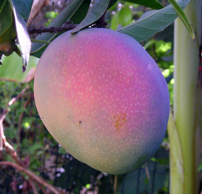

# Mango Classification
### Mango Classification
There are images of mangoes from three different species and they are, say species A,B and C.

*Sample Mango of type/species A*

These are RGB images (pixel values range from 0-255) and an image processing script has already 
extracted the maximum red and green values from each of the mango images.

Here is the plot of the maximum red and green values of the three species plotted along with the code snippet which list their values.

 

 

Now, you are given five new mangoes whose maximum red and green values
have been extracted as given below and shown in the plot

<pre><code class="python">X = [[130,70],[70,70],[100,170],[30,100],[70,210]]
</code></pre>

 

 

>Your task is to classify the 5 mangoes into their species using a program (python/julia).
The idea being that an unknown mango will be similar to its species
and hence lie closer to its own species in the plot.

> Here is one way to implement such an algorithm
>1. Find the empirical average point representing the species in the plot. 
This can be done by taking the geometric centroid of the species.
>2. For any given mango of unkown species, calculate the distance of it
to the centroids of species A, B and C in the plot.
>3. Assign the species to the above mango whose centroid is 
closest to it in the plot

Complete the code below to implement the above alogrithm
<!-- SETUP NEW ENV FOR PY_EDITOR -->

>The solution is plotted below.

