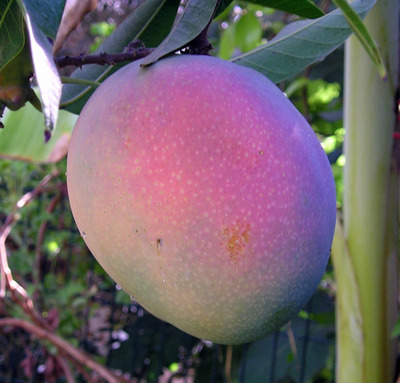

# 1-Bit-Problems-of-the-Day

### Mango Classification

There are images of mangoes from three different different species and they are, say species A,B and C.

*Sample Mango of type A*

These are RGB images and an image processing script has already 
extracted the maximum red and green values from each of the mango images.

Here is are the 

<!--  -->

