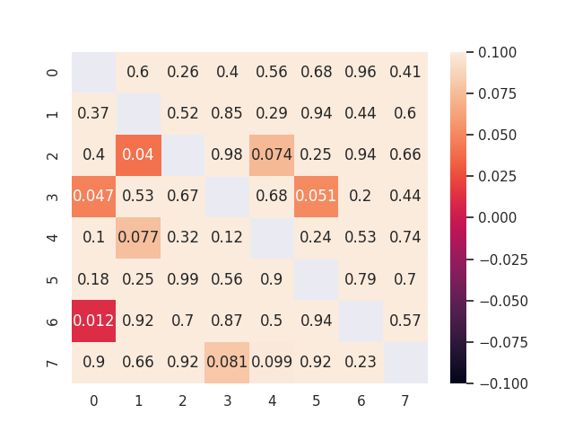
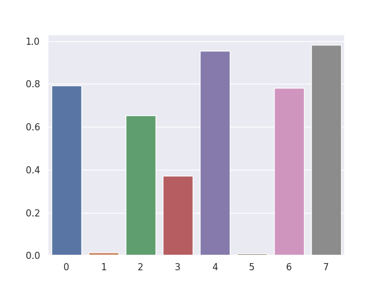

# *Optimal Task Allocation*  
#### *Autonomous Network Research Group,*
#### *University of Southern California, Los Angeles*
---

### Introduction

In todays cloud infrastructure, we have thousands of powerful machines (physical or virtual) crunching numbers. To solve a practical task, these machines may need to coordinate and communicate the input data and the intermediate results with many other machines connected over the internet infrastructure before the final results can be obtained. 

Each such task might itself consist of subtasks which might have interdependencies and hence a natural ordering of subtasks. The dependencies can be captured in a directed acyclic graph (DAG). Hence a complete task can be represented as a DAG of subtasks. 

Let us have a task which consists of 4 subtasks T0, T2, T3 and T3.
Also there are 8 machines M0, M2,...., M7 which are all capable of running the subtasks. These machines have cost of communication between themselves which is captured in a **communication cost matrix** of size 8 x 8.

<p align='center'>
    
    <p align='center'> <u><b>Fig: 1 - Network Cost Matrix [in $/GB transfer]</b></u></p>
</p>

<p align='center'>
    
    <p align='center'> <u><b>Fig: 2 - Task as DAG</b></u></p>
</p>

However each of these machines charge a cost for running the subtasks which can be captured in a **compute cost matrix** of size 4 x 8.

<p align='center'>
    
    <p align='center'> <u><b>Fig: 3 - Compute Cost Matrix [in $/subtask]</b></u></p>
</p>

Also each machine has different processing power and hence takes different time to complete these subtasks. Also time is required to transfer the intermediate results within the subtasks if they are scheduled across different machines. All of this is captured in the **makespan** of the complete task which tells us how long it takes us to execute the whole DAG task.

*As it happens, we need to keep track of a few more pieces of information ->*


<p align='center'>
    
    <p align='center'> <u><b>Fig: 4 - Network Bandwidth Matrix[in 0.1GB/s]</b></u></p>
</p>
<p align='center'>
    
    <p align='center'> <u><b>Fig: 5 - Network Latencies [in 10ms]</b></u></p>
</p>

### Problem Statement

Given all the above information, what can we do about it?
Well, if I am poor and still need to run my DAG task all day, I will definitely try to save my money. How do I schedule the 4 subtasks on the available 8 mmachines so that the money I have to spend is minimum?

If my friend is rich but impatient. So he would need his results as soon as possible.
How would he schedule the tasks? Would his schedule be different than mine? (Answer - maybe, maybe not | why though?)

Someone else might not be so poor as me or impatient as my friend. He would be willing to pay something that fits his budget but also might need the results quickly.

He would like optimise both the money and the time to complete the DAG task.
How exacly can that be done?

```
PROBLEM STATEMENT

Given all the information about the DAG task and the machines, 
find a way to optimise either the cost($) or the time to complete
the DAG(makespan) or both. 
```

Turns out that this problem is NP-Hard.
As the size of the problem grows, it will become exponentially difficult to find the best schedule solution it in a reasonable amount of time.

Well, sometimes we are happy even if we get a good offer on blackfriday, even if its isn't the best one (there always is that friend who gets a better one)

Here is where [Meta-Heuristic-Optimisation-Algorithms](https://en.wikipedia.org/wiki/Metaheuristic) come into play.

Many of these algorithms are inspired from nature (just like many other engineering marvels are - did you think of a bird or was just that neuron?)

A few of the popular of Metaheuristic Algorithms are -

1. [Particle Swarm Optimisation](https://en.wikipedia.org/wiki/Particle_swarm_optimization)
2. [Genetic Algorithms](https://en.wikipedia.org/wiki/Genetic_algorithm)
3. [Simulated Annealing](https://en.wikipedia.org/wiki/Simulated_annealing)

Caution, there are so many algorithms claimed to be inspired from nature but many fall into a few classes of basic underlying principles. Read here for more - 
1. [Endless Metaphors](https://en.wikipedia.org/wiki/List_of_metaphor-based_metaheuristics#Criticism)
2. [No Free Lunch](https://en.wikipedia.org/wiki/No_free_lunch_theorem)


### One of many solutions

One way to solve the above will be to use a meta-heuristic algorithm. We picked particle swarm because it is easy to understand intuitively and quickly immplement and test solutions using **open source software** libraries - [pySwarms](https://pyswarms.readthedocs.io/en/latest/).

<p align='center'>
    
    <p align='center'> <u><b>Fig: 6 - PSO Intuition</b></u></p>
</p>

<p align='center'>
    <iframe width="640" height="360" src="https://www.youtube.com/embed/OUHAypWn1Ro" frameborder="0" allow="accelerometer; autoplay; encrypted-media; gyroscope; picture-in-picture" allowfullscreen></iframe>
    <p align='center'> <u><b>PSO Visualisation <a href="https://www.youtube.com/embed/OUHAypWn1Ro">(Watch on Youtube)</a></b></u></p>
</p>


Key Idea to solve our DAG scheduling problem - Represent the schedules as particles in the right search space and define a cost function.

Also our problem is discrete domain - [Combinatorial Optimisation](https://en.wikipedia.org/wiki/Combinatorial_optimization), not in continuous domain. We can only the subtasks to the machines in full, we cannot break down the subtasks and run them on two machines, say break them into 10% on M1 and 90% on M7 - hence discrete.

