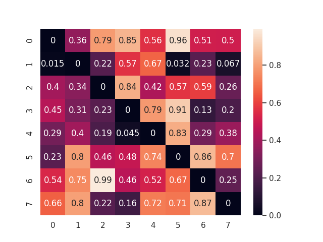
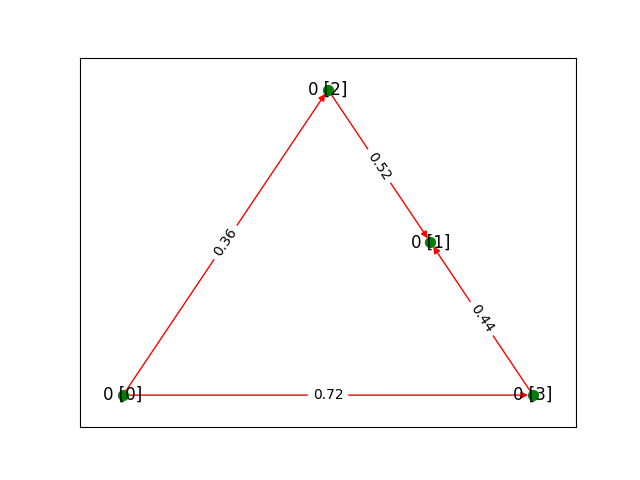
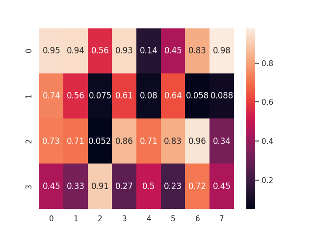

# *Optimal Task Allocation*  
#### *Autonomous Network Research Group,*
#### *University of Southern California, Los Angeles*
---

### Introduction to the problem

In todays cloud infrastructure, we have thousands of powerful machines (physical or virtual) crunching numbers. To solve a practical task, these machines may need to coordinate and communicate the input data and the intermediate results with many other machines connected over the internet infrastructure before the final results can be obtained. 

Each such task might itself consist of subtasks which might have interdependencies and hence a natural ordering of subtasks. The dependencies can be captured in a directed acyclic graph (DAG). Hence a complete task can be represented as a DAG of subtasks. 

Let us have a task which consists of 4 subtasks T0, T2, T3 and T3.
Also there are 8 machines M0, M2,...., M7 which are all capable of running the subtasks. These machines have cost of communication between themselves which is captured in a **communication cost matrix** of size 8 x 8.

    
    
 <u><b>Fig:1 - Network Cost Matrix [in $/GB transfer]</b></u>

    
    
 <u><b>Fig:2 - Task as DAG</b></u>

However each of these machines charge a cost for running the subtasks which can be captured in a **compute cost matrix** of size 4 x 8.

    
    
 <u><b>Fig:3 - Compute Cost Matrix [in $/subtask]</b></u>

Also each machine has different processing power and hence takes different time to complete these subtasks. Also time is required to transfer the intermediate results within the subtasks if they are scheduled across different machines. All of this is captured in the **makespan** of the complete task which tells us how long it takes us to execute the whole DAG task.

*As it happens, we need to keep track of a few more pieces of information ->*

$$ ok $$