
## PhD Thesis Proposal

 
 
**UNIVERSITY OF SOUTHERN CALIFORNIA**

### <u> Committee members </u>

**Bhaskar Krishnamachari | Jyotirmoy V. Deshmukh |Satish Kumar Thittamaranahalli | Jiapeng Zhang | Robert Guralnick | Gary Rosen**

##### Presenter: Sampad Bhusan Mohanty
###### 25th July, 2025
---
### Acknowledgement

Possible in part due to the unwavering suppport from  
[Prof. Bhaskar Krishnamachair](https://viterbi.usc.edu/directory/faculty/Krishnamachari/Bhaskar) and [Dr. Fan Bai](https://scholar.google.com/citations?user=ZDRy6_EAAAAJ&hl=en) from General Motors.

  

Also all my [teachers and mentors](https://sampadbm.github.io/#Teachers%20and%20Mentors)  

To the committee: 

Thank you so very much for your valuable time and guidance.

---
exclude: true
class: center middle

### Timeline

<pre class="mermaid">
        graph LR
        A["QUALS Summer 2024"] --> B["PROPOSAL Summer 2025"] --> C["DEFENSE Summer 2026"]
</pre>

---
class: center middle

### PRESENTATION OUTLINE
##### 1. Quick Recap of work upto Quals | Summer 2024
##### 2. Updates since Quals | Summer 2024 - Summer 2025
##### 3. Proposed Work | Summer 2025 - 2026
---
class: center middle

<h3 style="color:darkturquoise">QUALS RECAP</h3>
---
### Dataset 

GPS logs from Taxi's operating in Beijing and Shanghai, China over a month.

### Problem
- Noisy data
- Lots of missing entries (sensor/network/power failures)
- Cost restrictions - sparse and non-uniform sensor deployment
- Too large to store over longer periods (terrabytes/day)

### Task
Address the challenges
posed by mobility datasets.

	- Denoise and recover missing entries. 
	- Store data more efficiently, compression.
---

### Raw data

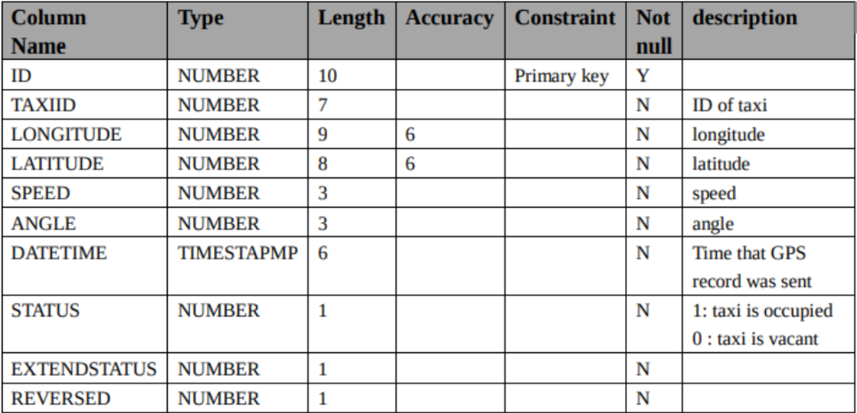

>>> `GPS Logs from ~ 2500 Taxis over 1 month`

---
### Grid view (Shanghai)

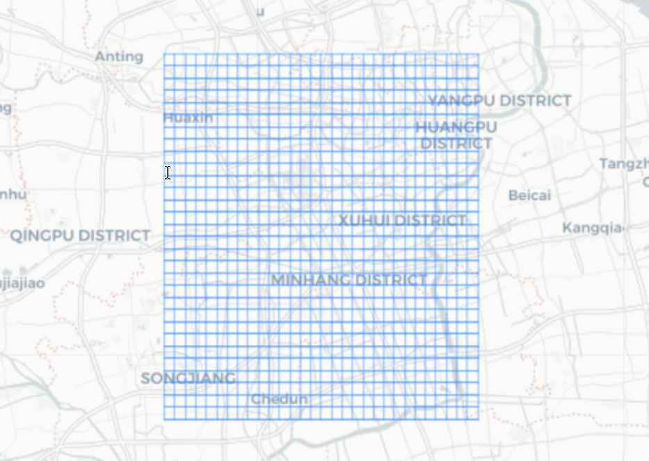
>>>  30 x 30 grid of traffic density data

---

### Representations

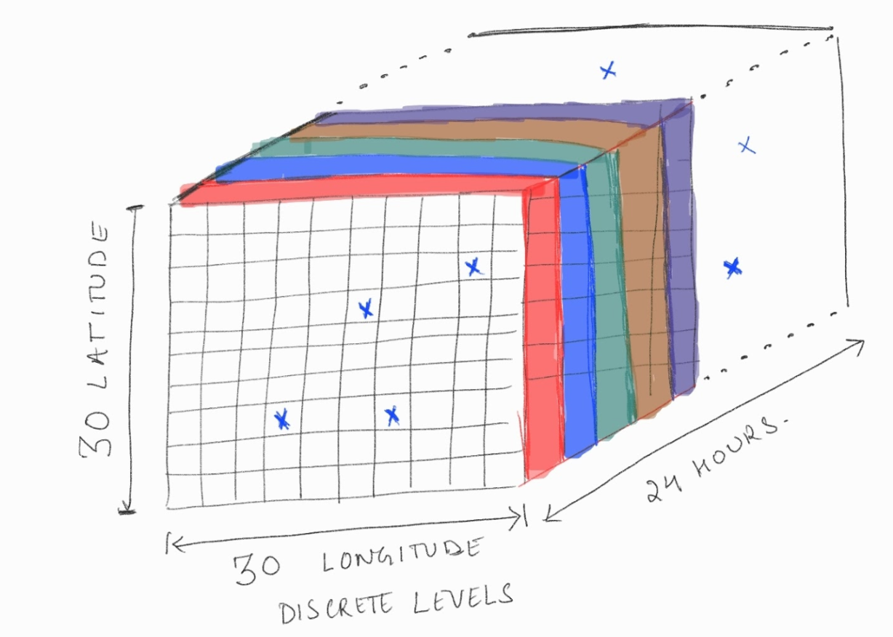
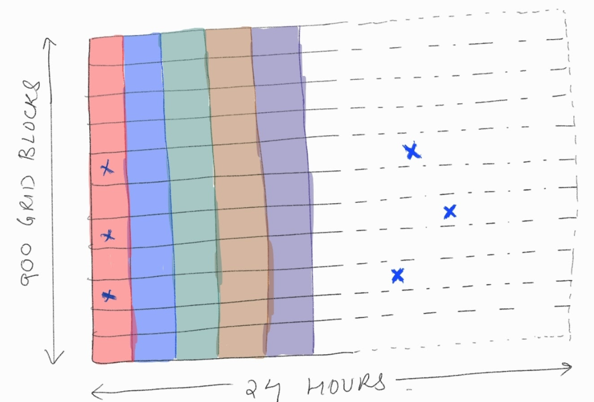
>>> Tensor   $\hspace{11em}$   Matrix
---
exclude: true
### Tensor Terminology
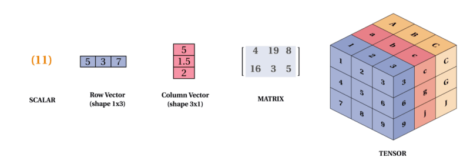

- Scalars, vectors, and matrices are $0^{th}, 1^{st},$ and $2^{nd}$ order tensors.

- For us, tensors mean a $3^{rd}$ or higher order tensor.

---
exclude: true
### Clash of cultures
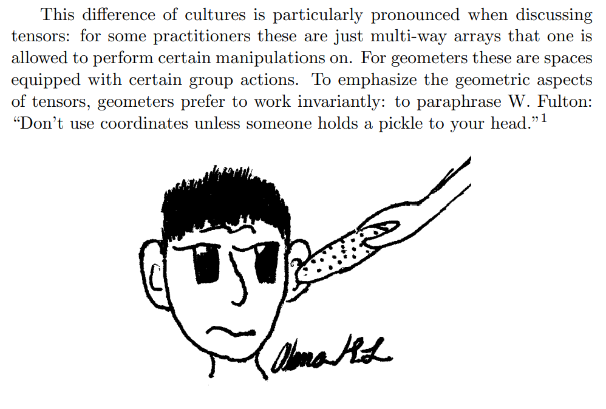

Preface, Tensors: Geometry and Applications, 

J. M. Landsberg 

---
exclude: true
### Processed traffic density (1 hour x 1km x 1km)

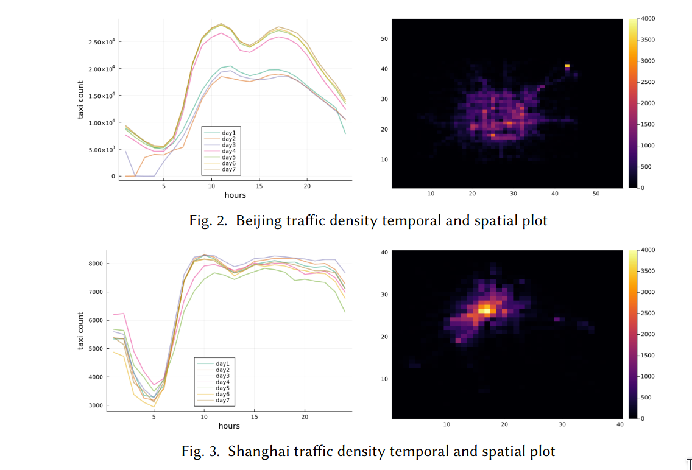
>>> >>> $X \times Y \times T$ tensors 

---
### Processed traffic density visualizations
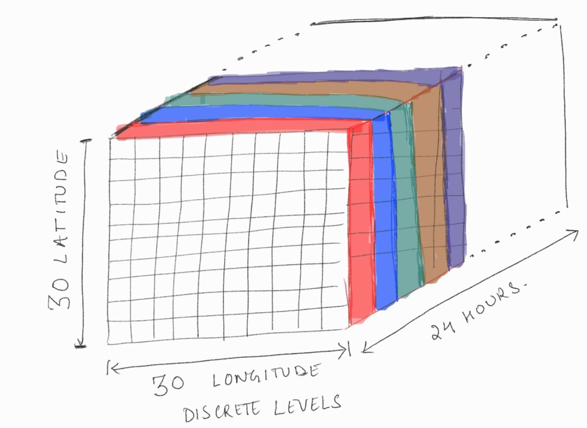

$\hspace{20em} X \times Y \times T$

**Spatial plot: **
Contract time dim. using vector $\mathbf{1_T} \in \mathbb{R}^T$

**Temporal plot:**
Contract spatial dims. using vectors $\mathbf{1_X} \in \mathbb{R}^X$ and $\mathbf{1_Y} \in \mathbb{R}^Y$

Same as contraction with matrix dot/inner product on spatial dimensions using 
matrix $\mathbf{1_X1_Y'} \in \mathbb{R}^{X \times Y}$ as $\mathbf{u^TBv} = \langle \mathbf{B},\mathbf{vu^T} \rangle$

---

### Prior work : Low Rank Structure in Traffic Density

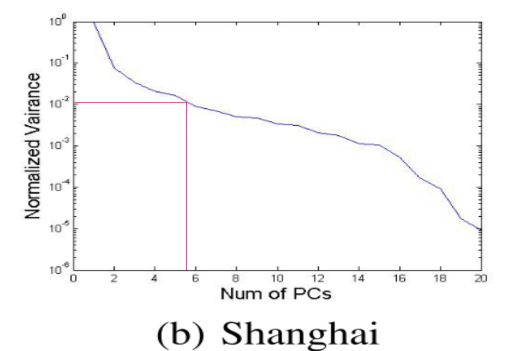
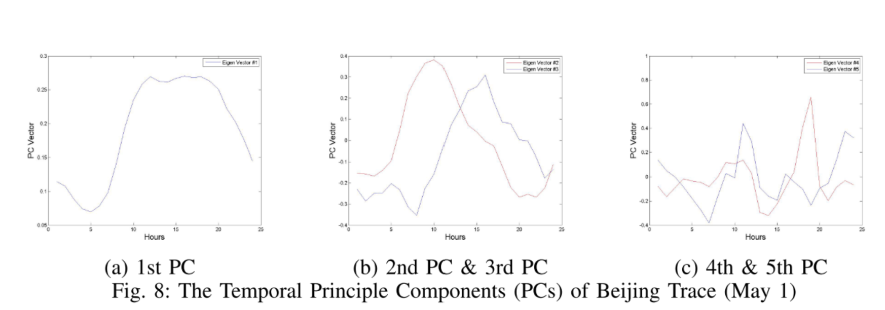
<small><a href="https://anrg.usc.edu/www/papers/Revealing.pdf">F. Bai and B. Krishnamachari, “Revealing a Hidden, Stable Spectral Structure of Urban Vehicular Traffic,” in Proc. IEEE Vehicular Networking Conf. (VNC), 2021</a></small>

---

### Prior work @ USC-ANRG + GM : Unexplained variance
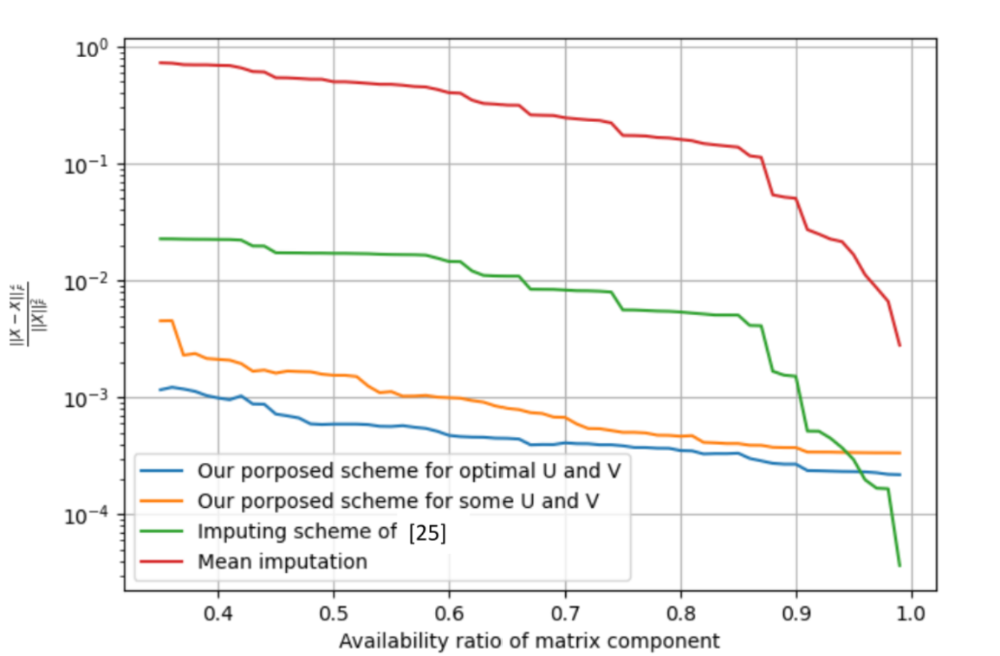

---
### Atoms using (outer) products

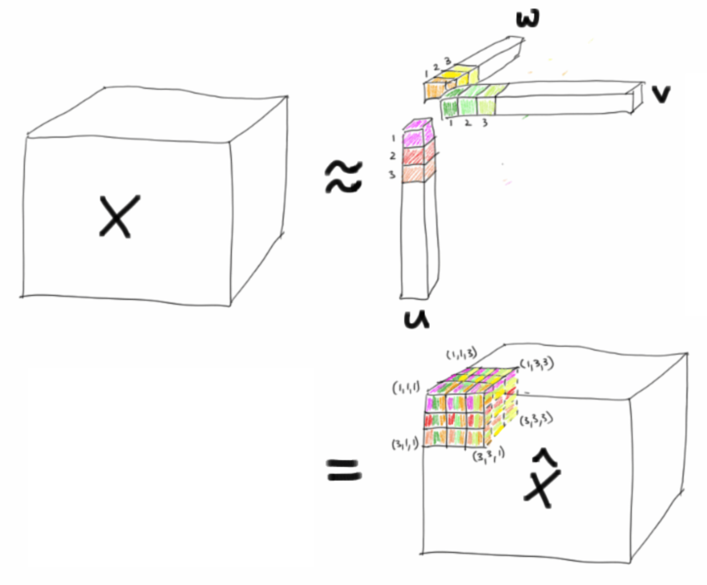

>>> >>> Atoms or "Simple tensors"

---

### Decomposition into sum of rank-1 atoms
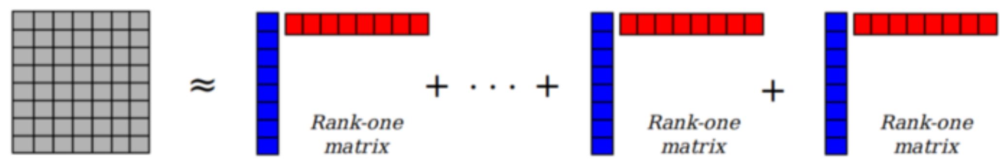

$$\text{Matrix Decomposition}$$

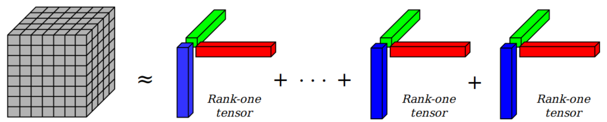

$$\text{Tensor Decomposition}$$

---
### Some other decompositions
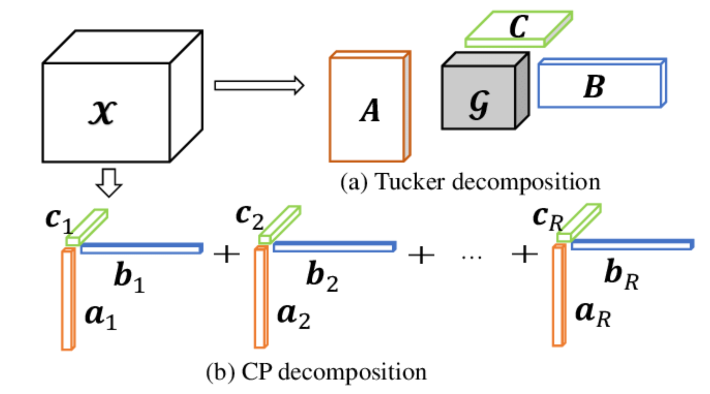

$$\text{Tucker vs CP Decompositions}$$

---
### Matrix vs Tensor decomposition

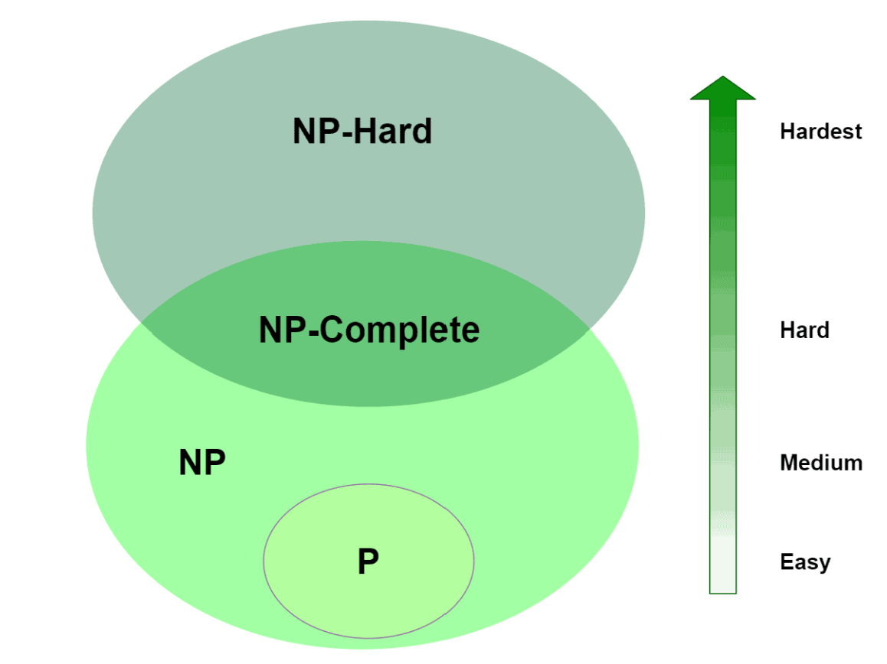

|Factorization | | Time complexity | | Notes |
|--------------|-|---------------|---|------|
|$\;$|$\;$|$\;$|$\;$|
| Cholesky,QR | | $O(n^3), O(mn^2)$ | | |
| SVD | | $O(mn^2)$ | |  $\hspace{4em} m \geq n$|
|EVD| | $O(n^3)$ | |  |
| CP rank $\leq$ k | | NP Complete | | ||
| Exact CP | | NP Hard | | $\because$ finding rank is NP Hard||

---
exclude: true
### Other peculiarities of Matrix vs Tensor decomposition

1. If A is a matrix of rank r over a field F then it has rank r over any extension field of F. 
Matrices have same ranks under $\mathbb{R}$ and $\mathbb{C}$ as the later extends the former. $^{**}$

2. If A is a matrix of rank r over a field K then its rank over any sub-field of K is at least $r$ (could be more). $^{**}$

3. The rank of a tensor(order $\geq$ 3) could be different over $\mathbb{R}$ and $\mathbb{C}$; under $\mathbb{C}$, it can be smaller.

** see [math.stackexchange](https://math.stackexchange.com/questions/2571197/a-problem-on-rank-of-a-matrix-over-two-fields)

---
exclude: true
### Other peculiarities of Matrix vs Tensor decomposition
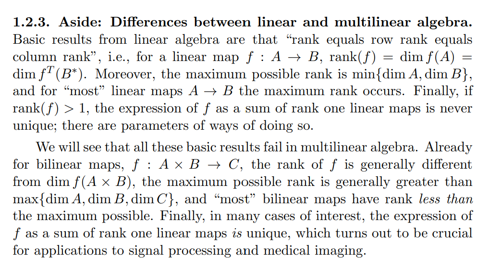

Chapter 1, Tensors: Geometry and Applications, J. M. Landsberg

$\mathbf{M = AB} = \boldsymbol{\alpha \beta}$ 

if $\boldsymbol{\alpha} = \frac{1}{\gamma} \mathbf{AU^*}$, $\boldsymbol{\beta} = \gamma \mathbf{UB}$ for any unitary matrix $\mathbf{U}$ and 
any scalar $\gamma \neq 0$.

Unique upto rotation/reflection/permutation and scaling.
---
exclude: true
### Other peculiarities of Matrix vs Tensor decomposition

Krushkal Rank  (also called spark of a matrix) vs Rank
---
### Notations

$\circ$

$=$

$\hspace{3em}\mathbf{T(t)} \hspace{4.5em}\circ\hspace{4em} \boldsymbol{\Omega(t)} \hspace{3em}=\hspace{4em}\mathbf{D(t)}$

Where,

$\mathbf{T} \in \mathbb{R}^{X \times Y \times Z}$

$\boldsymbol{\Omega} \in  \set{0,1}^{X \times Y \times Z}$, observed locations marked as $1$.

$\boldsymbol{\bar \Omega} = \boldsymbol{1 - \Omega}$, missing locations marked as $1$.

$\mathbf{D} \in \mathbb{R}^{X \times Y \times Z}$

---
### Imputation

$\overset{\phi}{\longrightarrow}$

$\hspace{3em}\underbrace{\mathbf{D}}_{\mathbf{T} \odot \boldsymbol{\Omega}} \hspace{5em} \overset{\phi}{\longrightarrow} \hspace{4em} \mathbf{\tilde T}$

$$\phi_{\boldsymbol{\theta}} : \mathbb{R}^{X \times Y \times Z} \times \\{0,1\\}^{X \times Y \times Z} \rightarrow \mathbb{R}^{X \times Y \times Z}$$

$$ \phi_{\boldsymbol{\theta}}(\mathbf{D},\boldsymbol{\Omega}) \rightarrow \mathbf{\tilde T}$$

$$\;$$

<!---latent parameters: $\mathbf{R}^{p} \ni \boldsymbol{\theta} = [\boldsymbol{\theta_1}, \boldsymbol{\theta_2}]$--->

<!-- time invariant component: $\boldsymbol{\theta_1} \in \mathbf{R}^{p_1}$ -->

<!-- time variant component: $\boldsymbol{\theta_2} \in \mathbf{R}^{p_2}$ -->
---
### Metrics: Completion Score and Reconstruction error

<!---img src="res/paper_equations/maskednorm.png" width="75%vw"--->

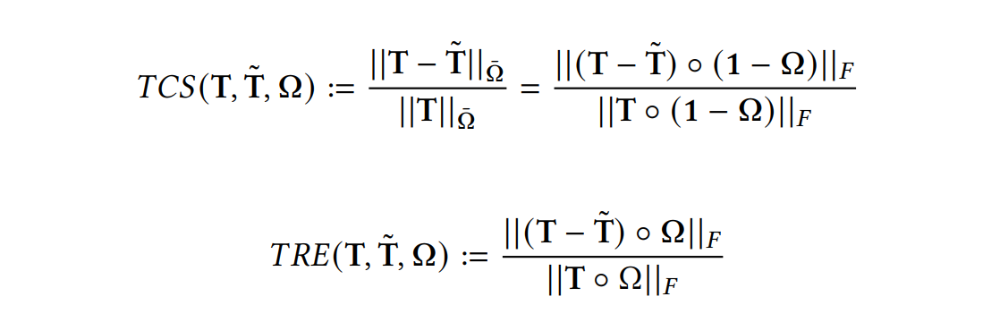

- Others: RMSE, MAE

<small><a href=https://arxiv.org/pdf/1005.2197> Acar, E., Kolda, T. G., Dunlavy, D. M., & Mørup, M. (2010, May 12). Scalable tensor factorizations for incomplete data (arXiv:1005.2197). arXiv</a></small>
---

### Hypothesis and Assumptions

##### Hypothesis 
There exist two kinds of latent factors that completely explain traffic patters
- time invariant latent factors and 
- time varying latent factors

##### Assumptions 

1. Observed density of a particular day can be explained by linearly weighted combination of the time invariant factors where the weights are precisely the time varying factors. 

2. The rank-1 matrix/tensor atoms obtained by decomposition of the data representation are time invariant.

3. The decomposition weights on the rank one atoms are time variant

**Assumptions are empirically validated on traffic density datasets.**

---
exclude: true
### Latent Parameters

<!---$$ \mathbf{\tilde T}(t) = \phi(\mathbf{D}(t),\boldsymbol{\Omega}(t); \boldsymbol{\theta}(t), \boldsymbol{\psi}(t_0))$$--->

<!--$\phi$ may additionally depend on optional auxiliary information $\boldsymbol{\psi}(t_0)$
where $|t_0 - t| \leq \epsilon$ for some $\epsilon \geq 0$--->

---
### Data Generative Model

$$\;$$
time invariant : $\boldsymbol{\theta_s} \in \mathbf{R}^{p_s}$ (singular subspaces, tensor factor subspaces, atomic subspaces)

time variant : $\boldsymbol{\theta_v} \in \mathbf{R}^{p_v}$ (singular values, tensor factor weights)

latent parameters: $\mathbf{R}^{p} \ni \boldsymbol{\theta} = [\boldsymbol{\theta_s}; \boldsymbol{\theta_v}]$

$p_s + p_v = p$

---
### Parameters

---
### Estimators

<h5 style="color:orange"> Note A: </h5> 

The estimation is not perfect and depends on the following -

- missing data percentage / sparsity of $\boldsymbol{\Omega}$
- Noise in the observed entries
- estimator efficiency (qualitative, non CRLB, local optimia from ALS)
- estimator robustness (qualitative, e.g Davis-Kahan type theorems)

---
exclude: true
### Quality of reconstruction
How good can the reconstruction be?

<h5 style="color:orange"> Note A: </h5> 

The estimation is not perfect and depends on the following -

- missing data percentage or equivalently sparsity of $\boldsymbol{\Omega}$
- Noise in the observed entries in the data
- estimator efficiency as the estimators are approximate algorithms

<h5 style="color:green"> Note B: </h5>
- How good the assumption on time invariance of $\boldsymbol{\theta_1}(t)$ holds 
between times $t$ and $t_0$.

---
### Temporal Stability

$$\;$$
under some suitable metric $|\;\cdot\;| : \mathbb{R^s} \times \mathbb{R^s} \rightarrow \mathbb{R}$

---
### Estimator Quality

- $D[t_1]$ and $D[t_2]$ are observations from two days where $t_1$,$t_2$ are close. $$\;$$ 
- Noise and occlusion @$t_2$ is not as severe as @$t_1$ => quality of estimated parameters $\theta_2$ superior to $\theta_1$.
$$\;$$

---
### Imputation (KSV/KTF) 

---
### Imputation (USV/UTF)

---
### SATORIS: Unified Framework

---
class: center middle
# PROPOSED METHODS

---
### Singular Value and Tensor Weight Regression
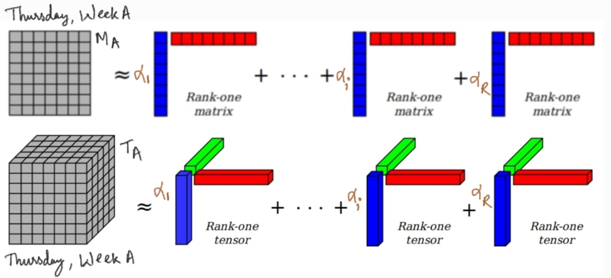

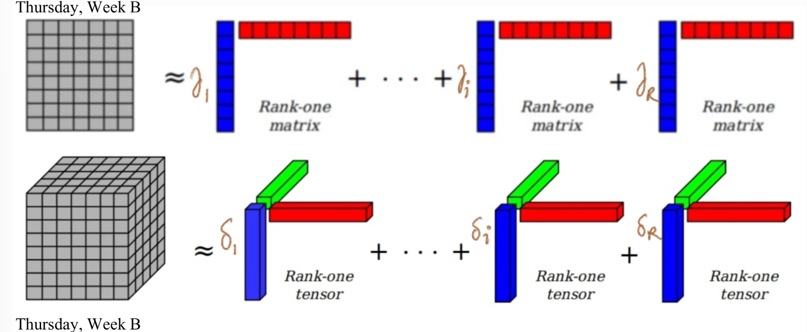

---
### Experiment Setup

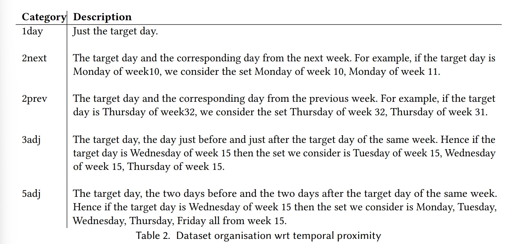

---
class: middle center
# RESULTS 

---
### 1 Day
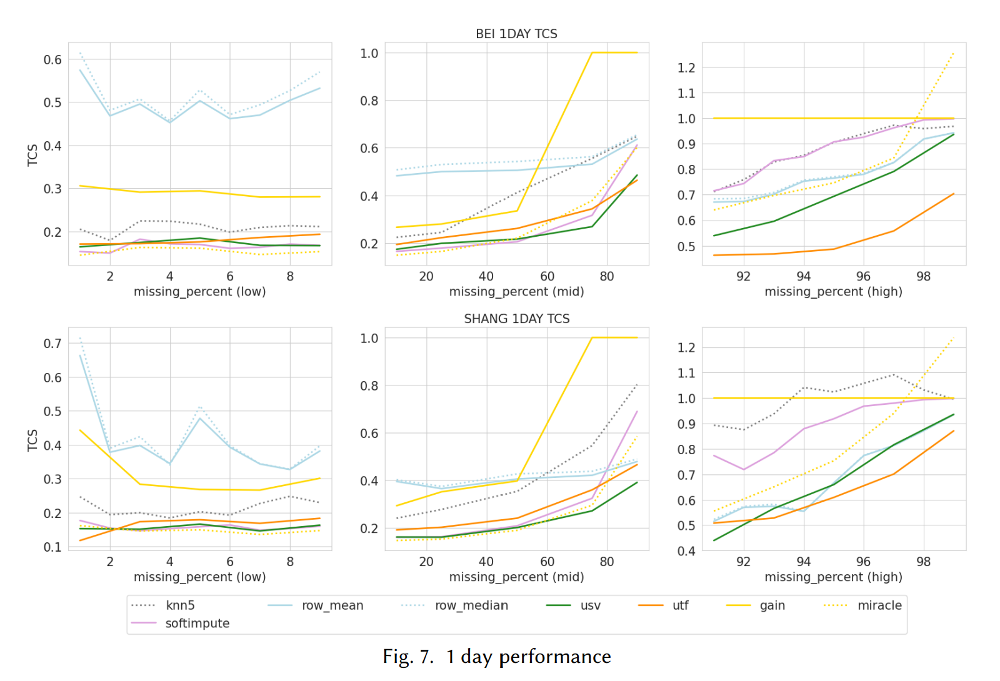

---
### 3 Day
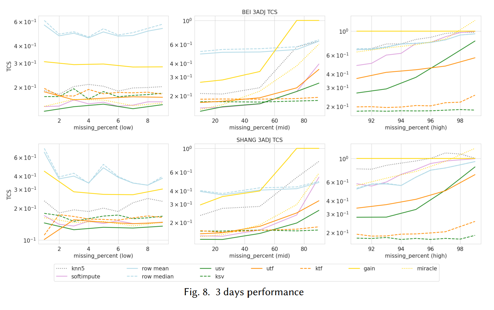

---
### 5 Days
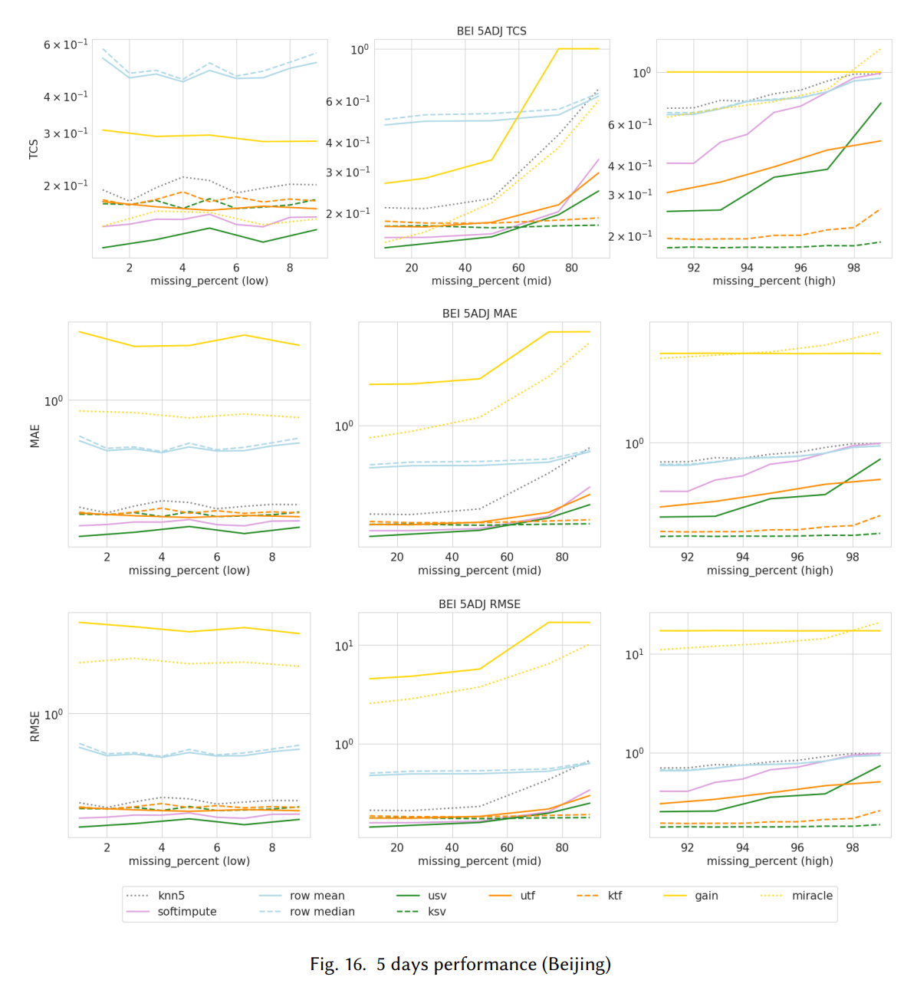

---
class: center middle

<h3 style="color:darkturquoise">POST QUALS</h3>

---
### Stability of Parameters

- Complete observations per day are vectorized (shape = 900x24 = )
- 7 Consecutive days
- 7x7 Covariance matrix 
- Spectrums of covariance matrices shown above
---
### Test with synthetic data 

$$\mathbf{x} \sim N(\boldsymbol{\mu, \Sigma}) $$

===================================================================
$$ \boldsymbol{\mu} \in \mathbb{R}^n $$
$$\mathbf{\Sigma} := a\mathbf{I} + (1-a)\mathbf{vv^T} \in \mathbb{R}^{n \times n}$$
$$\mathbf{v} \sim N(\mathbf{0, I}_{n \times n})$$
$$a \in (0,1)$$

- Sample 1000 vectors for $n=64$
- Reshape into $8 \times 8$
- Take SVD
- Plot 1000 left/right singular vectors 

---
### stability of parameters (matrix)

---
### stability of parameters (tensor)

$\hspace{3.5em} a=0.6 \hspace{7em} a=0.7 \hspace{7em} a=0.8$

  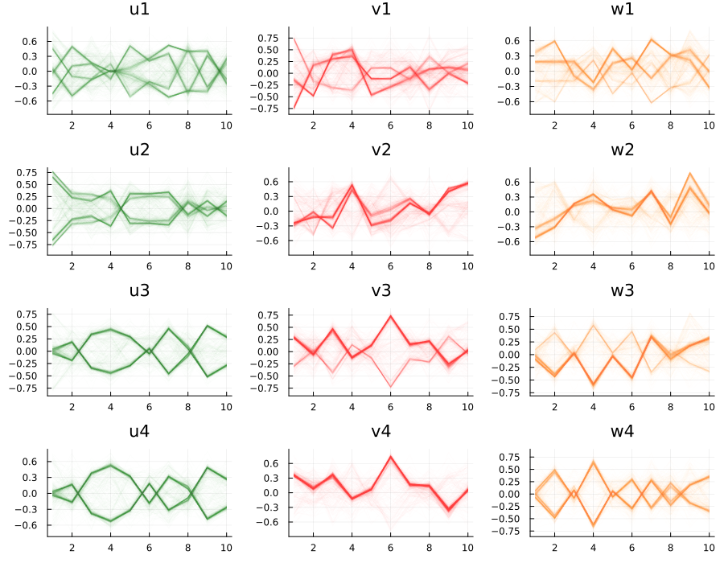

 

  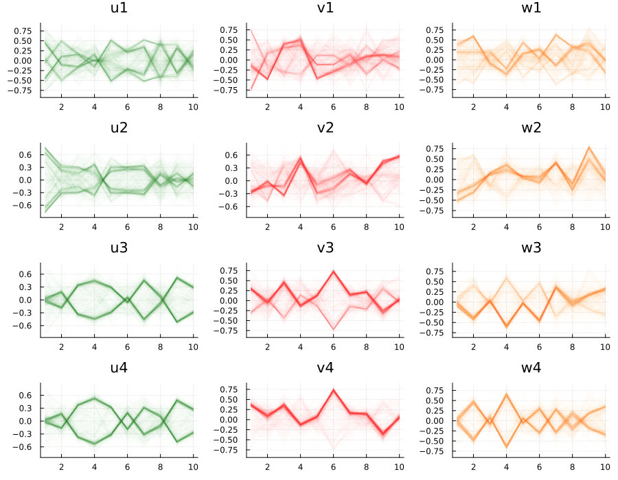

  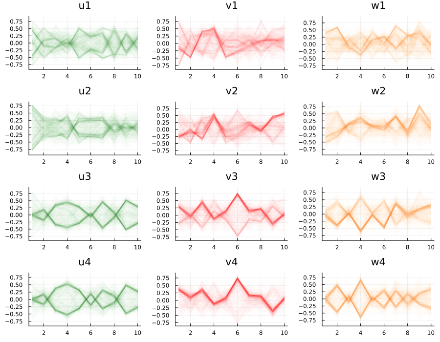

---
### average subspace angles for 3 consecutive days (tensor vs matrix) 

---
class: middle center
## Imputation via Subspace Aware Semidefinite Programming

---
### Rank and Nuclear Norm 
- Rank is subadditive; Rank(A+B) $\leq$ Rank(A) + Rank(B)
$$\;$$
- Rank is not convex; 
$$\;$$
 Rank$\bigg( \frac{1}{2} \underbrace{\begin{bmatrix}1 &  0 \\\\ 0 & 0\end{bmatrix}}_{A} + \frac{1}{2}  \underbrace{ \begin{bmatrix} 0 & 0 \\\\ 0 & 1 \end{bmatrix}}_B \bigg)$ = 2 $\color{red} \boldsymbol{>}$ 1 =  $\frac{1}{2}$ Rank(A) +  $\frac{1}{2}$ Rank(B)
$$\;$$
- $L_0$ pseudo-norm of the singular values. 
---
### Rank and Nuclear Norm 
- Convex surrogate of Rank (tightest relaxation)
$$\;$$
- $L_1$ norm of singular values
$$\;$$
- Yeilds low rank solutions if used as objective 
$$\;$$
- Analogous to use of $L_1$ as surrogate for $L_0$ in sparse regression.
 
---
### Formulations of Nuclear Norm

Let $X$ be a $m \times n$ matrix and $X = U\Sigma V$ be its SVD. Let $\vec \sigma := diag(\Sigma)$

The nuclear norm of $X$ is represented as $|X|_*$ and it equals

- $|\vec \sigma|_1 \hspace{8.6em} \text{compared to rank}(X) = |\vec \sigma|_0 $

- $Tr(\sqrt{X^TX}) \hspace{5em} \text{compared to } |X|_F^2 = Tr(X^TX)$

-  $\underset{U,V}{\min}{\frac{1}{2} \bigg( |U|_F^2 + |V|_F^2} \bigg) \hspace{2em}$ s.t. $\;\;\;X = UV^T$ 

- $\underset{|B|_2 \leq 1}{\sup} \; \langle X,B \rangle$

- $\color{brown} \underset{A \in S^p ,B \in S^q}{\min} \; \frac{1}{2} \; \bigg( Tr(A) + Tr(B) \bigg)$ s.t $\color{brown}\begin{bmatrix} A & X \\\\ X^T & B \end{bmatrix} \succeq 0$

$S^p,S^q$ are spaces of symmetric $p \times p$ and $q \times q$ matrices respectively. Due to PSD constraint on the block matrix $\implies$ leading principal submatrices need to PSD $\implies$ $A,B \succeq 0$

---
### Mean Width Interpretation (roughly)

- Matrix $A$ transforms unit ball to an ellipsoid. $|A|_* = a + b$ 

$\hspace{8em}$

- Let $X \in \mathbb{R}^{n+1}$ be any convex set. 

- $S_{n}$ be the unit sphere in the same space.

- $h(u) := \underset{x \in X}{\max} \; \langle x, u \rangle $ 

- $\sigma_{max}(A)$ = $|A|_2$ = $\frac{1}{2} \; \underset{u \in S_n}{\max} \;\;\; h(u) - h(-u)$ 

- $|A|_* = \frac{1}{|S_n|} \;\; \underset{S_n}{\int} h(u) - h(-u)$

---
### Minimum Nuclear Norm Imputation

- $\underset{X}{\arg\min} |X|_*\;\;\;$ s.t. $\;\;\; \Omega \circ X = \Omega \circ Y$ 

 - Since nuclear norm is a surrogate for the rank, it yields a low rank solution almost surely. 

- Analogous to solutions of $L1$ minimization producing sparse (low $L_0$ pseudo-norm) solution

---
### Another look at the SDP formulation  (nnsdp)

- $\underset{A,B \succeq 0}{\min} \; \frac{1}{2} \; \bigg( Tr(A) + Tr(B) \bigg)\;\;\;$ s.t $\;\;\;\begin{bmatrix} A & X \\\\ X^T & B \end{bmatrix} \succeq 0$

- A = $U \Sigma U^T = \sqrt{XX^T}$ and $B = V \Sigma V^T = \sqrt{X^TX}$ are minimizers.

- $U$ and $V$ are the singular vectors from SVD of $X = U\Sigma V^T$

- A and B carry the left and right singular subspace information.

 Can we repurpose this PSD formulation to inject the singular subspace information via A and B where $X$ is partially observed and is the decision variable instead?

---
### Imputation via inverse formulation (innsdp)

- Assuming $Y$ is fully observed.

- Obtain $A$ and $B$ as the solutions for the SDP formulation of the nuclear norm such that $c = \frac{1}{2} Tr(A) + \frac{1}{2} Tr(B)$ is $|Y|_*$, then

$$\underset{X}{\arg\min} \;\;\;c \text{ (const.) }$$

s.t.

$$ \begin{bmatrix} A & X \\\\ X^T & B\end{bmatrix} \succeq 0 $$
$$ X[i,j] = Y[i,j] \text{ if } \Omega[i,j] = 1$$

$$\;$$
- Could be multiple feasible X but almost surely all of them are low rank. 

---
### When $Y$ isn't fully observed

-  We don't know $A$ and $B$ apriori

- 
Could we use $A$ and $B$ from a neighbor ? 

#### Algorithm 

1. Require: $Y_1, \Omega_1, Y_2$
2. $A,B$ $\gets$ nnsdp($Y_2$)
3. $X_1$ $\gets$ innsdp($Y_1, \Omega_1, A, B$)
4. Return: $X_1$

---
### Soft reconstruction, Exact Injection

$$ \underset{X}{\arg\min} || \Omega \circ (X - Y)||_F  $$

s.t.

$$ \begin{bmatrix} A & X \\\\ X^T & B \end{bmatrix} \succeq 0$$

$$A = U\Sigma U^T$$ 

$$B = V \Sigma V^T$$

---
### Soft reconstruciton, Soft Injection

$$ \underset{X}{\arg\min} || \Omega \circ (X - Y)||_F + \alpha ||A - U\Sigma U^T|| + \beta ||B - V \Sigma V^T|| $$

s.t.

$$ \begin{bmatrix} A & X \\\\ X^T & B \end{bmatrix} \succeq 0$$

$$A \succeq 0$$ 

$$B \succeq 0$$

---
###  

---
exclude: true
### Segue 

- Watch Adit's Talk again - lots of insights and can cite his paper for the poor Deepnetworks performance for lower number of observed entries in matrix completion.

- Use Linear Deep NN as another baseline for the nuclear norm subspace injection.

- Use RFM package from Adit's repo and see if it can be used as a baseline too. 

---
class: middle center

# THANK YOU

More results in the <a href="SATORIS.pdf" target="_blank"> paper </a>. 

