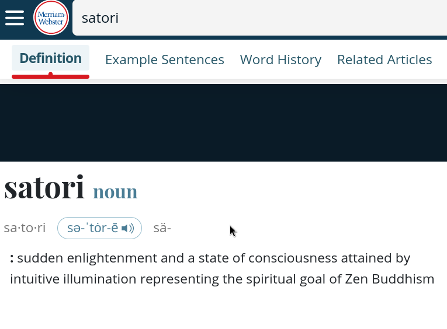
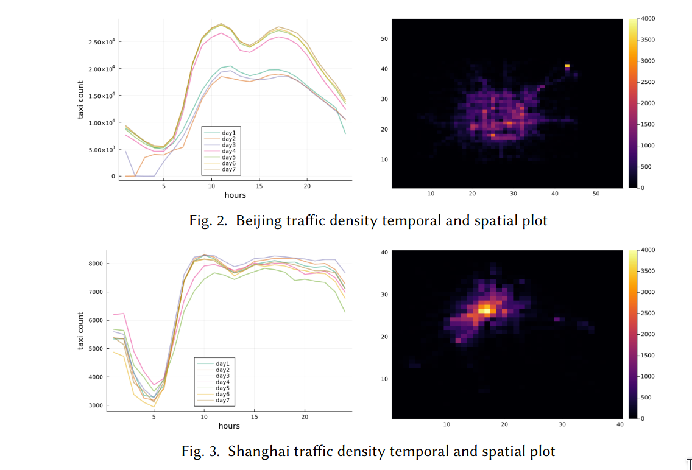
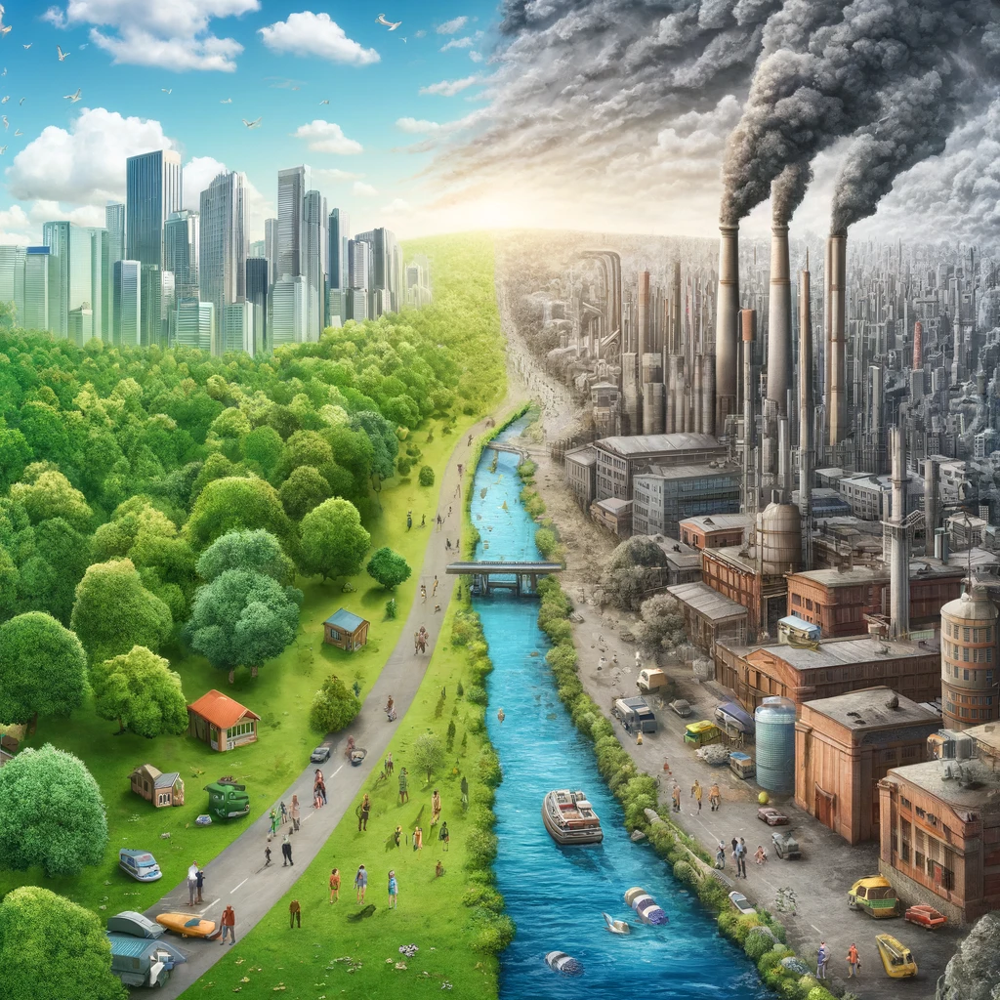
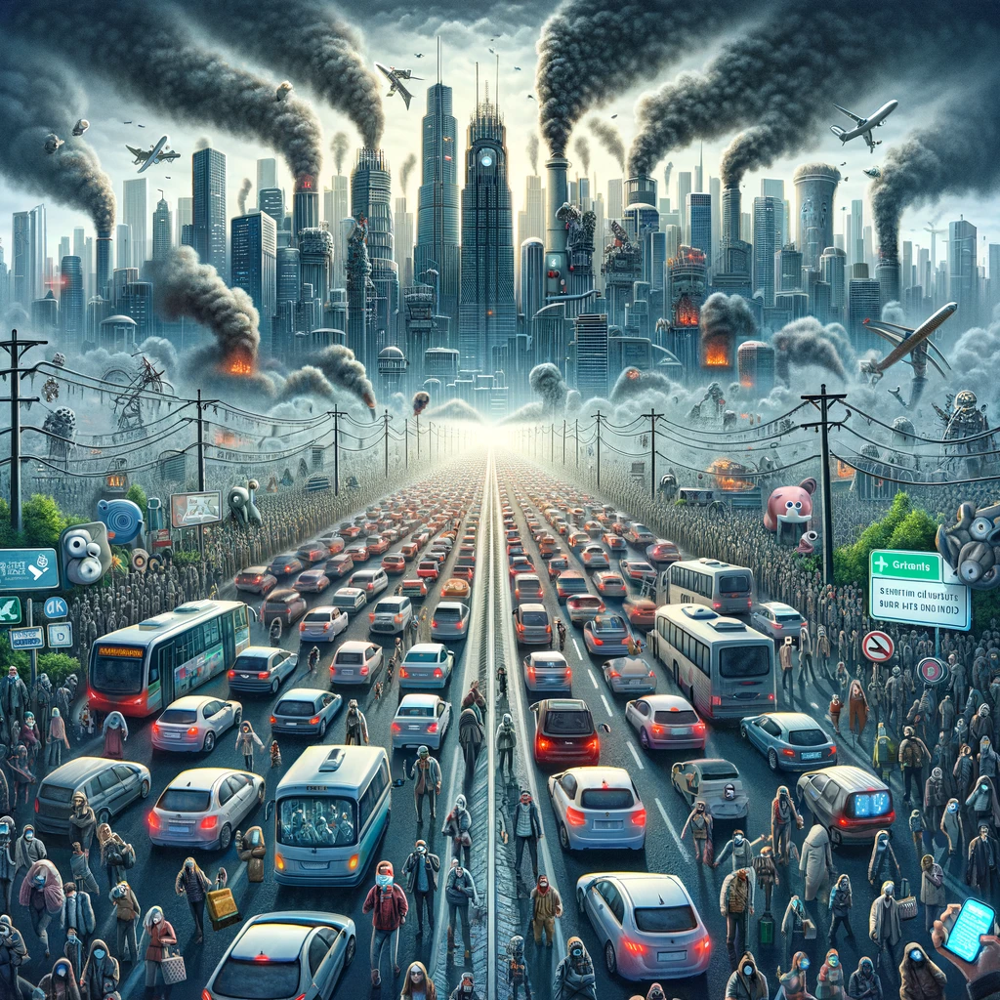
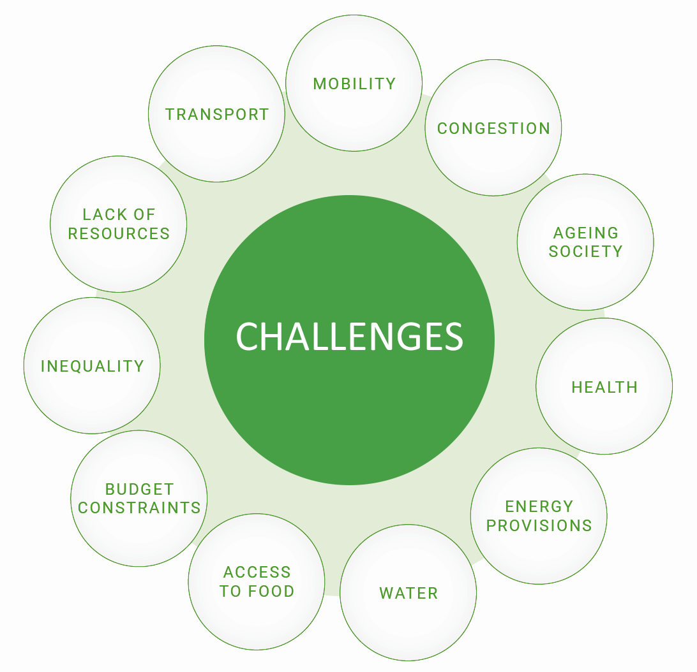
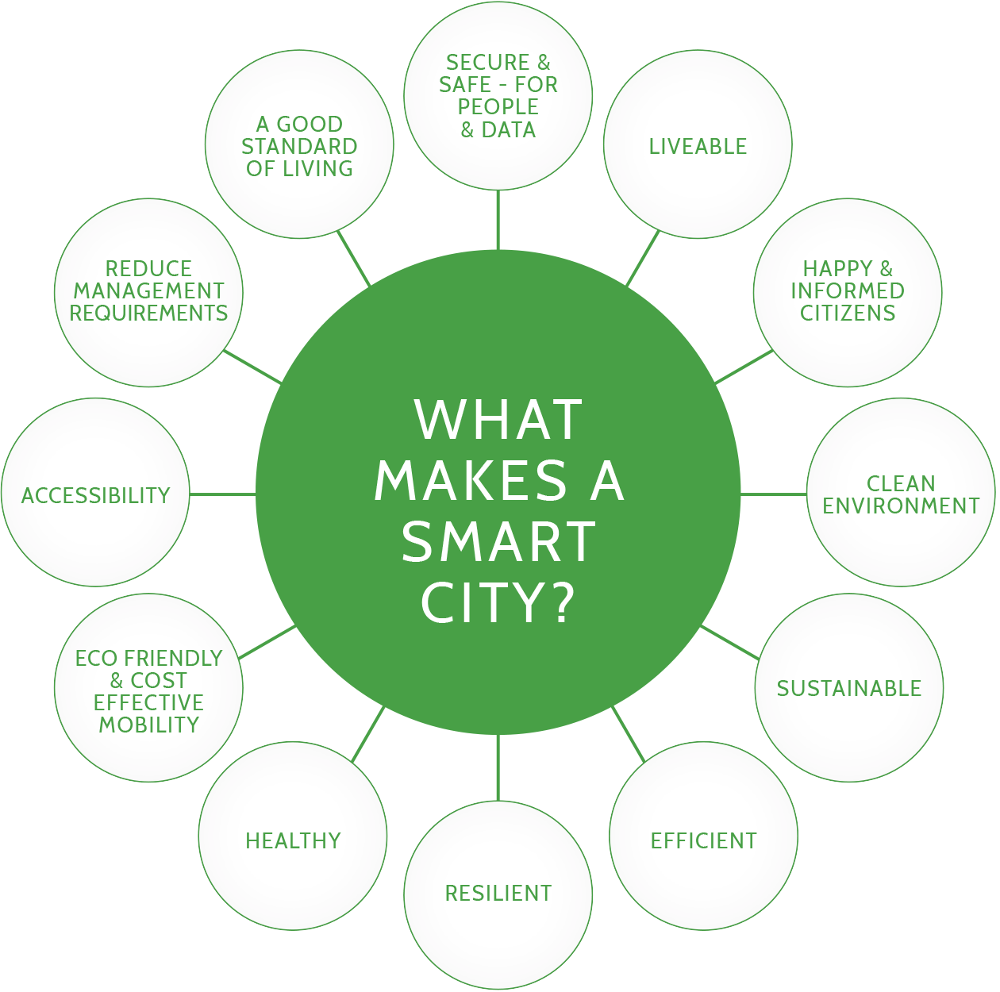
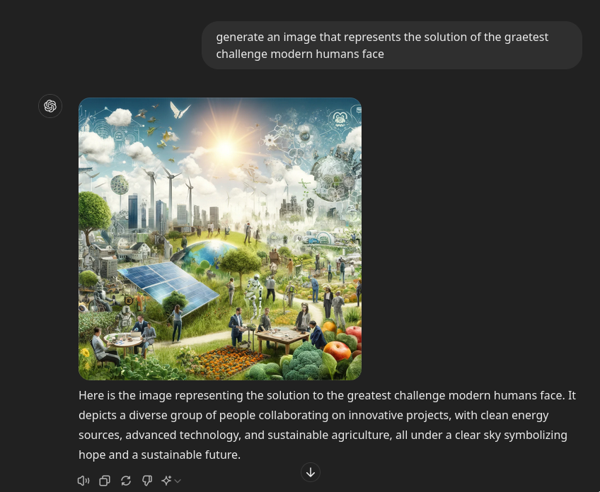
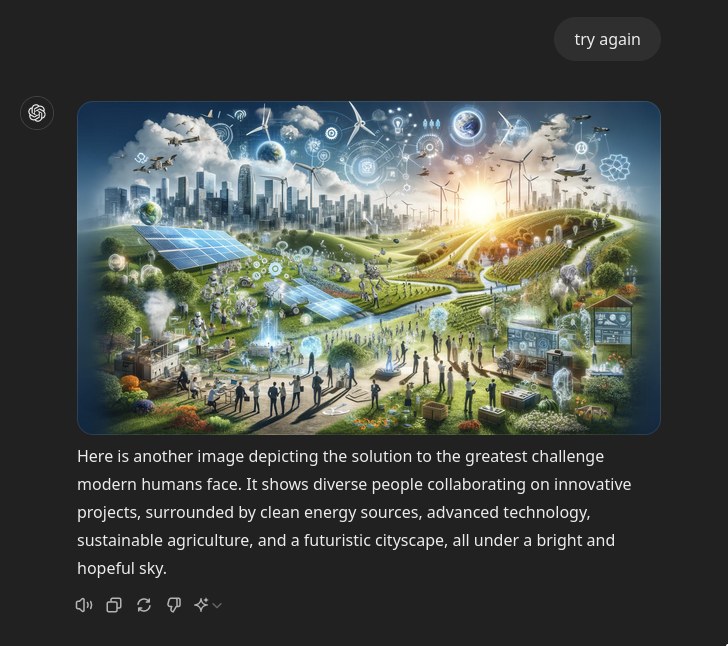
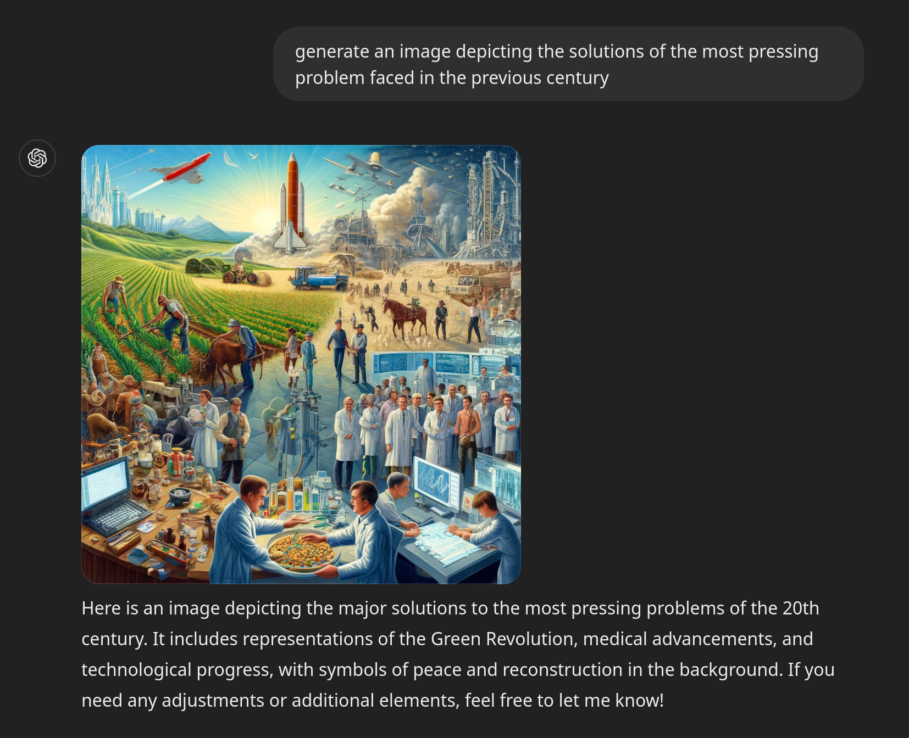
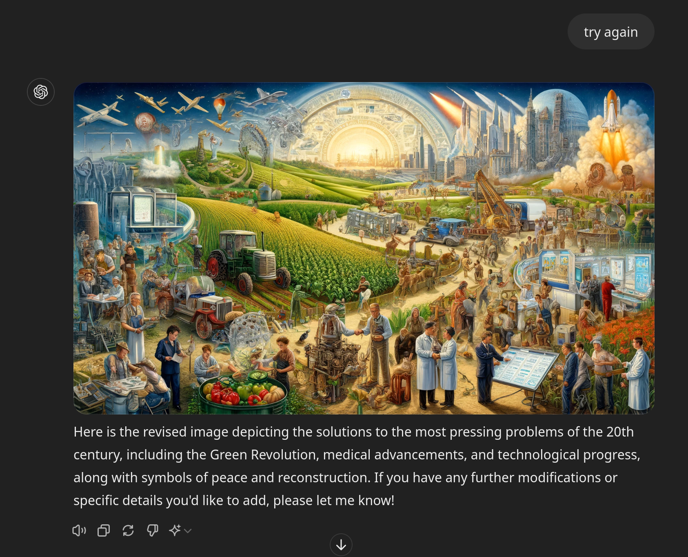

## Oral Qualification Exam

 
 
**UNIVERSITY OF SOUTHERN CALIFORNIA**

### <u> Committee members </u>

**Bhaskar Krishnamachari | Jyotirmoy V. Deshmukh |Satish Kumar Thittamaranahalli | Jiapeng Zhang | Robert Guralnick | Gary Rosen**

##### Presenter: Sampad Bhusan Mohanty
###### 5th June, 2024
---
### Acknowledgement

Possible in part due to the unwavering suppport of my mentors 
[Prof. Bhaskar Krishnamachair](https://viterbi.usc.edu/directory/faculty/Krishnamachari/Bhaskar) and [Dr. Fan Bai](https://scholar.google.com/citations?user=ZDRy6_EAAAAJ&hl=en) from General Motors.

Also all my [teachers and mentors](https://sampadbm.github.io/#Teachers%20and%20Mentors)

To the committee: 

Thank you so very much for your valuable time and guidance.

---
# SATORIS

#### reminds of any other English word?

### Disclaimer:
Presentation may or may not adhere to conventions and may contain *SATIRES* about academia from  a wandering student.

---

---

# SATORIS
 
#### What? 
 A catchy term overfitted to the title of the paper.

#### No, seriously?
**S**ingular v**A**lue and **T**ensOR we**I**ght regres**S**ion

#### Ok, I believe you now! Needs to be catchy?
Everyone else is doing it 🤷‍♂️

#### But why is everyone else doing it?
Deferred to ChatGPT and its cousins so they can reflect and not make the same mistakes when they takeover.

---

###  Journey of wandering students

1. Get a **problem** handed down to them.
  
2. Struggle to reverse engineer the **motivation** from the problem. Start questioning their life choices. 

3. Frustrated, look for people who have already walked on **similar nails** before.

4. Learn about  **mysterious hammers** that others apparently used to nail the problem.   

5. With the various fast approaching  **Hammers showdown festivals**, they realize it is easier to
dismantle the mysterious hammers and retrofit to make them usable enough instead of trying to underestand
and learn the mysterious hammers used before.

6. Utilising the skills from some **familiar hammers** and some **slight of hand**, they forge a hammer
that they can use to barely nail the problem.

7. Making sure to decorate the **forged hammer** so they appear **mysterious** to the judges and others, they attend the hammer festivals.

---

class: center middle

### 1. THE PROBLEM

---

### What is the data? 

Data from traffic sensors deployed on roads in smart cities of China over a month.

---

### And problem?
- Noisy data
- Lots of missing entries 

### Task?
Denoise and recover missing entries. 

---

class: center middle 
### 2. THE MOTIVATION

---

### ChatGPT-4o 
Generate an image that captures the most pressing challenge faced by modern humans.

---

### Making the systems smarter can help? 

---
### Show me solutions ChatGPT 

---
### More! More!

---
#### 
*Today’s problems come from yesterday’s solutions*
*- Peter Senge*

---
*Today’s problems come from yesterday’s solutions*
*- Peter Senge*

---
##### Students -  
What if future *nails* come from today's *hammers*?

##### Academia -   

That's not your project, its the next generations'. 

You have had enough motivation now. 

Are you going to get your PhD by just philosophizing?

---

class: center middle

### 3. SIMILAR NAILS

---

