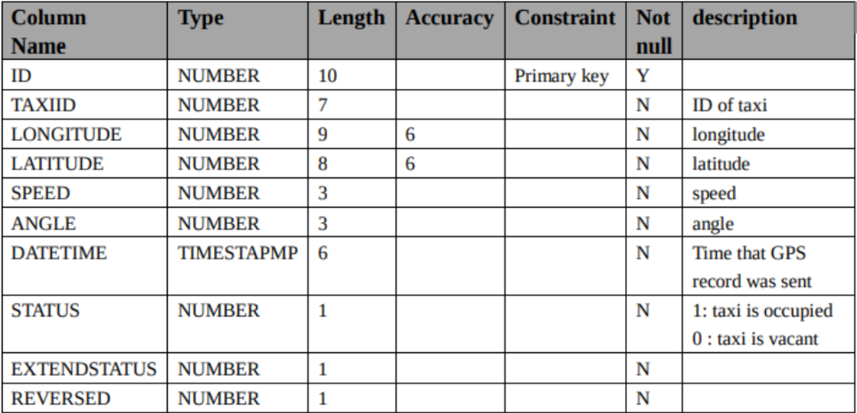
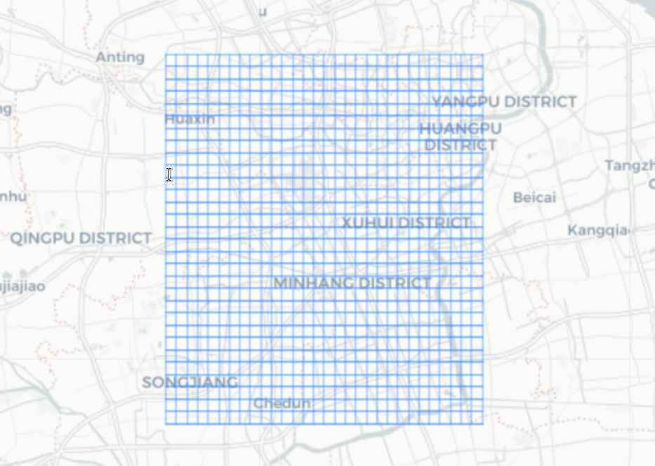
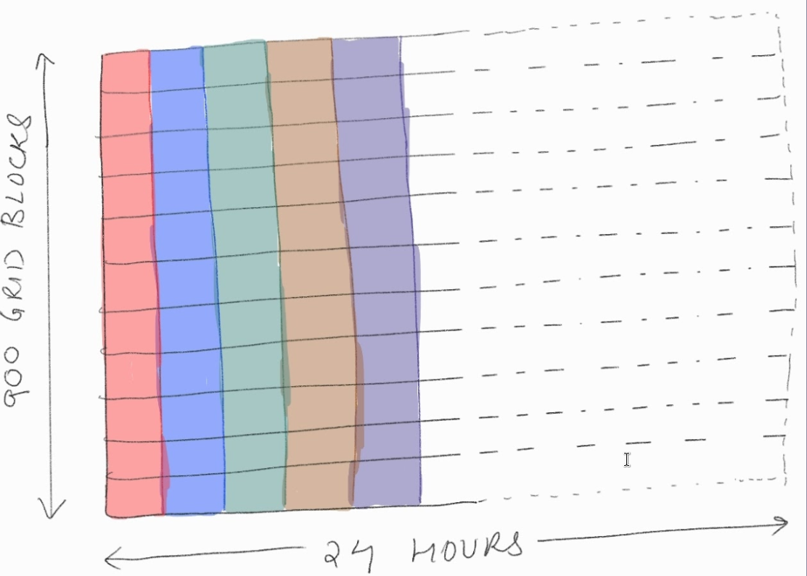

## Oral Qualification Exam

 
 
**UNIVERSITY OF SOUTHERN CALIFORNIA**

### <u> Committee members </u>

**Bhaskar Krishnamachari | Jyotirmoy V. Deshmukh |Satish Kumar Thittamaranahalli | Jiapeng Zhang | Robert Guralnick | Gary Rosen**

##### Presenter: Sampad Bhusan Mohanty
###### 5th June, 2024
---
### Acknowledgement

Possible in part due to the unwavering suppport of my mentors 
[Prof. Bhaskar Krishnamachair](https://viterbi.usc.edu/directory/faculty/Krishnamachari/Bhaskar) and [Dr. Fan Bai](https://scholar.google.com/citations?user=ZDRy6_EAAAAJ&hl=en) from General Motors.

Also all my [teachers and mentors](https://sampadbm.github.io/#Teachers%20and%20Mentors)

To the committee: 

Thank you so very much for your valuable time and guidance.

---
exclude: true

# SATORIS

#### reminds of any other English word?

### Disclaimer:
Presentation may or may not adhere to conventions and may contain *SATIRES* about academia from  a wandering student.

---

---
exclude: true

# SATORIS
 
#### What? 
 A catchy term overfitted to the title of the paper.

#### No, seriously?
**S**ingular v**A**lue and **T**ensOR we**I**ght regres**S**ion

#### Ok, I believe you now! Needs to be catchy?
Everyone else is doing it 🤷‍♂️

#### But why is everyone else doing it?
Deferred to ChatGPT and its cousins so they can reflect and not make the same mistakes when they takeover.

---
exclude: true

###  Journey of wandering students

1. Get a **problem** handed down to them.
  
2. Struggle to reverse engineer the **motivation** from the problem. Start questioning their life choices. 

3. Frustrated, look for people who have already walked on **similar nails** before.

4. Learn about  **mysterious hammers** that others apparently used to nail the problem.   

5. With the various fast approaching  **Hammers showdown festivals**, they realize it is easier to
dismantle the mysterious hammers and retrofit to make them usable enough instead of trying to underestand
and learn the mysterious hammers used before.

6. Utilising the skills from some **familiar hammers** and some **slight of hand**, they forge a hammer
that they can use to barely nail the problem.

7. Making sure to decorate the **forged hammer** so they appear **mysterious** to the judges and others, they attend the hammer festivals.

---

class: center middle

### 1. THE PROBLEM

---

### What is the (big) data? 

Data from traffic sensors deployed on roads in smart cities of China over a month.

### And problem?
- Noisy data
- Lots of missing entries (sensor/network/power failures)
- Cost restrictions - sparse and non-uniform sensor deployment
- Too large to store over longer periods (terrabytes/day)

### Task?
Address the challenges
posed by mobility datasets.

	- Denoise and recover missing entries. 
	- Store data more efficiently, compression.
---

class: center middle 
### 2. THE MOTIVATION

---

### Pressing problems of modern times
Generate an image that captures the most pressing challenge faced by modern humans.

---
### Some solutions

---
exclude: true

### More! More!

---

### Can smarter systems help? 

---

### Can smarter systems help? 

 **Today’s problems come from yesterday’s solutions** 

*- Peter Senge (The Fifth Discipline)*

---
exclude: true 
### Reflections: Solutions for 20th century problems

---
exclude: true
 **Today’s problems come from yesterday’s solutions** 

*- Peter Senge*
</hline>

---
exclude: true
 **Today’s problems come from yesterday’s solutions** 
*- Peter Senge*

---
exclude: true

##### Students -  
What if future *nails* come from today's *hammers*?

##### Academia -   

That's not your project, its the next generations'. 

You have had enough motivation now. 

---
### How can imputing accurate traffic data help?

1. Enhancing city efficiency/safety
	- faster commute times
	- reduced freight costs 
	- enhanced safety alerts and emergency dispatch
	- Predictable commute times

2. Addressing climate concerns
	- efficient fuel use
	- traffic shaping -> controlled air quality

3. Effective urban planning
	- traffic/commuter trends ->  effective urban planning for new cities 
	- Planning efficient locations for EV charging stations.
 

4. Enhancing downstream tasks
	-  informative data visualization
	-  easier for downstream tasks 
		- congestion detection
		- incident detection
		- City Functional Regions(Points of Interest) detection
			- business districts, residential area, education hubs, etc.
---

class: center middle

### 3. DATA REPRESENTATIONS

---
### Raw data

>>> `GPS Logs from ~ 2500 Taxis over 1 month`

---
### Grid view (Shanghai)

>>> >>> 30 x 30 grids

---
### Processed data matrix

---
### Processed traffic density (1 hour x 1km x 1km)

>>> >>> $X \times Y \times T$ tensors 

---
### Processed traffic density (1 hour x 1km x 1km)

 
##### Spatial plot
Contract time dim. using vector $\mathbf{1_T} \in \mathbb{R}^T$

##### Temporal plot
Contract spatial dims. using vectors $\mathbf{1_X} \in \mathbb{R}^X$ and $\mathbf{1_Y} \in \mathbb{R}^Y$

Same as contraction with matrix dot/inner product on spatial dimensions using 
matrix $\mathbf{1_X1_Y'} \in \mathbb{R}^{X \times Y}$
---

### Other Representations

