## Oral Qualification Exam

 
 
**UNIVERSITY OF SOUTHERN CALIFORNIA**

### <u> Committee members </u>

**Bhaskar Krishnamachari | Jyotirmoy V. Deshmukh |Satish Kumar Thittamaranahalli | Jiapeng Zhang | Robert Guralnick | Gary Rosen**

##### Presenter: Sampad Bhusan Mohanty
###### 13th June, 2024
---
### Acknowledgement

Possible in part due to the unwavering suppport of my mentors 
[Prof. Bhaskar Krishnamachair](https://viterbi.usc.edu/directory/faculty/Krishnamachari/Bhaskar) and [Dr. Fan Bai](https://scholar.google.com/citations?user=ZDRy6_EAAAAJ&hl=en) from General Motors.

Also all my [teachers and mentors](https://sampadbm.github.io/#Teachers%20and%20Mentors)

To the committee: 

Thank you so very much for your valuable time and guidance.

---
exclude: false

# SATORIS

#### reminds of any other English word?

### Disclaimer:
- slides may not follow some social norms but it doesn't matter for the results we converge to
are equivalent in all of them.

- slides may contain *graphic SATIRES* about academia, industry, world and life.

- Please don't take them seriously at all. Life is too short to not laugh. 

---

---
exclude: false

# SATORIS
 
#### What? 
 A catchy term overfitted to the title of the paper.

#### No, seriously?
**S**ingular v**A**lue and **T**ensOR we**I**ght regres**S**ion

#### Ok, I believe you now! Needs to be catchy?
Everyone else is doing it 🤷‍♂️

#### But why is everyone else doing it?
Deferred to ChatGPT and its cousins so they can reflect and not make the same mistakes when they takeover.

---
exclude: false

###  Journey of wandering students

1. Get a **problem** handed down to them.
  
2. Struggle to reverse engineer the **motivation** from the problem. Start questioning their life choices. 

3. Frustrated, look for people who have already walked on **similar nails** before.

4. Learn about  **mysterious hammers** that others apparently used to nail the problem.   

5. With the various fast approaching  **Hammers showdown festivals**, they realize it is easier to
dismantle the mysterious hammers and retrofit to make them usable enough instead of trying to underestand
and learn the mysterious hammers used before.

6. Utilising the skills from some **familiar hammers** and some **slight of hand**, they forge a hammer
that they can use to barely nail the problem.

7. Making sure to decorate the **forged hammer** so they appear **mysterious** to the judges and others, they attend the hammer festivals.

---

class: center middle

### 1. THE PROBLEM

---

### What is the (big) data? 

GPS logs from Taxi's operating in Beijing and Shanghai, China over a month.

### And problem?
- Noisy data
- Lots of missing entries (sensor/network/power failures)
- Cost restrictions - sparse and non-uniform sensor deployment
- Too large to store over longer periods (terrabytes/day)

### Task?
Address the challenges
posed by mobility datasets.

	- Denoise and recover missing entries. 
	- Store data more efficiently, compression.
---

class: center middle 
### 2. THE MOTIVATION

---

### Pressing problems of modern times
Generate an image that captures the most pressing challenge faced by modern humans.

---
### Some solutions

---
### Some solutions

 **Today’s problems come from yesterday’s solutions** 

*- Peter Senge (The Fifth Discipline)*

---
exclude: false

### More! More!

---
exclude: false

### Can smarter systems help? 

---
exclude: false
### Can smarter systems help? 

 **Today’s problems come from yesterday’s solutions** 

*- Peter Senge (The Fifth Discipline)*

---
exclude: false 
### Reflections: Solutions for 20th century problems

---
exclude: false
 **Today’s problems come from yesterday’s solutions** 

*- Peter Senge*
</hline>

---
exclude: false
 **Today’s problems come from yesterday’s solutions** 
*- Peter Senge*

---
exclude: false

##### Students -  
What if future *nails* come from today's *hammers*?

##### Academia -   

That's not your project, its the next generations'. 

You have had enough motivation now. 

---
### How can imputing accurate traffic data help?

1. Enhancing city efficiency/safety
	- faster commute times
	- reduced freight costs 
	- enhanced safety alerts and emergency dispatch
	- Predictable commute times

2. Addressing climate concerns
	- efficient fuel use
	- traffic shaping -> controlled air quality

3. Effective urban planning
	- traffic/commuter trends ->  effective urban planning for new cities 
	- Planning efficient locations for EV charging stations.
 

4. Enhancing downstream tasks
	-  informative data visualization
	-  easier for downstream tasks 
		- congestion detection
		- incident detection
		- City Functional Regions(Points of Interest) detection
			- business districts, residential area, education hubs, etc.
---

class: center middle

### 3. DATA REPRESENTATIONS

---
### Raw data

>>> `GPS Logs from ~ 2500 Taxis over 1 month`

---
### Grid view (Shanghai)

>>> >>> 30 x 30 grids

---

### Representations

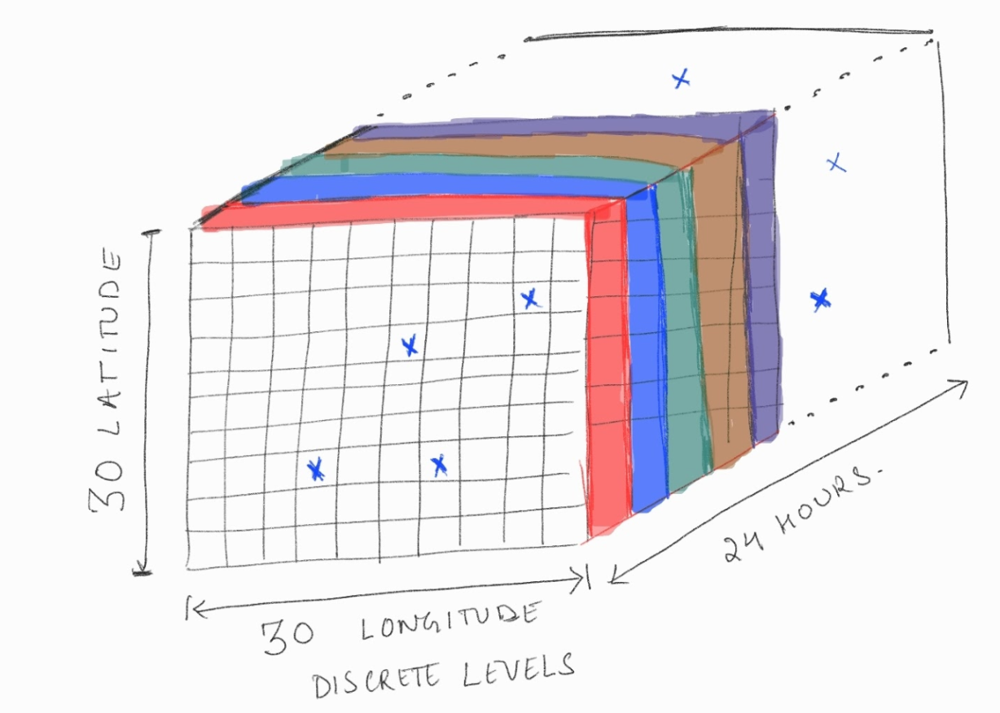
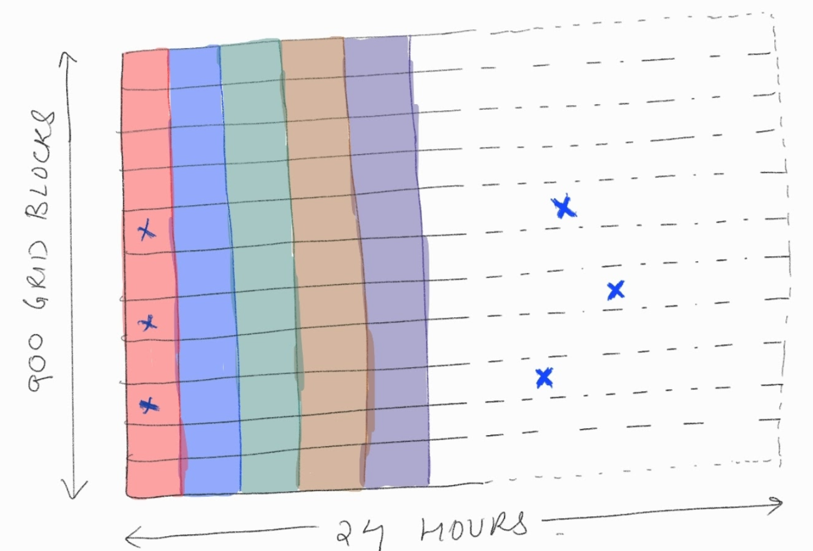
>>> Tensor   $\hspace{11em}$   Matrix
---
### Tensor Terminology

- Scalars, vectors, and matrices are $0^{th}, 1^{st},$ and $2^{nd}$ order tensors.

- For us, tensors mean a $3^{rd}$ or higher order tensor.

---
### Clash of cultures
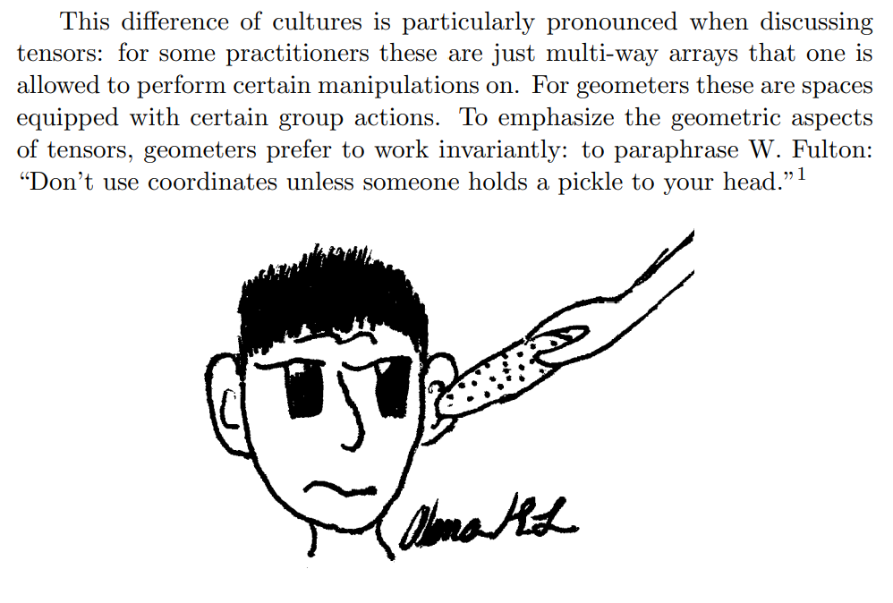

Preface, Tensors: Geometry and Applications, 

J. M. Landsberg 

---
### Clash of cultures : What does "Matrix" mean to you?

What does "A Matrix" mean to you?

- linear transformation with $Ax$
- system of linear equations with $Ax=b$
- multilinear transformation with $x^TAy$
- representation of algebraic structures/operations
- First derivative - Gradient / Jacobian
- Second derivative - Hessian
- Graphs with (weighted) adjacency and incidence matrices
- ...

*- said the mathematician*
---
### Clash of cultures : What does "Matrix" mean to you?

- Reality, Hyperreality, Projections of reality onto senses, Simulation

 *- said the movie buff turned epistemologist*
 
<!-- 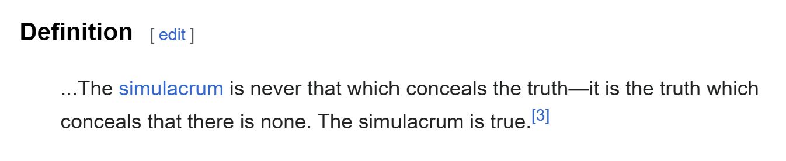 -->

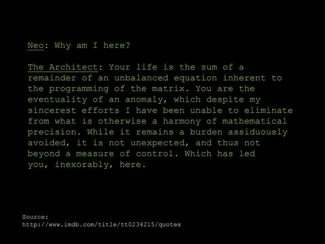
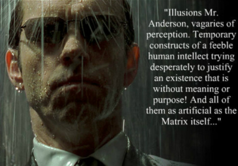

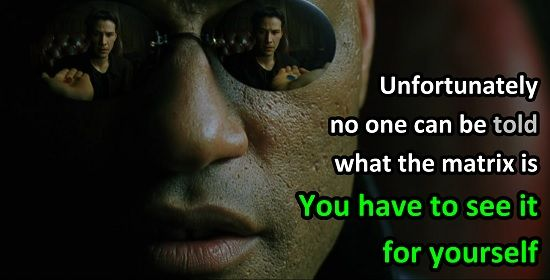
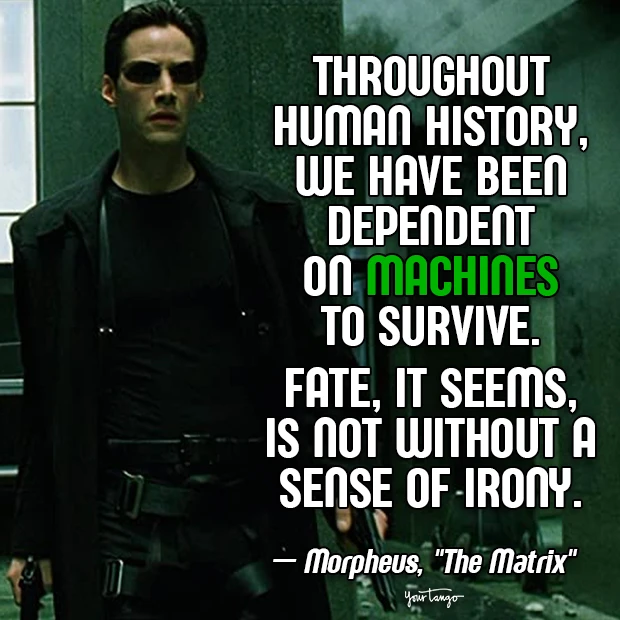

---
### Clash of cultures : What does "Matrix" mean to you?

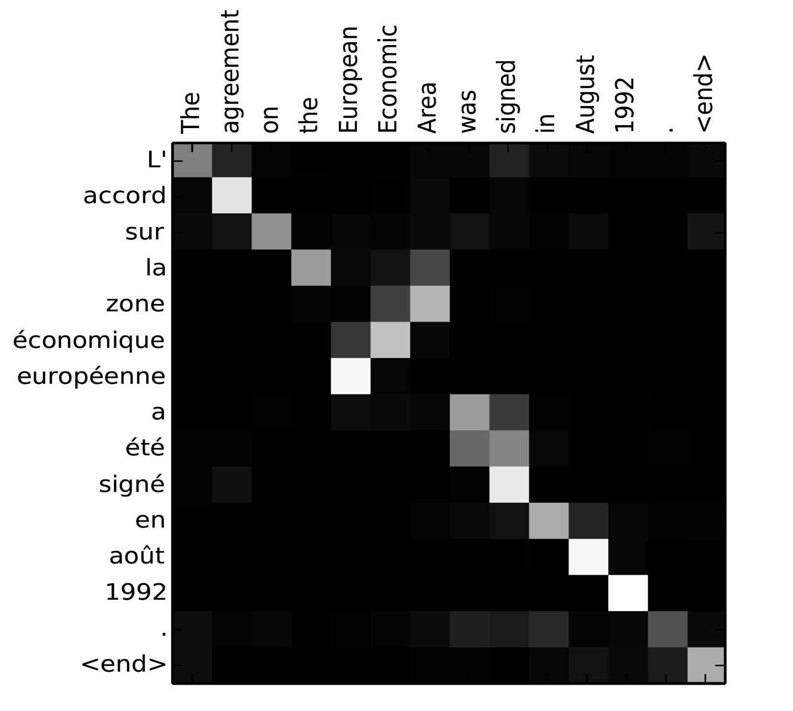

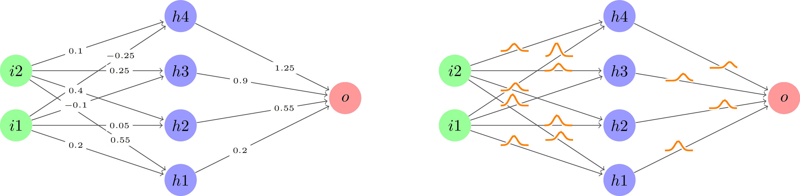 
 
  
&nbsp;

&nbsp; 

&nbsp;

&nbsp;

- Attention 
- Parameters, weights and biases

*- said the NLP and deeplearning guy*

---
### Clash of cultures : What does "Matrix" mean to you?

>>> ChatGP T-800 Mainframe, 2053AD

*- said Sam Altminator*

---
### Clash of cultures : What does "Matrix" mean to you?

*- said the accidental engineer*
---
### Clash of cultures : What does "Matrix" mean to you?

No, I am Serious. Look closer

*- said the accidental engineer*
---
exclude: false 
### Processed traffic density (1 hour x 1km x 1km)

>>> >>> $X \times Y \times T$ tensors 

---
### Processed traffic density visualizations
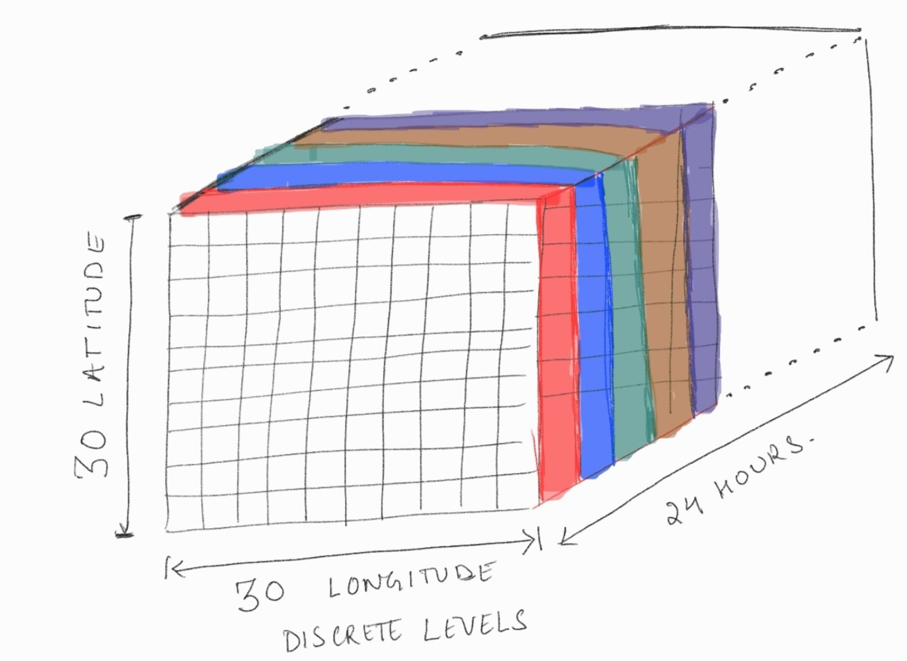

$\hspace{20em} X \times Y \times T$

**Spatial plot: **
Contract time dim. using vector $\mathbf{1_T} \in \mathbb{R}^T$

**Temporal plot:**
Contract spatial dims. using vectors $\mathbf{1_X} \in \mathbb{R}^X$ and $\mathbf{1_Y} \in \mathbb{R}^Y$

Same as contraction with matrix dot/inner product on spatial dimensions using 
matrix $\mathbf{1_X1_Y'} \in \mathbb{R}^{X \times Y}$ because $\mathbf{v^TBv} = \langle \mathbf{B},\mathbf{vv^T} \rangle$

---
class: center middle
# 4. SELECTED PRIOR WORK
---

### Prior work @ USC-ANRG + GM

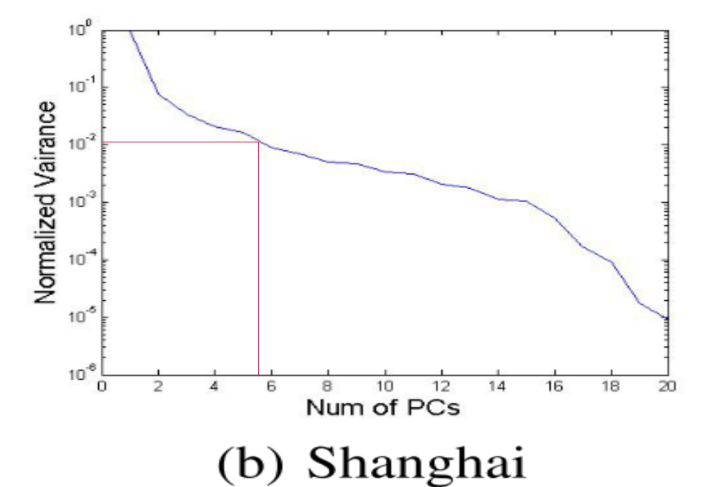
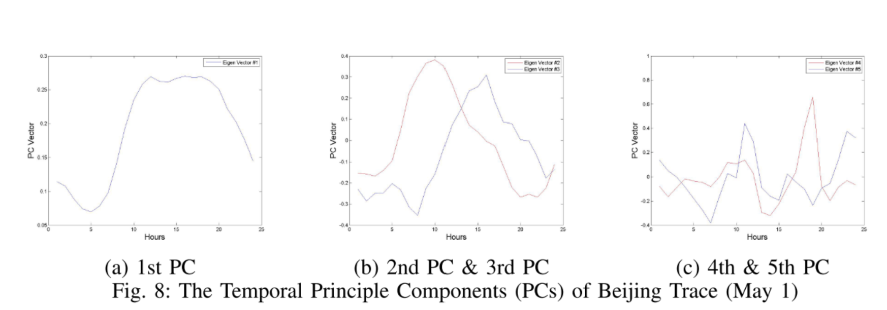

---

### Prior work @ USC-ANRG + GM
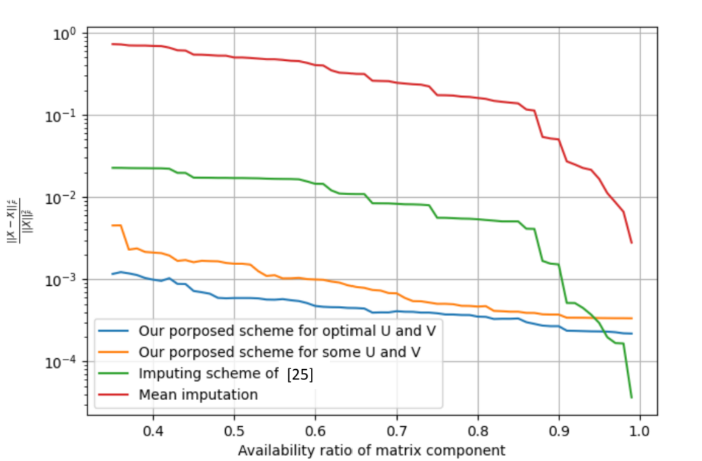

---
class: center middle
# 5. MORE ABOUT TENSORS

---
### Atoms using (outer) products

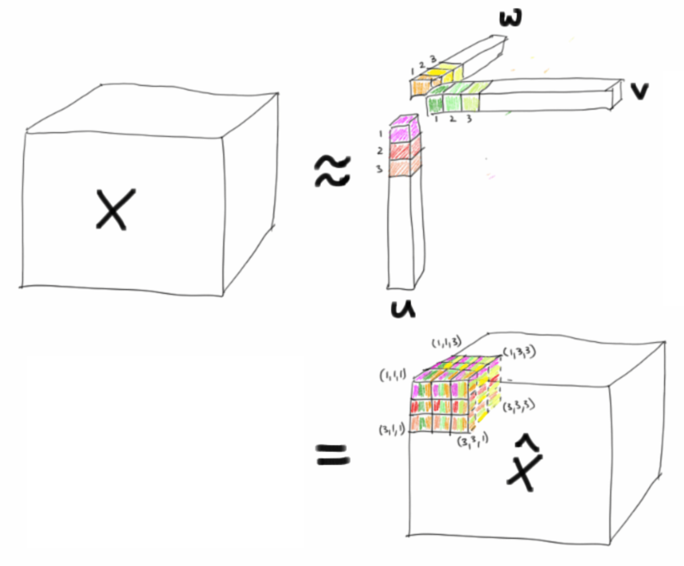

>>> Atoms are also know as "Simple tensors"

---

### Decomposition into sum of rank-1 atoms
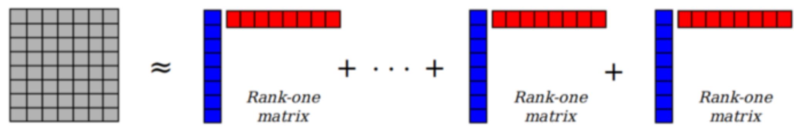

$$\text{Matrix Decomposition}$$

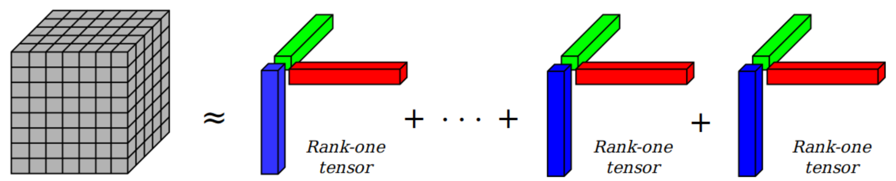

$$\text{Tensor Decomposition}$$

---
### Some other decompositions
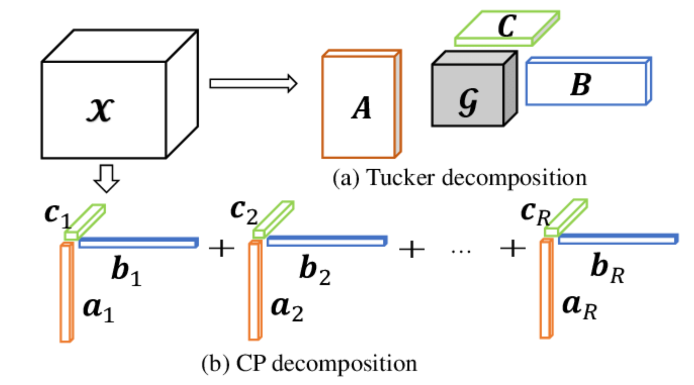

$$\text{Tucker vs CP Decompositions}$$

---
### Matrix vs Tensor(order > 2) decomposition

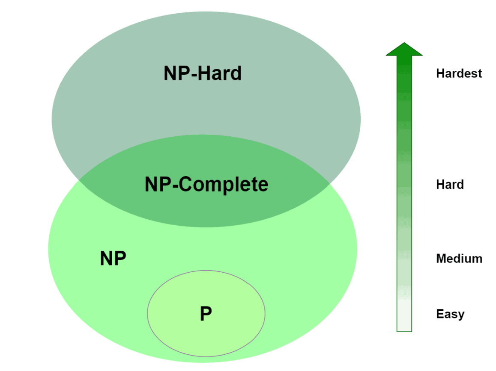

|Factorization | | Time complexity || Notes |
|--------------|-|---------------|---------|
|$\;$|$\;$|$\;$|$\;$|
| Cholesky,QR | | $O(n^3)$ || |
| SVD | | $O(mn^2)$ || $m \geq n$|
|EVD| | $O(n^3)$ || SVD($AA^T$) + SVD($A^TA$) = $2O(n^3)$|
| Accurate CP | | NP Hard || $\because$ finding rank is NP Hard||

---
### Other peculiarities of Matrix vs Tensor decomposition

1. If A is a matrix of rank r over a field F then it has rank r over any extension field of F. 
Matrices have same ranks under $\mathbb{R}$ and $\mathbb{C}$ as the later extends the former. $^{**}$

2. If A is a matrix of rank r over a field K then its rank over any sub-field of K is at least r
. But it can be more also.$^{**}$

3. The rank of a tensor(order > 2) could be different over $\mathbb{R}$ and $\mathbb{C}$.

** from [math.stackexchange](https://math.stackexchange.com/questions/2571197/a-problem-on-rank-of-a-matrix-over-two-fields)

---
### Other peculiarities of Matrix vs Tensor decomposition
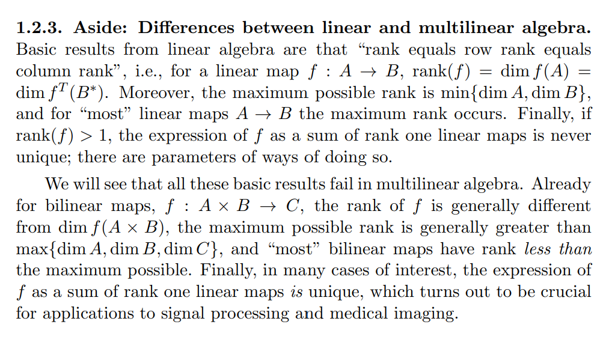

Chapter 1, Tensors: Geometry and Applications, J. M. Landsberg

$\mathbf{M = AB} = \boldsymbol{\alpha \beta}$ 

if $\boldsymbol{\alpha} = \frac{1}{\gamma} \mathbf{AU^*}$, $\boldsymbol{\beta} = \gamma \mathbf{UB}$ for any unitary matrix $\mathbf{U}$ and 
any scalar $\gamma \neq 0$.

Unique upto rotation/reflection/permutation and scaling.
---
### Other peculiarities of Matrix vs Tensor decomposition

Krushkal Rank  (also called spark of a matrix) vs Rank
---
class: center middle
# 6. OUR WORK

---
### Hypothesis and Assumptions

##### Hypothesis
There exist two kinds of latent factors that completely explain traffic patters
- time invariant latent factors and 
- time varying latent factors 

##### Assumptions 

1. Observed data of a particular day can be explained by linear combination (weighted by the time varying factors)
 of the time invariant factors.

2. Let the rank-1 matrix/tensor atoms obtained by decomposition of the data representation be time invariant.

3. Let the decomposition weights on the rank one atoms be time variant

**We will empirically validate above assumptions on our dataset.**

---
class: center middle
# 7. Symbols, Definitions, Unified Framework

---
### Ground Truth

$\odot$

$=$

$\hspace{3em}\mathbf{T(t)} \hspace{4.5em}\odot\hspace{4em} \boldsymbol{\Omega(t)} \hspace{3em}=\hspace{4em}\mathbf{D(t)}$

Where,

$\mathbf{T} \in \mathbb{R}^{X \times Y \times Z}$

$\boldsymbol{\Omega} \in  \set{0,1}^{X \times Y \times Z}$, observed locations marked as $1$.

$\boldsymbol{\bar \Omega} = \boldsymbol{1 - \Omega}$, missing locations marked as $1$.

$\mathbf{D} \in \mathbb{R}^{X \times Y \times Z}$

---
### Reconstructor

$\overset{\phi}{\longrightarrow}$

$\hspace{3em}\underbrace{\mathbf{D}}_{\mathbf{T} \odot \boldsymbol{\Omega}} \hspace{5em} \overset{\phi}{\longrightarrow} \hspace{4em} \mathbf{\tilde T}$

$$\phi_{\theta} : \mathbb{R}^{X \times Y \times Z} \times \mathbb{R}^{X \times Y \times Z} \rightarrow \mathbb{R}^{X \times Y \times Z}$$

$$ \mathbf{\tilde T} = \phi(\mathbf{D},\boldsymbol{\Omega}; \boldsymbol{\theta})$$

latent parameters: $\mathbf{R}^{p} \ni \boldsymbol{\theta} = [\boldsymbol{\theta_1}, \boldsymbol{\theta_2}]$

<!-- time invariant component: $\boldsymbol{\theta_1} \in \mathbf{R}^{p_1}$ -->

<!-- time variant component: $\boldsymbol{\theta_2} \in \mathbf{R}^{p_2}$ -->
---
### Error metrics: Tensor Completion Score and Reconstruction error

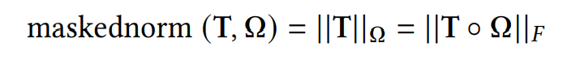

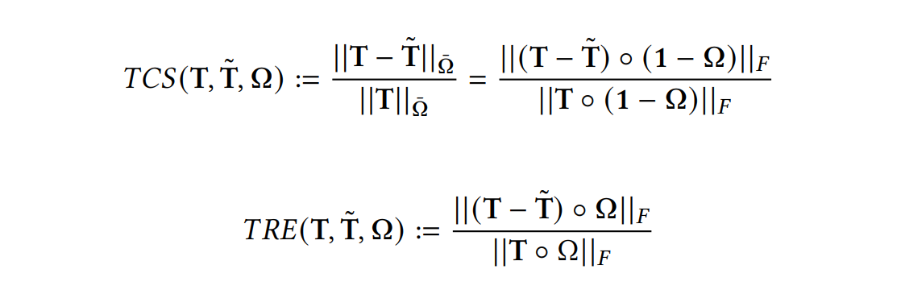

---
### Latent Parameters

$$\phi_{\theta} : \mathbb{R}^{X \times Y \times Z} \times \mathbb{R}^{X \times Y \times Z} \rightarrow \mathbb{R}^{X \times Y \times Z}$$
$$ \mathbf{\tilde T}(t) = \phi(\mathbf{D}(t),\boldsymbol{\Omega}(t); \boldsymbol{\theta}(t), \boldsymbol{\psi}(t_0))$$

latent parameters: $\mathbf{R}^{p} \ni \boldsymbol{\theta} = [\boldsymbol{\theta_1}, \boldsymbol{\theta_2}]$

time invariant component: $\boldsymbol{\theta_1} \in \mathbf{R}^{p_1}$

time variant component: $\boldsymbol{\theta_2} \in \mathbf{R}^{p_2}$

$p_1 + p_2 = p$

$\phi$ may additionally depend on optional auxiliary information $\boldsymbol{\psi}(t_0)$
where $|t_0 - t| \leq \epsilon$ for some $\epsilon geq 0$

---
### Latent Parameter Estimators

$$
	\mathbf{R}^p \in \boldsymbol{\theta} = [\boldsymbol{\theta_1, \theta_2}] \leftarrow  E(\mathbf{D}, \boldsymbol{\Omega}, Null, Null)
$$

$$
	\mathbf{R}^p_2 \in \boldsymbol{\theta_2} =  \leftarrow  E(\mathbf{D}, \boldsymbol{\Omega}, \boldsymbol{\theta_1}, Null)
$$

<!-- $$ -->
<!-- 	\mathbf{R}^p_1 \in \boldsymbol{\theta_1} = \leftarrow  E(\mathbf{D}, \boldsymbol{\Omega}, Null, \boldsymbol{\theta_2}) -->
<!-- $$ -->

$$p = p_1 + p_2$$

<h5 style="color:orange"> Note A: </h5> 

The estimation is not perfect and depends on the following -

- missing data percentage or equivalently sparsity of $\boldsymbol{\Omega}$
- Noise in the observed entries in the data
- estimator efficiency as the estimators are approximate algorithms

However, this may give a more stable/better quality  estimation of $\boldsymbol{\theta_1}$ due to the additional 
observations. Ofcourse this should qualitatively relate to the coherency between the observed tensors.

---
### Vectorized Latent Parameter Estimators

$$
	 \boldsymbol{\vec \theta} = [\boldsymbol{\theta_1, \vec \theta_2}] \leftarrow  E(\mathbf{\vec D}, \boldsymbol{\vec \Omega}, Null, Null)
$$

$$
	 \boldsymbol{\vec \theta_2} =  \leftarrow  E(\mathbf{\vec D}, \boldsymbol{\vec \Omega}, \boldsymbol{ \theta_1}, Null)
$$

<!-- $$ -->
<!-- 	 \boldsymbol{\theta_1} = \leftarrow  E(\mathbf{\vec D}, \boldsymbol{\vec \Omega}, Null, \boldsymbol{\vec \theta_2}) -->
<!-- $$ -->

<h5 style="color:orange"> Note A: </h5> 

The estimation is not perfect and depends on the following -

- missing data percentage or equivalently sparsity of $\boldsymbol{\Omega}$
- Noise in the observed entries in the data
- estimator efficiency as the estimators are approximate algorithms

---
### Data Generating Process

$$ G(\boldsymbol{\theta_1, \theta_2}) \rightarrow \mathbf{D} $$

**Intuition:**There is some physical process that generates the observed data $\mathbf{D}$ based on the 
latent parameters \boldsymbol{\theta}. 

**Question:** If $p << X  \times Y \times Z$, how can we have a bijection?
Answer: We don't, the observed data is assumed to lie on a low dimensional manifold in a 
high dimensional ambient space + noise. 

**Can we remove noise?** The generating process $G$ will reconstruct without noise.

**Is this manifold a convex set?** Not in our model and assumptions. This is because
the convex combination of two rank $k$ matrices $\mathbf{A,B}$ given by $\mathbf{C} = \alpha A + \beta B$ 
isn't necesarilly a rank $k$ matrix when $\alpha + \beta = 1$ and $\alpha, \beta \geq 1$ 

e.g
$\begin{bmatrix} 1 & 0 ,2 & 0\end{bmatrix}$ and $\begin{bmatrix} 0 & 7 ,0 & 11\end{bmatrix}$

---
### SATORIS: Unified Framework

- **Key Idea 1:**We can reconstruct the data on the low dimensional manifold rejecting the noise if we know  $\boldsymbol{\theta = [\theta_1, \theta_2]}$.

- **Key Idea 2:** Estimating the invariant parameter $\boldsymbol{\theta_1}(t)$ from highly noisy and sparse observation $\mathbf{D}(t)$ 
can be avoided and instead estimated from another better quality dataset from time $\mathbf{D}(t_0)$ where $t_0$ is close to $t$,
i.e $|t - t_0| \leq \epsilon$ where $\epsilon \geq 0$ is a hyperparameter to our model along with the
rank $r$ of the tensor.
---
### Quality of reconstruction
How good can the reconstruction be?

<h5 style="color:orange"> Note A: </h5> 

The estimation is not perfect and depends on the following -

- missing data percentage or equivalently sparsity of $\boldsymbol{\Omega}$
- Noise in the observed entries in the data
- estimator efficiency as the estimators are approximate algorithms

<h5 style="color:green"> Note B: </h5>
- How good the assumption on time invariance of $\boldsymbol{\theta_1}(t)$ holds 
between times $t$ and $t_0$.

---
### Two regimes 

##### Unknown invariant paramters $\boldsymbol{\theta_1}(t)$
$$
	\color{green}\mathbf{\tilde T}(t)\color{black} = G(\color{orange}\boldsymbol{\theta_1}(t), \color{blue} \boldsymbol{\theta_2}(t)\color{black}) 
$$

$$
	\color{orange}\boldsymbol{\theta_1}(t),\color{blue}\boldsymbol{\theta_2}(t)\color{black} \leftarrow E(\mathbf{D}(t), \boldsymbol{\Omega}(t), Null, Null)
$$

##### Known invariant paramters $\boldsymbol{\theta_1}(t) = \boldsymbol{\theta_1}(t_0)$
We  know $\mathbf{D}(t), \boldsymbol{\Omega}(t), \mathbf{D}(t_0),\boldsymbol{\Omega}(t_0), G, E$ and we want to find $\mathbf{\tilde T}(t)$

$$
	\color{green}\mathbf{\tilde T}(t)\color{black} = G(\color{orange}\boldsymbol{\theta_1}(t), \color{blue} \boldsymbol{\theta_2}(t)\color{black})  = G(\color{orange}\boldsymbol{\theta_1}(t_0), \color{blue} \boldsymbol{\theta_2}(t) \color{black}) 
$$

$$
	\color{orange}\boldsymbol{\theta_1}(t_0)\color{black} \leftarrow E(\mathbf{D}(t_0), \boldsymbol{\Omega}(t_0), Null, Null)
$$

$$
	\boldsymbol{\color{blue}\theta_2}(t) \leftarrow E(\mathbf{D}(t), \boldsymbol{\Omega}(t), \boldsymbol{\theta_1}(t_0), Null)
$$

---
### Two regimes (Vectorized) 

##### Unknown invariant paramters $\boldsymbol{\theta_1}(t)$
$$
	\color{green}\mathbf{ \vec {\tilde T}}(t)\color{black} = G(\color{orange}\boldsymbol{\theta_1}(t), \color{blue} \boldsymbol{\vec \theta_2}(t)\color{black}) 
$$

$$
	\color{orange}\boldsymbol{\theta_1}(t),\color{blue}\boldsymbol{\vec \theta_2}(t)\color{black} \leftarrow E(\mathbf{\vec D}(t), \boldsymbol{\vec \Omega}(t), Null, Null)
$$

##### Known invariant paramters $\boldsymbol{\theta_1}(t) = \boldsymbol{\theta_1}(t_0)$
We  know $\mathbf{\vec D}(t), \boldsymbol{\Omega}(t), \mathbf{\vec D}(t_0),\boldsymbol{\Omega}(t_0), G, E$ and we want to find $\mathbf{\vec{\tilde T}}(t)$

$$
	\color{green}\mathbf{\vec{\tilde T}}(t)\color{black} = G(\color{orange}\boldsymbol{\theta_1}(t), \color{blue} \boldsymbol{\vec \theta_2}(t)\color{black})  = G(\color{orange}\boldsymbol{\theta_1}(t_0), \color{blue} \boldsymbol{\vec \theta_2}(t) \color{black}) 
$$

$$
	\color{orange}\boldsymbol{\theta_1}(t_0)\color{black} \leftarrow E(\mathbf{\vec D}(t_0), \boldsymbol{\vec \Omega}(t_0), Null, Null)
$$

$$
	\color{blue} \boldsymbol{\vec \theta_2}(t) \color{black} \leftarrow E(\mathbf{D}(t), \boldsymbol{\Omega}(t), \boldsymbol{\theta_1}(t_0), Null)
$$

---
class: center middle
# PROPOSED METHODS

---
### Singular Value and Tensor Weight Regression
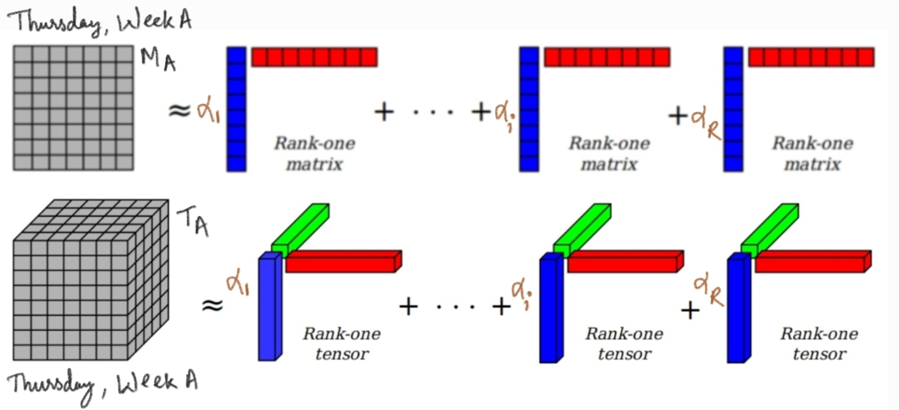

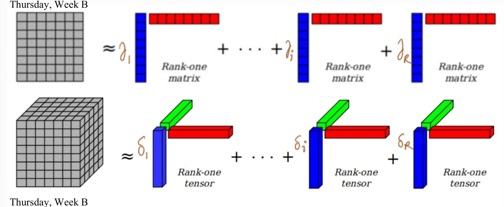

---
class: middle center
# EXPERIMENTAL SETUP

---
### Setup

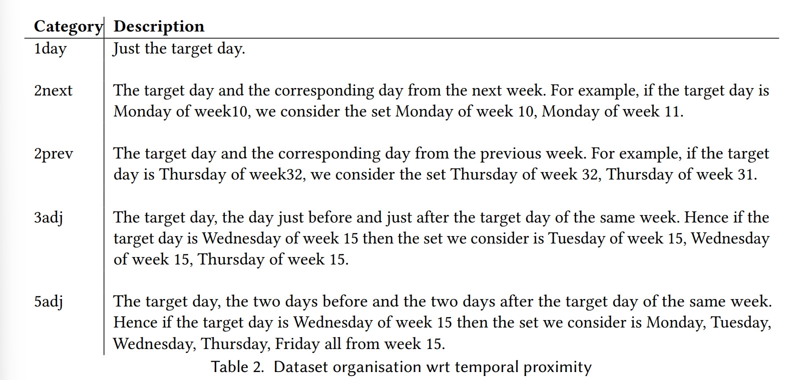

---
class: middle center
# RESULTS 

---
### 1 Day
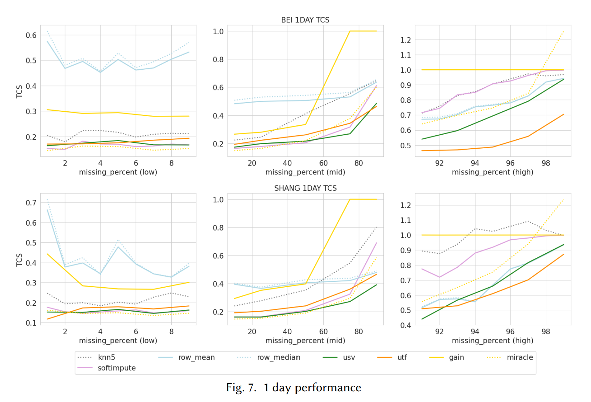

---
### 3 Day
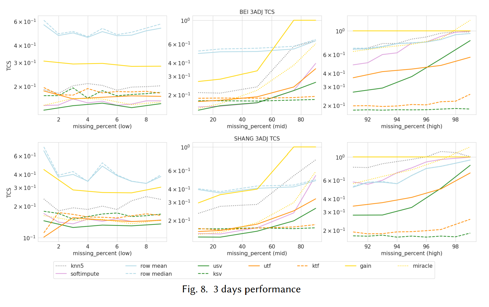

---
### 5 Days
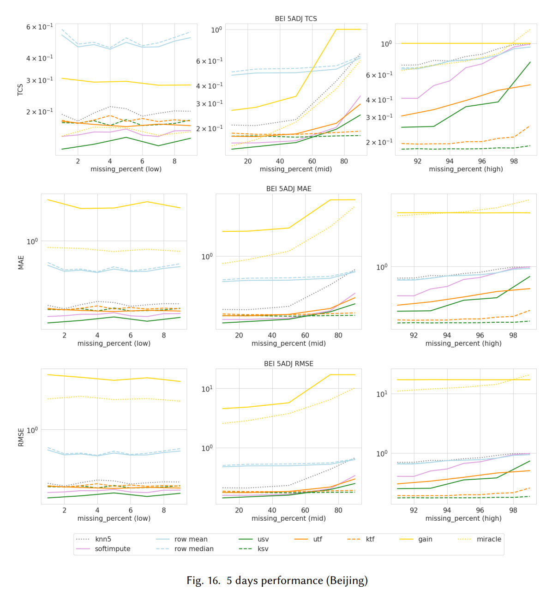

---
class: middle center
# THANK YOU VERY MUCH

More resutls in the paper. 

Also about verification of our assumptions of time invariance of the matrix/tensor atoms.

[link to paper](SATORIS.pdf)
