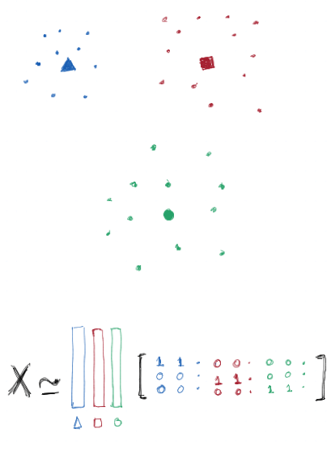

class: center middle

## Matrix And Tensor Factorization
### Approximations for understanding Spatiotemporal Data

Sampad Mohanty  
Autonomous Networks Research Group, USC

24th September, 2025

---

#### About me
 
    - Advisor : Prof. Bhaskar Krishnamachari

    - Interests : 
        - Generalized Low Rank Models 
        - Interpretability / Safety in ML/LLMs, 
        - Physics + ML 
        - Technologies for Teaching/Learning

    - Other Interests :
            - Measures of inequality in access to quality of education.
            - Philosophy

    - Come say hi after the talk if you find these topics interesting

    - Would like to get involved/collaborate/propose via project(s)  

---
### Tensors in disguise

---

### Examples : 1D Tensor

---
### Examples: 2D Tensor

---
### Example: 3D Tensors

---
### Matrix And Tensor Factorization / Decomposition

$\;$ 

$\;$

---
## Some Factorizations:

- Matrix:
    - Eigenvalue Decomposition (EVD) | $M = PDP^{-1}$
    - Singular Value Decomposition (SVD) | $M = U\Sigma V^T$
    - Principal Components Analysis ( Special case of EVD/SVD)
    - QR Factorization | $M = QR $
    - LU Decomposition | $M = LU$
    - Cholesky Factorization | $M = LL^T$
    - CUR Factorization | $M = CUR$
    - Non-negative Matrix Factorization (NMF) | $M = AB$

- Tensor:
    - Canonical Polyadic (CP) / Parallel Factors (PARAFAC)
    - Tucker Decomposition
    - Hierarchical Tucker
    - Higher Order SVD (HOSVD)
    - Tensor Train (TT) / Matrix Product State (MPS)
    - Tensor Networks
    - Tensor CUR 

---
## Tensor Factorization: CP vs Tucker Decomposition

---
## SVD for Image Compression

<iframe width=100%vw height=80%vh style="border:none" src="https://marimo.app/?embed=true#code/MQAg9BIM4MYE4EsAOAXAUKA2ig9jgNgHQC2AhosToXAK4B2KCxApgLoYik24D6CdUFKQYJSKZiAC8IAGal8UZhwhg0aJkhxwUIMhRxqePAObM6zOGOYATHgHcEKABZSQAIlII3aUkiSu9JioAQT8ACgdrZ0k3FmsEGmI3AEo1AAFfJEIYZnx8NGtmGRAeMOSALjQQapANLR1Ayk4oXQMa2uJNbRA6RKQAT2aepCqauu6yFCR8HBR8BAAjQgHp2aHp9HaZOBxiaABrJlJTDq6dazFSABoQGAItUert3YOj00IUSwEZLT3xnTgzCgCAAXkp2o8QKAADI4UjWTh0BFIQEonA5KAtN4SMLGSz9WDyZg3QHAsGyLTQJDMGypdpaBDGfjyPhkE7SO4zODUYwLABMeNI-TCFyEhFIgh2dC4KDKdJqUDIeVZxwk0lJoOYYQZTOl+BVphuYQAjHyABw3U1m5I3YSMHjyUTAujGSQAFVozHl1Uhivk+uxkMBKBocDo6Uy2Vy+UKxVKFUhlBI1jCbjTkJhODsIAASsJ9iBQmiAB5HRg4OggHDFYQgACSbPBNUhbqcCBadFmzAWeALhUoAk+VhaTizIFwnD8O1LkwktexIBozuMnBAMzsAFovgXJohiyBCndOjhgeXK2EAMoANQAIslCJC0ykg8wQ2GI34o3kCkUSmVKu0oAAKp1uU0DzIUcAUlB27QLkzAwGeQb5jwUAQRYARUDQCCEGhCCQSalrmjcABu8g0Mwkh8gADDc+CkAsuQxHmdAFtWk4lmWCAVs+7Tbqh6FwC+b7hmgGSfjk36xn+CaASAADCuxINwEjXjeiIIoCdyDrQiEdKqnA6Io+AIeImn5pCQE3BeNxXm6rh0Fk8x6sYuEkSmfrKtiNwyDQyq7ggGKSAAYvIijeiAsHqiheGQYQZH4BRkIZiAsKbrBmTTlxFaQplODFgaaogGEQGYOUNzlNurAgGkwyEPExyXmVVXJDVIB2c1+YVawEUpQACjMOg6sy+AaRxWWTNxlbAoUIALIMM1Nk8jK2sWQKuBsuE0AsqwoFAhEgHyPmMmSlFhBaIAACzJBFpBrVAmDUawhBMFAo52GEnkBo2NwwGQSCSAA5IK-SA7d92Pc9igoDwjBzFqgMAPKILq8hg7lENPeKpb7YD1YyOj7R3UCmDGs9r3vWEeUFd5tz-UDIOEzUxMPWTuGvrDjgmWEBMsQWADe24AL6FlO+XZXQTPVCzpPPXd7ZhHjMgExFm2MMYTgw-R-Q4NwZSQptxgwKQ+t8a+oaieJWSSTGv7xgBNRJsQKZPpZijjk4EixRhDE4CREgTjATjCCczgSLB7Fh+N4uTRWhCpVmGHbi0pJ+To-CtICtxKaSwIVmNMyYlWxSFEICD4DcdhtiZIBthrSf5i0-QILkCKkJnc4wDAoZWJFCEVpKNCIVND7tE+EXBhbagIHGPDSiwRhSNIbhGGQ-BGG4DvS5+tB0PrQA"> </iframe>

---
## Principal Components Analysis

<iframe width=100%vw height=90%vh style="border:none" src="https://marimo.app/?embed=true#code/JYWwDg9gTgLgBCAhlUEBQaD6mDmBTAOzykRjwBNMB3YGACzgF44AiAVwIGsCIqCW0iMGCYJkqAHQBBYQAoAlBjQABIWAkBjPABttacngBmcTAoBcaOFbihIsMShAQ4iAM4J01m+GjwwiAnI3F3cwcktrW184AjZwAE8QmLAIqyj7RG0YRGAoJMyYVLhDKAgQOFdObTxkAgkg7Nc8GHd0+G0IREpyYBxaVyKSsoqqmqg6gw0yyFdaYAgCbzt4AAUAYSkitrEYMA6YbWAAIwkweL2IeGC9wq8oZrZxuHWpABoXLPeOrswevpb3k53gQwO8wmCskpVMJNDptLI6MADJgpgZGAAVKBsPCKAzGUwvL6dbq9frA0FwcGUrLyCxeADEcAAMsS4PQ8HA-v1OaQ3M0XIFitpSGRFqBEPgBl5Kr9SS1RN8Sf9XAoigANUQyrkteq8orCo46dzMLVy1wSbJQfCFIqMgBKFDYWjZzgATAAROA0ejPDZFMAaRCiF6yAgo6YLQgtRiuxReNWYV3kUQBxASQy0TAwEgEVyGaAgWRqxS2uBre6kDlB928gBiJBAHPzeSkWRyUCK2tcv2MzDCEhr2XriEbsgA3kUvABydYARinZjgCaTAG0zO8AAwAXVek+sM7WroXS8T5DX71nO73Vin7rlx4NRokbhg5zwslc2bj1gAviX-Vk6a9I874ZjgswAF54IwsizhurwACzyN+VjNjYNiLDm+CyAA7LS15wAAHqIIISDm5BlGRAQ9AQMCwQArBuG4oV41IwBIrhsEcFx0bOrw4a8wAANSzixXg3BIoCuHQvBFiuhFbmReDSUI74AByvGpyEERJMC0NUsiPtorjyVuLESdJsksfcMCPIsarvF2PZQmosK6AiSJ4OGaKYtiuJGCYRbvBodDIDAEIwPhDJwAAyjJVBsnQHIhWFcAAG6ZNicCyGhTTVBoekLO8zQaBI5mAWBIE5b0kHQbIrqvLGLHAMYsgpbAEgZdo2IccAUFRaxVgiH2gFSfFcntexXU9cAgR4ApSkqWA6madpXhGngdKDZSogbkUNl2dloL-tC6haO5iLIqi0G+Ti+gBaYBSOWaPaAhAA1WIy5Y1GQLgVAAjmwyAcq22S5BUgYwGQUA8UUriQ9DogFBIayhbAshOeQhjyBISBQJwmCQLNdEZroFAYlieDvLVjAAGzMRIhDXbIBGEYwyNqrIB7ztTgbVOzgExXz75QaUjC1pkTTIbu21wPEAvsQAmlz6xHrzmTQcjQsa7IosQOLks4vIMvbVMHRQArKMQObXN3v8ZgAHJTl8eD4IEltMq7hDkLIekHNBLB27QLDSwRMAQNbelgIwK63ve7zc87cAHkeW5FDjYClMtsDAMpLOyzQ5D0DGTEm4NSW9HQMAl-BYf6QHAAS1FUCgUOEHAQfygAasAnGZH1FAYXAHrZS88gCF4JZeJNohOBIbDAM+ba5CiaN0fDIrECxjKTftDxPG1a+vCdrnnXoeKBZNYIfXAV8pHc+8EC5MJn-d+LmHvtnjEoLUmJgBAji8pgJgzAWDYCQLNbALAtpWFcliAgqogA"></iframe>

---
## K-Means as Constrained Matrix Factorization

---
## K-Means as Constrained Matrix Factorization

$X \in \mathbb{R}^{d \times n}$, the data matrix.

We want $X \approx CM$

$C \in \mathbb{R^{d \times k}}$ has columns as centroids.

$M \in \\{0,1\\}^{k \times n}$ is 0-1 hard membership.

Optimize: 

$$
    \argmin_{C,M}  || X - CM ||_F^2 
$$

Soft clustering: 
- $M \in [0,1]$, real valued, with $1^TM = 1$

---
## Image Imputation/Inpainting

- $X \in \mathbb{R}^{m \times n}$ is image matrix.

- $A \in \mathbb{R}^{m \times k}$, $B \in \mathbb{R}^{k \times n}$

- Want $X \approx AB$

$$
    \argmin_{A,B} || X - AB ||_F^2
$$

- What if some pixels of the image are corrupt?

$$
        \argmin_{A,B} || \Omega \circ ( X - AB ) ||_F^2
$$

---
## Image Inpainting

---
## Inpainting Application: Restoration

---
## Audio Inpainting for restoration

---
## Tensor Fact. Applications: Diagnosis

---
## More Applications: Faster Imaging

---
## More Applications: Traffic Imputation/Prediction

