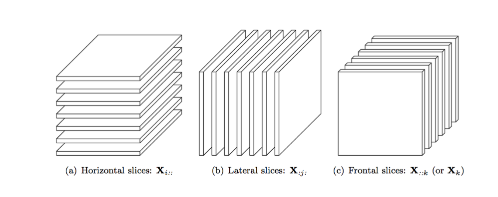

# Tensors: A crappy introduction | Part-1
  
All of us are familiar with numbers. Numbers, when interpreted as on a real line, represent the distance from the origin.
Similarly, almost all of us have met vectors, either in mathematics or physics which are represented as a list of numbers.
The most common interpretation of vectors is as an object in a n-dimensional space with a direction and a magnitude.
Next, we all have encountered a matrix at some point in our lives. A calendar is a matrix with seven columns/rows where 
the columns/rows represent the days of a week. Matrices may have many interpretations and the most prevalent interpretation 
of a matrix of dimention $ m \times n $ is that of representing a linear transformation of vectors living in n-dimensional space into vectors living in a m-dimentional 
space.

### What are tensors?

Tensors are a generalisation of vectors and matrices. 
Vectors are 1st order tensors. 
If we stack more than one of these 1st order tensors, we get a 2nd order tensor or a matrix.
Stacking a few 2nd order tensors or matrices, we get a third order tensor which is of interest 
to us in current discussion. Such 3rd order tensors are also called 3 way tensors. Our discussion 
in this blog is limited to only 3 way tensors.


*Vectors, Matrices and 3 way Tensors*

### Representation and indexing

Recall that in a matrix, the index $ (i,j) $ represents the $ i^{th} $ row and the $ j^{th} $ column. Something which is not
stated explicitly in the above representation is that there is a natural way of inferring what are the rows and what are the
columns in a matrix. For example, let's assume a matrix is written on a see through board made of glass. You and your friend are
looking at the same matrix such that the glass board separates you and your friend, i.e you and your friend are looking at the
matrix from opposite sides of the glass board. Now it becomes tricky to infer which exact element of the matrix is pointed to when
we speak of the index, say, $ (3,5) $. Your friend and you might end up referring to different elements of the matrix given the 
same index $ (3,5) $. The implicit assumption while referring to matrices is that the matrix is looked at by different peopl from the
same side and this is not a problem most of the times since we usually don't write matrices on transparent pages of a book or 
glass boards. However, with tensors, it is a bit tricky. Since we cannot represent 3 way tensors and beyond on our 2D papers and
boards, there is a need to define and fix a direction which we all agree on to look at a tensor. And even if we had transparent pages, 
since the numerals do not have lateral symmetry (in English), anyone can quickly figure out the conventionally correct side to look at 
the written matrix (unless the matrix contains numbers using only the numerals $ \in {0,1,8} $) 

For example, for a $ 3 \times 3 \times 3 $ tensor, the index $ (1,2,3) $ will represent different elements of the tensor if we do not define 
which direction is the front facing tensor.  As expected, without loss of generality (WLOG, from now on), any face can be defined
as the front face of the 3 way tensor and once everyone agrees on it, no ambiguity is left. 

Given an $ m \times n \times p $ 3 way tensor, we define the front face as having dimensions $ m \times n $.
Now, there are two such faces which have dimensions $ m \times n $ but we don't fret on it. Any on of them
is picked as the front consistently by the library we use, in our case tensorly.

Now that we are clear about the front face, if we face straight at the front face of a 3 way tensor, we see an $ m \times n $
matrix. We can imagine easily that there are such **frontal slice** matrices which are stacked back to back and that there are $ p $ of them.
To get the element at index $ (i,j,5) $ of a 3 way tensor, we look at the $ 5^{th} $ frontal slice matrix (which is of size $ m \times n $) 
and then get the element corresponing to the index $ (i,j) $ in this frontal matrix.

Here is a picture of a tensor and its frontal slices, the horizontal slices and the lateral slices.



*[Tensor slices [source: Thesis, Parker Allen Tew]](http://groups.csail.mit.edu/commit/papers/2016/parker-thesis.pdf)* 


### Tensors in Python

Now that we are somewhat familiar with the tensors, their representations and indexing, let's try to inspect them
using Python.

[Tensorly](http://tensorly.org/stable/installation.html) is a python package
that provides methods to create and operate on tensors. Run `pip install tensorly`
to install the tensorly package.

Tensorly can utilize multiple backends like Numpy, MXNet, CuPy (GPU accelerated Numpy), PyTorch, etc.
Tensorly provides a unified interface to creating tensors and manipulating them
while utilizing various backends. Depending on the kinds of algorithms/manipulations
one wants to perform on the tensors and depending on one's system configurations (e.g Nvidia GPU with CUDA support) , one or the other backend
might be suitable to accelerate the performance of these operations.
The default backend is Numpy.

Let's get started. Import the tensorly package and the random module

```ipython
In [8]: import tensorly as tl
In [9]: from tensorly import random
```


Create a random tensor of size $ 2 \times 3 \times 4 $.
Creating the tensor with each dimension of different lenght
will help us inspect it more clearly. 

```ipython
In [10]: tensor = random.random_tensor((2,3,4))
In [12]: tensor
Out[12]: 
array([[[0.15827042, 0.11829199, 0.54573019, 0.82766384],
        [0.50626486, 0.05225791, 0.27397286, 0.49952413],
        [0.99215644, 0.59113968, 0.97005041, 0.15577187]],

       [[0.12139198, 0.69805793, 0.90775814, 0.78711105],
        [0.18043326, 0.82680337, 0.97503025, 0.38870734],
        [0.46179522, 0.05780899, 0.90322751, 0.03780271]]])
```

Note that by default the tensor is dumped/printed as horizontal
slices (by tensorly, other libraries might do things differently).
This is clear as we can see that there are two matrices. 
Each matrix is of size $ 3 \times 4 $. We can imagine that the tensors front face
is facing towards the left and we are looking from at the tensor from the top.
Looking from the top, the first matrix ($ 1^{st} $ horizontal slice) is the first
matrix and the $ 2^{nd} $ horizontal slice which lies beneath it is the $ 2^{nd} $ matrix. 


Now let us confirm that our conception of how tensors are represented and 
indexed are correct. If you have grasped the indexing, you should now be able 
to tell the element at the index $ (1,2,3) $ [*Python uses zero indexing*]. 
Can you see why it should be the entry at the index $ (2,3) $ of bottom matrix, i.e the 
bottom right corner entry **0.03780271**

```ipython
In [16]: tensor[1,2,3]
Out[16]: 0.03780271407447877
```

How do we access the frontal slices? There are 4 of them, each of size $ 2 \times 3$
```ipython
In [25]: """ Access Frontal Slices """
Out[25]: ' Access Frontal Slices '

In [26]: tensor[:,:,0]
Out[26]: 
array([[0.15827042, 0.50626486, 0.99215644],
       [0.12139198, 0.18043326, 0.46179522]])

In [27]: tensor[:,:,1]
Out[27]: 
array([[0.11829199, 0.05225791, 0.59113968],
       [0.69805793, 0.82680337, 0.05780899]])

In [28]: tensor[:,:,2]
Out[28]: 
array([[0.54573019, 0.27397286, 0.97005041],
       [0.90775814, 0.97503025, 0.90322751]])

In [29]: tensor[:,:,3]
Out[29]: 
array([[0.82766384, 0.49952413, 0.15577187],
       [0.78711105, 0.38870734, 0.03780271]])

In [30]: tensor[:,:,4]
---------------------------------------------------------------------------
IndexError                                Traceback (most recent call last)
<ipython-input-30-2c12b50c570f> in <module>
----> 1 tensor[:,:,4]

IndexError: index 4 is out of bounds for axis 2 with size 4
```
Alternative syntax using python ellipses to access frontal slices
```ipython
In [67]: tensor[...,0]
Out[67]: 
array([[0.15827042, 0.50626486, 0.99215644],
       [0.12139198, 0.18043326, 0.46179522]])

In [68]: tensor[...,1]
Out[68]: 
array([[0.11829199, 0.05225791, 0.59113968],
       [0.69805793, 0.82680337, 0.05780899]])

In [69]: tensor[...,2]
Out[69]: 
array([[0.54573019, 0.27397286, 0.97005041],
       [0.90775814, 0.97503025, 0.90322751]])
```

How do we access the lateral slices? There are 3 of them, each of size $ 4 \times 2 $.
```ipython
In [32]: "Access Lateral Slices"
Out[32]: 'Access Lateral Slices'

In [33]: tensor[:,0,:]
Out[33]: 
array([[0.15827042, 0.11829199, 0.54573019, 0.82766384],
       [0.12139198, 0.69805793, 0.90775814, 0.78711105]])

In [34]: tensor[:,1,:]
Out[34]: 
array([[0.50626486, 0.05225791, 0.27397286, 0.49952413],
       [0.18043326, 0.82680337, 0.97503025, 0.38870734]])

In [35]: tensor[:,2,:]
Out[35]: 
array([[0.99215644, 0.59113968, 0.97005041, 0.15577187],
       [0.46179522, 0.05780899, 0.90322751, 0.03780271]])

In [36]: tensor[:,3,:]
---------------------------------------------------------------------------
IndexError                                Traceback (most recent call last)
<ipython-input-36-e33426d3d389> in <module>
----> 1 tensor[:,3,:]

IndexError: index 3 is out of bounds for axis 1 with size 3 
```

How do we access the horizontal slices? Guess how many are there and what is there size/shape?

```ipython
In [47]: "horizontal Slices"
Out[47]: 'horizontal Slices'

In [48]: tensor[0,:,:]
Out[48]: 
array([[0.15827042, 0.11829199, 0.54573019, 0.82766384],
       [0.50626486, 0.05225791, 0.27397286, 0.49952413],
       [0.99215644, 0.59113968, 0.97005041, 0.15577187]])

In [49]: tensor[1,:,:]
Out[49]: 
array([[0.12139198, 0.69805793, 0.90775814, 0.78711105],
       [0.18043326, 0.82680337, 0.97503025, 0.38870734],
       [0.46179522, 0.05780899, 0.90322751, 0.03780271]])

In [50]: tensor[2,:,:]
---------------------------------------------------------------------------
IndexError                                Traceback (most recent call last)
<ipython-input-50-b894217e3c5f> in <module>
----> 1 tensor[2,:,:]

IndexError: index 2 is out of bounds for axis 0 with size 2

```
Hence for a $ 2 \times 3 \times 4 $ tensor, we got 2 horizontal slices, each of shape $ 3 \times 4 $.


### Tensor Unfolding/Matricization

Clearly most of us humans are not gifted enough to be visualizing and manipulating the 3 way tensors
in our heads. One way we already simplified the visualization of the tensors was by looking at the varous
slices. Let's now look at another way of visualizing tensors - tensor unfolding. Tensor unfolding are used 
more than just another way to visualize.


*[Tensor unfolding/matricization](https://www.researchgate.net/figure/Mode-i-tensors-of-a-3-way-tensor-For-a-3-way-tensor-X-R-n-1-n-2-n-3-it-has-3-types_fig1_335742056)*

As can be seen in the figure above, there are 3 modes of unfolding/matricization. 

Mode 1 unfolding is concatenation of the frontal slices.
Mode 2 unfolding is concatenation of horizontal slices.
Mode 3 unfolding is concatenation of lateral slices.


Are you thinking the same as I am? Is there a connection of the modes to the indices of the matrices?
Well, I was tempted to think that mode-1 unfolding must be the concatenation of the slices obtained by
keeping the 1st index constant. Well, it turns out **not** to be so. The mode 1, 2 and 3 unfolding are
just defined according to the concatenation of the frontal, horizontal and lateral slices respectively.

Is that so? Or should we look a little more closer and harder?

Clearly each unfolding concatenates the slices (which are matrices) into a larger matrix.
Based on our understanding of unfolding so far, what do we expect the shape of the mode-1 unfolding
of our $ 2 \times 3 \times 4 $ tensor referred to by the variable named `tensor`?

Remember we said there is no relation of the mode-k (for k $ \in {1,2,3} $) to have no connection with
the indices of the tensor? Well that is not completely true. Let's consider the mode-1 unfolding in which 
we concatenate the frontal slices. However, in which dimension do we concatenate the slices? 
To be concrete, for our $ 2 \times 3 \times 4 $ matrix, we have 4 frontal slices each of shape $ 2 \times 3$.
These slices/matrices can be concatenated in along the columns (dim = 2) or the rows (dim = 3) giving rise
to larger matrices of shape $ 2 \times 12 $ or $ 8 \times 3 $ respectively.

So which way should we concatenate? Well here is a connection to the mode-k. For mode-1 unfolding, 
the frontal slices are concatenated along the axis represented by the index position 1.
Clearly the index position 1 in $ (i,j,k) $ represents the columns of the frontal slices which are of 
the shape $ j \times k $. Hence the mode-1 unfolding for our $ 2 \times 3 \times 4 $
must concatenate the frontal slices (shape $ 2 \times 3 $) along the columns and hence should
yield a matrix of shape $ 2 \times 12 $. Let's verify our chain of inferences. 

```ipython
In [52]: "mode-1 unfolding (i.e. zeroth mode in Python)"
    ...: unfolded1 = tl.unfold(tensor, mode=0)

In [53]: unfolded1.shape
Out[53]: (2, 12)
```

Similarly the mode-2 unfolding is concatenation of the horizontal slices. Based on our connection to the 
mode-k and the axis of slice concatenation, let us predict the dimensions of the mode2-unfolding.
The 2 horizontal slices have shape $ 3 \times 4 $. The 2nd index in the tensor of shape $ (2,3,4) $ is 3 which corresponds to 
the side of the horixontal slices having dimension 3 i.e the columns. Hence the concatenation takes
place along the columns. So the mode-2 unfolded tensor should be a matrix of shape $ 3 \times 8 $.
Let's verify using tensorly.

```
In [56]: "mode-2 unfolding (i.e. 1st mode in Python)"
    ...: unfolded2 = tl.unfold(tensor, mode=1)

In [57]: unfolded2.shape
Out[57]: (3, 8)
```

Hope you have gotten the hang of it. The mode-3 unfolding is the concatenation of the 3 lateral slices which 
have the shape $ 2 \times 4 $ along the dimension of size 4, which is along the rows. So thinking the mode-3 
unfolding must yield a matrix of shape $ 6 \times 4 $. Let's verify.

```ipython
In [60]: "mode-3 unfolding (i.e. 2nd mode in Python)"
    ...: unfolded3 = tl.unfold(tensor, mode=2)

In [61]: unfolded3.shape
Out[61]: (4, 6)
```

Surprise !!! There seems to be a convention that after the concatenation axis is determined, the 
slices are transposed so that the concatenation always happens along the column. Since we had 
3 lateral slices, each of dimension $ 2 \times 4 $ which needed to be concatenated along the rows, 
the slices were transposed and then concatenated along the columns. Hence we had 3 $ 4 \times 2 $
matrices and after concatenating along the columns, we get cthe mode-3 undolded tensor as a matrix
of shape $ 4 \times 6 $.


I know what you are thinking. This all seems arbitrary - we are missing something on the mode-k unfolding.
And you are right. It took some time to reach here, but hope the ride was fun and memorable. 
Before we understand the mode-k unfoldings, let's disect tensors more than just slices. 

### Fibers: Columns, Rows & Tubes 

Just like matrices have columns and rows which are 1 way tensors, we can look at the 3 way tensors
as composed of such 1 way tensors (or vectors). These vectors which compose a tensor are called fibers. 
For a 3 way tensor, there are 3 kinds of fibers - the columns, the rows and the tubes.
The figure below tries to give a visualization for the three kinds of fibers. 


*[Fibers : Columns, Rows and Tubes](https://medium.com/@keremturgutlu/tensor-decomposition-fast-cnn-in-your-pocket-f03e9b2a6788)*

Now that we are familiar with the rows, columns and the tubes, it is easy to associate the columns, rows and tubes
to the 1st, 2nd and the 3rd positions of the tensor index $ (i,j,k) $. Varying $i$ keeping $j$ and $k$ constant
will give us the columns. Similarly varying the 2nd position of the index $j$ while keeping $i$ and $k$ 
constant will yield us the rows. Keeping $i$ and $k$ constant and varying $k$ will yield us the tubes.

Coming back to the relation to unfolding, the mode-k unfolding of a tensor of size $ n_1 \times n_2 \times . . . n_N$
is defined as a matrix of size $ n_k \times (n_1 . n_2 . . . n_{k-1} . n_{k+1} . . . n_N) $ which
is obtained by filling the columns using the fibers obtained when varying the $k^{th}$ position in the index 
$ (i_1, i_2, i_3, . . . , i_k, . . . , k_N) $ and keeping all other positions of the index constant. 


### Folding back an unfolding

If we have the original shape and the mode-k unfolding of a tensor, we can easily obtain back original
tensor using the following lines of python code.

```ipython
In[81]: help(tl.fold)
Help on function fold in module tensorly.base:

fold(unfolded_tensor, mode, shape)
    Refolds the mode-`mode` unfolding into a tensor of shape `shape`

        In other words, refolds the n-mode unfolded tensor
        into the original tensor of the specified shape.

    Parameters
    ----------
    unfolded_tensor : ndarray
        unfolded tensor of shape ``(shape[mode], -1)``
    mode : int
        the mode of the unfolding
    shape : tuple
        shape of the original tensor before unfolding

    Returns
    -------
    ndarray
        folded_tensor of shape `shape`


In [82]: tl.fold(unfolded2, mode=1, shape=original_shape) == tensor
Out[82]: 
array([[[ True,  True,  True,  True],
        [ True,  True,  True,  True],
        [ True,  True,  True,  True]],

       [[ True,  True,  True,  True],
        [ True,  True,  True,  True],
        [ True,  True,  True,  True]]])
```

The above sections on unfolding and folding might not seem to have any motivations behind it,
but when we talk about tensor multiplications with matrices and vectors, we will find matrix 
unfolding and folding to be handy.

### Tensor operations


