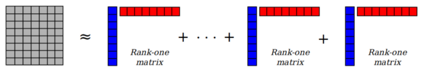
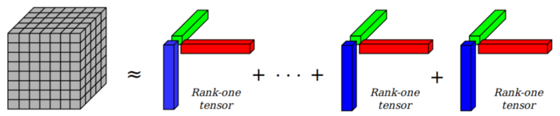

# CSCI670 Theoretical Thinking - I

 <b>26th November, 2021</b> 

<b> 
Theoretical Thinking II assignment for CSCI670 Fall2021 | Prof. Teng Shang-Hua
</b>

---

> Init: 23rd November, 2021 ->  Using tensors for finding patterns in urban traffic data.

&nbsp;

1. **What is the practical background of your problem?**

 The overall goal is motivated by General Motor's idea of zero congestion, zero crashes an zero emission. In particular, we will be looking at the traffic patterns of about 4000 taxis in Shanghai collected in 2007 for over a month. Our goal is to see if we can identify any traffic pattern from the dataset which can help us estimate traffic in the places in the city where might have sparse datapoints, or where might have missing data, or if we wanted to predict the traffic a few hours ahead in time. 

To find patterns in the data, we look at different statistics of the raw data and try to represent them in various mathematical/programming structures.

The key contents of the dataset that we are using are - 

| Latitude 	| Longitude | Date		| Time	|
|----------	|-----------|-----------|-------|
|22.3		|24.1		|8th Feb 07	| 7:00	|
|25.7		|24.3		|8th Feb 07	| 7:15	|
|21.9		|24.5		|8th Feb 07	| 15:30	|	
| . 		| .	 		|. 			| . 	|	
| . 		| .	 		|. 			| . 	|	

2. **What is the mathematical definition of your problem?**

The formulation of the problem is parallel to that of the completing an incomplete matrix in the collaborative filtering of partially reviewed movies in the [Netflix Prize](https://en.wikipedia.org/wiki/Netflix_Prize).

Do do so, we need to find if there exist any pattern in the various statistics/aggregations of the data when put into matrix and tensor structures since wihtout additional model/hypotheis on the data, the missing values could be arbitrary (think of the 10 data points, 3 of which are missing, unless we assume a model which has less than 7 degrees of freedom/free variable, we cannot determine the 3 missing values as they can be arbitrary without a mode - for example, we can assume that the model is a polynomial of degree 6. )

 Although matrices are essentially two dimensional tensors, in the following discussion, when we say tensors, we mean tensors of dimension(also called order) three or more. We start with the density of taxi, i.e we divide the map into a grid of shape 20x20 and take the aggregated number of taxis passing over 24 hours in those 20x20 grids. Now, we can create a 400x24 matrix with grid identified using GridIDs in the range 1 to 400 in the columns and time in the rows. Similarly we can also construct a 20x20x24 tensor of 3 dimensions using the same data, which feels like a more natural representation as it also capture the relative spatial correlation/closeness between the GridIDs. The question we are asking is if there is any underlying pattern in the data when represented in the matrix and the tensor formats. 

Assuming that there is a low rank linear subspace in which the data lies, we can use low rank decomposition methods line Singular Value Decomposition and Candecomp/Parafac or Canonical-Polyadic (abbrv. as CP) decomposition on the matrix and the tensor representations respectively. 

Additionally, if there are such low rank subspaces which can capture the pattern in the traffic data matrix/tensor, can we use this structure to complete missing data (imputation) or predict traffic density in the near future, a few hours ahead of time. - i.e given a matrix/tensor with incomplete data (due to sensor/netowork failure), can we reconstruct the data fairly accurately using the known/available data points - if so, what are the accuracies empirically on our dataset.

__Mathematical Definitions-__ 

For a matrix $M$ and a tensor $T$, the matrix and tensor decompositions are as follows - 

$$
 M = A \circ B \\
 T = A \circ B \circ C
 \\
 where \; \circ \; is \; generalized \; outer \; product.
$$

*[matrix decomposition (source: medium post)](https://medium.com/@mohammadbashiri93/tensor-decomposition-in-python-f1aa2f9adbf4)*

*[tensor decomposition (source: medium post)](https://medium.com/@mohammadbashiri93/tensor-decomposition-in-python-f1aa2f9adbf4)*

3. **What are the interesting algorithmic questions concering your problem?**

For the matrix case with no missing data, we already have good decomposition algorithms which are pretty good at what they do and hence we can easily say if a low rank matrix can explain a large amount of the variance present in the data to answer the 1st question. However, for the case of tensors, there has been a lot of work in the last decade to make tensor decomposition libraries but we are still far away from being fast on large tensors. Unlike matrices whose rank are well defined (in multiple ways) and unique, a similar property for the tensor is a bit more difficult and sometimes not unique - for example, a rank k tensor can sometimes be approximated infinitely by a rank k-1 tensor. 

Just like SVD is unique (upto rotations, permutations(for repeated eigenvalues) and scaling)  and under some mild conditions, tensor decomposition is also unique upto permutation and scaling which is stronger than the matrix counterpart (as rotations are excluded). This result was shown by Joseph B. Kruskal in the later half of 1970s [(ref.)](https://www.sciencedirect.com/science/article/pii/0024379577900696)

Our questions - 

- Are there patterns in corresponsing days of the weekly data. 
Mathematically, if $X_{Th1}$ and $X_{Th2}$ be the data (matrix or tensor representation) for Thursday of week1 and the thursday of week2, can we find any invariant subspaces between the two.
Mathematically, the factors from the low rank decompositions of the two tensors should lie in approximately the same subspace. A measure by which the two subspaces differ is the sum of the least squares errors in fitting one set of factors by the others for all the modes of the tensor.

- Compare the performance of the tensor and the matrix representations is being able to discover these subspaces, if they exist at all. The rank k matrix decomposition has k+k(400+24) parameters and tensor decomposition has k+k(20+20+24) parameters - we compare how much of the original data is captured by these two decompositions vs the number of parameters.

- If there exist low rank approximations and invariance of underlying subspaces from week to week, can we use them to impute the missing values or predict future values. For example, if we have complete data for the week1 Thursday, then we can decompose this data and get the rank-1 factors of $X_{Th1}$. 

Decomposition - 
$$
	X_{Th1} \approx \sum_{i=0}^{R}{ \alpha_i (a_i \circ b_i \circ c_i) }
$$

We can then find the coefficients ($\beta_i, i \in \{ 1,2,3...k\}$) that best fit $X_{Th2}$ in a least squares sense using the rank-1 factors of $X_{Th2}$.  

Since we assumed that the underlying rank one subspace is relatively invariant from one week to the other in the corresponsnig days, we use the above $a_i, b_i$ and $c_i$, find $\beta_i$ for the best least squares fit.

$$
	X_{Th2} = \sum_{i=0}^{R}{ \beta_i (a_i \circ b_i \circ c_i)}
$$

Using the above $\beta_i$ values, one can impute the missing datapoints.

4. **What is the state of the art for modeling and solving this problem?**

The state of the art models are all deeplearning based models. Although there have been discussions [(ref.)](https://michaelaalcorn.medium.com/are-linear-models-actually-easily-interpretable-a7662cd3de4b) about linear regressions and similar methods being no more interpretable than deeplearning, we want to work on linear algebra methods for solving the problem as we think it is more interpretable than the deeplearning methods.

The state of the art models are based on Graph Neural Networks and Autoencoders.

5. **What are the interesting open questions inspired by your formulation?**

Some of the open questions are - 

- Can we impute the missing data without using the data from the previous week.
- Can the method be applied to more than just the density data? What about origin-destination based metrics/features?- Can we bring nonlinearity into the model while still keeping it relatively interpretable.

