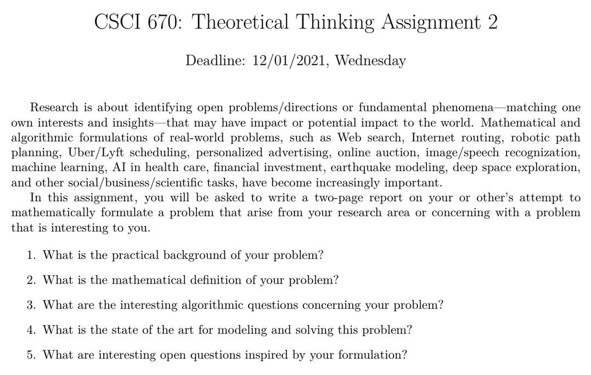

# CSCI670 Theoretical Thinking - I

 <b>26th November, 2021</b> 

<b> 
Theoretical Thinking II assignment for CSCI670 Fall2021 | Prof. Teng Shang-Hua
</b>

---

> Mod1: 23rd November, 2021 ->  Imputation from incomplete tensors

&nbsp;

1. What is the practical background of your problem?

In this assignment, I will be reporting on the data analysis of urban traffic data. Broadly, analysis of data and subsequent interventions using algorithmic and computing methods is known as urban computing. The motivation behind analyzing traffic data is to reduce congestion by traffic prediction and adapting routing of vehicle. The overall goal is motivated by General Motor's idea of zero congestion, zero crashes an zero emission. In particular, we will be looking at the traffic patterns of about 4000 taxis in Shanghai collected in 2007 for over a month. Our goal is to see if we can identify any traffic pattern from the dataset which can help us estimate traffic in the places in the city where might have sparse datapoints, or where might have missing data, or if we wanted to predict the traffic a few hours ahead in time. 

 
