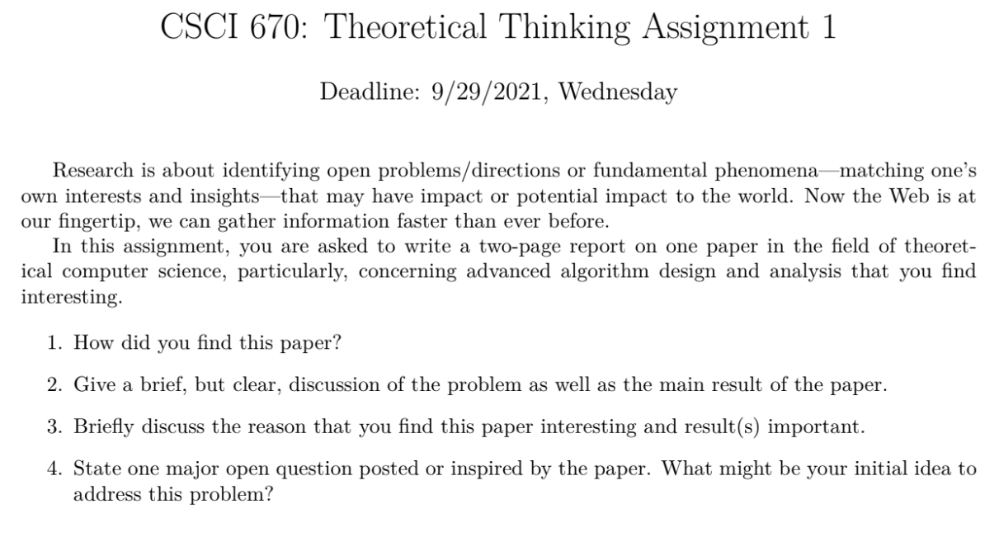

# CSCI670 Research Writing-I

 <b>18th September, 2021</b> 

<b> 
Research Writing I assignment for CSCI670 Fall2021 | Prof. Teng Shang-Hua
</b>

---

> Some disparate thoughts from the following papers -
&nbsp;

>1. [PySINDy: A Python package for the Sparse Identification of Nonlinear Dynamics from Data](https://arxiv.org/pdf/2004.08424.pdf)
>2. [Geometric Deep Learning Grids, Groups, Graphs, Geodesics, and Gauges](https://arxiv.org/pdf/2104.13478.pdf)
>3. [Discovering governing equations from data by sparse identification of nonlinear dynamical systems](https://www.pnas.org/content/pnas/113/15/3932.full.pdf)

Q. How did you find this paper?

A. I had ran into the PySINDy paper from this youtube video 
[Deep Learning of Dynamics and Coordinates with SINDy Autoencoders](https://www.youtube.com/watch?v=WHhDgxkiR9c)
on professor [Steve Brunton](https://www.me.washington.edu/facultyfinder/steve-brunton) youtube channel.
I was(still am) subscribed to Prof. Steve's and had watched
Prof. [Nathan Kutz](https://www.me.washington.edu/facultyfinder/steve-brunton) explanations on PCA
form the [AMATH301](https://www.youtube.com/channel/UCEirPnFv_2QbvzrM67SnKPA) channel,
who is a co-author on this paper. I ran into the Geometric Deep Learning paper on the 
[website of the same name](https://geometricdeeplearning.com) which I used to check once in a while 
since I like geometry and deep learning is something I don't feel comfortable with - so they kinda 
balance by combining my discomfort and interest. Earlier, the website contained a set of
papers all related to geometric deep learning(I had looked into only one or two) but one fine day
I found this one paper that put together the unified framework.

### 

### Scale invariant idempotent operators  (from paper [3])

> Max is sometimes linear
$$
   max \{ a+K,b+K,c+K, ...  \} = max \{a,b,c,...\} + K
	\\\;\\
   max\{ \gamma a,\gamma b,\gamma c,...\} = \gamma \times  max \{a,b,c,...\} \forall \gamma \in \mathbb{R^+}
   
$$

> Composition of maximum is a maximum, maximum is idempotent
$$
	max \{ max\{ max ...... max\{ a,b,c,... \} \}\} = max\{a,b,c...\}
$$

Max can be applied on finer scales and then reapplied on the outcomes(coarser) of their applications on 
finer scales (See [Geometric DL-3.4](https://arxiv.org/pdf/2104.13478.pdf)).
Another function that comes to mind is the center
of mass function. Center of mass of a system can be calculated by first applying it to subsystems 
of the system and then applying again
to subsytem COM - hence the finning-coarsing (should it be called scale separation?) of COM function 
(it outputs both total mass of the system and the COM coordinates). 
Similarly, the max pooling applied on finer segments/grids and then reapplied on the output of the already max pooled
finer grids still gives the same result (classification class here) - so prediction class is invariant 
to finning-coarsing of the max-pooling operation 

$$
   max \{ \color{green} \alpha_1, \alpha_2,\alpha_3 ..., \color{red} \beta_i, \beta_2, \beta_3, ..., \color{blue} \gamma_1, \gamma_2, \gamma_3...\ \color{default} \}
   \\\;\\
   \\||\\
   \\\;\\
   max \{ 
 	max \color{green} \{ \alpha_i | i \in 1,2,... \} \color{default},
   max \color{red} \{ \beta_i | i \in 1,2,... \} \color{default},
   max \color{blue} \{ \gamma_i | i \in 1,2,... \} \color{deafault}\}

$$

Let $S = \{ m_{a1},m_{a2},..., m_{b1},m_{b2},... \} $ be a set of particle masses from a system in 1D.
hence, $ S = \{ m_{ai} | i=1,2,... \} \cup \{ m_{bi} | i=1,2,... \} = S_a \cup S_b $.
Let the position of $m_z$ be $p_z$ and $P = \{ p_{a1},p_{a2},...,p_{b1},p_{b2},... \} = P_a + P_b$.
Let $Y$ be a tuple representation of the system such that $Y = \{ \langle m_z, p_z \rangle | m_z \in S, p_z \in P \}$.
$$Y = \{ \langle m_{a1},p_{a1}\rangle, \langle m_{a2},p_{a2}\rangle, ... \langle m_{b1},p_{b1}\rangle,\langle m_{b2},p_{b2}\rangle, \} = Y_a + Y_b$$
If $Q$ is tuple representation of a system, define 

$$
	C(Q) = \Bigg \langle \sum_{m_z}{m_z},  \frac{ \sum{m_z p_z}}{ \sum_{m_z}} \Bigg \rangle \; where \; (m_z,p_z) \in Q
$$

Hence $C$ is a multivariable function which takes in a tuple representation of a sytem and returns 
the total mass and the center of mass of the system.Given this definition, the function $C$ behaves 
just like the function $max$ when we are thinking in terms of finning-coarsing -
$$  
\begin{aligned}
	C(Y_a) = \langle M_a,P_a  \rangle \\
	C(Y_b) = \langle M_a,P_a \rangle \\\;\\
	C(Y) = C( \; \langle M_a,P_a \rangle ,  \langle M_b,P_b \rangle \; )
	\\\;\\
	\implies \color{black} C(Y) = C( \; C(Y_a), C(Y_b) \;  ) \color{default}
\end{aligned}	
$$
Hence C is comatible with the finning-coarsing operation and under this operation,  the lumped tuple representation of the syetem
$\langle M,P \rangle$ of the system is invariant to how the fining and coarsing is done 
(i.e detils of set partitioning for finning is immaterial)

