# CSCI675 : Homework-2

 <b>26th February, 2022</b> 

<b>

---

>edits -\
init: 26th February, 2022

> ==========
[Textbook: Convex Optimisation, Stephen Boyd and Lieven Vandenberghe](https://web.stanford.edu/~boyd/cvxbook/bv_cvxbook.pdf)
> ==========

Find the question here - [Homework2 Questions](hw2questions.pdf)

### Q1 : Midpoint Convexity and closed set 
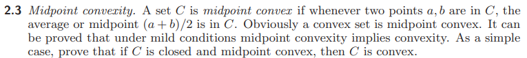

### Q2 : Convex Sets 
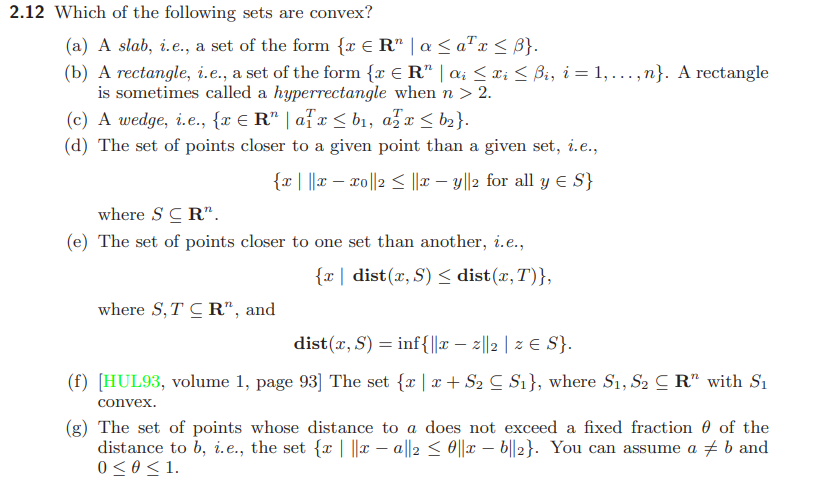
Axioms
------
A1) Halfspaces are convex. $\\$
A2) Intersection of convex sets is convex. $\\$
A3) Union of convex sets is not necessarily convex.
A4) Affine transformation of a convex set is convex, i.e convexity is preserved under affine transformations.
A5) Set of points closer to point x than to point y is a halfspace, say $H(x,y)$.

| **part** | **convex / non-convex** | **reasoning** |
-----------|-------------------------|---------------|
|a| convex | Slab = intersection of halfspaces $ \alpha \leq a^T x $ and $a^T x \leq \beta$.$\\$ Apply A1 and A2. |
|b| convex | Rectangle = intersection of axis aligned slabs (i.e $\;a$ is an element of the standard basis or a multiple of it in the formulation in part a). $\\$ Apply A1 and A2.|
|c| convex | Wedge = intersection of halfspaces. $\\$ Apply A1 and A2.|
|d| convex | Let $S$ be the described set and $x_0$ be the point. $\\$ Let a generic point $y_i \in S$. $\\$ The halfspace $H(x_0,y_i)$ describe all the points closer to $x_0$ than the point $y_i$. $\\$ Let $S_i = H(x_0,y_i)$. $\\$ Clearly, $S = \bigcap_{i} S_i = \bigcup_{i} H(x_0,y_i)$ since all $y_i \in S$ are closer to $x_0$ than any point in $T$. $\\$ Apply A1 and A2.
|e| non-convex | An easy conterexample in $\mathbb{R^2}$ - set A = {(-1,0), (1,0)} and B={(0,0)}. The set Q of all points in A than in B is the union of the halfspaces $x>0.5$ and $x < -0.5$.$\\$ In general, Q is the union of the convex sets $S_i$ where $S_i$ is the set described in part (d), i.e $S_i$ is the convex set that is closer to $a_i$ than set $B$ for an arbitrary point $a_i \in A$. Apply axiom A3 |
|f| convex | $S_1$ is the translation of $S_2$ by the vector $\vec{x}$. Translation is an affine transformation (f(\vec{p}) = I \vec{p} + \vec{x}). $\\$ Apply axiom A4.|
|g| convex | Turns out that this set is the interior of a circle centered at one of the points because $0 \leq \theta \leq 1$. | 

### Q3) Probability Distributions and Convexity

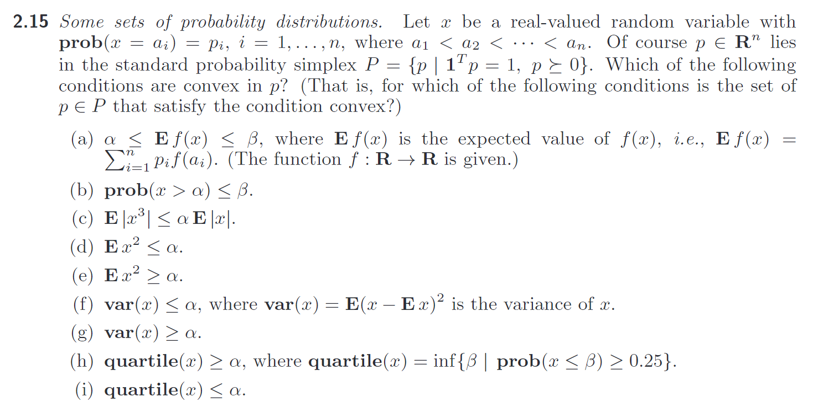

| **part** | **convex / non-convex** | **reasoning** | 
|----------|-------------------------|---------------|
| a | convex | Let $b_i = f(a_i)$. $\\$ $\mathbf{E}f(x) = f(a_i)p_i = b_ip_i$. $\\$ $\alpha \leq \mathbf{E}f(x) \leq \beta \iff \alpha \leq b_ip_i$ and $b_ip_i \leq \beta$ . $\\$ So $p_i$ has to obey two linear inequalities and hence the region defined in p-space is convex.|
| b | convex | Let $a_k \geq \alpha$ for some $k \in \{1,2,...n\}$. $\\$  $ \therefore prob(x > \alpha) \leq \beta = \sum_{i=k}^{n}{p_i} \leq \beta$. $\\$ Above is a linear inequality in p-space when $\alpha$ and $\beta$ are some given constants.
| c | convex | $\mathbf{E}|x^3|= \sum_{i=1}^{n}|a_i|^3p_i$ and $\mathbf{E}|x| = \sum_{i=1}^{n}|a_i|p_i$. $\\$ $\mathbf{E}|x^3| \leq \alpha\mathbf{E}|x| \iff \mathbf{E}|x^3| - \alpha \mathbf{E}|x| \leq 0$ $\\$ or  $|a_i^3|p_i - \alpha |a_i|p_i \leq 0 \iff |a_i^3|p_i - |a_i|p_i$. $\\$ $(|a_i|^3 - |a_i|)p_i \leq 0$. $\\$ Above is a linear inequality in p-space and hence is convex since $a_i$ and $\alpha$ are constants.
| d | convex | $\mathbf{E}x^2 = \sum_{i=1}^{n}a_i^2p_i \leq \alpha$. Above is a linear inequality in p-space.|
| e | convex | $\mathbf{E}x^2 = \sum_{i=1}^{n}a_i^2p_i \geq \alpha$. Above is a linear inequality in p-space.|
| f | non-convex | Let $\mathbf{E}x = \mu = \sum_{i=1}^{n}a_ip_i$. $\\$ $ \mathbf{var}(x) = \mathbf{E}[x - \mu]^2 = \mathbf{E}[ x^2 + \mu^2 - 2x \mu x ]$ $\\$ $= \mathbf{E}x^2 + \mu^2 - 2\mu \mathbf{E}x = \mathbf{E}x^2 + \mu^2 - 2 \mu^2 = \mathbf{E}x^2 - \mu^2$ $\\$ $= \sum_{i=1}^{n}{a_i^2 p_i} - (\sum_{i=1}^n a_i p_i)^2 $. $\\ \; \\$ Let $c_i = a_i^2$ and $\mathbf{c} = [c_1 ... c_i ... c_n]^T$. $\\$ Similarly, let $\mathbf{a} = [a_1 ... a_i ... a_n]^T$. $\\$ Then, $\mathbf{var}(x) = \mathbf{c^Tp} - \mathbf{p^T(aa^T)p}$ $\\$ $\mathbf{var}(x) \leq \alpha \iff \mathbf{c^Tp} - \mathbf{p^T(aa^T)p} \leq \alpha$ $\\$ This may not be convex always. $\\$ For example, if we are in $\mathbb{R^2}$, then the LHS in the above inequality defines a conic section which can be a hyperbola (since there is a -ve sign in the equation). This can cause the failure of convexity if the inequality forces the set to be the two disjoint unbounded sides of the hyperbola.|
|g| convex | using a similar derivation as in part f, we can get $\mathbf{var}(x) = \mathbf{c^T p} - \mathbf{p^T (a a^T) p}$ $\\$ $\mathbf{var}(x) \leq \alpha \implies \mathbf{c^T p} - \mathbf{p^T (a a^T) p} \geq \alpha$ $\\$ Unlike the previous case, there is no -ve sign in the LHS and the entires of the vector $\mathbf{c}$ are all positive since $c_i = a_i^2$. $\\$ Also since $\mathbf{aa^T}$ is always +ve semidefinite for all $\mathbf{a}$, we can guarantee that the corresponding conic section will be a parabola and hence the inequality forces the set to be on the side of parabola that makes the set convex. |
| h | convex | linear inequality |
| i | convex | linear inequality |

### Q4. Operations that preserve convextiy
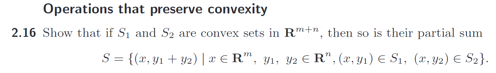

|                                                         |
|---------------------------------------------------------|
| **We will solve this using 4 methods -** $\\$ 1. Using algebraic definition of convex sets  $\\$ 2. Projecting and then taking Minkowski sum of the projections. $\\$ 4. Using multilinear operator and tensor algebra $\\$ 2. Using direct sum of convex sets and then projecting|

Let $f((x,y_1), (x,y_2)) = (x, y_1 + y_2))$ where $f: \mathbb{R^m} \times \mathbb{R^n} \rightarrow \mathbb{R^{m+n}}$ is a multilinear function.

Let $\\$
$A_1 = (x,a_1), B_1 =(x,b_1) \; s.t \; A_1,B_1 \in S_1$ and $\\$
$B_1 = (x,a_2), B_2 = (x,b_2) \; s.t \; A_2, B_2\in S_2$.$\\$

$S_1$ is convex, $\color{purple} M_1 = \theta A_1 + (1 - \theta)B_1 = (x, \theta a_1 + (1- \theta) b_1) \in S_1 \; \forall \; \theta \in [0,1]$.

Similarly, $\color{blue}M_2 = \theta A_2 + (1 - \theta)B_2 = (x, \theta a_2 + (1- \theta) b_2) \in S_2 \; \forall \; \theta \in [0,1]$.

By definition, $F_A = f(A_1,A_2) = (x,a_1 + a_2) \in S_1$ and $F_B = f(B_1, B_2) = (x,b_1 + b_2) \in S_2$.

We need to show that $F = \theta F_A + (1 - \theta) F_B \in S \; \forall \; \theta \in [0,1]$.

$$
	F = \theta F_A \color{crimson}+\color{black} (1 - \theta) F_B \\ \; \\

	= \theta (x \;,\; a_1 + a_2) \color{crimson}+\color{black} (1 - \theta)(x \;,\; b_1 + b_2) \\\;\\
	= (\theta x \; , \; \theta [a_1 + a_2] ) \color{crimson}+\color{black} ( (1-\theta) x \;,\; (1-\theta) [b_1 + b_2]) \\ \;\\

	= (\theta x \color{crimson}+\color{black} (1 - \theta)x \; , \; [\theta a_1 \color{crimson}+\color{black} (1 - \theta)b_1] \color{crimson}+\color{black} [\theta a_2 \color{crimson}+\color{black} (1 - \theta)b_2] ) \\ \; \\

	= ( x \; , \; [\theta a_1 \color{crimson}+\color{black} (1 - \theta)b_1] \color{crimson}+\color{black} [\theta a_2 \color{crimson}+\color{black} (1 - \theta)b_2] ) \\ \; \\

	= f \color{green}\bigg(\color{black} ( x \; , \; \theta a_1 + (1 - \theta)b_1 ) \; , \; (x \; , \; \theta a_1 + (1 - \theta)b_1 \color{green} \bigg)\color{black} \\ \; \\

	= f \color{green}\bigg(\color{black} ( x \; , \; \theta a_1 + (1 - \theta)b_1 ) \; , \; (x \; , \; \theta a_1 + (1 - \theta)b_1 \color{green} \bigg)\color{black} \\ \; \\
	

	= f \color{green}\bigg(\color{purple} ( x \; , \; \theta a_1 + (1 - \theta)b_1 ) \; \color{black}, \color{blue} \; (x \; , \; \theta a_1 + (1 - \theta)b_1 \color{green} \bigg)\color{black} \\ \; \\

	= f \color{green}\bigg(\color{purple} M_1 \; \color{black}, \color{blue} \; M_2 \color{green} \bigg)\color{black} \in S \;\;\; _\blacksquare\\
	
$$

> Theorem 1: Direct Sum of convex sets is convex.$\\ \; \\$
$X,Y$ convex $\implies$ $X \oplus Y$ is convex. $\\$  
If $X \subset \mathbb{R^m}$ and $Y \subset \mathbb{R^n}$ are convex sets. Let us embed $X$ and $Y$ in the first $m$ and the last $n$ dimensions of the space $\mathbb{R^{m+n}}$. Let then the direct sum of the two convex sets can be defined as the set $S = \{ \langle x,y \rangle | \;   x \in X, y \in Y \} $ where $\langle x,y \rangle \in \mathbb{R^{m+n}}$ is the concatenation of the vectors $x \in X$ and $y \in Y$.  Then $S$ is convex. $\\ \; \\$
>Proof: $\\$
Let $x_1, x_2 \in X$ and $y_1,y_2 \in Y$. $\\$
Since $X$ and $Y$ are both convex, $x_3 = \alpha x_1 + (1 - \alpha)x_2 \in X$ and $y_3 = \alpha y_1 + (1 - \alpha)y_2 \in Y$. $\\$
$\\$ Let $s_1 = \langle x_1, y_1 \rangle \in S$ and $ s_2 = \langle x_1, y_1 \rangle \in S$.$\\$
Clearly $s_3 = \langle x_3, y_3 \rangle \in S$ by definition of direct sum.
 We need to show that $s = \alpha s_1 + (1 - \alpha) s_2 \in S$. $\\\;\\$
$$
	s = \alpha s_1 + (1 - \alpha) s_2 \\
	=  \alpha \langle x_1, y_1 \rangle + ( 1 - \alpha ) \langle x_2, y_2 \rangle \\
	= \langle \alpha x_1 + (1 - \alpha) x_2 \; , \; \alpha y_1 + (1 - \alpha) y_2 \rangle \\
	= \langle x_3, y_3 \rangle = s_3 \in S \;\;\; _\blacksquare
$$ 

$\\ \; \\$

> Theorem 2: Projection operator preserves convexity $\\ \; \\$
> Let $P$ be a projector operator such that $ P: \mathbb{R^{m+n}} \rightarrow \mathbb{R^{m}}$. $\\$ Let $X \subset \mathbb{R^{m+n}}$ be convex. $\\$ Then the image of $X$ under $P$ is convex, i.e $P(X)$ ius convex. $\\ \; \\$
>Proof: $\\$
Let $x_1, x_2 \in X$ $\\$
Since X is convex, $\forall \alpha, \; 0 \leq \alpha \leq 1$ we have $x_3 = \alpha x_1 + (1 - \alpha)x_2 \in X$.
Let $p_1 = P(x_1) \in \mathbb{R^m}$ and $p_2 = P(x_2) \in \mathbb{R^m}$ be the projections of $x_1, x_2$ respectively, i.e $p_1$ and $p_2$ are the images of $x_1$ and $x_2$ under the projection operator and hence by definition of images under operators, $p_1, p_2 \in P(X)$ $\\ \; \\$
We need to show that the point $p_3 = \alpha p_1 + (1 - \alpha) p_2 $ belongs to the image of $X$ under $P$, i.e $p_3 \in P(X)$. $\\ \; \\$
$$
	p_3 = \alpha p_1 + ( 1 - \alpha) p_2 \\
	 = \alpha P(x_1) + (1 - \alpha)P(x_2) \\
	 = P(\alpha x_1) + P((1 - \alpha) x_2) \;\; \{ \because P \; is \; linear \} \\
	 = P (\alpha x_1 + (1 - \alpha)x_2 ) \;\; \{ \because P \; is \; linear \} \\
	 = P( x_3 ) \in P(X) \{ \because x_3 \in X \} \;\;\; _\blacksquare 
$$

> Theorem 3: Minkowski sum preserves convexity $\\$
$A + B = \{ a + b \;| \; a \in A, b \in B  \}$ $\\ \; \\$
We are not going to prove the following result about Minkowski sums but here is the [wiki reference.](https://en.wikipedia.org/wiki/Minkowski_addition#Convex_hulls_of_Minkowski_sums) $\\ \; \\$
$Conv(A + B) = Conv(A) + Conv(B)$ $\\$
i.e the convex hull of the Minkowski sum is the Minkowski sum of the convex hull of the sets. [Note that this is a special case of the general case of equivariance if we define the Minkowski sum '+' as a binary operator on convex sets.] $\\ \; \\$
> If $X$ is a convex set, $\iff$ $Conv(X) = X$. $\\ \; \\$
Using the above two results, we can show that the Minkowski sum of two convex sets $A$ and $B$ is convex, i.e we can show that $S = A+B$ is convex $\\$
$$
	Conv(S) = Conv(A + B) \\
	= Conv(A) + Conv(B) \\
	= A + B \;\;\; \{ \because \; A,B \; are \; convex \} \\
	= S \\ \; \\

	\implies Conv(S) = S \\ \therefore \; S=A+B \; is \; convex \;\;\; _\blacksquare
	
$$

Now let's prove what we were asked in the question. We need to show that the image under $f((x,y_1),(x,y_2)) = (x, y_1 + y_2)$ is convex.
Let $ U = P_Y (S_1), V = P_Y(S_2)$ and $W = P_X(S_1) \cap P_X(S_2)$ where $P_Y$ is the projection on to the last $n$ dimensions and $P_X$ is projection onto the first $m$ dimensions.
Clearly $U$ and $V$ are convex since $S_1, S_2$ are convex. Similarly $W$ is convex because it is the intersection of the projection of convex sets $S_1$ and $S_2$ and we know that intersections and projections preserce convexity.

It is easy to see that the compsition $ Minkowskisum (U, V) \oplus W  $ is precisely $f$. Since all the operations that compose $f$ preserve convexity, $f$ preserves convexity too since convexity is preserved under composition if the operations which themselves preserveconvexity as it is basically a chain of convex images.     

$\color{darkred} 
I \; will \; be \; back \; to \; the \; other\; two \; methods \; - \; 3 \; and \; 4\; when \; I \; get \; time \; later .$ 

### Q5: Set of separating hyperplanes

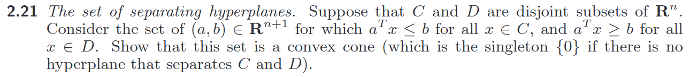

Definition of a convex cone: A set S is a cone if $s \in S \iff \alpha s \in S \; \forall \; \alpha > 0$

Clearly when $C$ and $D$ are not separable, $\langle a, b \rangle = \vec{0} \in \mathbb{R^{n+1}}$ and hence is a trivial convex cone. 

When there exists a separating hyperplane, let the $ \langle a,b \rangle$ be a representation of it. Let us call the set of all such representations $H$.

$$
	a^T x \leq b \; \forall \; x \in C \; and \; a^T y \geq b \; \forall \; y \in D \\
	\implies k a^T x \leq k b \; and \; k a^T y \geq kb \; \forall \; k \geq 0 \\
	\implies (ka)^T x \leq kb \; and \; (ka)^T y \geq kb \; \forall \; k \geq 0 \\
$$  

Hence $ \langle ka, kb \rangle = k \langle a,b \rangle \; \forall \; k > 0 $ is also the representation of the separating hyperplane and hence belongs to the set of the separating hyperplanes. Hence the set of the separating hyperplanes is a cone.

Now we will prove that it is convex as well.
Let $ \langle a_1 , b_1 \rangle$ and $\langle a_2, b_2 \rangle$ be in the set $H$.
We have to show that $ \langle a_3, b_3 \rangle = \theta \langle a_1, b_1 \rangle + ( 1 - \theta) \langle a_2, b_2 \rangle = \langle \theta a_1 + (1 - \theta) a_2 \; , \; \theta b_1 + (1 - \theta)b_2   \rangle $ is also in the set $H$ when $0 \leq \theta \leq 1$.

$$
	Let \; x \in C \; and \; y \in D \\ \; \\
	
	a_1 x \leq b_1 \; \color{darkred} and \color{black} \; a_1 y \geq b_1 \\
	a_2 x \leq b_2 \; \color{darkred} and \color{black} \; a_2 y \geq b_2 \\ 

					\Updownarrow \\
					
	\theta a_1 x \leq \theta b_1 \;\color{darkred} and \color{black} \; \theta a_1 y \geq \theta b_1 \\
	( 1 - \theta) a_2 x \leq ( 1 - \theta) b_2 \;  \color{darkred} and \color{black} \; ( 1 - \theta) a_2 y \geq ( 1 - \theta) b_2 \\
	
					\Updownarrow \\
		
	\theta a_1 x + ( 1 - \theta) a_2 x \leq \theta b_1 + ( 1 - \theta) b_2 \; \color{darkred} and \color{black} \; \theta a_1 y + ( 1 - \theta) a_2 y \geq \theta b_1 + ( 1 - \theta) b_2 \; \\

		\Updownarrow \\

		a_3 x \leq b_3 \; \color{darkred} and \color{black} \; a_3 y \geq b_3 

		\\ \; \\
		
	   \implies \langle a_3 , b_3 \rangle \in H \;\;\; _\blacksquare 
$$

Hence the set $H$ is convex in addition to being a cone. Hence $H$, the set of representation of separating hyperplanes is a convex cone. If we restrict the hyperplanes to have a unique representation, then the set might neither be convex or a cone - for example forcing $a$ to be unit length will make the set and arc of the unit circle that is formed when we take the intersection of the convex cone $H$ and the unit circle in $\mathbb{R^{n+1}}$.

### Q6. Support Functions

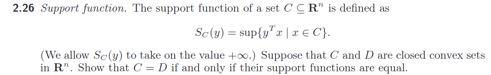

Basically we are looking in the direction of the vector $y$ and trying to see what is the greatest value of the dot product of $y$ with any point/position vector $x$ in the set $C$. 

Why we need the set to be closed is clear from a counterexample. If $C$ is a closed convex set and $D$ is $C$ with a hole cut out in the interior of $C$, in then the support funcitons are the same but the sets $C$ and $D$ are not.

Why we need convexity for the sets $C$ and $D$ for the claim in the question will become evident when we have proved the statement.

We can easily see that since $S_C(y) = y \cdot x$, $S_C(ky) = k y \cdot x = k S_C \; \forall \; k \in \mathbb{R}$ i.e $S_C{ky} = k S_C{y}$. So if $C$ and $D$ are two sets and $S_C(y) = S_D(y)$, then $S_C(ky) = kS_C(y) = k S_D(y) = S_D(ky)$. That means that once we know that the support function for the sets $C$ and $D$ are same given the vector $y$, it is the same for $C$ and $D$ for all vector in that direction (all linear combinations) of them. So we might aswell just look at the directions and not all the vectors. That is exactly what we will do, we will look at all unit vectors $y$, i.e $|y| = 1$.

We observe that if the support functions $S_D(y) = S_C(y) \; \forall \; |y| = 1$, then the closed convex sets $C$ and $D$ are the same. 

** fact 1: ** Recall that the vector form of a hyperplane that has the unit normal $y$ and is $d$ distance away from the origin along the direction $y$ is given by $y \cdot x = d$ or equivalently $y^T x = d$. 

** fact 2: ** $y^T x =   y \cdot x = d$ gives the projection of $x$ in the direction of $y$ when $|y| = 1$.

From the above two facts, we can see that $\color{green}y^T\color{black} \color{blue}x \color{black} = \color{green}S_C(y) \approx max(d) \color{black}$ is a $ \color{orange}hyperplane$ that supports the set $C$ at the point $x^*$ where $\color{green} S_C(y) = y^T x^* \color{black}$.

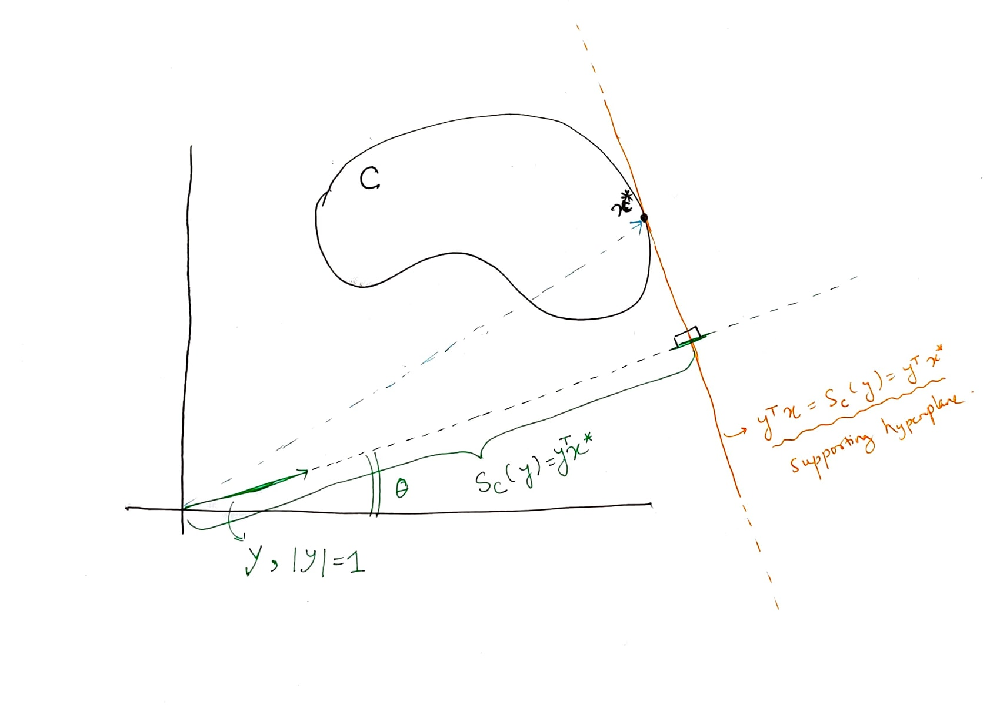
*support function*

Clearly $S_C(y) = S_C(\theta)$ when $y = 1$ and $S_C(\theta) = sup \{ \langle cos \theta , sin \theta \rangle \cdot x \; | \; x \in C \}$.

Hence $y^T x = S_C(y) \; , \; |y|=1$ are the supporting hyperplanes of the set $C$.

Since $S_C(y) = S_D(y) \; \forall \; y$, hence $S_C(y) = S_D(y)$ for $|y| = 1$. 

$$
	S_C(y) = S_D(y) \; \forall \; |y|=1 \\ \; \\
	\implies y^T x = S_C(y) \equiv y^T x = S_D(y) \\ \; \\
	supporting \; hyperplanes \; of \; C \equiv supporting \; hyperplanes \; of \; D. 
$$

If the set of supporting hyperplanes of two convex sets $C$ and $D$ are the same, then the sets are the same since the convex sets are also defined by the set of the separating hyperplanes instead of the set of points. $\;\; _\blacksquare$

### Q7. Euclidean Distance Matrices

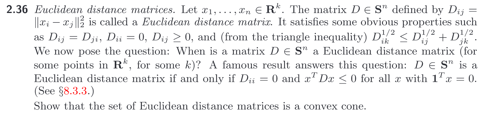

The distance matrix satisfies $D_{ii} = 0$ and $x^T D x \leq 0$ for all $1^T x = 0 $.

We need to show that the space of distance matrices is a convex cone.

It is not very difficult to see that the space of such matrices form a cone.
Let $C = kD$ where $k \geq 0, k \in \mathbb{R}$.

$$
	C_{ii} = k * D_{ii} = k * 0 = 0 \;\;\; _\blacksquare
  
$$

For $1^T x = 0$

$$
		x^T D x \leq 0 \\
		\implies k x^T D x  \leq 0 \;\;\; \forall k \geq 0 \\
		\implies x^T kD x \leq 0 \\ 
		\implies x^T C x \leq 0 \;\;\; _\blacksquare
		 
$$

Now let us show that the space of such matrices is infact convex. 

Let $D$ and $E$ be two euclidean distance matrices. 
Let $F  = \alpha D + (1 - \alpha)E$ for $0 \leq \alpha \leq 1$
$$
	F_{ii} = \alpha D_{ii} + ( 1 - \alpha ) E_{ii} = \alpha * 0 + ( 1 - \alpha ) * 0 = 0 \;\;\; _\blacksquare
$$

for $1^T x = 0 $
$$
	x^T D x \leq 0 \; and \; x^T E x \leq 0 \\ \; \\

	\alpha x^T D x \leq 0 \; and \; (1 - \alpha) x^T E x \leq 0 \\ \; \\

	x^T \alpha D x \leq 0 \; and \; x^T (1 - \alpha)E x^T \leq 0 \\ \; \\

	\implies x^T [ \alpha D + ( 1 - \alpha ) E ] x \leq 0 \\ \; \\

	\implies x^T F x \leq 0 \;\;\; _\blacksquare   
$$

So the space of euclidean distance matrices is infact a convex cone. 

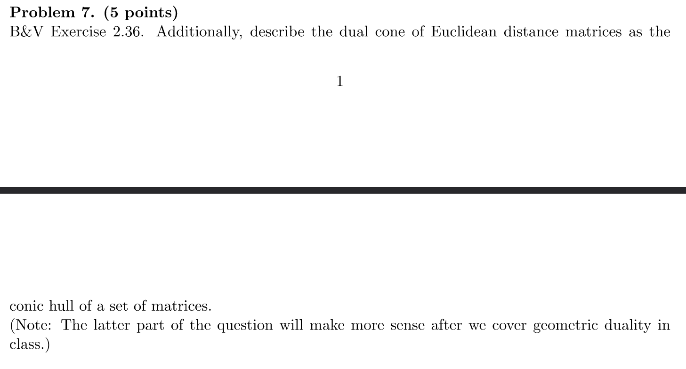

We need to find the dual cone of the cone of the euclidean distance matrices. 

The polar of a set $Z$ is defined as the set $Y$  = $y \; | \; y^T z \leq 1 \; \forall z \in Z$.

For a cone $Z$, the polar is equilvalently defined as the set $Y$  = $y \; | \; y^T z \leq 0 \; \forall z \in Z$.
The dual is just the negative of the polar. Hence the dual of the cone $Z$ is given by $Y$  = $y \; | \; y^T z \geq 0 \; \forall z \in Z$.

> Useful remarks 
> 1. $ w^T M w = (ww^T) \cdot M $ where $\cdot$ represents the dot product in the space of matrices. 

We already know that for all euclidean distance matrices $D$ and $1^T x = 0 $
$$
	x^T D x \leq 0 \;\;\; \forall \; D  \\ \; \\
	 

	\implies (x x^T) \cdot D \leq 0 \;\;\; \forall D \\ \; \\

	\implies (- x x^T) \cdot D \geq 0 \;\;\; \forall D \\ \; \\

	\implies - xx^T \; is \; in \; the \; dual \; cone \; of \; the \; set \; of \; euclidean \; distance \; matrices 
	   
$$

We know that the dual of a cone is a cone and the dual cone is the cone defined by the matrices $-xx^T$ that can be constructed from $x$ under the constraint $1^T x = 0$.

### Q8. Level sets of convex, concave, quasiconvex, and quasiconcave functions

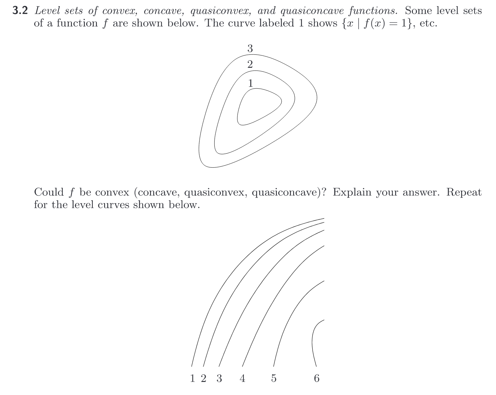

**part 1**

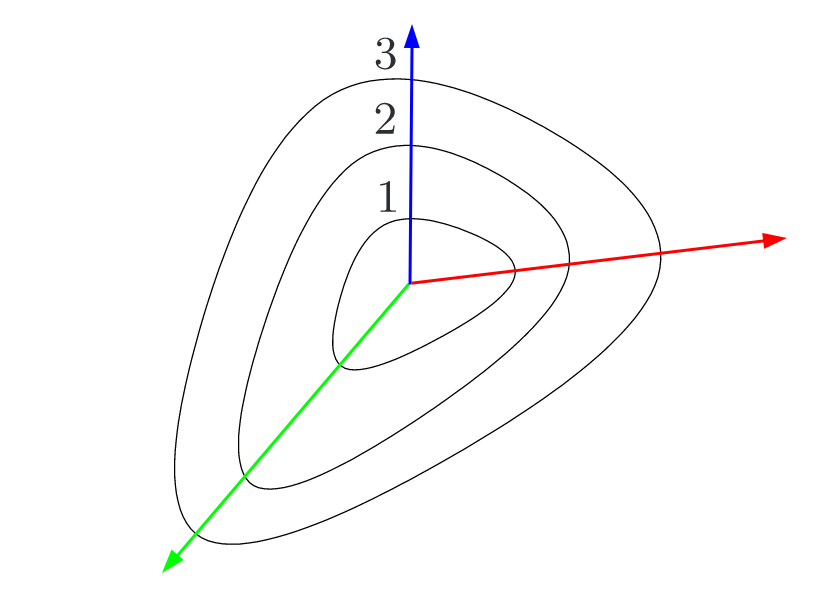

Since the level sets show that as we move away from the center, the function increase, the only posibilities are that the function is either convex or quasi convex. 

Any higher dimensional convex funciton is also convex when we take the [restriction](https://en.wikipedia.org/wiki/Restriction_(mathematics)) of the function on a one dimensional line in its domain. For our case, the convex function has domain in $\mathbb{R^2}$. So a line in the domain like the red, green and the blue lines must yield a convex function on the corresponding restrictions. 

On the one dimensional restrition, the slope of a convex function can only increase as we move on the line (we can assume any direction on the line to be positive). Now, since the slope has to increase, the density of the level curves should increase as w move along any line. 

Along the green line, the distance between the level curves does decrease (hence density increases). 
Along the blue line, the density remain constant which indicates that along that direction the function increase linearly
Along the red line, the density decreases. This shows that the function cannot be a convex funciton. 

Since the sublevel sets are covnex, the function is quasiconvex. 

**part 2**

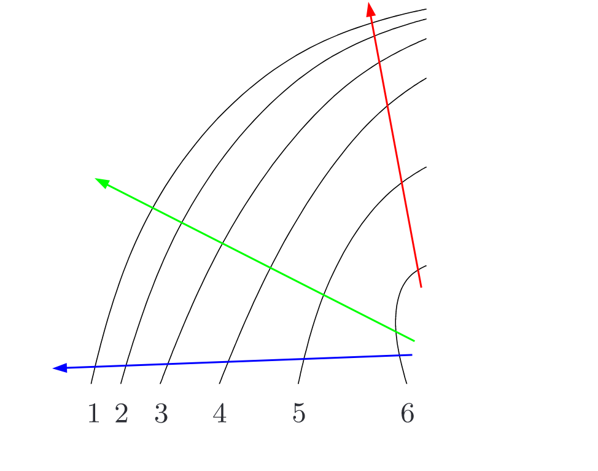

As we can see from the level curves, the finction keeps decraseing as we move away from the center and hence the only possibilities are that the function is concave or quasi convex. However, all directions we take in the domain to for a one dimensional line to create a restriction for the function, we see that the density of the level sets at increases and hence the funciton is convex. 

Since quasiconcave functions are supersets of concave functions, we conclude that the funciton is quasiconvex as well. We can also say that because the superlevel set of te function as re convex regions/sets in the domain.

### Q9. 
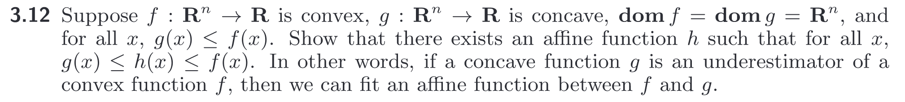

$ \\\;\\\;\\\;\\\;\\\;\\\;\\\;\\\;\\\;\\\;\\\;\\\;\\\;\\\;\\\;\\\;\\\;\\\;\\\;\\\;\\\;\\\;\\\;\\\;\\\;\\\;\\\;\\\;\\\;\\\;\\\;$
$\\\;\\\;\\\;\\\;\\\;\\\;\\\;\\\;\\\;\\\;\\\;\\\;\\\;\\\;\\\;\\\;\\\;\\\;$

### Q10. 
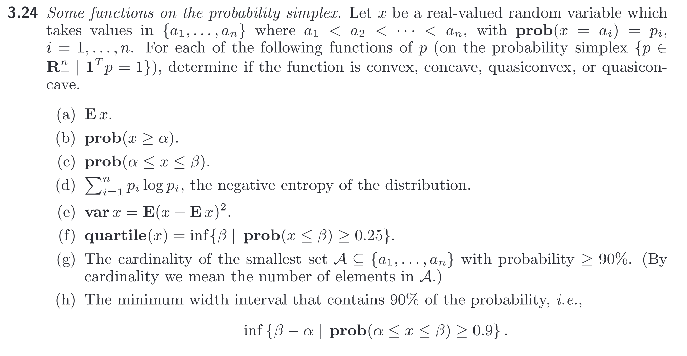

| **part** | **convex / non-convex** | **reasoning** |
|----------|-------------------------|---------------|
|  a  | convex, concave, quasiconvex, quasiconcave | expectation is linear in both $a_i$ and $p_i$ |   
|  b  | convex, concave, quasiconvex, quasiconcave | linear in $p_i$ |
|  c  | convex, concave, quasiconvex, quasiconcave | linear in $p_i$ | 
|  d  | convex, quasiconvex | xlogx is a convex function (second derivative is always  positive). Sum of convex functions is convex.
|  e  | convex, quasiconvex | quadratic function with PSD hessian|
|  f  | not convex not concave | discontinous |
|  g  | not convex not concave | discontinous |
|  h  | not convex not concave | from counterexamples |
 

### Q11 : Representation of piecewise-linear convex functions
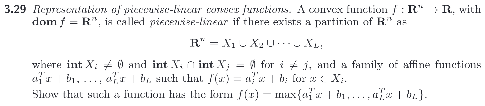

$ \\\;\\\;\\\;\\\;\\\;\\\;\\\;\\\;\\\;\\\;\\\;\\\;\\\;\\\;\\\;\\\;\\\;\\\;\\\;\\\;\\\;\\\;\\\;\\\;\\\;\\\;\\\;\\\;\\\;\\\;\\\;$

### Q12: Convex hull or envelope of a function
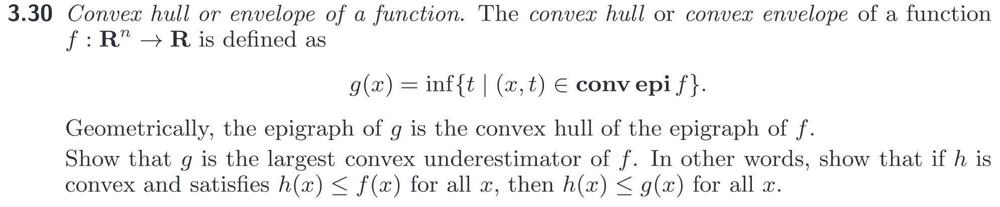

$ \\\;\\\;\\\;\\\;\\\;\\\;\\\;\\\;\\\;\\\;\\\;\\\;\\\;\\\;\\\;\\\;\\\;\\\;\\\;\\\;\\\;\\\;\\\;\\\;\\\;\\\;\\\;\\\;\\\;\\\;\\\;\\\;\\\;\\\;\\\;$

### Q13: Conjugate functions
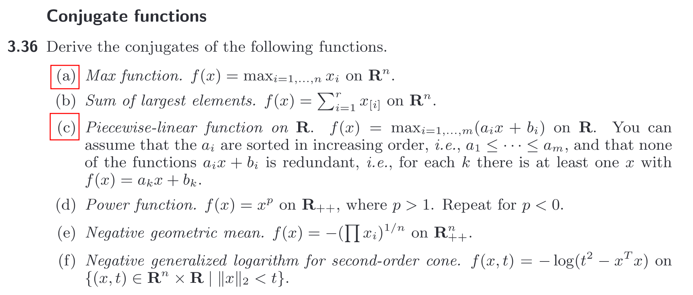

Conjugate of $f(x)$ is defined as $f^*(y) = \sup \{ y^T x - f(x) \;|\; x \in dom(f) \}$

a) $ f^*(y) = \sup \{ y^T x - max(x_i) \;|\; x \in \{x_1, x_2, ..., x_n \} \} $

$ \\\;\\\;\\\;\\\;\\\;\\\;\\\;\\\;\\\;\\\;\\\;\\\;\\\;\\\;\\\;\\\;\\\;\\\;\\\;\\\;\\\;\\\;\\\;\\\;\\\;\\\;\\\;\\\;\\\;\\\;\\\;\\\;\\\;\\\;\\\;$

### Q14: Relation between polar and Lagrangian duality.
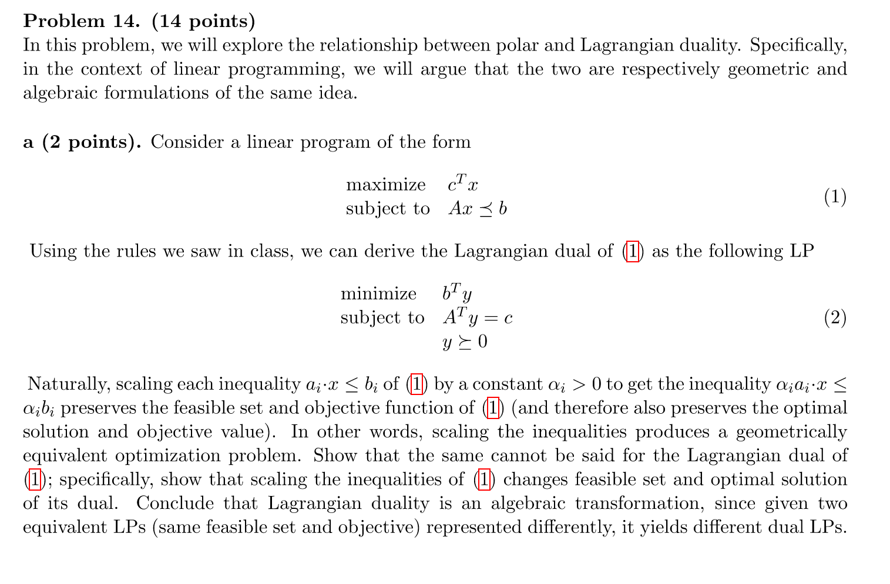
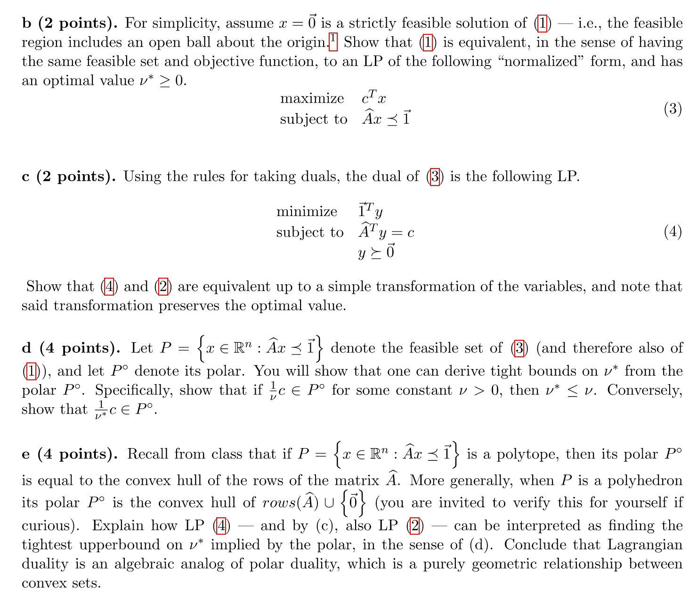

##### part a

Scaling the inequalities of [1], we get 

$$
	\text{maximize }   c^T x \\  \; \\
	\text{subject  to } \alpha A x \preccurlyeq \alpha b
$$

The dual of it is 
$$
	\text{minimize }	\alpha b^T y \\
	\text{subject to }  \alpha A^T = c \equiv A^T = \frac{x}{\alpha}\\
	\text{           }  y \succcurlyeq 0
$$

which is not the same as the duality we have originally. 

##### part b

$\vec{0}$ is a strictly feasible solution and hence $A \vec{0} \prec \vec{b}$ which implies $\vec{b} \succ \vec{0}$, i.e $\vec{b}$ has each element strictly greater than $0$.

The objectives of $(3)$ and $(1)$ are the same.

So all we need to show is that the feasible set of $(1)$ and $(3)$ are the same.

Let the feasible set of $(1)$ be $\color{darkred}F_1$ and that of $(3)$ be $\color{green}F_3$.

$$
	\color{darkred} F_1 \color{black} \equiv A \vec{x} \preceq \vec{b} \\ \; \\
	\implies A_{[i,:]} \vec{x} \leq b_i \; \forall \; i=\{1,2,3,...\} \\ \; \\
	\implies \frac{1}{b_i} A_{[i,:]} \vec{x} \leq 1 \; \forall \; i=\{1,2,3,...\} \\ \; \\

	\implies \hat{A}_{[i,:]} \vec{x} \leq 1 \; where \; \hat{A}_{[i,:]} = A_{[i,:]} \\ \; \\

	\implies \hat{A} \vec{x} \preceq 1 \equiv \color{green}F_3 \color{black} \;\;\; _\blacksquare 				
$$

##### part c

Define $ \vec{z} = \vec{b} \odot \vec{y}$ or  $\color{darkred}z_i = b_i y_i$ where $\odot$ is the Hadamard Product of two matrices/vectors.

We just need to show that the objectives and the constraints/feasible regions do not change by the above change of variables.

Clearly $\;b^T y = \sum{b_i y_i} = 1^T z\\$

The objectives are the same 
$$
	\text{minimize } b^T y \equiv \text{minimize } \sum_i \color{darkred} b_i y_i = \color{black} \sum_i \color{darkred} z_i \color{black} = 1^T z    
$$ 

Clearly $A^T y = c \implies \hat{A}^T z = c\;$ where $\; \hat{A}_{[i,:]} = \frac{1}{b} A_{[i,:]}$

So the feasible region (or the constraints) do not change either. 

Finally renaming the variable  $z$ to $y$ proves the statement in the question.

##### part d

Definition of polar of a set P is given by $Y = \{ y \; | \; y^T x \leq 1 \; \forall \; x \in P \}$.

Let $g = \frac{1}{\nu} c$ be in the polar $P^\circ$ for some $\nu > 0$

Then, by definition of the polar, 
$$ 
	g^T x \leq 1 \; \forall \; x \in P \\ \; \\

	\implies (\frac{1}{\nu} c)^T x \leq 1 \; \forall \; x \in P \\ \; \\

	\implies \frac{1}{\nu} c^T x \leq 1 \; \forall \; x \in P \\ \; \\

	\implies c^T x \leq 1 * \nu \; \forall \; x \in P \;\;\; \{ \because \nu > 0 \} \\ \; \\

	\implies c^T x \leq \nu \; \forall \; x \in P
$$

Let $x^*$ be the optimimum solution and the optimum objective value be $\nu^*$, i.e $\; c^T x^* = \nu^*$.

Since $ c^T x \leq 0$ for any $x \in P$ and since $x^* \in P$, definitely $ c^T x^* \leq \nu $ which implies $v^* \leq \nu$.

Hence $\nu$ is an upper bound on $\nu^*$ whenever $\frac{1}{\nu}c \;$ belongs to the polar $P^\circ$.

Now we will show that $h = \frac{1}{\nu^*} c$ is in the polar $P^\circ$.

We know that $x^*$ maximizes the objective $c^T x$, i.e $c^T x^* = \nu^*$ is the maximum value that can be attained for the objective. 

So $\nu^* = c^T x^* \geq c^T x$ for any arbitrary $x \in P$ and hence $ \color{blue} 1 \geq \frac{c^T x}{\nu^*}$ since we assume $\nu^* > 0$ as otherwise $\frac{c}{\nu^*}$ is not well defined in part d.

For any arbitrary $x \in P$, 

$$
	h^T x = (\frac{1}{\nu^*} c)^T x = (\frac{1}{\nu^*}) c^T x =  \color{blue} \frac{c^T x}{\nu^*} \leq 1 \color{black} \\ \; \\

	\implies h^T x \leq 1 \; \forall \; x \in P \text{ and hence } h \text{ is in the polar} \;\;\; _\blacksquare 
$$

##### part e

> Things we know - 
> 1. Polar $P^\circ$ is the convex combination of the rows of $\hat{A}$
> 2. $\hat{A}^T z$ is the convex compination of the rows of $\hat{A}^T$

$ \\\;\\\;\\\;\\\;\\\;\\\;\\\;\\\;\\\;\\\;\\\;\\\;\\\;\\\;\\\;\\\;\\\;\\\;\\\;\\\;\\\;\\\;\\\;\\\;\\\;\\\;\\\;\\\;\\\;\\\;\\\;\\\;\\\;\\\;\\\;$
