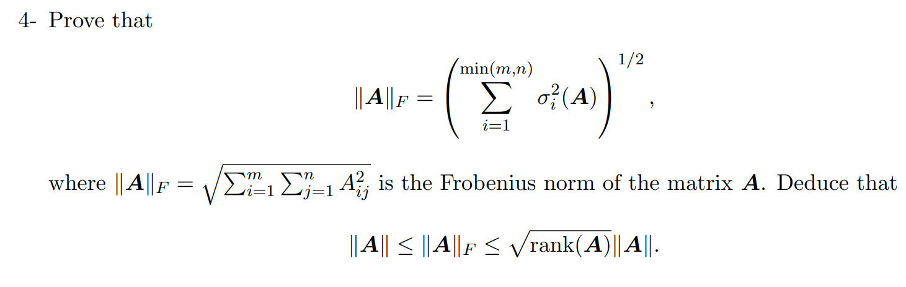

# EE546-Mathematics of High Dimensional Data

 <b>7th October, 2022</b> 

<b> 
Homework-2 EE546 Fall2022 | Prof. Mahdi Soltanolkotabi
</b>

---

>**Lemma1:** Frobenius norm is invariant to orthonormal transformation.  
Proof:
Let $A \in \mathbb{R}^{m \times n}$. $||A||_F$ and $||A||$ are Frobenius and spectral norm respectively.  
$$
	||A||_F^2 = trace(A^TA) = trace(AA^T)
$$
Hence, if $U \in \mathbb{R}^{m \times m}$ is orthonormal i.e $U^TU = UU^T = I \in \mathbb{R}^{m \times m}$, then
$$
	||UA||_F^2 = trace((UA)^T(UA)) = trace(A^TU^TUA) = trace(A^T I_{m\times m} A) = trace(A^TA) = ||A||_F^2
$$
Also, for $V \in \mathbb{R}^{n\times n}$ be orthonormal, i.e $V^TV = VV^T = I \in \mathbb{R}^{n \times n}$ 
$$
	||AV||_F^2 = trace( (AV) (AV)^T) = trace(AVV^TA^T) = trace(A I_{n \times n} A^T) = trace(AA^T) = ||A||_F^2 
$$

Let $A = U \Sigma V^T$ be the SVD of $A$ with $U \in \mathbb{R}^{m \times m}$ and $V \in \mathbb{R}^{n \times n}$.  
Since $U$ and $V$(and hence $V^T$) are orthonormal matrices,
$$
	||A||_F^2 = ||U \Sigma V^T||_F = || U \Sigma ||_F = || \Sigma ||_F = \sum_{i=0}^{min(m,n)}{\sigma_i^2(A)}\\
	\implies ||A||_F = \bigg[ \; \sum_{i=1}^{min(m,n)}{\sigma_i^2(A)} \; \bigg]^{1/2} = \bigg[ \; \sum_{i=1}^{rank(A)}{\sigma_i^2(A)} \; \bigg]^{1/2}\\
$$
Clearly,
$$
	\sigma_{max}(A) \leq \bigg[ \; \sum_{i=1}^{rank(A)}{\sigma_i^2(A)} \; \bigg]^{1/2} \leq \bigg[ \; \sum_{i=1}^{rank(A)}{\sigma_{max}^2(A)} \; \bigg]^{1/2}\\
		\sigma_{max}(A) \leq \bigg[ \; \sum_{i=1}^{rank(A)}{\sigma_i^2(A)} \; \bigg]^{1/2} \leq \bigg[ \; rank(A){\sigma_{max}^2(A)} \; \bigg]^{1/2} \\
				\sigma_{max}(A) \leq \bigg[ \; \sum_{i=1}^{rank(A)}{\sigma_i^2(A)} \; \bigg]^{1/2} \leq \sqrt{rank(A)}\;{\sigma_{max}(A)}\\\;\\
				||A|| \leq ||A||_F \leq \sqrt{rank(A)}\;||A|| \;\; _\blacksquare

$$
