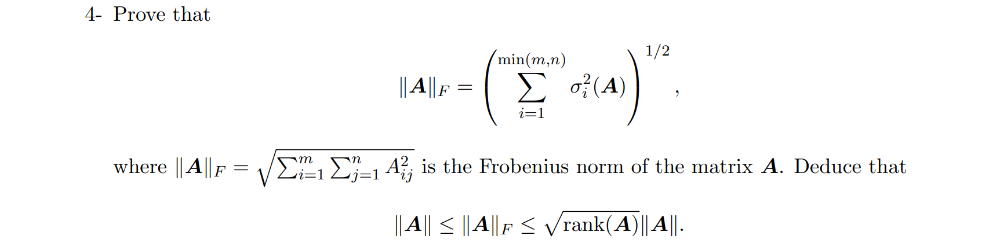

# EE546-Mathematics of High Dimensional Data

 <b>7th October, 2022</b> 

<b> 
Homework-2 EE546 Fall2022 | Prof. Mahdi Soltanolkotabi
</b>

---

Let us recall that
$$
	||x||_2 = \underset{||y||_2 = 1}{max}{\langle y,x \rangle}
	= \underset{||y||_2 = 1}{max}{y^Tx}
		
$$

By definition, spectral norm is the maximum stretching the matrix $A$ can apply on a vector. 
$$
	||A|| = \underset{x}{max}\frac{||Ax||_2}{||x||_2} \\
	= \underset{x}{max}{\bigg|\bigg|\frac{Ax}{||x||_2}\bigg|\bigg|_2} \;\; \color{green} \big( \because ||x||_2 \text{ is a scalar} \big) \color{default} \\\;\\
	= \underset{x}{max}{\bigg|\bigg|A \frac{x}{||x||_2}\bigg|\bigg|_2} \;\; \color{green} \big( \text{again } \because ||x||_2 \text{ is a scalar} \big) \color{default} \\\;\\
	= \underset{x}{max}{\color{brown}||A \hat{x}||_2 \color{default}} 
	= \underset{\hat{x}}{max}{\color{brown}||A \hat{x}||_2\color{default}}
	= \underset{||x||_2 = 1}{max}{\color{brown}||A x||_2\color{default}} = \underset{||x||_2=1}{max}\;{\color{brown}\underset{||y||_2=1}{max}{||y^TAx||_2}\color{default}}\\\;\\
	= \underset{||x||_2=||y||_2=1}{max}\;{y^TAx}
$$

Hence,
$$
	||A|| = \underset{||x||_2=||y||_2=1}{max}\;{||y^TAx||_2} = max \{ \langle y,Ax  \rangle : x \in \mathbb{R}^n, y \in \mathbb{R}^m, ||x||_2 = ||y_2|| = 1 \} \;\;\;\; _\blacksquare
$$

Now we want to show that $||A||$ is infact the largest singular value of $A$, i.e $\sigma_1(A)$.  
Let us cnsider a square matrix $A \in \mathbb{R}^{n \times n}$. Let the SVD of $A$ be $A = U \Sigma V^T$ where $\Sigma$ is diagonal and $U,\Sigma,V \in \mathbb{R}^{n \times n}$ and $U^TU = V^TV = I_{n \times n}$, i.e $U,V$ are orthonormal. 

By definition, 
$$
	||A||^2 = \underset{||x||_2 = 1}{max}{||Ax||_2^2} = \underset{||x||_2 = 1}{max}{(Ax)^T(Ax)} = \underset{||x||_2 = 1}{max}{x^TA^TAx}
$$

>$$
	A^TA = (U \Sigma V^T)^T (U \Sigma V) = V \Sigma U^T U \Sigma V^T = V^T \Sigma I \Sigma V = V^T \Sigma^2 V
$$
Setting $P = V^T$, we have $A^TA = P \Sigma^2 P^{-1}$ which is the eigenvalue decomposition of $A^TA$ and thus the eigenvalues of $A^TA$ are contained in the diagonal matrix $\Sigma^2$ and hence are square of the singular values of $A$, i.e $ \lambda_i(A^TA) = \sigma_i(A)^2$

If we accept that $\underset{||x||_2=1}{max}x^T B x$ gives us the largest eigenvalue of $B$, then we are done since the largest eigenvalue of $A^TA$ is $\lambda_1(A^TA) = \sigma_1(A)^2$.

Otherwise, 

$$
	\underset{||x||_2 = 1}{max}{x^TA^TAx} = \underset{||x||_2 = 1}{max}{x^TV^T \Sigma^2 Vx} =  \underset{||x||_2 = 1}{max}{(Vx)^T \Sigma^2 (Vx)}
$$

>We know that $V$ is orthonormal and hence $V^TV = I$ and $V^{-1} = V^T$. And since $V$ is orthonormal, the transformation under $V$ is an isometry (preserves lengths and angles).  
$$
 ||Vx||_2 = (Vx)^T(Vx) = x^TV^TVx = x^T I x = x^Tx = ||x||_2 \;\;\; \text{(length preservation)}
$$
$$ 
\langle Vx, Vy \rangle = (Vx)^T(Vy) = x^T V^T V y = x^T I y = x^Ty = \langle x, y \rangle \\\;\\

\implies \langle Vx, Vy \rangle = \langle x,y \rangle \\\;\\

\implies ||Vx||_2 \; ||Vy||_2 \; cos(\alpha) = ||x||_2 \; ||y||_2 \; cos(\beta) \\\;\\
\implies ||x||_2 \; ||y||_2 \; cos(\alpha) = ||x||_2 \; ||y||_2 \; cos(\beta) \\\;\\
\implies cos(\alpha) = cos(\beta) \;\;\; \text{(angle preservation)} \\
$$
We also know that $||V^{-1}x||_2^2 = ||V^Tx||_2^2 = (V^Tx)^T(V^Tx) = x^TVV^Tx = x^T I x = x^T x = ||x||^2$ and hence $V^{-1} = V^T$ also 

Setting $z = Vx$ we get,
$$
	\underset{||x||_2 = 1}{max}{x^TA^TAx} = \underset{||x||_2 = 1}{max}{x^TV^T \Sigma^2 Vx} = \underset{||x||_2 = 1}{max}{(Vx)^T \Sigma^2 (Vx)}  = \underset{||V^{-1}z||_2=1}{max}{z^T \Sigma^2 z}
$$

From Q4 we know that,

$$
||A||_F = \bigg( \sum_{i=1}^m ||row_i||^2 \bigg)^{\frac{1}{2}} \\
 \leq \bigg( \sum_{i=1}^m ||row_{max}||^2 \bigg)^{\frac{1}{2}} = \bigg( m \times ||row_{max}||^2 \bigg)^{\frac{1}{2}} = \sqrt{m} \;  ||row_{max}|| =  \sqrt{m}{\underset{i \in \{1,...,m\}}{max}{\bigg( ||row_i|| \bigg)^\frac{1}{2}}}\\
 = \sqrt{m}{\underset{i \in \{1,...,m\}}{max}{\bigg( \sum_{j=1}^n{A_{ij}^2} \bigg)^\frac{1}{2}}}
$$

From Q4 we know that $||A|| \leq ||A||_F$ and hence we have,
$$
	||A|| \leq ||A||_F \leq \sqrt{m}{\underset{i \in \{1,...,m\}}{max}{\bigg( \sum_{j=1}^n{A_{ij}^2} \bigg)^\frac{1}{2}}}
$$

For an example where the inequality is tight, we need to make $||A|| = ||A||_F$ first. This can be achieved when the matrix is diagonal with only one entry on the diagonal non-zero. However, the second inequality can only be made tight if all the rows are of same length. Hence, the only way the two inequalities can be made tight is if the matrix is $\mathbf{0}$ or is a $1 \times 1$ matrix.  

Now let us look at the second inequality $||A|| \geq \frac{1}{\sqrt{mn}}\sum_{i=1}^m \big| \sum_{j=1}^n A_{ij} \big|$  

We know that $||A|| = \underset{||x||_2 = ||y||_2 = 1}{max}{y^TAx}$  
 
Let $a = \frac{1}{\sqrt{n}}\vec{1}$ and $b$ be such that $b_i = \frac{1}{\sqrt{n}}sgn(e_iAa)$ such that $||a||_2 = ||b||_2 = 1$  

Clearly,  
$$
	\frac{1}{\sqrt{mn}}\sum_{i=1}^m \big| \sum_{j=1}^n{A_{ij}^2}  \big| = a^TAb \leq ||A|| = \underset{||x||_2 = ||y||_2 = 1}{max}{x^TAy}  \;\;\; _\blacksquare
$$

The inequality will be tight if $a$ and $b$ are the exact vectors that maximize $x^TAy$ when $x=a$ and $y=b$.  

An even simpler case is $I_{n \times n}$ where $\frac{1}{\sqrt{mn}}{\sum_{i=1}^{m}\bigg| \sum_{j=1}^n I_{ij}\bigg|} = \frac{1}{n} n = 1$ and $\underset{||x||_2 = ||y||_2 = 1}{max}{x^T I y} = \underset{||x||_2  = ||y||_2 = 1}{x^Ty} = 1$  

And ofcourse there are more trivial examples like the all zero matrix $0_{n \times n}$ and all $1 \times 1$ matrices.

$\\\;\\$

>**Lemma1:** Frobenius norm is invariant to orthonormal transformation.  
Proof:
Let $A \in \mathbb{R}^{m \times n}$. $||A||_F$ and $||A||$ are Frobenius and spectral norm respectively.  
$$
	||A||_F^2 = trace(A^TA) = trace(AA^T)
$$
Hence, if $U \in \mathbb{R}^{m \times m}$ is orthonormal i.e $U^TU = UU^T = I \in \mathbb{R}^{m \times m}$, then
$$
	||UA||_F^2 = trace((UA)^T(UA)) = trace(A^TU^TUA) = trace(A^T I_{m\times m} A) = trace(A^TA) = ||A||_F^2
$$
Also, for $V \in \mathbb{R}^{n\times n}$ be orthonormal, i.e $V^TV = VV^T = I \in \mathbb{R}^{n \times n}$ 
$$
	||AV||_F^2 = trace( (AV) (AV)^T) = trace(AVV^TA^T) = trace(A I_{n \times n} A^T) = trace(AA^T) = ||A||_F^2 
$$

Let $A = U \Sigma V^T$ be the SVD of $A$ with $U \in \mathbb{R}^{m \times m}$ and $V \in \mathbb{R}^{n \times n}$.  
Since $U$ and $V$(and hence $V^T$) are orthonormal matrices,
$$
	||A||_F^2 = ||U \Sigma V^T||_F = || U \Sigma ||_F = || \Sigma ||_F = \sum_{i=0}^{min(m,n)}{\sigma_i^2(A)}\\
	\implies ||A||_F = \bigg[ \; \sum_{i=1}^{min(m,n)}{\sigma_i^2(A)} \; \bigg]^{1/2} = \bigg[ \; \sum_{i=1}^{rank(A)}{\sigma_i^2(A)} \; \bigg]^{1/2}\\
 $$
Clearly,
$$
	\sigma_{max}(A) \leq \bigg[ \; \sum_{i=1}^{rank(A)}{\sigma_i^2(A)} \; \bigg]^{1/2} \leq \bigg[ \; \sum_{i=1}^{rank(A)}{\sigma_{max}^2(A)} \; \bigg]^{1/2}\\
		\sigma_{max}(A) \leq \bigg[ \; \sum_{i=1}^{rank(A)}{\sigma_i^2(A)} \; \bigg]^{1/2} \leq \bigg[ \; rank(A){\sigma_{max}^2(A)} \; \bigg]^{1/2} \\
				\sigma_{max}(A) \leq \bigg[ \; \sum_{i=1}^{rank(A)}{\sigma_i^2(A)} \; \bigg]^{1/2} \leq \sqrt{rank(A)}\;{\sigma_{max}(A)}\\\;\\
				||A|| \leq ||A||_F \leq \sqrt{rank(A)}\;||A|| \;\; _\blacksquare
$$

