# EE546-Mathematics of High Dimensional Data - Fall2022 | Prof. Mahdi Soltanolkotabi

 <b>7th October, 2022</b> 

<b> 
Homework-3 (Matrix concentration inequalities)
</b>

---

---
>Notations
$$
	\text{Spectral Norm of M} = ||M|| \\
	\text{Frobenius Norm of M} = ||M||_F
$$
---

## Q1

>[LINK TO HINT - An Introduction to Matrix Concentration Inequalities](https://arxiv.org/pdf/1501.01571v1.pdf)

### i) 
Upperbound on 
$$
	\frac{\mathbb{E}[||\hat{A} - A||]}{||B||||C||} \leq \sqrt{\frac{4.asr.\log(m+n)}{n}} + \frac{2.asr.\log(m+n)}{3n}
$$

where 

$$
	\text{avg. stable rank} = asr = \frac{1}{2}(srank(B) + srank(C))
$$

where

$$
	\text{stable rank of M} = srank(M) = \frac{||M||_F}{||M||}
$$

### ii) 
A good choice for $p_i$ is 
$$
	p_i = \frac{||b_{i}||_2^2 + ||c_i||_2^2}{||B||_F^2 + ||C||_F^2}
$$

### iii) 

From **An Introduction to Matrix Concentration Inequalities** we already know that if 
$$
	r \geq e^{-2} \; . \;  asr \; . \; \log(m + n)
$$

then 

$$
	\frac{\mathbb{E}[||\hat{A} - A||]}{||B||||C||} \leq 2e + \frac{2}{3}e^2
$$

Setting $\epsilon = 2e + \frac{2}{3}e^2$, we get
$$
	3\epsilon = 6e + 2e^2 \\
	\implies 2e^2 + 6e - 3\epsilon = 0 \\
	\implies e = \frac{-6 \pm \sqrt{36 + 24\epsilon}}{4}
$$

Since the other is negative, we accept $e = \frac{-6 + \sqrt{36 + 24\epsilon}}{4}$

Hence we need 
$$
	r \geq  e^{-2} \; . \;  asr \; . \; \log(m + n) \;
	= \bigg( \frac{-6 \pm \sqrt{36 + 24\epsilon}}{4} \bigg)^{-2} \;.\; asr \;.\; \log(m + n)
$$

### iv) 
computation cost $ = O \bigg( \big( \frac{-6 \pm \sqrt{36 + 24\epsilon}}{4} \big)^{-2} \; . \; asr \;.\; mn \;.\; \log(m+n) \bigg)$

## Q2

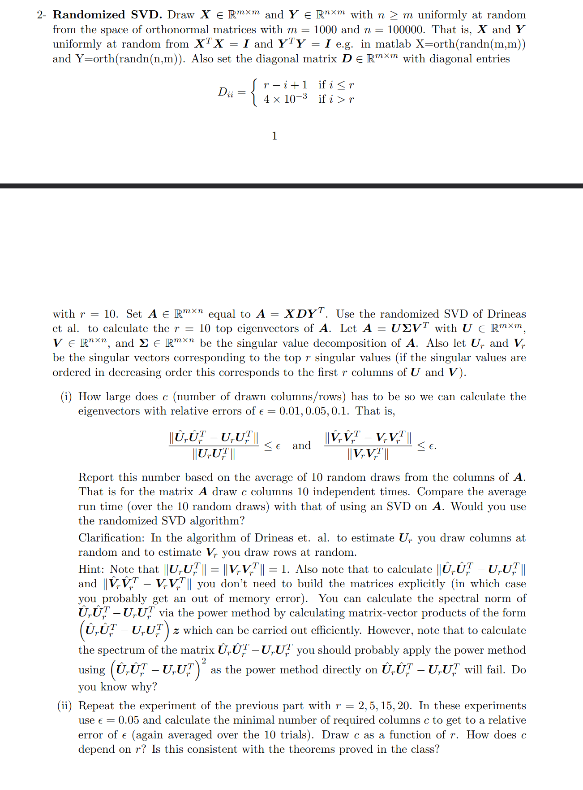

### i) 
For $U$ we get - 

>|relative error in U | c |
|---------------|---|
|0.1|100|
|0.05|250|
|0.01|6000|

For $V$, we get -

>|relative error in V | c |
|---------------|---|
|0.1|100|
|0.05|250|
|0.01|never|

---

### ii)
>|r|cU|plot U|cV|plot V|
|-|--|------|--|-----|
|2|175|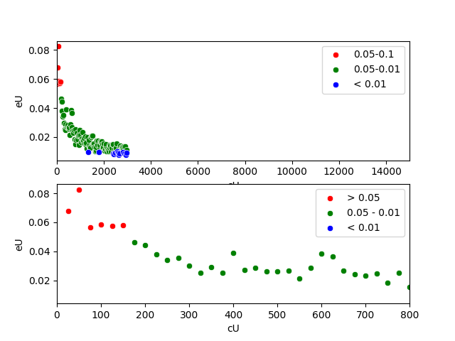|175|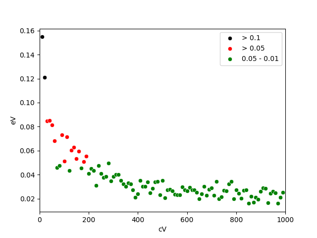|
|5|300|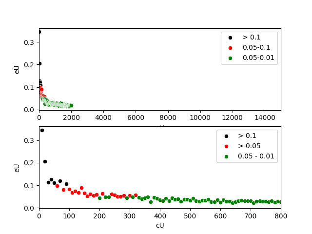|300|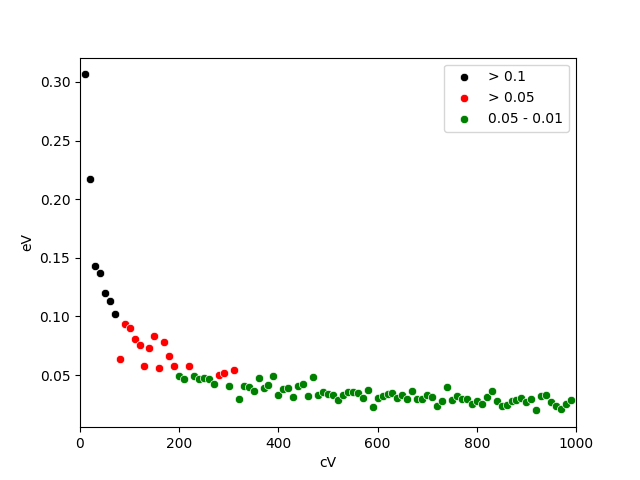|
|10|350|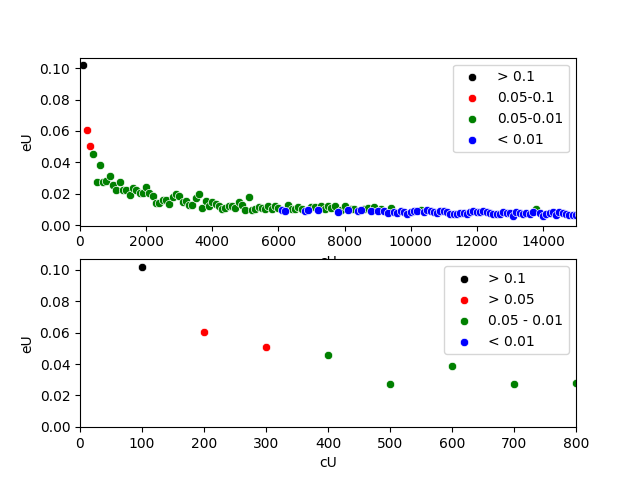|350|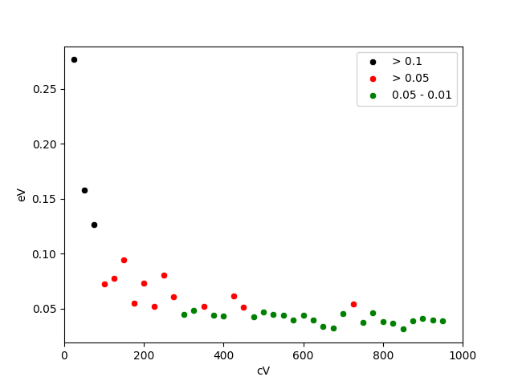|
|15|400|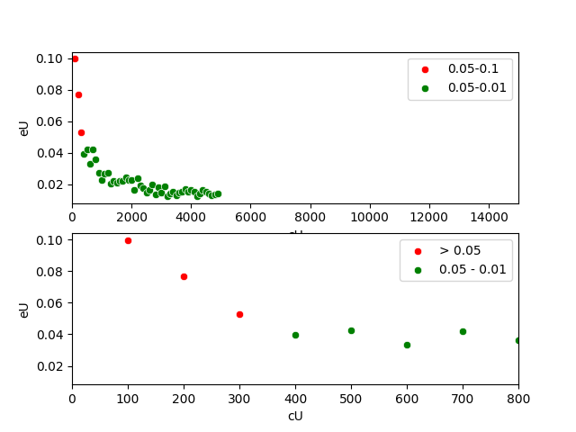|400|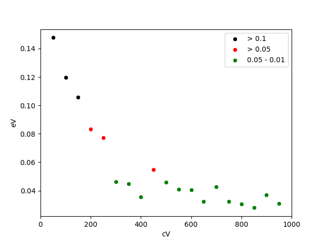|
|20|400|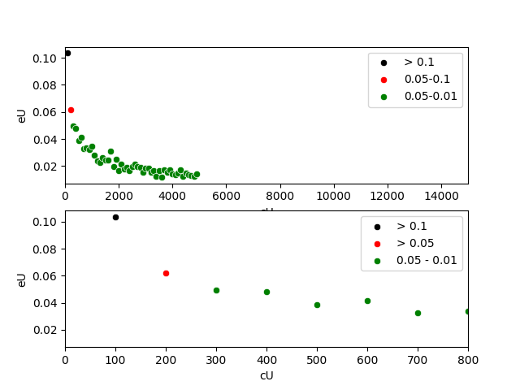|400|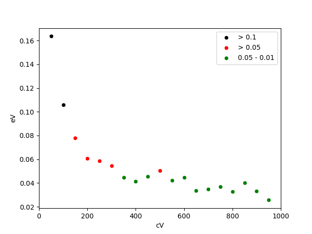|

---

Plot for **c** vs **r**
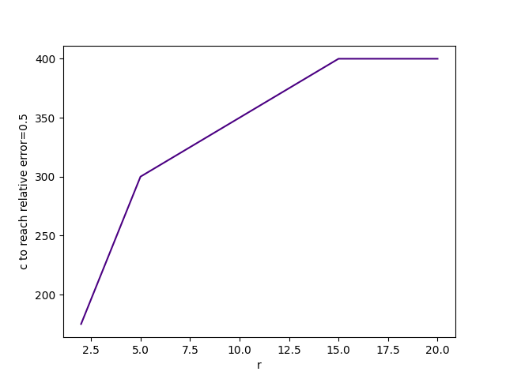

Maybe.

