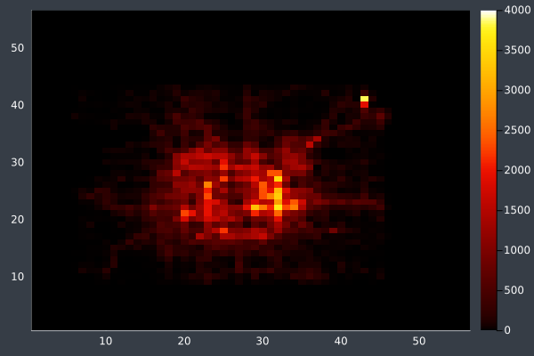
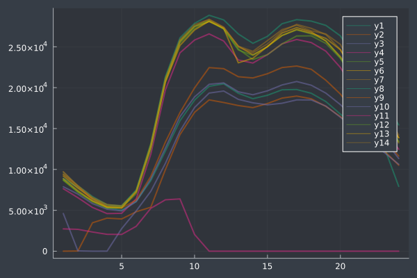
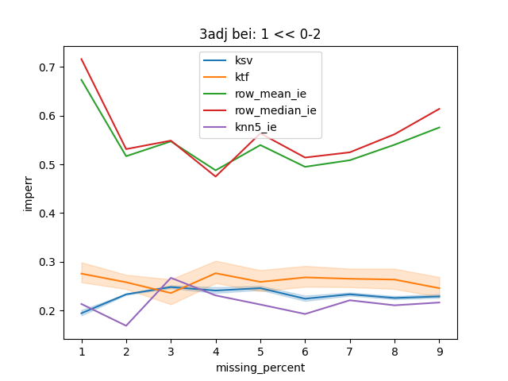
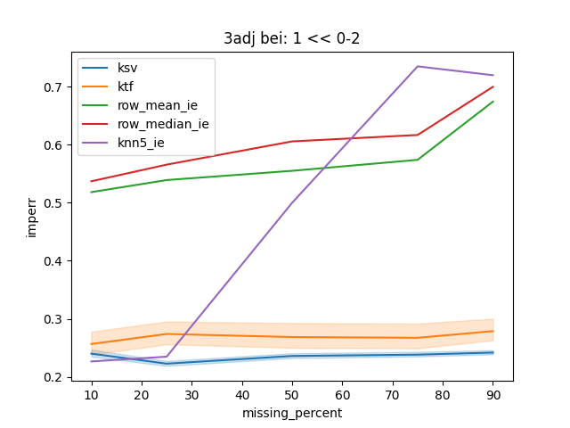
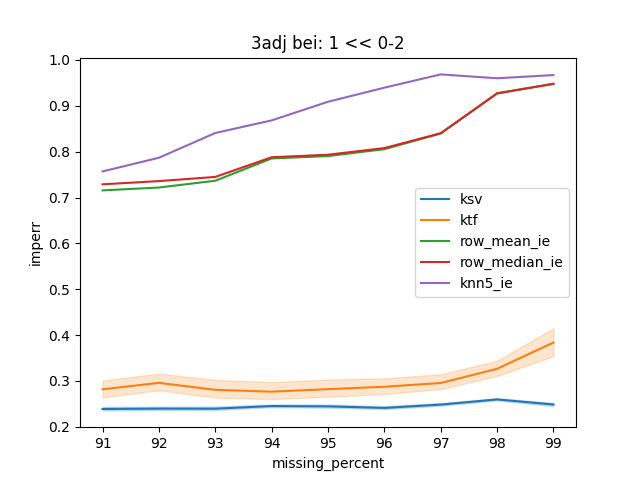
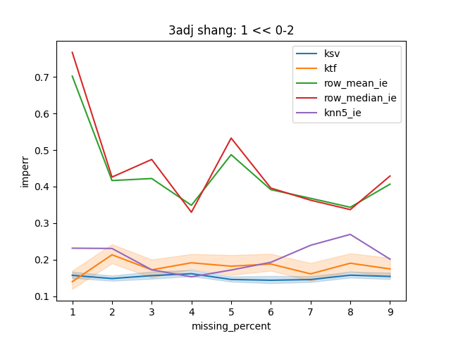
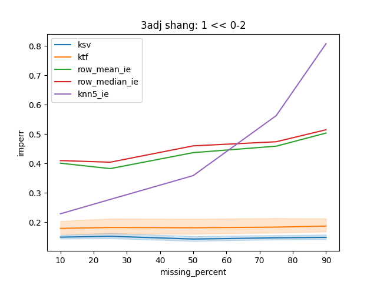
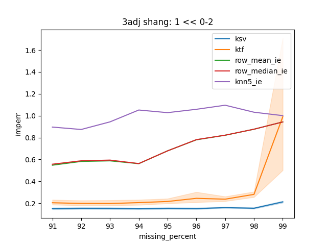
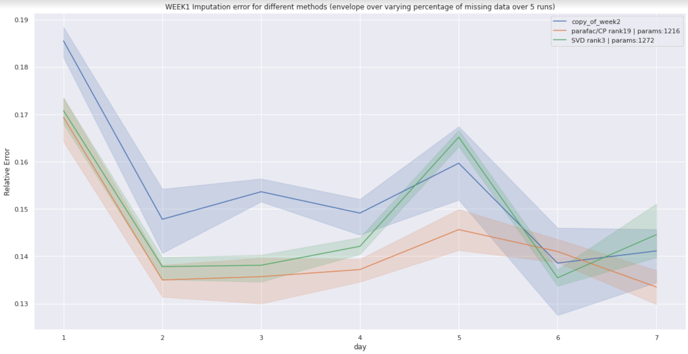

# EE546-Mathematics of High Dimensional Data

 <b>Init: 25th October, 2022</b> 

 <b>Updated: 15th December, 2022</b> 

<b> 
Project EE546 Fall2022 | Prof. Mahdi Soltanolkotabi
</b>

---

## Abstract

A tensor of order 3 can represent variety of data like images and spatiotemporal data. In this project we compare performance of popular imputation methods on an image and a traffic dataset. Specifically, we are interested in finding how tensor decomposition based imputation methods compare to methods like mean imputation, matrix decomposition based methods and neural networks.

## Problem formulation

We are given an order 3 tensor $T \in \mathbb{R}^{m \times n \times p}$ that is a representation of data generated by some data generating process. A binary mask $\Omega \in \mathbb{\{0,1\}}^{m \times n \times p}$ provides location of unobserved entries, i.e if $\Omega[i,j,k]=0$, then $A[i,j,k]$ is unobserved. The task is to best estimate the unobserved value having seen only the observed value.

We also get matrix representations of the observations and the mask by unfolding the tensors along one of the modes

## Models

We compare the following techniques - 

| Method | Description |
|---|---|
| Mean imputation | Mean value of the column/row |
| KNN imputation | Mean value of K-nearest-neighbours |
| Tensor decompostition | Low rank decomposition followed by reconstruction |
| Tensor Atoms | Low rank tensor rank1-factors(atoms) estimated using CPDECOMP from adjacent data and weights fitted to known portion of data on the target day |
| Matrix imputation | Low rank decomposition followed by reconstruction |
| Matrix Atoms | Low rank tensor rank1-factors(atoms) estimated using SVD from adjacent data and singular values fitted to known portion of data on the target day |
| Neural net | input = position, output = value at position -> train on observed positions |

#### 1. Mean Imputation
This is implemented using SimpleImputer from sklearn library. The values are mean of the columns using the matrix representation. We compare the various unfolding modes of the tensor for the matrix representation.

$$
	M[i,j] = \frac{ \sum_{i} \mathbf{M}[i,j] \mathbf{\Omega}[i,j] }{\sum_i \mathbf{\Omega}[i,j]}
$$
#### 2. Tensor Decomposition
The tensor representation of the observed data is assumed to be low rank.  We use CP decomposition which is carried out using alternating least squares method. Reconstructing the tensor using the factors gives us the unobserved values.

Decomposition using ALS
$$
	\underset{\mathbf{a_i,b_i,c_i}}{\text{minimize }}{|| \mathbf{\Omega} \odot \big(\mathbf{T} - \sum_{i}^{r} \mathbf{a_i} \otimes \mathbf{b_i} \otimes \mathbf{c_i} \big) ||_F}
$$ 

Reconstruction 

$$
	\mathbf{\hat{T}} = \sum_{i}^{r} \mathbf{a_i} \otimes \mathbf{b_i} \otimes \mathbf{c_i}
$$

#### 3. Matrix Decomposition
Same as tensor decomposition but on the matrix representation of the observations. 

Decomposition using ALS
$$
	\underset{\mathbf{a_i, b_i}}{\text{minimize }}{|| M - \sum_{i=1}^{r}{\mathbf{a_i b_i^T}}||_F}
$$

Reconstruction 

$$
	\mathbf{\hat{T}} = \sum_{i}^{r} \mathbf{a_i} \mathbf{b_i^T}

$$

#### 4. Neural Net
This method is tried on the matrix and the tensor representations. For the tensor representation, the network is a function $f : \mathbb{R}^{3} \rightarrow \mathbb{R}$ and $g: \mathbb{R}^2 \rightarrow \mathbb{R}$ for the matrix representation. The network is trained on the observed indices and the unobserved entries are predictions of the network on the unobserved indices.

$$
	\underset{\theta}{\text{minimize }}{\sum_{ \substack{i,j,k \\\\ \Omega[i,j,k]=1}} \bigg( f(\theta, [i,j,k]) - \mathbf{T}[i,j,k] \bigg)^2}
$$

Reconstruction 

$$
	\mathbf{\hat{T}}[i,j,k] = f(\boldsymbol{ \theta^*}, [i,j,k])
$$

## Evaluation

We evaluate the performance of the various models using the reconstruction loss $L_R$ and imputation loss $L_I$.

$$
	L_R = \frac{|| \mathbf{\Omega} \circ (\mathbf{\hat{T} - T})||}{||\mathbf{T}||}
$$

$$
	L_I = \frac{|| (\mathbf{1 - \Omega}) \circ (\mathbf{\hat{T} - T})||}{||\mathbf{T}||}
$$

## Results 

We will compare the performance of the some of the above imputation methods in three levels of missing percenages - high missing percentages, mid missing percentages and low missing percentages.

In particular we are going to consider the following methods - 
- Mean Imputation
- KNN Imputation
- Tensor Atoms
- Matrix Atoms

We also run the experiment on the traffic dataset from two cities - Beijing and Shanghai.
Below is a spatial and temporal plot of traffic density over a few days in Beijing.

As is clear from the plots, the traffic density clearly has a pattern over the 24 hours.

|Beijing Spatial|Beijing Temporal|
|-------|--------|
|||

**Table of Abbreviation used in the plot**
| Method Abbr. | Expansion | Description |
|:----:|:---------:|:-----------:|
|ksv|known singular vectors| the singular vectors are estimated from one or more adjacent days and the rank1 matrix atoms to fit the known part of the data of the to be imputed day|
|ktf|known tensor factors| the tensor factors are estimated from one or more adjacent days and then the weights are estimated for the rank-1 tensor atoms to fit the known part of the data of the to be imputed day|
|row_mean_ie|mean estimate from row| mean value of the data frm the same row is used to fill the missing values|
|row_median_ie|media estimate from row| median value of the data frm the same row is used to fill the missing values|
|knn5_ie| K-nearest-neighbour imputations with K=5| mean value of the nearest 5 neihbours  from the same matrix are used to fill the issing value |  

|lowmp|midmp|highmp|
|:--:|:-:|:-:|
||||
||||

## Conclusion

We observe that the matrix and the tensor imputation methods do better than the mean and KNN imputers. KNN imputer does better when the missing perentages are below 25% but as the missing percentage goes beyond 25%, matrix and tensor based imputation methods outperform the baseline imputer (mean imputer) and the KNN imputer.

We also conclude that atleast for the traffic datasets we experimented on shows that the matrix impuation is better than the tensor based imputation. 

However at the same time, we find that at the same parameter size the tensor does better than the matrix based imputation method.

## Further exploration

Here we compared the imputation from the above methods except from the neural network - a 5 layer MLP with ReLU activations. It is because the neural network is the worst performer of all and is worse by orders of magnitude when compared to other methods that I experimented with. This [**paper**](https://bmild.github.io/fourfeat) probably addresses why the performance is poor and how it can be remedied. I have not tried the fourier features that can improve the performance yet but this work is in the pipeline. Also trying other deep learning models targeting spatiotemporal data is the next step in this project.

We also want to see the effectiveness of tensor vs matrix based imputation methods from parameter complexity perspective. 

## Acknowledgements

I am grateful and thankful for all the support in class and the discussions after the classes and in office hours by [Prof. Mahdi Soltanolkotabi](https://viterbi-web.usc.edu/~soltanol/) . The class was extremely useful and the discussions while walking back from class or office hours were really interesting and productive. I am also really grateful to [Prof Bhaskar Krishnamachari](https://ceng.usc.edu/~bkrishna/) and [Dr. Fan Bai](https://scholar.google.com/citations?user=ZDRy6_EAAAAJ&hl=en) for their help and guidance in this project. 
