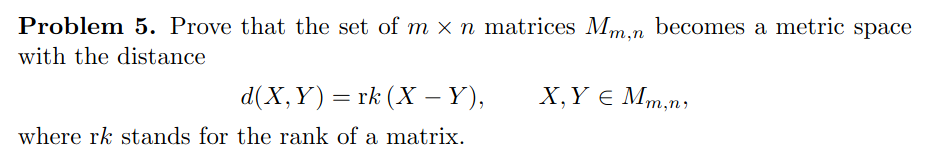
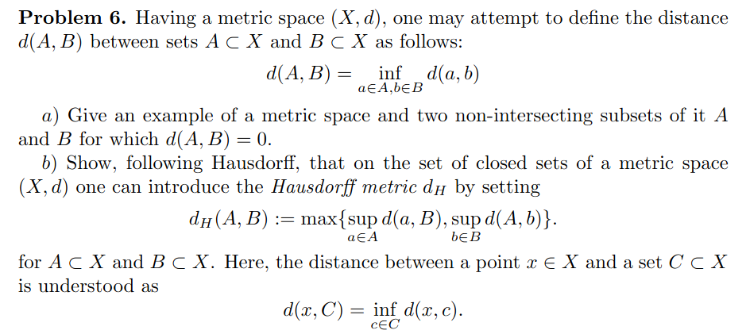
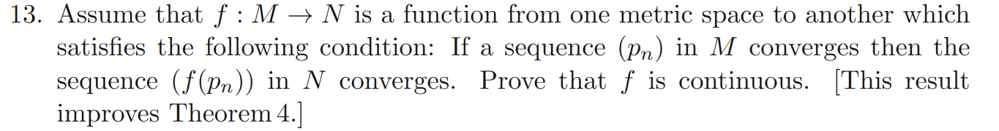
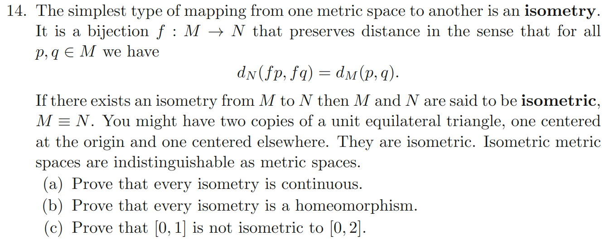

# MATH425A : Homeworks

 <b>5th March, 2023</b> 

<b>
Notes from MATH425A: Real Analysis (Prof. Guillermo Rayes Suoto).</b>

---

### Q1 - Pugh Pg. 125, Q3

Solution: The torus around the unit circle $S^1$ with cross-sectional radius $\frac{1}{2}$.

---
### Q2 - Pugh Pg. 125, Q5

Solution: We need to show that the axioms of metric space hold for $d_a$.

- Distance of a point to itself is zero
	$$
		d_a(\angle x, \angle x) = min\{ |\angle x - \angle x | , 2\pi - |\angle x - \angle x| \} = min \{ 0, 2\pi\} = 0
	$$

	and it is zero only if $\angle x = \angle y$ in $d_a(\angle x, \angle y)$.
	
- Positivity, i.e $d_a > 0$

	Since $\angle z \in [0,2\pi)]$, $\underset{\angle x,\angle y}{max}| \angle x - \angle y| = 2\pi$ and $\underset{\angle x,\angle y}{min}| \angle x - \angle y| = 0$
	So, $\underset{\angle x, \angle y}{min} \; ( 2\pi - |\angle x -  \angle y|) = 0$ and hence $2\pi - |\angle x - \angle y| \geq 0$.

	Hence $d_a(\angle x, \angle y) \geq 0$

- Symmetry, i.e. $d_a(\angle x, \angle y) = d_a(\angle y , \angle x)$

	Since absolute value function is symmetric, i.e $|\angle x - \angle y| = |\angle y - \angle x |$, so is $2\pi - |\angle x - \angle y|$.
	Hence $d_a$ is symmtric too.

- Triangle inequality. i.e $d_a(\angle x , \angle y) \leq d_a(\angle x, \angle z) + d_a(\angle z, \angle y)$ is easily proved by method of exhaustion similar to  Q4 below.
	
 
---

### Q3 - Pugh Pg. 125, Q6

To prove this we appeal to metric preserving functions. More details on such functions can be found at [link](https://web.science.upjs.sk/jozefdobos/wp-content/uploads/2012/03/mpf1.pdf).

A positive and non decreasing function is metric preserving if it is concave or sub-additive i.e $f(x+y) \leq f(x) + f(y)$. By metric preserving, we mean that if $d$ is a metric, then so is $g = f \circ d$.

Proof:
$$
	d(x,z) \leq d(x,y) + d(y,z) \;\;\; \because \text{ d is a metric} \\
	\implies f(d(x,z)) \leq f(d(x,y) + d(y,z)) \;\;\; \because \text{ f is non-decreasing} \\
	\implies f(d(x,z)) \leq f(d(x,y)) + f(d(y,z)) \;\;\; because \text{ f is sub-additive} \\
	\implies g(x,z) \leq g(x,y) + g(y,z) \;\;\; _\blacksquare
$$ 

Now, since it is given that  $p,q \in [0,\pi/2)$, we have $d(p,q)=|p-q| \in [0,\pi/2)$. We know that $d(p,q)$ is the standard metric. All we need to show is that $sin$ is positive and sub-additive in $[0,\pi/2)$.

Clearly from the figure below, $sin(x)$ is positive and concave.

*figure: y=sin(x) and y=x*

We also show sub-additivity (which is obvious from the concavity in the above picture)
$$
	sin(x+y) \\
	= sin(x)cos(y) + cos(x)sin(y) \\ 
	\leq sin(x) + sin(y) \\ \; \\
	\because \text{ $\forall$ $x,y \in [0,\pi/2), 0 \leq cos(x),cos(y) \leq 1$ }
$$

### Q4

We want to show non-negativity, symmetry and triangle inequality.

Non-negativity is obvious due to the absolute value on the log.

For symmetry, 
$$
	d(y,x) = |log(y/x)| = |-log(x/y)| = |-1||log(x/y)| = |log(x/y)| = d(x,y)
$$

For triangle inequality, we have 
$$
	d(x,y) \leq d(x,z) + d(z,y) \\
	|log(x/y)| = |log(x/z)| + |log(z/y)|
$$

Note that $log$ is a monotonically increasing function. 
We prove $\triangle$-inequality by exhausting all the possible cases.

|order|observation|LHS|RHS|conclusion|
|-----|-----------|---|---|----------|
|$x \leq y \leq z$|$\frac{y}{x} \leq \frac{z}{x} \\ 1 \leq \frac{z}{y} \\ \therefore \frac{y}{x} \leq \frac{z}{x}\frac{z}{y}$ |$log(y/x)$ | $log(z/x)+log(z/y) = log(\frac{z}{x}\frac{z}{y})$|$LHS \leq RHS$|
| $x \leq z \leq y$ |  | $log(y/x)$ | $log(z/x) + log(y/z) = log(\frac{z}{x}\frac{y}{z})$ | $LHS = RHS$|
|$y\leq x\leq z$|$\frac{x}{y} \leq \frac{z}{y} \\ 1 \leq \frac{z}{x} \\ \therefore \frac{x}{y} \leq \frac{z}{x} \frac{z}{y}$|$log(x/y)$|$log(z/x)+log(z/y) = log(\frac{z}{x}\frac{z}{y})$| $LHS \leq RHS$ |
|$y \leq z \leq x$| | $log(x/y)$ | $log(z/y) + log(x/z) = log(\frac{z}{y} \frac{x}{z})$ | $LHS = RHS$|
|$z \leq x \leq y$| $\frac{y}{x}  \leq \frac{y}{z} \\ 1 \leq \frac{x}{z} \\ \therefore \frac{y}{x} \leq \frac{y}{z} \frac{x}{z} $| $log(y/x)$ | $log(x/z) + log(y/z) = log(\frac{x}{z}\frac{y}{z})$| $LHS \leq RHS$|
|$z \leq y \leq x$| $\frac{x}{y} \leq \frac{x}{z} \\ 1 \leq \frac{y}{z} \\ \therefore \frac{x}{y} \leq \frac{x}{z} \frac{y}{z}$ | $log(x/y)$ | $log(x/z)+log(y/z) = log(\frac{x}{z} \frac{y}{z})$ | $LHS \leq RHS$ |

### Q5

We need to show positivity, symmetry and $\triangle$-inequality.

- positvity
	Rank is always a whole number as it counts the number of independent columns. 

- symmetry 
	We note that the rank of a matrix does not change under scaling the matrix by a scalar.
	Since $X-Y = (-1) (Y - X)$, $X-Y$ and $Y-X$ are scalar multiples of each other and hence posses the same rank. Hence $rk(X-Y) = rk(Y-X)$.

- $\triangle$-inequality
	We need to show that $rk(X - Y) \leq rk(X - Z) + rk(Z - Y)$.
	
	We appeal to the fact from linear algebra $rk(A+B) \leq rk(A)+ rk(B)$ and set $A=X-Z$ and $B = Z-Y$ and we are done.

### Q6

a) In $\mathbb{R}^2$ with standard Euclidean metric, $A = \{(x,y)| x=1\}$ and the open unit circle $\{ (x,y) | x^2 +y^2 < 1 \}$ 

b) 
$$
	d_H(A,B) := \max \bigg\{ \underset{a \in A}{\sup} \; \underset{b \in B}{\inf} \; {d(a,b)} \; , \; \underset{b \in B}{\sup} \; \underset{a \in A}{\inf} \; {d(a,b)} \bigg\}
$$

In words, the Hausdorff distance speaks of if an adversary was to put us on one of the sets $A$ or $B$, what is the most distance we have to travel to reach the other set. 

Positivity is obvious since we are taking max, sup and inf over a metric which is always positive. 
Symmetry drips from the invariance of the max operation to permutation of its arguments. 

Clearly $d_H(X,X) = 0$ since the inner $\inf$ is always zero and outer $\sup$ over zeros is still zero.
Now we need to prove that $d_H(X,Y)=0 \implies X=Y$. This is also obvious from the word description of Hausdorff distance mentioned above. If $X \neq Y$, then there is some point on $X$ or $Y$ from which the nearest distance to the other set is non zero. Since we have atleast one such point, the sup over all such points is greater than this non-zero number and hence is non-zero. 
 
All we are left with is to prove $\triangle$-inequality. We want to show $d_H(A,B) \leq d_H(A,C) + d_H(C,B)$.

Let $a,b,c$ belong to $A,B,C$ respectively.

### Q7

Let us define the images of $(p_n)$ as $(q_n)$ where $q_n:=f(p_n)$..

Now let $p_n$ converge to $p$ and $q_n$ converge to $q$. To show $f$ is continuous, we need to show that $q=f(p)$. We show this by contradction. Let $f(p) \neq q$.

### Q8

##### a) We need to show that all convergent sequences in $(M,d_M)$ converge in $(N,d_N)$.

Let $(p_n)$ be a sequence in $(M,d_M)$. Let it converge to $p$. So for all $\delta > 0$, we can find some $J$ such that for $n>J$, $d_M(p_j,p) < \delta$.

Let the image of the sequence be $(p_n)$ be $(r_n)$ with $r_n = f(p_n)$. We need to show that $r_n$ converges to some point in $N$. Let us define $r := f(p)$. We claim that $r_n$ converges to $r$. To show this we need to show that for all $\epsilon > 0 $ , there exists $K$ such that for $k > K$, $d_N(r_k,r) < \epsilon$.

Due to isometry, $d_M(p_k,p)$ and $d_N(f(p_k),f(p)) = d_N(r_k,r)$ are equal. If someone gave us an $\epsilon$, we want to find a $K(\epsilon)$. Setting $\delta = \epsilon$,for some $J$ we have $d_M(p_j, p) < \delta = \epsilon$ for all $j > J$.

So for all $j>J$,

$$
	d_M(p_j,p) < \delta = \epsilon \; \forall \; p > J\\
	d_N(f(p_j),f(p)) < \epsilon  \;\;\; \because isometry \\
	d_N(r_j,r) < \epsilon
$$ 

Hence setting $K=J$, we get the desired result that $d_M(r_k,r)<\epsilon$ for all $k>K$.

##### b) We assume that f is onto $N$ (one can always have such an $M$ since if the range is not $N$, then one can take the metric subspace consisting of the range and denote it $N$ ).

Now we need to prove that $f$ is one-one. We will prove this by contradiction. Let the isometry $f$ not be one-one. Then $\exist x,y \in M, x \neq y$ such that $f(x)=f(y)=a$.

Now, since $x \neq y$, $d_M(x,y)>0$. But since fis an isometry, 
$$ 
	d_N(f(x),f(y)) = d_M(x,y) > 0 \\
	\implies d_N(a,a) = d_M(x,y) > 0 \\
	\implies d_N(a,a) > 0
$$

But since $(N,d_N)$ is a metric space, $d_N(a,a)=0$ and hence we have a contradiction. So $f$ must be one-one.

Since $f$ is both one-one and onto, it is a bijection. Let us define the inverse of $f$ by $g:=f^{-1}$.

For $f$ to be a homeomorphism, $f$ and $g$ have to be continuous bijections. Clearly $g$ is a bijection because $f$ was one-one. All we need is to show that $g$ is continuous. We do this by showing that $g$ infact is an isometry too and then applying part a) of the question on $g$ shows that $g$ is continuous.

Let $x=g(a)$ and $y=g(b)$ for $a,b \in N$ and $x,y \in M$. We want to show $d_N(a,b) = d_M(g(a),g(b))$. Since $f$ is an isometry

$$
	d_N(f(x), f(y)) = d_M(x,y) \\
	\implies d_N(f(g(a)),f(g(b))) = d_M(g(a),g(b)) \\
	\implies d_N(a,b) = d_M(g(a),g(b)) \;\;\; \because f(g(t)) = t
$$  

Hence $g=f^{-1}$ is an isometry and by part a) it is continuous. Hence $f$ is a homeomosrphism as both $f$ and $g=f^{-1}$ are continuous bijections.

##### c) I believe the question forgot to mention that the metrics in both $[0,1]$ and $[0,2]$ are the standard metric.

We prove this by contradiction. 

Let us assume $[0,1]$ and $[0,2]$ are isometric. This means that there exists some isometry $f:[0,1]\rightarrow [0,2]$. Let $x,y \in [0,1]$ be such that $f(x)=0 \in [0,2]$ and $f(y)=2 \in [0,2]$. 

Clearly, $d(x,y) <= 1$ but $d(f(x),f(y)) = d(0,2) = 2$. Hence distance can never be preserved by any funtion $f$. Hence there exists no such isometry $f$.
