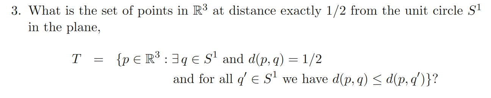
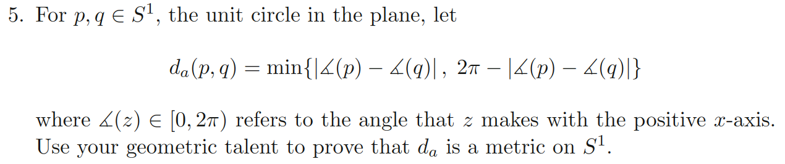
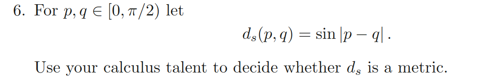
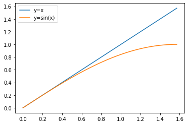
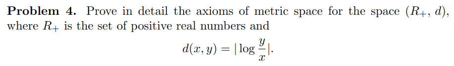

# MATH425A : Homeworks

 <b>5th March, 2023</b> 

<b>
Notes from MATH425A: Real Analysis (Prof. Guillermo Rayes Suoto).</b>

---

### Q1 - Pugh Pg. 125, Q3

Solution: The torus around the unit circle $S^1$ with cross-sectional radius $\frac{1}{2}$.

---
### Q2 - Pugh Pg. 125, Q5

Solution: We need to show that the axioms of metric space hold for $d_a$.

- Distance of a point to itself is zero
	$$
		d_a(\angle x, \angle x) = min\{ |\angle x - \angle x | , 2\pi - |\angle x - \angle x| \} = min \{ 0, 2\pi\} = 0
	$$

	and it is zero only if $\angle x = \angle y$ in $d_a(\angle x, \angle y)$.
	
- Positivity, i.e $d_a > 0$

	Since $\angle z \in [0,2\pi)]$, $\underset{x,y}{max}| \angle x - \angle y| = 2\pi$ and $\underset{x,y}{min}| \angle x - \angle y| = 0$
	So, $\underset{x,y}{min} \; ( 2\pi - |\angle x -  \angle y|) = 0$ and hence $2\pi - |\angle x - \angle y| \geq 0$.

	Hence $d_a(\angle x, \angle y) \geq 0$

- Symmetry, i.e. $d_a(\angle x, \angle y) = d_a(\angle y , \angle x)$

	Since absolute value function is symmetric, i.e $|\angle x - \angle y| = |\angle y - \angle x |$, so is $2\pi - |angle x - \angle y|$.
	Hence $d_a$ is symmtric too.

- Triangle inequality. i.e $d_a(\angle x , \angle y) \leq d_a(\angle x, \angle z) + d_a(\angle z, \angle y)$
	
 
---

### Q3 - Pugh Pg. 125, Q6

To prove this we appeal to metric preserving functions. More details on such functions can be found at [link](https://web.science.upjs.sk/jozefdobos/wp-content/uploads/2012/03/mpf1.pdf).

A positive and non decreasing function is metric preserving if it is concave or sub-additive i.e $f(x+y) \leq f(x) + f(y)$. By metric preserving, we mean that if $d$ is a metric, then so is $g = f \circ d$.

Proof:
$$
	d(x,z) \leq d(x,y) + d(y,z) \;\;\; \because \text{ d is a metric} \\
	\implies f(d(x,z)) \leq f(d(x,y) + d(y,z)) \;\;\; \because \text{ f is non-decreasing} \\
	\implies f(d(x,z)) \leq f(d(x,y)) + f(d(y,z)) \;\;\; because \text{ f is sub-additive} \\
	\implies g(x,z) \leq g(x,y) + g(y,z) \;\;\; _\blacksquare
$$ 

Now, since it is given that  $p,q \in [0,\pi/2)$, we have $d(p,q)=|p-q| \in [0,\pi/2)$. We know that $d(p,q)$ is the standard metric. All we need to show is that $sin$ is positive and sub-additive in $[0,\pi/2)$.

Clearly from the figure below, $sin(x)$ is positive and concave.

*figure: y=sin(x) and y=x*

We also show sub-additivity (which is obvious from the concavity in the above picture)
$$
	sin(x+y) \\
	= sin(x)cos(y) + cos(x)sin(y) \\ 
	\leq sin(x) + sin(y) \\ \; \\
	\because \text{ $\forall$ $x,y \in [0,\pi/2), 0 \leq cos(x),cos(y) \leq 1$ }
$$

### Q4

