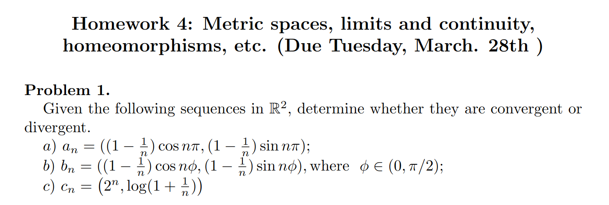
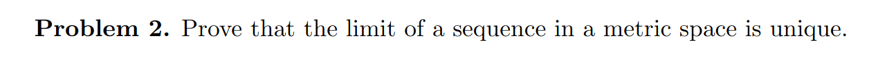
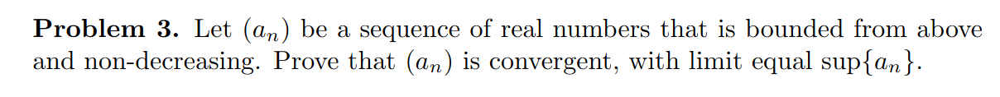
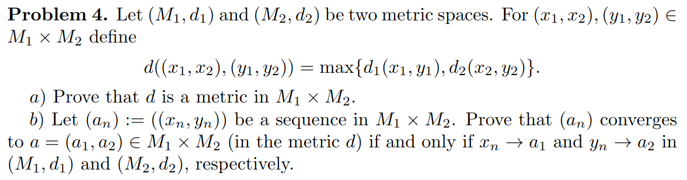
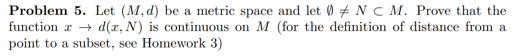
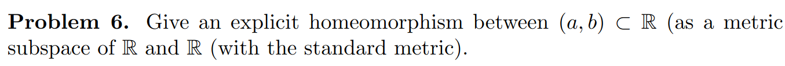
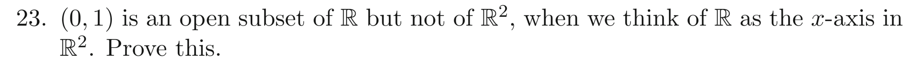
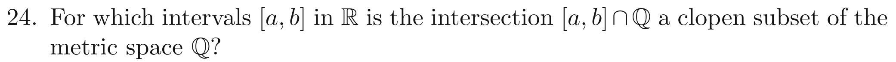

# MATH425A HW4

Recall that a sequence in $\mathbb{R}^n$ (with standard euclidean metric) converges if and only if each component converges in $\mathbb{R}$ (with standard metric, i.e $d(x,y)=|x-y|$).

a) $1 - \frac{1}{n}$ converges to $1$.

Since $\sin n\pi$ is always zero, the second component is a constant sequence with value $0$ and hence converges to $0$.

However, the first component contains $\cos n \pi = (-1)^n$ which oscillates and hence does not converge.

Hence the sequence $a_n$ does not converge.

b) $1 - \frac{1}{n}$ converges to 1. Both $\cos n\phi$ and $\sin n \phi$ oscillate and do not converge and hence the sequence $b_n$ does not converge.

c) The first component $2^n$ diverges and hence $c_n$ does not converge.

Let the limit of a sequence $a_n$ is a metric space $M,d$ be non-unique. Hence it has more than one limits. Let $x$ and $y$ be two unique such limits, ie. $x \neq y$.

By definition of a limit, for all $\epsilon > 0$ ,

$\exist X(\epsilon)$ such that for all $n > X(\epsilon)$, $d(a_n,x) < \epsilon$.

and

$\exist Y(\epsilon)$ such that for all $n > Y(\epsilon)$, $d(a_n,y) < \epsilon$

Now, by triangle inequality property of the metric $d$,

$$
  d(x,y) \leq d(x,a_n) + d(a_n,y) \\
  \implies d(x,y) \leq d(a_n,x) + d(a_n,y) \;\;\; \because \text{symmetry of d} \\
$$

Let $N(\epsilon) = max(X(\epsilon),Y(\epsilon))$, then for all $\epsilon > 0$, we have

$$
	d(x,y) \leq d(a_n,x) + d(a_n,y) \\
	< \epsilon + \epsilon = 2\epsilon \\
	\implies d(x,y) < 2\epsilon
$$

Since $\epsilon$ is arbitrary, we can make $\epsilon$ as small as we want and we still have $d(x,y) < 2\epsilon$. Hence $x$ and $y$ are arbitrarily close and hence $x=y$. But this is a contradiction as we assumed $x \neq y$. Hence $a_n$ has only one unique limit which is $x=y$.

Let $\alpha := \sup \{ a_n \}$. By definition of supremum/l.u.b, for all $\epsilon > 0$, $\exist N$ such that $\alpha - \epsilon < a_N$
Since $a_n$ is non decreasing, $a_N \leq a_n \; \forall n>N$. Hence
$$
	\alpha - \epsilon < a_N \leq a_n \;\;\;(eq1)
$$

However, since $\alpha$ is an upper bound, 
$$
	a_n < \alpha \; \forall \; n \;\;\;(eq2)
$$

From $eq1$ and $eq2$, for all $\epsilon$, there is some $N$ such that $\forall n > N$
$$
	\alpha - \epsilon < a_N < a_n < \alpha  \\
	\implies \alpha - \epsilon < a_n < \alpha \\
	\implies \alpha - \epsilon < a_n <  \alpha + \epsilon \\
	\implies - \epsilon < a_n - \alpha < \epsilon \\
	\implies |a_n - \alpha| < \epsilon \;\;\;\; \blacksquare
$$

Hence, $\alpha = \sup \{ a_n\}$ is the limit of $a_n$ as by definition of a limit, there must exist some $N$ such that for all $n > N$,  $|a_n - \alpha| < \epsilon$.

Let $x = (x_1,x_2)$ and $y = (y_1, y_2)$. Then we have, 

$$
	d(x,y) = \max \{ d_1(x_1,y_1), d_1(x_2, y_2) \}
$$

For $d$ to be a metric, we need to check the following properties - 
- Symmetry
$$
	d(x,y) = \max \{ d_1(x_1,y_1), d_2(x_2, y_2) \} \\
					= \max \{ d_1(y_1,x_1), d_2(y_2,x_2) \} \\
					= d(y,x)
$$
where the second line is due to symmetry of $d_1$ and $d_2$ due to each being a metric.

- Positive definiteness i.e. $d(x,y) >= 0$ and $d(x,y) = 0 \iff x=y$
	
	Since $d_1,d_2 \geq 0$, it is obvious that $\max \{ d_1, d_2\} \geq 0$.

	Let us prove $x=y \implies d(x,y)=0$
	
	If $x=y$, then $x_1=y_1$ and $x_2=y_2$ and hence $d_1(x_1,y_1) = 0$ and $d_2(x_2,y_2)=0$. 
	Hence 
	$$
	d(x,y) = \max \{ d_1(x_1,y_1), d_2(x_2,y_2)\} \\
	  = \max \{ 0,0 \} = 0
	$$ 

	Now we prove $d(x,y) =0 \implies x=y$
	We know that $d_1,d_2 \geq 0 \;\;\;eq1$
	$$	
		d(x,y) = 0 \\
		\implies \max \{ d_1(x_1,y_1), d_2(x_2,y_2) \} \\
		\implies d_1(x_1, y_1), d_2(x_2,y_2) \leq 0 \;\;\;eq2 
	$$

	From $eq1$ and $eq2$, $d_1(x_1,y_1),d_2(x_2,y_2) = 0$.

	Since $d_1,d_2$ are metrics, $d_1(x_1,y_1)=0 \implies x_1=y_1$ and $d_2(x_2,y_2) \implies x_2=y_2$. 
	
	Since the components are equal, $x=y$

- Triangle inequality , $d(x,y) < d(x,z) + d(z,y)$

	$$
		RHS = d(x,z) + d(z,y) \\
		= \max \{ d_1(x_1,z_1),d_2(x_2,z_2)\} + \max\{ d_1(z_1,y_1), d_2(z_2, y_2)\} - eq1
	$$

	Recall,
	 $$ 
	 \max \{a+b,c+d \} \leq \max \{ a,c\} + \max \{ b,d \}  -eq 2
	 $$ 
Proof: Let $\max \{ a+b , c + d \} =  a + b$ without loss of generality.
But we always have $a \leq \max \{ a,c \}$ and $b \leq \max \{ b,d\}$ for any $c,d$.
Hence, 
$$
\max \{a+b, c+d \} = a+b \\ 
				 \leq \max \{a,c \} + \max \{b,d \} \;\;\;\; \blacksquare
$$
Using $eq1$  and $eq2$, we have 
$$
	RHS = d(x,z) + d(z,y) \\
	 = \max \{\color{red}d_1(x_1,z_1) \color{reset}, d_2(x_2,z_2) \} + \max \{ \color{red}d_1(z_1,y_1) \color{reset},d_2(z_2, y_2) \} \\
	\geq \max \{ \color{red}d_1(x_1,z_1) + d_1(z_1,y_1) \color{reset}, d_1(x_2,z_2) + d_2(z_2,y_2)  \} \\
	\geq \max \{ \color{red}d_1(x_1,y_1)\color{reset}, d_2(x_2,y_2)\} = d(x,y) = LHS \;\;\; \blacksquare
$$ 
where the last line is because $d_1$ and $d_2$ are metrics and $\max\{M,N\} \geq \max\{m,n\}$ if $M \geq m$ and $N \geq n$.

Using Sequential Continuity, we need to show that if a sequence $x_k$ converges to $x^*$, then the distance $d(x_k,N)$ converges to $d(x^*,N)$. 

Since $x_k \rightarrow x^*$, for all $\delta > 0$, there exists $K$ such that $d(x_k,x^*) < \delta$ for all $k > K$.

For $d(x_k,N)$ to converge to $d(x^*,N)$, we need to show that for all $\epsilon>0$, $\exists K'$ such that for all $k>K'$, $|d(x_k,N) - d(x^*,N)|< \epsilon$.

$$
	d(x_k,N)  = \underset{n \in N}{\inf}{d(x_k,n)} \\
	\leq \underset{n \in N}{\inf}{[d(x_k,x^*) + d(x^*,n)]} \\
	\leq d(x_k,x^*) + \underset{n \in N}{\inf}{d(x^*,n)} \\
	\leq d(x_k,x^*) + d(x^*,N) \\
	\implies d(x_k,N) - d(x^*,N) \leq d(x_k,x^*)  \;\;\;(1)\\
$$

Similarly
$$
	d(x^*,N) = \underset{n \in N}{\inf}{d(x^*,n)} \\
	\leq \underset{n \in N}{\inf}{[d(x^*,x_k) + d(x_k,n)]} \\
	\leq d(x^*,x_k) + \underset{n \in N}{\inf}{d(x_k,n)} \\
	\leq d(x^*,x_k) + d(x_k,N) \\
	\implies d(x^*,N) - d(x_k,N) \leq d(x^*,x_k) = d(x_k,x^*) \;\;\; (2)
$$

Using $(1)$ and $(2)$, 
$$
	|d(x_k,N) - d(x^*,N)| \leq d(x_k,x^*) \;\;\; (3)
$$

Given an arbitrary $\epsilon > 0$, we set $\delta = \epsilon$ and find $K$ such that for all $k > K$, $d(x_k,x^*) < \delta = \epsilon$ and we can do that since $x_k \rightarrow x^*$. Now we are done, since for all $k>K$, we can make $d(x_k,x^*) < \delta$. Hence for all $k>K$, $|d(x_k,N) - d(x^*,N)| \leq d(x_k,x^*) < \delta = \epsilon$. $\;\;\;\; \blacksquare$

Let $f(x) =\pi \frac{x-a}{b-a}$ and $g(x) = tan(x)$. Then clearly $h(x)=gof(x)$ sends $(a,b)$ to $\mathbb{R}$ and is continuous since both $f$ and $g$ are. Also since $f^{-1}$ and $g^{-1}$ exist, so does $h^{-1}=f^{-1}og^{-1}$ and is continuous. Hence we have a homeomorphism.

### Q7. Pugh, Pg. 127, Q23

Open set: 
$S$ is an open set if for each $p \in S$, there exists an $r>0$ such that $d(p,q)<r \implies q \in S$.

We know that $(0,1)$ is an open set of $\mathbb{R}$.  We want to show that it is not an open set in $\mathbb{R}^2$. It will be sufficient to show that for some $p \in (0,1) \subset \mathbb{R}^2$ and all $r>0$ there always exist $q$ such that $d(p,q)<r$ but $q \notin (0,1)$.

Let $q=[0,0] \in \mathbb{R^2}$, and given any $r>0$, take $p=[\frac{r}{2},\frac{r}{2}]$ and $d(q,p) = \frac{r}{\sqrt{2}} < r$ but $p$ does not lie in $(0,1)$. Hence $(0,1) \in \mathbb{R}^2$ is not open.

### Q8. Pugh, Pg. 127, Q23

For either $a$ or $b$ or both irrational.
