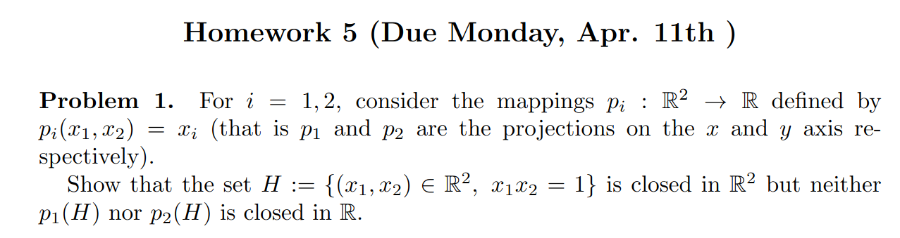
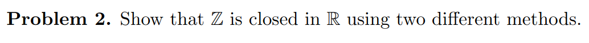
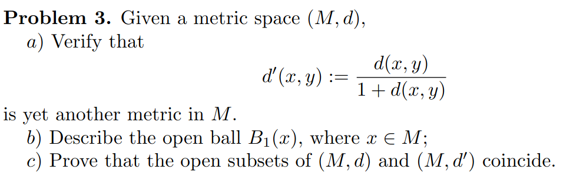
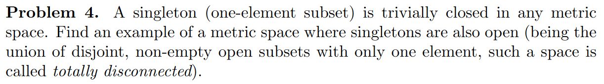
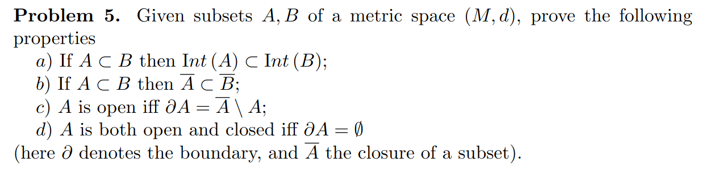
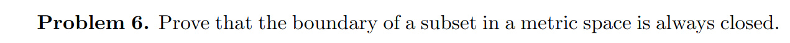

#  MATH425A HW5

Consider the function $f(x_1,x_2)=x_1x_2$ from $\mathbb{R}^2$ to $\mathbb{R}$. This function is continuous and hence the preimage of a closed set is closed. Since $\{1\} \in \mathbb{R}$ is a closed set, so is its preimage $H:=\{(x_1,x_2)|x_1x_2=1\}$ in $\mathbb{R}^2$.

$p_1(H)$ is not closed since there exist sequences like $r_k = (\frac{1}{k}, k) \in H$ such that $p_1(r_k) = \frac{1}{k}$ which converges to $0$ although $0 \notin p_1(H)$. A similar argument can be made for $p_2(H)$ using $t_k = (k, \frac{1}{k})$. 

The complement of $\mathbb{Z}$ wrt $\mathbb{R}$ is $\mathbb{R\backslash Z} = \cup_{n \in \mathbb{Z}}(n,n+1)$ which is a union of open intervals and hence is open and therefore the complement of it is closed.

Another argument for the same would be based on limit points. Since the limit points of $\mathbb{Z}$ are integers themselves, hence $\mathbb{Z}$ contains all its limit points and hence is closed.

a) Symmetry
$$
	d'(x,y) = \frac{d(x,y)}{1 + d(x,y)} \\
	= \frac{d(y,x)}{1+d(y,x)} \\
	= d'(y,x)
$$

Positive definiteness
$$
	d'(x,y) = \frac{d(x,y)}{1+d(x,y)} = \frac{1}{1 + \frac{1}{d(x,y)}}
$$

If $d(x,y) > 0$, so is $d'(x,y)$.
Also $d'(x,y) = 0 \iff d(x,y)=0 \iff x=y$

Triangle inequality

Let $f(t)=\frac{t}{1+t}$. Then $f(t)$ is increasing. Given a metric $d(x,y)$, want to show triangle inequality for $d'(x,y) = f(d(x,y))$

In particular, we want to show 
$$
	f(d(x,z)) \leq f(d(x,y)) + f(d(y,z)) 
$$

We know already that $d(x,y)+d(y,z) \geq d(y,z)$ and also that $f$ is increasing. Hence
$$
	f(d(x,z)) \leq  f(d(x,y) + d(y,z))
$$

If only we could show $f(a + b) \leq f(a) + f(b)$ for $a,b \geq 0$, we could show $f(d(x,y) + d(y,z)) \leq f(d(x,y)) + f(d(y,z))$.

We are going to do that exactly.

$$
	f(a+b) = \frac{a+b}{1+a+b} = \frac{a}{1+a+b} + \frac{b}{1+a+b} \leq \frac{a}{1+a} + \frac{b}{1+b} = f(a) + f(b)
$$ 

And we are done $\;\;\; \blacksquare$

b) $B_1(x)$ is all of $M$.

c) We want to show that if a set is open in one metric space, then it is open in the other as well.
Let us consider an open ball centered at $x$ of radius $\epsilon$ denoted by $B(x,\epsilon)$ in $(M,d)$.

Let $y \in B(x,\epsilon)$. 

$$
	d(x,y) < \epsilon \\
	\frac{d(x,y)}{1+d(x,y)} < \frac{\epsilon}{1+d(x,y)}\\
	d'(x,y) < \eta
$$

where $\eta = \frac{\epsilon}{1+d(x,y)}$. Thus we have an open ball $B'(x,\eta)$ in $(M,d')$ whenever we have an open ball $B(x,\epsilon)$ in $(M,d)$.

<!-- Also we have $B'(x,\eta) \subseteq B(x,\epsilon)$ -->

Similarly let us consider an open ball centered at $x$ and of radius $\epsilon < 1$ denoted by $B'(x,\epsilon)$

Let $y \in B'(x,\epsilon)$
$$
	d'(x,y) < \epsilon \\
	\frac{d(x,y)}{d(x,y)+1} < epsilon \\
	d(x,y) < \epsilon (1  + d(x,y)) = \epsilon + \epsilon d(x,y) \\
	d(x,y) < \frac{\epsilon}{1 - \epsilon} = \eta
$$

Thus we have an open ball $B(x,\eta)$ in $(M,d)$ whenever we have an open ball $B'(x,\epsilon)$ in $(M,d')$

<!-- Also we have $B(x,\eta) \subseteq B'(x,\epsilon)$ -->

Hence we showed that an open set in one is also an open set in the other.

Any metric space $(M,d)$ with the discrete metric 
$$
d(x,y) = 
\begin{cases}
	1 & \text{ if } x=y\\
	0 & \text{ otherwise}
\end{cases}
$$

a) Let $x \in Int(A)$. Then $\exist$ a ball centered at $x$ of some positive radius such that $B(x) \in A$.
Since $B(x) \in A$, so $B(x) \in B$ and hence there also exist a ball in $B$. Hence $x \in Int(B) \;\;\; \blacksquare$

b) Let us recall that the closure of a set can be defined as the instersection of all the closed sets containing it.
Let $\alpha$ be all the closed sets containing $A$ and $\beta$ be all the closed sets containing $B$.

Then clearly $\beta \subset \alpha$ and hence $\cap \alpha\subset \cap \beta$ (loosely speaking, adding more sets to an intersection can only make it smaller) which means $\bar{A} \subset \bar{B}$ 

c) By definition $\partial A = \bar{A} \backslash Int(A)$. However, if $\partial A = \bar{A} \backslash A$, then we have $A = Int(A)$ which means $A$ is open.

d) 
$$
	\bar{A} = A \cup \partial A = A \cup \phi = A
$$
Since $\bar{A} = A$, $A$ is closed.

Also $\bar{A} = Int(A) \cup \partial A = Int(A) \cup \phi = Int(A)$. Hence $A$ is open. 

Now to show the other direction, let us assume $A$ is clopen.
Then $A = Int(A)$. But $\bar{A} = A \cup \partial A$.

However, $A$ is closed and hence $\bar{A} = A$

So, we have $A = A \cup \partial A$. 

Also recall that $Int(A) \cap \partial A = \phi \implies A \cap \partial A = \phi$.

Hence $A = A \cup \partial A$ and $A \cap partial A = \phi$. Hence $\partial A$ must be $\phi \;\;\; \blacksquare$. 

Let the metric space be $(X,d)$. 

We know that for two sets $A,B \subset S$, $A \backslash B = A \cap (C \backslash B)$

We also know that intersection of two closed sets is closed.

Now,  
$$
	\partial A = \bar{A} \backslash Int(A) = \bar{A} \cap(X \backslash Int(A))
$$	

$\bar{A}$ is closed and so is $X \backslash Int(A)$ which is the complement of the open set $A$. Hence we have an intersection of two closed sets here which must be closed $ \;\;\; \blacksquare$
