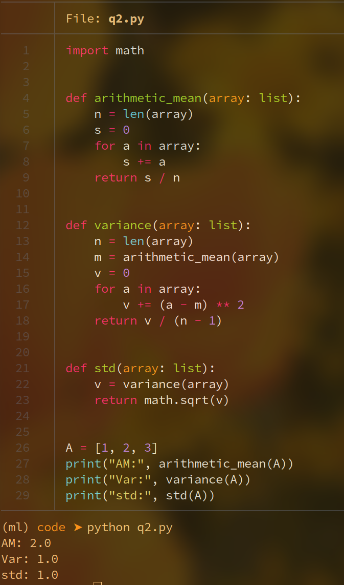

# Homework 1

### Q1 
> page 17, q5

Clearly $x^n < x^{n+1}$ for $x \in (0,1)$
$$
	\implies x^n e^x < x^{n+1}e^x \\
	\implies \int_0^1 x^n e^x dx < \int_0^1 x^{n+1}e^x dx \\
	\implies p_n < p_{n+1} \;\;\; \blacksquare
$$

Integration by parts says $ \int_a^b fg' dx = \bigg[fg \bigg]_a^b - \int_a^b f'g dx $

Applying integration by parts,
$$
	p_{n+1} = \int_0^1 x^{n+1} e^x dx = \bigg[   x^{n+1}e^x   \bigg]_0^1 - \int_0^1 (n+1)x^n e^x dx = \bigg[ 1^{n+1}e^1 - 0^{n+1}e^0 \bigg] - p_n = e - (n+1) p_n \;\;\; \blacksquare
$$

$$
	p_1 = p_{0+1} = e - (0+1)p_0 = e -  \int_0^1 x^0 e^x dx = e -  e^x |_0^1 = e - (e - 1) = 1
$$

The inequalities are violated because of machine precision is limited which leads to inaccurate representation of the small numbers.

### Q2
> page 17, q7

### Q3
> page 17, q7

So for $n \geq 53$, $1+2^{-n}$ is equal to one on my computer.

### Q4
>page 31, q1

 
 

$$
(1+x)^n = 1 + \binom{n}{1}x + \binom{n}{2}x^2 + ... \\
= 1 + nx + \frac{n(n-1)}{2!}x^2 + ...\\
$$

For $n=2$,
$$
	(1+x)^2 = 1+2x+x^2
$$

For $n=3$,
$$
	(1+x)^3 = 1+ 3x + 3x^2 + x^3
$$

For $n=\frac{1}{2}$,
$$
	\sqrt{1 + x} = 1 + \frac{1}{2}x - \frac{1}{8}x^2 + \frac{1}{16}x^3 - \frac{2}{128}x^4 + \frac{7}{256}x^5 - \frac{21}{1024}x^6 
$$

### Q5
>page 32, q4

a) $\sqrt{x}$ has a first derivative of $\frac{1}{2\sqrt{x}}$ and it does not exist at $x=0$

b) $|x|$ is not differentiable at $x=0$

c) first derivative of $\arcsin(x-1)$ is $\frac{1}{\sqrt{1 - (x-1)^2}}$ which does not exist at x=1.

d) $\frac{d \cot(x)}{dx} = -\cosec^2(x) = \frac{-1}{\sin^2(x)}$ which does not exist at $x=0$.

e) $\frac{d \log(x)}{dx}=\frac{1}{x}$ which does not exist at $x=0$

f) $\frac{d^4 x^\pi}{dx^4} = \pi (\pi - 1)(\pi - 2)(\pi - 3)x^{\pi - 4}$ is not defined at $x=0$ as $\pi - 4$ is less than zero.

#### Q6
> page 32, q6

a) 
$$
	e^{\cos(x)} \approx e - \frac{ex^2}{2} + ...
$$
b) 
$$
	\sin(\cos(x)) \approx sin(1) - \frac{\cos(1)x^2}{2} + ...
$$
c)
$$
	\cos^2(x)\sin(x) \approx x - \frac{7x^3}{6} + ...
$$

### Q7
> page 32, q8 

$$
	f(x) = \sum_{i=0}^{n-1} \frac{f^{(i)}(x)\; x^i}{i!} + \frac{f^{(n)}(\xi)x^{n}}{n!}
$$
where $\xi \in (0,1)$ in the error term.

For $f(x)=e^x$, since $f^{(i)}(x)=e^x$ for all $i$, we have the error term $\frac{e^\xi x^n}{n!}$ for $\xi \in (0,1)$. For $x=1$, the errors term is $\frac{e^\xi}{n!}$.

Clearly $\frac{e^\xi}{n!} \leq \frac{e}{n!}$ for $\xi \in (0,1)$.

As long as $\frac{e}{n!}$ is less than 10^{-15}, our error is definitely less than $10^-{15}$ too.

$$
	\frac{e}{n!} < 10^{-15} \\
	\implies \frac{n!}{e} > 10^{15} \\
	\implies n! > e * 10^{15} \\
	\implies \log(n!) > \log(e) + 15 \\
	\implies \log(n!) > 0.4342944819032518 + 15 = 15.4342944819032518
$$

By plugging different values of n, we find that log(n!), we get 

Hence if we take 18 terms in the expansion of $e^x$, we can find $e$ upto $15$ digits correctly.

### Q8
> page 32, q14

$$
	f(2) = 8 - 8 + 8 - 1 = 7\\
	f'(2) = 12 - 8 + 4 = 8 \\
	f''(2) = 12 - 4 = 8 \\
	f'''(2) = 6 \\
	f''''(2) = 0 \\
$$

Hence 
$$
	f(x) = f(2)  \\ + f'(2)(x-2) \\
	+ \frac{f''(2)(x-2)^2}{2!} \\ + \frac{f'''(2)(x-2)^3}{3!} 
$$

Hence 
$$
	f(2+h) = f(2) \\ + f'(2)h \\+ \frac{f''(2)h^2}{2!} \\+ \frac{f'''(2)h^3}{3!} \\
	= 7 + 8h + 4h^2 + h^3 
$$

$$
	e^x = \sum_{i=0}^{\infty} \frac{x^i}{i!} \\
	\implies e^{-t^2} = \sum_{i=0}^{\infty} \frac{(-t^2)^i}{i!} = \sum_{i=0}^{\infty} \frac{(-1)^i t^{2i}}{i!} \\
	\implies \int_0^x e^{-t^2} dt = \int_0^x \sum_{i=0}^{\infty}\frac{(-1)^i t^{2i}}{i!} dt \\
	= \sum_{i=0}^{\infty} \int_0^x \frac{(-1)^i t^{2i}}{i!} dt = \sum_{i=0}^{\infty}\frac{(-1)^i \;\;[t^{2i+1}]_0^x}{(2i+1)i!} \\
	\sum_{i=0}^{\infty}\frac{(-1)^i \;\;x^{2i+1}}{(2i+1)i!}
$$

For obtaining Taylor series of $\int_0^x e^{-t^2}dt$ directly, 
$$
	0 + e^{-0^2}x + \frac{e^{-0^2}(-2\times 0)x^2}{2!} \\ + \frac{-2(e^{-0^2} - 2\times0^2e^{-0^2})x^3}{3!} + ... \\
	= 0 + x - \frac{x^3}{3} + 0 + ...
$$

Hence the two expansions are equal.
Upto 4 terms, we get 
$$
	erf(x) = \frac{2}{\sqrt{\pi}} (0 + x - \frac{x^3}{3} + \frac{x^{5}}{10} - \frac{x^7}{42}) \\
	\implies erf(1) = \frac{2}{\sqrt{\pi}}(1 - \frac{1}{3} +\frac{1}{10} - \frac{1}{42}) = 0.8427
$$

