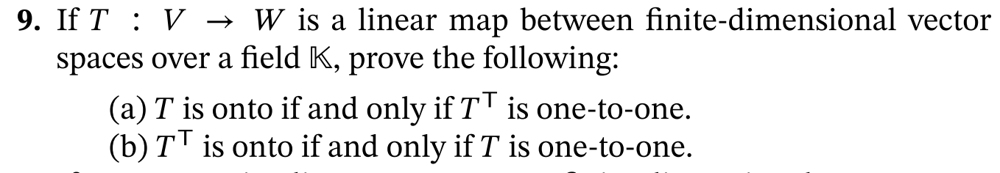

# MATH574 : Homework-2

 <b>9th October, 2021</b> 

<b>
Notes from MATH574: Applied Matrix Analysis (Prof. Robert Guralnick).</b>

---

##### Q1: page 75 - 2.43

##### Solution:

This seems so trivial but I am not sure how to prove it - it kind of seems circular in some way because we are not handed down a linear transform but are given this representation in standard bases $X$ and $Y$ and we interpret the linear transform from A which we denote by $L_A$. Then we are asked to show that the representation of this linear transform given the standard bases $X$ and $Y$ is A itself - I mean, didn't we interpret $L_A$ from A using the same bases?.

Will this work for any bases? Yes, this should work for any bases in $\mathbb{K}^m$ and $\mathbb{K}^n$ since we are interpreting the linear transform $L_A$ from the reprentation in some bases $X$ and $Y$ and then representing them back in the same bases. If we were asked to represent $L_A$ in a basis different from the one we used to interpret $L_A$ from A, then we wouldn't have $B=A$.

##### Q2: page 75 - 2.44

##### Solution:

Let $f(x) = a_0 + \sum_{n=1}^{\infty}{a_n x^n} \in \mathbb{K[x]}$

$$

\begin{aligned}

D(f) = \sum_{n=1}^{\infty}{ n \;a_n \; x^{n-1}}
\\
A(f) = \sum_{n=0}^{\infty}{ \frac{a_n \; x^{n+1}}{n+1}} + c

\end{aligned}
$$

$$
\begin{aligned}
(D \odot A)(f) = D \Big(   \sum_{n=0}^{\infty}{ \frac{a_n \; x^{n+1}}{n+1}} + c  \Big) =  \sum_{n=0}^{\infty}{ \frac{ (n+1) \;a_n \; x^{n+1 -1}}{n+1}} = \sum_{n=0}^{\infty}{a_n x^n} = a_0 + \sum_{n=1}^{\infty}{a_n x^n}

\\

\implies (D \odot A)(f) = f

\end{aligned}
$$

Hence $A \odot D = id_p $

However, 

$$

\begin{aligned}

(A \odot D) (f) = A( \; D(f) \;) = A \Big( \sum_{n=1}^{\infty}{ n \;a_n \; x^{n-1}} \Big) = \sum_{n=1}^{\infty}{ \frac {n \; a_n \; x^{n-1+1}}{n-1+1}  } = \sum{a_n x^n} + c_0 \neq f

\end{aligned}

$$

where $c_0$ is the constant of integration/antiderivative.

To prove that the map $D$ is surjective, we need to shaow that eacf $f \in \mathbb{K[x]}$ has atleast one pre-image in $\mathbb{K[x]}$ since that is our domain for $D$

Let any arbitrary $f =  f(x) = a_0 + \sum_{n=1}^{\infty}{a_n x^n} = a_0 + a_1x + a_2x^2 + ...$ , we can always construct the polynomal $g = \sum_{n=0}^{\infty}{  \frac{1}{n+1}\;  a_n x^{n+1} } = a_0x + \frac{1}{2}a_1x^2 + \frac{1}{3}a_2x^3 + ... = A(f)$ such that $D(g)=f$.

However, there are more than just one such $g$. i.e $D$ is many to one -  all members of the set  $ \{ g(x) + k : \; \forall \; k \in \mathbb{R} \}$ when operated by $D$ yield $f(x)$.

Since $D$ is linear and that it is injective (many-to-one), it must be true that its kernel is non trivial since for linear operators, if $D(g) = f$, then $D(g) + ker(D)$ also equals $f$. Clearly $D(k)=0 \; \forall \; k  \in \mathbb{R}$ and hence $ker(D) \neq 0$

$A$, unlike $D$, is however one to one in the sense that every $f$ has a different image (but multiple of them which form an equivalence class). This is clear from the form of $A(f)$ above - i.e we can easily show by equating coefficient of $A(f_1)$ and $A(f_2)$ that $f_1 = f_2$ if their anti derivatives are equal.

##### Q3: page 75 - 2.46

##### Solution:
a) 

$$

\begin{aligned}

A = [a_{ij}] \;,\;B = [b_{ij}]
\\
\alpha A = [\alpha \; a_{ij}] \; 
\;,\;
\beta B = [\beta \; b_{ij}] \; \; where \; \alpha,\beta \in \mathbb{R}

\\
C = \alpha A + \beta B = [\alpha a_{ij} + \beta b_{ij}] = [c_{ij}]

\\
then \; Tr(C) = \sum_{i=1}^{n}{c_ii} = \sum_{i=1}^{n}{\alpha a_{ii} + \beta b_{ii}} = \alpha \sum_{i=1}^{n}{a_{ii}} + \beta \sum_{i=1}^{n}{b_{ii}} = \alpha Tr(A) + \beta Tr(B).

\end{aligned}

$$

Hence $Tr : M(n,\mathbb{K}) \rightarrow \mathbb{K}$ is a linear map.

b) To prove - $ Tr(AB) = Tr(BA) $
Let $A \in \mathbb{K}^{n \times n}$ and $B \in \mathbb{K}^{n \times n}$

Let $C = AB$ and $D = BA$.

We know that,
$$
\begin{aligned}

C = AB = \Big[ \sum_{r=1}^{n}{a_{ir} * b_{rj}} \Big] = [c_{ij}]
\\
 
\implies Tr(C) = \sum_{i=1}^{n}{c_{ii}} = \sum_{i=1}^{n} { \sum_{r=1}^{n}{a_{ir} * b_{ri}}  } \;\; \color{green}  ( eq1
 )\\
where \; c_{ii} = \sum_{r=1}^{n} { a_{ir} * b_{ri} }

\end{aligned}
$$

Similarly,
$$
\begin{aligned}

D = BA = \Big[ \sum_{q=1}^{n}{b_{iq} * a_{qj}} \Big] = [d_{ij}]
\\

\implies Tr(D) = \sum_{j=1}^{n}{d_{jj}} = \sum_{j=1}^{n} \sum_{q=1}^{n}{b_{jq} * a_{qj}} 
\\
where \; d_{jj} = \sum_{r=1}^{n}{b_{jq} * a_{qj}} 

\end{aligned}
$$

Since summation orders can be exchanged, 

$$
 Tr(D) = \sum_{j=1}^{n}{d_{jj}} = \sum_{j=1}^{n} \sum_{q=1}^{n}{b_{jq} * a_{qj}} =  \sum_{q=1}^{n} \sum_{j=1}^{n}{b_{jq} * a_{qj}}
$$

Due to commutativity of scalars, 

$$
 Tr(D) =  \sum_{q=1}^{n} \sum_{j=1}^{n}{b_{jq} * a_{qj}} = \sum_{q=1}^{n} \sum_{j=1}^{n}{a_{qj} * b_{jq}}
$$

Clearly, with change of dummy variable from $q \rightarrow i$ and $j \rightarrow r$

$$
Tr(D) = \sum_{j=1}^{n}{d_{jj}} = \sum_{i=1}^{n} \sum_{r=1}^{n}{a_{ir} * b_{ri}} \color{brown} \;\; (eq2)
$$

From $\color{green}(1)\color{default} \;and \;\color{brown}(2)$, we get $Tr(BA) = Tr(D) = Tr(C) = Tr(AB)$
$_\blacksquare$

Corollary : 
$$
	Tr(ABC) = Tr(CAB) = Tr(BCA)
$$
which can be proved by lumping together product of any two of the matrices and then applying the above results.

>Takeaway:$\\$
Trace as an operation is invariant to the cycling commutation of its operands under multiplicaiton. 

c) If $B = SAS^{-1}$ is a valid operation and $S \in M(n,\mathbb{K})$ means $A \in M(n,\mathbb{K})$.
So, $SAS^{-1} = (SA)(S^{-1})$ where $SA \in M(n,\mathbb{K})$

So, using the icorollary from part b)

$$ 
Tr(SAS^{-1}) = Tr( S^{-1}SA ) = Tr(IA) = Tr(A)

\;\;_\blacksquare
$$

##### Q4: page 84 - 3

##### Solution:

a) For any set $S$ to be a subspace (over field $\mathbb{K}$), it must satisfy the following conditions - 

- Contain 0 i.e $0 \in S$
- Be closed under scaling i.e $ x \in S, \; \alpha \in \mathbb{K} \implies \alpha x \in S $ 
- Be closed under addition i.e $x,y \in S \implies x+y \in S$

We can combine the last two properties into one - 
$x,y \in S \;and\; \alpha,\beta \in \mathbb{K} \implies \alpha x + \beta y \in S$.

$$
E_{\lambda} = \{  v \in V : (T - \lambda I)v = 0 \}
\\
M_{\lambda} = \{ v \in V : (T - \lambda I)^k v=0 \; for \; some \; k \in \mathbb{N} \}
$$

Since $T$ is linear, $T(0) = 0$ as otherwise there will be multiple images of $0$ as $T(0) = T(\alpha 0) = \alpha T(0)$.

We show that $z=0 \in E_{\lambda},M_{\lambda}$

$$
  \color{brown}(T - \lambda I)(z)\color{default} = T(z) - \lambda I(z) = T(z) - \lambda z = T(0) - 0 = 0 - 0 = \color{brown} 0 = z\color{default}
\\\;\\

(T - \lambda I)^k (z) = (T - \lambda I)^{k-1}( \color{brown} \;(T - \lambda I)(z) \; \color{default}) = (T - \lambda I)^{k-1}(\color{brown}z\color{default}) = ... = \color{brown}(T - \lambda I)(z) = 0 \color{default}
$$

Now we show that $E_{\lambda}, M_{\lambda}$ are closed under scaling and addition together.

Let $x,y \in E_{\lambda},M_{\lambda}$.

Since T is linear, $T(\alpha x + \beta y) = \alpha T(x) + \beta T(y)$. Also $I$ is linear and hence has the same property.

$$
	(T - \lambda I)(\alpha x + \beta y) 

	= T(\alpha x + \beta y) - \lambda *  I(\alpha x + \beta y) 

	\\
	
	= \alpha T(x) + \beta T(y) -
	\lambda * ( \alpha I(x) + \beta I(y) ) 

	\\

	= \alpha * (T(x) - \lambda I(x)) + \beta * (T(y) - \lambda I(y)) 

	\\
	\;\; \color{green}\because \; multiplication \; commutes \; 	and \; distributes \color{default}
	\\

	= \alpha * (T - \lambda I)(x) + \beta * (T - \lambda I)(y)

	\;\; _\blacksquare
$$

b) We need to show that both $E_{\lambda}, M_{\srlambda}$ are invariant under operation $T$.

Let $v \in E_{\lambda}$. Then $T(v) = \lambda v \in E_{\lambda}$ since $E_{\lambda}$ is a subspace and is closed under scaling.

Now, we need to show the same for $M_{\lambda}$.
Let $u \in M_{\lambda}$ and $y = A(u)$. By definition $\color{brown}(A - \lambda I)^k(u) = 0 \;\color{black}$.

We need to show that $A(u) \in M_{\lambda}$ which means we need to show $(A - \lambda I)^k(A(u)) = 0$.

Proof-1:

$$
	(A - \lambda I)^k A(u)
	= (A - \lambda I)^k A(u) -  \color{brown} 0\color{default} 
	= (A - \lambda I)^k A(u) - \color{green} \lambda \color{brown} 0\color{black} 
	\\ = (A - \lambda I)^k A(u) - \color{green} \lambda \color{brown} (A - \lambda I)^k u \color{black}
	\\ = (A - \lambda I)^k(A(u) - \color{green} \lambda \color{brown} u \color{black} )
	\\ = (A - \lambda I)^k(A - \color{green} \lambda I \color{default})(u)
	\\ = (A - \color{green} \lambda I \color{default})(A - \lambda I)^k(u)
	\\ = (A - \color{green} \lambda I \color{black}) (0) = 0 \;\; _\blacksquare
	
$$

Proof-2

$A^n$ commutes with itself (i.e $A$)$ \; \forall n \in \mathbb{N}$.
Also the identity $I^n = I$ commute with everything (and hence $A$)
Hence  $A$ commutes with $(A - \lambda I)^k$ because we can always expand the expression into terms with powers of $A$ and $I$.

Note that, $ (A - \lambda I)^k = \sum_{r=1}^{k}{ \binom{k}{r} A^{r} \lambda^{k-r} I^{k-r} } 
= \sum_{r=1}^{k}{ \binom{k}{r} A^{r} \lambda^{k-r} }$

Hence $(A - \lambda I)^k( \; A(x) \;) = A( \; (A-\lambda I)^k(x) \; )$ 

Now,
$$
	(A - \lambda I)^k A(u) 
	\\ = \color{brown}(A - \lambda I)^k\color{black} A(\color{brown}u\color{black}) 
	\\= A \color{brown}(A - \lambda I)^k(u) \color{default} = A( \color{brown}0\color{black}) = 0
	\;\; _\blacksquare		
$$

 
##### Q5: page 84 - 4

##### Solution:

a) Let us represent the sequence $(a_1,a_2,a_3,...)$ with the vector $\langle a_1,a_2,a_3,... \rangle$ using the standard basis $\{ e_1, e_2, e_3, ...\}$ where e_1 = $\langle 1,0,0,...\rangle$, and so on. Clearly, since the values $a_1,a_2,a_3,...$ are all independent and not subjected to any constraint, they all contribute to a degree of freedom.
Since no finite set $e_1, e_2, e_3, ...$ can represent a give infinite sequences $\mathbf{z}$ in $l^{\infty}$, its dimension must be infinite. 

b) $\lambda$ is an eigenvalue of the leftshift operator $L$ iff $L(z) = \lambda z$ for some non-zero $z$ in the domain of $L$. Let any arbitrary sequence be $z=(a_1,a_2,a_3,...)$.

$$
	L(z) = \lambda z
    \\ \implies L((a_1,a_2,a_3,...)) = \lambda (a_1,a_2,a_3,...)
    \\ \implies (a_2,a_3,a_4,...) = \lambda (a_1,a_2,a_3,...)
    \\ \implies a_2 = \lambda a_1
    \\ a_3 = \lambda a_2 = \lambda^2 a_1
    \\ a_4 = \lambda a_2 = \lambda^3 a_1
    \\ a_5 = \lambda a_4 = \lambda^4 a_1
    \\.
    \\.
    \\.

    \\\;\\

    \implies a_n = \lambda^n a_1
$$ 

The above is valid for any arbitrary $\lambda \in \mathbb{C}$ except $\lambda = 0 $ since otherwise $z=0$.

So all $0 \neq \lambda in \mathbb{C}$ are eigenvalues of $L$. The corresponding eigenspace for $\lambda$ has dimension1 as we can only select $a_1$ and then rest of the terms - $a_2,a_3,...$ are fixed.

Hence, $E_{\lambda} = span( \{ (1,\lambda,\lambda^2,...) \}) = a_1 (1,\lambda,\lambda^2,...)$ for $ 0 \neq a_1 \in \mathbb{C}$. (since $a_1=0$ will make the sequence $z$ equal the $0$ sequence)

However, we have defined $l^{\infty}$ as having terms which are bounded. Had we not done this we would have any $\lambda \in \mathbb{C}$ as an eigenvalue. However, only when $|\lambda| \leq 1$, we have bounded sequences since otherwise the terms runaway to $\infty$ as $|a_n| = |\lambda^{n}| |a_i|$ (unless $a_1=0$ which is not allowed)

Hence all the points $\lambda \in \mathbb{C}$ in the unit disc $|\lambda| \leq 1$ are the eigenvalues and the corresponding eigenspaces are $E_{\lambda} = a_1 * (1,\lambda, \lambda^2,...)$ for all $0 \neq a_1 \in \mathbb{C}$

To get the eigenvalues of $R$, we have

$$
	R(z) = \lambda z
	\\ \implies R( (a_1,a_2,a_3,...) ) = \lambda (a_1, a_2, a_3, ...)
	\\ \implies (0,a_1,a_2,...) = \lambda (a_1, a_2, a_3, ...)
	\\ \implies 0 = \lambda a_1
	\\ a_1 = \lambda a_2
	\\ a_2 = \lambda a_3
	\\.
	\\.
	\\.

	\\\;\\

	\implies a_1 = 0 = a_2 = a_3 = ...
$$

Since the above is true for all $\lambda$, it means that for any $\lambda$ to satisfy the condition for being an eigenvalue, $z$ must have to be zero. However, we also need $z$ to be non-zero in addition to $\lambda$ satisfying the eigenvalue.

So the rightshift operator $R$ has no eigenvalues.

##### Q6: page 87 - q9

##### Solution:

i) Let's check linearity

We have
$$
	(D-xI)(f) = D(f) - xI(f) = f' - xf 
	\\\;\\ 
	(D-xI)(g) = D(g) - xI(g) = g' - xg
$$

Now, 
$$
	(D-xI)(\alpha f + \beta g) = D(\alpha f + \beta g) - xI(\alpha f + \beta g)  
	\\ = D(\alpha f) + D(\beta g) - x(\alpha f + \beta g)
	\\ = \alpha D(f) + \beta D(g) - \alpha x f - \beta x g
	\\ = \alpha f' + \beta g' - \alpha x f - \beta x g
	\\ = \alpha f' - \alpha x f + \beta g'  - \beta x g
	\\ = \alpha f' - \alpha x f + \beta g'  + \beta x g
	\\ = \alpha (f' - x f) + \beta ( g'  + x g)
	\\ = \alpha (D-xI)(f) + \beta (D-xI)(g)
	
$$

and hence clearly $D-xI$ is linear.

ii) A linear operator $L$ is one-to-one $\iff$ its kernel is trivial, i.e. ker(L)=0.

Let $g(x) = c_0 + c_1x + c_2x^2+...$

So,
$$
	(D-xI)(g) = g'(x) - xg(x) 
	\\ = c_1+2c_2x+3c_3x^2+... + c_0x+c_1x^2+c_2x^3+...
	\\ = c_1 + (2c_2+c_0)x + (3c_3+c_1)x^2 +...
$$

If $g \in Ker((D-xI))$, then
$$
 	(D-xI)(g) = 0
 	\\ \implies c_1 + (2c_2+c_0)x + (3c_3+c_1)x^2 +... = 0
 	\\ \implies c_1 = 0
 	\\ c_2 = - c_0
 	\\ c_3 = -c_1
 	\\...

 	\\ \implies c_1 = c_3 = c_5 ... = 0
 	\\ and
 	\\ \implies c_0 + 2c_2 = c_2 + 4c_4 = ... = 0
$$

Clearly $Ker(D-xI)$ is non-empty and hence it is not one to one. 

$D-xI$ might be surjective as I feel there are polynomials to get any of the elements of the basis $1,x,x^2,...$. For example. we can 1 if we find $h$ such that $(D-xI)(h)=1$ for which we need to solve the differential equation $h' - xh = 1$.

##### Q7: page 107 - q9

##### Solution:

We know that both $T$ and $T^T$ are linear. 
We also know that for a matrix $T$, $T$ sends vectors in rowspace($T$) to columnspace($T$) while $T^T$ sends vectors in rowspace($T^T$)=columnspace($T$) to columnspace($T^T$)=rowspace($T$). 

I am going to just give an intuitive description of why this is true. 
While I have definitely made progress towards recovery (can understand dual spaces a bit better now than before), it is still a long way (haven't still figured out the relation of dual spaces to transpose, need more effort) and I am still infected by the $MV/C$ virus as mentioned in this [paper by David Hestenes](http://geocalc.clas.asu.edu/pdf/MathViruses.pdf).

I will sketch a non-rigorous proof for part b) below.

Let us think about a tall matrix $T$, say 3x2 (think of an isometry, i.e columns of T are orthonormal, but all we need is just independence of the columns). Then $T$ sends vectors in $R^2$ to $R^3$. If $T$ is one-to-one, then the image of $T$ which is also the columnspace($T$) is going to be a 2 dimensional subspace/plane in $R^3$. Let's call this subspace $C$ = colomunspace($T$). Clearly $T$ is one-to-one.

Now, $T^T$, which is 2x3 and takes all points in this $C$ to all of rowspace($T$) = $R^2$ in the domain of T. Hence $T^T$ is onto. However, $T^T$ will map multiple points to the same image and hence is not one-to-one, which is fine.

On the contrary, if the two columns of $T$ were not independent, then the rowspace(T)=$R^2$ would have been mapped to a line in columnspace=$R^3$ (assuming that the two columns aren't both zero, in which case T=0).So $T$ si not one-to-one and hence now, $T^T$ being linear, can only map back the line in $R^3$ back to a line in rowspace(T)=$R^2$ and hence $T^T$ is not onto.  

For a) set $T^T$ to $S$ and $T$ becomes $S^T$. Now the proof is same as in b) with S instead of T.

##### Q8: page 137 - q4

##### Solution:

We know that if $A \in M(n,\mathbb{K})$ then, $\color{green}\det(cA) = c^n \det(A)$ for $c \in \mathbb{K}$
We also know that $\color{brown}\det(A^T) = \det(A)$.
Also for skey symmetric matrices $A$, we have $A^T = -A$

For a matrix $A$ to be non-invertible, we must have $\det(A)=0$

Hence,

$$
	A^T = -A
	
	\\ \implies \color{brown} \det(A^T) \color{black} = \color{green}\det(-A) = (-1)^n \det(A) \color{black}
	\\ \implies \color{brown} \det(A) \color{black} = \color{green} -\det(A) \color{black} \; when \; n \; is \; odd

	\\ \implies \det(A) + \det(A) = 0
	\\ \implies \det(A) = 0 \;\; _\blacksquare
$$

If $n$ is even, we can't say much as we get a trivial equation $\det(A) = \det(A)$.
