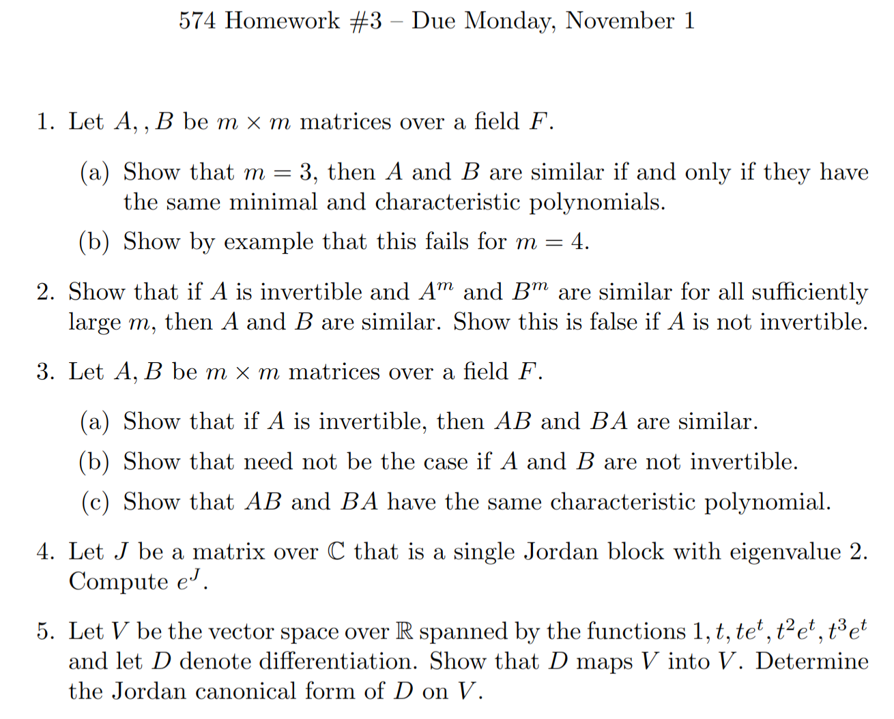

# MATH574 : Homework-3

 <b>1st November, 2021</b> 

<b>
Notes from MATH574: Applied Matrix Analysis (Prof. Robert Guralnick).</b>

---

**All Questions:**

**Solution-1:**
a) First we are going to prove the forward direction, i.e similar matrices have the same characteristics and minimal polynomials.

If $A$ and $B$ are similar, i.e $A \sim B$, then $A = PBP^{-1}$ for some invertible matrix $P$.

Let characteristic polynomials of $A$ and $B$ be $p_{A}$ and $p_{B}$

$$

	\begin{aligned}

		p_{A}(x) = \det(A - xI) = \det(PBP^{-1} - xI)  \\

		= \det(PBP^{-1} - xPIP^{-1}) \;\; \color{green} \because I \; commutes\color{black} \\
		= \det(P \; (B - xI) \; P)
		=\ det(P) \; \det(B - xI) \det(P^{-1}) \\
		= \det(B - xI) \\
		= p_{B}(x) \;\;\;\;\; _\blacksquare
	\end{aligned}
$$

Since charecteristic polyomials for similar matrices are the same, they have the same eigenvalues.

Let the minimal polynomials for $A$ and $B$ be $m_{A}$ and $m_{B}$.
We know that the the roots of the charecteristics polynomial and the minimal polynomial 
of a matrix are the same - i.e the eigenvalues are not only the roots of the charecteristics
polynomial but also the minimal polynomial.

