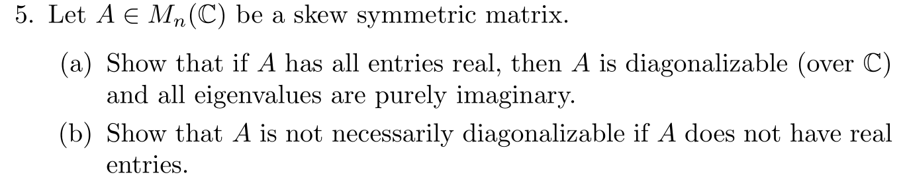

# MATH574 : Homework-4 (take home final)

 <b>1st December, 2021</b> 

<b>
Notes from MATH574: Applied Matrix Analysis (Prof. Robert Guralnick).</b>

---

Q1.

a) 

$L_A : \mathbb{F}^{n \times n} \rightarrow \mathbb{F}^{n \times n}$ is a linear transformation and hence we can write a matrix which represents this transformation when the input and output basis are selected.

$L_A(C) = AC$

Let the basis for $C \in \mathbb{F}^{n \times n}$ be of the form $e_i e_j^T \; \forall \; i,j \in \{ 1,2,3,...,n\}$, i.e we have all the entries zero except the $(i,j)$ entry which is $1$.

Let us think of a simple caase of $n = 3$ for understanding. Let $A = \begin{bmatrix} \; a_1 & | &  a_2 & | &  a_3 \; \end{bmatrix}$ where $a_i$ are column vectors of shape $n \times 1$.

Now, the standard basis for $C \in \mathbb{F}^{3 \times 3}$ be -
$$
\begin{bmatrix}
	1 & 0 & 0 \\
	0 & 0 & 0 \\
	0 & 0 & 0 \\
\end{bmatrix},
\begin{bmatrix}
	0 & 0 & 0 \\
	1 & 0 & 0 \\
	0 & 0 & 0 \\
\end{bmatrix},
\begin{bmatrix}
	0 & 0 & 0 \\
	0 & 0 & 0 \\
	1 & 0 & 0 \\
\end{bmatrix}, \\ \; \\

\begin{bmatrix}
	0 & 1 & 0 \\
	0 & 0 & 0 \\
	0 & 0 & 0 \\
\end{bmatrix},
\begin{bmatrix}
	0 & 0 & 0 \\
	0 & 1 & 0 \\
	0 & 0 & 0 \\
\end{bmatrix},
\begin{bmatrix}
	0 & 0 & 0 \\
	0 & 0 & 0 \\
	0 & 1 & 0 \\
\end{bmatrix}, \\ \; \\

\begin{bmatrix}
	0 & 0 & 1 \\
	0 & 0 & 0 \\
	0 & 0 & 0 \\
\end{bmatrix},
\begin{bmatrix}
	0 & 0 & 0 \\
	0 & 0 & 1 \\
	0 & 0 & 0 \\
\end{bmatrix},
\begin{bmatrix}
	0 & 0 & 0 \\
	0 & 0 & 0 \\
	0 & 0 & 1 \\
\end{bmatrix}
$$

The corresponding outputs (in standard basis) when we plug the elements of the standard basis as input to $L_A$ one by one are - 

$$

	\begin{bmatrix}
		\; a_1 & | & 0 & | & 0 \; 
	\end{bmatrix},

	\begin{bmatrix}
	 		\; a_2 & | & 0 & | & 0 \; 
	\end{bmatrix},
	
	\begin{bmatrix}
	 	 	\; a_3 & | & 0 & | & 0 \; 
	\end{bmatrix}, \\ \; \\

	\begin{bmatrix}
		\; 0 & | & a_1 & | & 0 \; 
	\end{bmatrix},
	\begin{bmatrix}
		\; 0 & | & a_2 & | & 0 \; 
	\end{bmatrix},
	\begin{bmatrix}
		\; 0 & | & a_3 & | & 0 \; 
	\end{bmatrix}, \\ \; \\

	\begin{bmatrix}
		\; 0 & | & 0 & | & a_1 \; 
	\end{bmatrix},
	\begin{bmatrix}
		\; 0 & | & 0 & | & a_2 \; 
	\end{bmatrix},
	\begin{bmatrix}
		\; 0 & | & 0 & | & a_3 \; 
	\end{bmatrix}	 	 
$$

Since any linear transform can be represented in the form of a matrix, we would like to write this matrix representation for the above input-ooutput bases we have chosen. We can do this by using a vector representation of the input and output matrices. This can be done by the [vectorization operator](https://en.wikipedia.org/wiki/Vectorization_(mathematics)) which stacks the $n \times 1$ shaped columns of a $n \times m$ matrix to give a $mn \times 1$ column vector. 

Hence, the input basis respresented as vectors become - 
$$
	\begin{bmatrix}
			1 \\ 0 \\ 0 \\ \\ 0 \\ 0 \\ 0 \\ \\ 0 \\ 0 \\ 0
	 \end{bmatrix},

	 \begin{bmatrix}
	 		0 \\ 1 \\ 0 \\ \\ 0 \\ 0 \\ 0 \\ \\ 0 \\ 0 \\ 0
	 \end{bmatrix},
	 
	 \begin{bmatrix}
	 		0 \\ 0 \\ 1 \\ \\ 0 \\ 0 \\ 0 \\ \\ 0 \\ 0 \\ 0
	 \end{bmatrix},

	 \;\;\;\;\;
	 
	 \begin{bmatrix}
	 		0 \\ 0 \\ 0 \\ \\ 1 \\ 0 \\ 0 \\ \\ 0 \\ 0 \\ 0
	 \end{bmatrix},

	 \begin{bmatrix}
	 		0 \\ 0 \\ 0 \\ \\ 0 \\ 1 \\ 0 \\ \\ 0 \\ 0 \\ 0
	 \end{bmatrix},	

	 \begin{bmatrix}
	 		0 \\ 0 \\ 0 \\ \\ 0 \\ 0 \\ 1 \\ \\ 0 \\ 0 \\ 0
	 \end{bmatrix},	

	 \;\;\;\;\;

	 \begin{bmatrix}
	 		0 \\ 0 \\ 0 \\ \\ 0 \\ 0 \\ 0 \\ \\ 1 \\ 0 \\ 0
	 \end{bmatrix},

	 \begin{bmatrix}
	 		0 \\ 0 \\ 0 \\ \\ 0 \\ 0 \\ 0 \\ \\ 0 \\ 1 \\ 0
	 \end{bmatrix},	

	 \begin{bmatrix}
	 		0 \\ 0 \\ 0 \\ \\ 0 \\ 0 \\ 0 \\ \\ 0 \\ 0 \\ 1
	 \end{bmatrix}
	
$$

Clearly, the above represent the standard basis {$e_1,e_2,...,e_9$} for $\mathbb{F}^{9}$.

Now, the outputs in the vector representation (using the vectorization operator) are given by - 

$$

	\begin{bmatrix}
			a_1 \\ -  \\ 0 \\ - \\ 0
	\end{bmatrix},
	
	\begin{bmatrix}
			a_2 \\ - \\ 0 \\ - \\ 0
	\end{bmatrix},

	\begin{bmatrix}
			a_3 \\ - \\ 0 \\ - \\ 0
	\end{bmatrix},

	\;\;\;\;

	\begin{bmatrix}
			0 \\ - \\ a_1 \\ - \\ 0
	\end{bmatrix},
	
	\begin{bmatrix}
			0 \\ - \\ a_2 \\ - \\ 0
	\end{bmatrix},

	\begin{bmatrix}
			0 \\ - \\ a_3 \\ - \\ 0
	\end{bmatrix},

	\;\;\;\;

	\begin{bmatrix}
			0 \\ - \\ 0 \\ - \\ a_1
	\end{bmatrix},
	
	\begin{bmatrix}
			0 \\ - \\ 0 \\ - \\ a_2
	\end{bmatrix},

	\begin{bmatrix}
			0 \\ - \\ 0 \\ - \\ a_3
	\end{bmatrix}
	
$$

Since the representation $\phi_{L}$ of a linear transformation $L$ in a given ordered input-output basis is essentially the matrix whose columns are the representations of the output (in the output basis) when we plug in the elements of the ordered input basis (represented in the input basis itself and hence are the elements e_1, e_2, ...,e_n ,   i.e the standard basis vectors) into $L$, we have - 

$$
	\phi_{L_A} = 

	\begin{bmatrix}

		\; a_1 & | &  a_2 & | & a_3 & \bigg| &  0 & | & 0 & | & 0 & \bigg| & 0 & | & 0 & | & 0 \;  \\

	 - & - & - & - & -  &\cdot& - & - & - & - & - &\cdot& - & - & - & -  & - \\
				\; 0 & | &  0 & | & 0 & \bigg| &  a_1 & | & a_2 & | & a_3 & \bigg| & 0 & | & 0 & | & 0 \;  \\

	 - & - & - & - & -  &\cdot& - & - & - & - & - &\cdot& - & - & - & -  & - \\

				\; 0 & | &  0 & | & 0 & \bigg| &  0 & | & 0 & | & 0 & \bigg| & a_1 & | & a_2 & | & a_3 \;  

	\end{bmatrix} 

	\\ \; \\

	= \begin{bmatrix}
		A & | & 0 & | & 0 \\
		- & \cdot & - & \cdot  & - \\
		0 & | & A & | & 0 \\
		- & \cdot  & - & \cdot  & - \\
		0 & | & 0 & | & A \\
	\end{bmatrix} 

	\\ \; \\

	= I_{n \times n} \otimes A 
	\; \;  \color{darkgreen} [ \otimes \; \rightarrow Kronecker \; Product ] \color{black}
	
$$

Just to summarize, the output $L_A(C)$ for any matrix $C$ can them be written as -

$$
	vectorize(L_A(C)) = \phi_{L_A} \;  vectorize(C)  
$$

The above is an interesting use of [Kronecker Product](https://en.wikipedia.org/wiki/Kronecker_product) to capture the linearity operation of a matrix operating on another matrix (which is then treated as a vector by using [vectorize operator](https://en.wikipedia.org/wiki/Vectorization_(mathematics))).

> The following is taken from the wikipedia page called [Vectorization](https://en.wikipedia.org/wiki/Vectorization_(mathematics)).
 
 
Now, the question wants us to compare the characteristics and minimal polynomial of the matrix $\phi_{L_A}$ with that of the matrix $L_A$ and see if there is any relation.

Clearly, the matrix $\phi_{L_A}$ is block diagonal with the diagonal blocks being equal to $A$. 

We know that the determinant of a block diagonal matrix (diagonal blocks are square matrices) is the product of the determinants of the diagonal blocks. The proof can be found [here](https://proofwiki.org/wiki/Determinant_of_Block_Diagonal_Matrix). 

Hence,

$$
	\phi_{L_A} - \lambda I_{9\times9} \\ \; \\
	
	=  \begin{bmatrix}
		A & | & 0 & | & 0 \\
		- & \cdot & - & \cdot  & - \\
		0 & | & A & | & 0 \\
		- & \cdot  & - & \cdot  & - \\
		0 & | & 0 & | & A \\
	\end{bmatrix}
	 
	- \lambda
	
	\begin{bmatrix}
		I_{3\times3} & | & 0 & | & 0 \\
		- & \cdot & - & \cdot  & - \\
		0 & | & I_{3\times3} & | & 0 \\
		- & \cdot  & - & \cdot  & - \\
		0 & | & 0 & | & I_{3\times3} \\
	\end{bmatrix}  \\ \; \\
	
	=  \begin{bmatrix}
		A & | & 0 & | & 0 \\
		- & \cdot & - & \cdot  & - \\
		0 & | & A & | & 0 \\
		- & \cdot  & - & \cdot  & - \\
		0 & | & 0 & | & A \\
	\end{bmatrix}
	 
	- 
	
	\begin{bmatrix}
		\lambda I_{3\times3} & | & 0 & | & 0 \\
		- & \cdot & - & \cdot  & - \\
		0 & | & \lambda I_{3\times3} & | & 0 \\
		- & \cdot  & - & \cdot  & - \\
		0 & | & 0 & | & \lambda I_{3\times3} \\
	\end{bmatrix} \\ \; \\

		
	=  \begin{bmatrix}
		A - I_{3\times3}& | & 0 & | & 0 \\
		- & \cdot & - & \cdot  & - \\
		0 & | & A - I_{3\times3}& | & 0 \\
		- & \cdot  & - & \cdot  & - \\
		0 & | & 0 & | & A - I_{3\times3} \\
	\end{bmatrix}

	\\ \; \\

	\implies \det(\phi_{L_A} - \lambda I_{9\times9}) = det(A - I_{3\times3}) \cdot  det(A - I_{3\times3}) \cdot  det(A - I_{3\times3}) 

	\\ \; \\

	\implies \det(\phi_{L_A} - I_{9 \times 9}) = det(A - I_{3\times 3})^3 

	\\ \; \\

	\implies charpoly(\phi_{L_A}) = charpoly(A)^3
$$

By generalizing from $n=3$ to arbitrary $n$, we find the following - 

$$
	charpoly(\phi_{L_A}) = charpoly(A)^n
$$

Now, let us observe a few things - 

Lemma 1: Let matrix $B$ of shape $n^2 \times n^2$ be a block diagonal matrix with blocks of matrices $A_i$ of shape $n \times n$ for $ i \in \{ 1,2,...n\}$. Let $f(x)$ be a polynomial. Then f(B) is the block diagonal matrix whose blocks are $f(A_i)$ for $i \in \{ 1,2,3,...,n\}$. 

Proof - 		
Since we can multiply matrices block wise, the proof is essentially the same as polynomial of a diagonal matrix being the diagonal matrix whose diagonals are the polynomials of the diagonal entries of the original matrix.  

Corollary 1:
Let $B = I_{n\times n} \otimes A$. Let $f(x)$ be a polynomial. Then $f(B) = I_{n \times n} \otimes f(A) $.

We know from above that $\phi_{L_A} = I_{n \times n} \otimes A$. Let $g(x)$ be the minimal polynomial of $A$ such that $g(A) = 0_{n \times n}$.

Using the above corrollary, 
$$
	g(\phi_{L_A}) = I_{n \times n} \otimes g(A) = I_{n \times n} \otimes 0_{n \times n} = 0_{n^2 \times n^2}  

$$

Hence, the minimal polynomial of $A$ annihilates $\phi_{L_A}$.  

Now we want to see if there is an $f(x)$ such that $f(\phi_{L_A}) = 0_{n^2 \times n^2}$ and $degree(f) < degree(g)$.

We will prove that the set of annihilating polynomials of $\phi_{L_A}$ and $A$ are the same, i.e $h(x)$ annihilates $A \implies$ $h(x)$ annihilates $\phi_{L_A}$.
 

Let's prove one direction - 

$$
 0_{n^2 \times n^2} = f(\phi_{L_A}) \\
 \implies 0_{n^2 \times n^2} =  I_{n \times n } \otimes f(A)

\\ \; \\
\implies  0_{n^2 \times n^2} = \begin{bmatrix} 
	f(A) & | & 0    & | & . & . & ... \\
	- &    | & -  &   | &  \\
	0    & | & f(A) & | & . & . & ... \\
	.    & | & .    & | & . & . & ... \\
	.    & | & .    & | & . & . & ... \\
	.    & | & .    & | & . & . & ... \\
\end{bmatrix} 

\\ \; \\

\implies 0_{n \times n} = f(A)

$$

Let's prove the other direction - 
$$
	f(A) = 0_{n \times n} \\ \; \\

	\implies I_{n \times n} \otimes f(A) = I_{n \times n} \otimes 0_{n \times n} = 0_{n^2 \times n^2} \\ \; \\
	
	\implies f(\phi_{L_A}) = 0_{n^2 \times n^2}   
$$

So we have proved that the set of the annihilating polynomials of $A$ and $\phi_{L_A}$ are the same. 

Hence the monic polynomial with the smallest degree is the same for both of them.   

Hence,  
$$
	minpoly(\phi_{L_A}) = minpoly(A)
$$

b) 

Reference - [Sylvester's Equation](https://en.wikipedia.org/wiki/Sylvester_equation)

Above, we found that the representation of $L_A(C) = AC$ is $\phi_{L_A} = I_{n \times n} \otimes A$. Similarly we can verify that the representation of $R_B(C) = CB$ is $\phi_{R_B} = B^T \otimes I_{n \times n}$.

Let the map be $G_{AB}(X) = AX - XB$. 
The representation $ \phi_{G_{AB}}$ is given by $I_n \otimes A - B^T \otimes I_n$.

$G_{AB}$ is non-invertible if for some non-zero X, $G_{AB}(X)=0 $ 

$$
 G_{AB}(X) = 0 \\
 \implies G_{AB}(X) = AX - XB = 0 \\
 \implies AX = XB
$$

By induction, 
$$
	A^k X = X B^k
$$

Q2.

$$
N = \begin{bmatrix}
	0 & m_1 & 0 & 0 & 0 \\
	0 & 0 & m_2 & 0 & 0 \\
	0 & 0 & 0 & m_3 & 0 \\
	0 & 0 & 0 & 0 & m_4 \\
	0 & 0 & 0 & 0 & 0 \\
\end{bmatrix}

\\ \; \\

\sum_{i=1}^{n-1}{m_i \; e_i \; \; e_{i+1}^T }
$$

Hence, $ N e_{k+1} = m_k e_k $

Hence,

$$
	N^2 = \sum_{i=1}^{n-1} m_i e_i e_{i+1}^T  \; \sum_{j=1}^{n-1} m_j e_j e_{j+1}^T \\
	
	= \sum_{i=2}^{n-1} { (m_{i} e_i e_{i+1}^T) \; (m_{i+1} e_{i+1} e_{i+2}^T) } \color{darkred} \;\;\; \because e_i^T e_j = 0 \; when \; i \neq j  \color{black} \\
	
	= \sum_{i=2}^{n-1}{m_i m_{i+1} \;\;  e_i \;\; (e_{i+1}^T e_{i+1}) \;\; e_{i+2}^T  }\\

	= \sum_{i=2}^{n-1}{m_i m_{i+1}e_i  e_{i+2}^T } 
$$

And hence by induction, 

$$
	N^k = \sum_{i=k}^{n-1}{\;\bigg(\prod_{i}^{i+k-1}{m_i} \bigg)  e_i e_{i+k}^T}
$$

Clearly after $k=n-1$, we have $N^k = 0$. Hence $N$ is nilpotent.

b) $N$ is similar to a single Jordan block when all the $m_i$ are equal. This is because a single Jordan block has $1s$ on the diagonal above the main diagonal and we can get this block if all $m_i = m$ so that we can factor out $m$ from the block.

Q3.

a) Let $\vec{v_1}$ be of unit norm {norm, as defined by ||.||} eigenvector corresponding to the largest eigenvalue $\lambda_1 = \rho(A)$ so that $Av_1 = \lambda_1 v_1$. Note that any eigenvector corresponding to $\lambda_1$ can be scaled to obtain a vector of unit norm (according to $||.||$) which we call as $v_1$.

If $S =  \{ v \;\;\; |  \;\;\; || v || = 1 \}$, then clearly $v_1 \in S$. Let $R = \{ v_1 \}$ be a singleton.

Since $v_1$ is contained in $S$, we expect $\max \{||Av|| \;\;\; | \;\;\; v \in S \} \geq ||Av_1||$. This is because in the extended domain $S$, we expect to find an optimiser atleast as good as in the limited set $R$.

Hence, 

$$
	|||  A  ||| = \max \{ || Av || \;\;\; | \;\;\; v \in S \} \geq || Av_1 || = || \lambda_1 v_1 || \\
	= \lambda_1 \color{darkred} || v_1 || \color{black} \;\; (  \color{green} \; \because norm \; is \; linear \color{black}) \\
	= \lambda_1 \color{darkred}1 \color{black}\\
	= \lambda_1  

	\\ \; \\

	\implies ||| A ||| \geq \lambda_1 = \rho(A) \;\;\; _\blacksquare
$$

b)

c) This is almost same as a) but we need to show that $\forall \; \epsilon > 0\;,\; \rho(A) + \epsilon > ||| A |||$ for some operator norm $|||.|||$, we have $|||A||| < \rho(A) + \epsilon$.

Let us consider a real symmetric matrix $A$.
We know that the largest singular value of the matrix $A$ is given by the operator norm of A w.r.t to the $L_2$ vector norm, i.e $\sigma_1 = \max \{ || Av || \;\; | \;\;  ||v||=1 \}$

We can also show that the eigenvalues of the matrix are the same as the singular values in magnitude and hence the largest eigenvalue is the same as the largest singular value in magnitude.

Hence we have,

$$
	||| A ||| =  \sigma_1  =   = | \lambda_1 | \\
	\implies ||| A ||| = \sigma_1 < |\lambda_1| + \epsilon \\
	\implies ||| A ||| < |\lambda_1| + \epsilon \; \forall \; \epsilon > 0 

	\\ \; \\

	\implies ||| A ||| < \rho(A) + \epsilon	 
$$

Hence $\rho(A)$ is the largest real number $a$ such that no norm exist such that $||| A ||| < a$, i.e $||| A ||| \geq a$.

-----------------------------------------

Q4. 

a) We know A is positive definite, hence for any non-zero $\vec{x}$, we have -
$$
	x^* A x > 0
$$

Some useful Lemma's

**Lemma 1A: Unitary Similarity transform preserves Positive definiteness**

We also know that positive definiteness does not change under unitary similarity transform, i.e if $U$ is an orthonormal matrix such that $U^*U = I = UU^*$, then $B = U^{-1} A U = U^* A U$ is positive definite as well.

Proof - 
For any non-zero $\vec{y}$, we have
$$
	y^* B y =   y^* U^* A U y = (Uy)^* A (Uy) = x^* A x > 0
$$
where $\vec{x} = U \vec{y}$ is non-zero as $U$ is invertible and $\vec{x}$ is non-zero.

**Lemma 1B: Similarity transform preserves positive definiteness.**

This can be easily seen because similarity transform preserves eigenvalues and since all eigenvalues being positive means positive definite, positive definiteness is preserved.

The eigenvalues of $A$ are the roots of $det(A - \lambda I)$.

Let $B = R^{-1}AR$.
Proof that eigenvalues are preserved in similarity trasnformation - 

$$
	B - \lambda I  = R^{-1}AR - \lambda I \\
	=  R^{-1} A R - \lambda R^{-1} I R \\
	= R^{-1}(A - \lambda I) R 

	\\ \; \\
	
	\implies det(B - \lambda I) = \color{darkred} \; det(R^{-1}) \; \color{green} det(A - \lambda I) \color{darkred} \;det (R) \\

	\color{black}
	\\ \; \\
	\implies det(B - \lambda I) = \color{green}det( A - \lambda I ) 
		
$$ 

Since the characteristics polynomials of A and B are the same, so are the roots and hence the eigenvalues.

Now, we claim that any principal minor of $A$ can be converted into the leading principal minor of a matrix C, i.e the top-left corner block of $C$ of size $d \times d$. This can be achieved by a suitable permutation matrix $P$ (all permutation matrices are unitary) as $C = P^TAP$. Since unitary similarity preserves positive definiteness, $A$ is positive definite $\iff$ $C$ is positive definite.

We know that $C$ is an $n \times n$ definite matrix and hence $x^T C x > 0 \; \forall \; x \neq 0$. Let us make the last $n - d$ entries of the length $n$ vector $\vec{x}$ zero and copy the first $d$ entries to form $\vec{y}$ of length $d$.

Now, we can easily see that $x^T C x = y^T B y$ and hence $y^T B y > 0$.

We could have proved this without introducing the permutation matrix $P$ and the matrix $C$. This can be done by the following construction - 

Let $B$ be a $d \times d$ principal subminor block matrix such that the rows and columns at the indices $i_1, i_2, ... i_d$ that correspond to the entries selected in the principal minor with respect to the matrix $A$. We know that length $n$ vectors $\vec{x}  \neq 0$, we have $x^T A x > 0$. Now let us suppress all the entries in $\vec{x}$ at the indices not in ${i_1, i_2, i_3, ... i_d }$ by making those entries 0. Now let us construct the vector $\vec{z}$ of length $d$ by taking the entries of $\vec{x}$ at the indices $i_1, i_2, ... i_d$. 

Thus, in block form, $x = [ z \;\;\;0]^T$.
Also in block form - 

$$
	A = \begin{bmatrix}
		B & G \\
		G^T & H
	\end{bmatrix}
$$

For this construction, clearly, $ x^T A x = z^T B z$ and hence $z^T B z > 0$ which shows that $B$ is definite.

$$
	x^T A x = [z \;\; 0] \begin{bmatrix}
		B & G \\
		G^T & H
	\end{bmatrix} \begin{bmatrix} z \\ 0 \end{bmatrix} 
	= z^T B z 
$$

Now, let's show that $B$ has largest eigenvalue $\leq \lambda_1$.

We know that $\lambda_1 = \max \frac{x^T A x}{x^Tx}$.
Also, if $\alpha_1$ is the largest eigenvalue of $B$, then $\alpha_1 = \max \frac{z^T B z}{z^T z}$.

Let us take the $d$ dimensional hypersphere such that $|z|^2 = z^T z = 1 $. Now, let us construct the vector $\vec{w}$ similar to our previous construction, i.e copy the entries of $\vec{z}$ into $\vec{w}$ at the corresponding indices $i_1, i_2, i_3, ..., i_d$ and all the other indices being filled with value 0. So in this construction, $|w|^2 = w^T w = z^T z = 1$. 

Let $\vec{x}$ be any arbitrary vector. Since $\vec{w}$ is a special subset with a certain structure/constraint of the arbitrary vectors $\vec{x}$, we must have - 
$$
\max \frac{w^T A w}{w^T w} \leq \max \frac{x^T A x}{x^T x} = \lambda_1
$$
This is basically saying that if the domain of optimisation is extended, we cannot find a worse optimisation than in the original domain since we can always select the best optimizer in the original domain when domain is extended.

So under this construction of $w$ from $z$, we have - 

$$
 \frac{z^T B z}{z^T z} = \frac{w^T A w}{w^T w}

 \\ \; \\

 \implies \color{green} \max \frac{z^T B z}{z^Tz} \color{black} = \max \frac{w^T A w}{w^T w} \leq \color{darkred} \max \frac{x^T A x}{x^Tx} \color{black}

 \\ \; \\
 
 \implies \color{green} \alpha_1 \leq \color{darkred}\lambda_1 \;\;\; \color{black}_\blacksquare
$$

b) I will invoke the $\color{darkred}interlacing \; theorem$ here which states that if $A \in \mathbf{R}^{n \times n}$ is symmetric and $B \in \mathbf{R}^{m \times m}$ is a principal minor of $A$, then the eigenvalues $\lambda_1, \lambda_2, ..., \lambda{n}$ of $A$ and $\beta_1, \beta_2,...\beta_{n-1}$ of $B$ in increasing orders, then th follow the interlacing holds - 
$$
	\lambda_k \leq \beta_k \leq \lambda_{k + n - m}  
$$
A proof for this can be found [here.](https://people.orie.cornell.edu/dpw/orie6334/Fall2016/lecture4.pdf)

Now, for $m = n - 1$, we have
$$
	\lambda_k \leq \beta_k \leq \lambda_{k + 1}  
$$
 
Hence, for the largest eigenvalue $\beta_{n-1}$ of $B$, we have $ \lambda_{n-1} \leq \beta_{n-1} \leq \lambda_n $.

Since in our question the indexing is in decreasing order(i.e the largest eigenvalues are $\lambda_1$ and $\beta_1$), we have - 
 $$ \lambda_2 \leq \beta_{1} \leq \lambda_1 \;\;\; _\blacksquare$$ 

----------------------------------------------------------
Q5.

Properties of a Skew Symmetric Matrix A of shape n x n - 

$$
	A + A^T = 0 \; (by \; definition.) \; - eq(1)
$$

$$
	det(A) = 0 \iff n = odd
$$

Proof -

$$
	\begin{aligned} 
	\\
	
	det(A^T) = det(A) \; \color{green} (property \; of \; det)\\
	\implies det(-A) = det(A) \\
	\implies (-1)^n det(A) = det(A) \; \color{green} (\because det(kA) = k^n det(A)) \\
	\implies - det(A) = det(A) \\
	\implies det(A) = 0

	\end{aligned}
$$

Other useful facts for any matrix B - 

$$
	e^B = I + B + \frac{B^2}{2!} + \frac{B^3}{3!} + . . . = \sum_{i=0}^{\infty} \frac{B^n}{n!}
$$

$$

	(e^B)^T = I + B^T + \frac{(B^T)^2}{2!} + \frac{(B^T)^3}{3!} + . . . = \sum_{i=0}^{\infty} \frac{(B^T)^n}{n!}  = e^{B^T} \\

	\implies \color{blue} (e^B)^T = e^{B^T} \; \color{black} - eq(2)
$$

Properties of orthogonal(Q)/unitary(U) matrix

$$
	\color{brown} U^T U = I \color{black} \; (by \; def.) \\
	\implies  U^T (U^T U) = U^T I = U^T \\
	\implies U^T (U^T U) U = U^T U \\
	\implies U I U^T = U^T U = I \\
	\implies \color{brown}U U^T = I
$$

An orthonormal/unitary matrix is an isometry, i.e it conserves lengths when applied any vector.
Let $y = Ux$
$$
	|y|^2 = y^T y = (Ux)^T (Ux) = x^T U^T U x \\\;\\
	 =  x^T (U^TU) x = x^T I x = x^Tx = |x|^2 
	\\ \; \\
	
	\implies |y| = |x| \;\;\; _\blacksquare	  
$$

**Lemma 0:** The eigenvalues of a orthonormal/unitary matrix are always of magnitude 1, i.e lie on the unit circle in the Argand plane. Let $(\lambda , x )$ be an eigenvalue,eigenvector pair of the orthonormal/unitary matrix Q/U.

So we have  $Ux = \lambda x = y$

We know that $|y|=|x|$. So,
$$
	| y |^2 = | x |^2 \\ 
	\implies | \lambda x |^2 = |x|^2 \\
	\implies |\lambda|^2 |x|^2 = |x|^2 \\
	\implies ( |\lambda|^2 - 1 ) |x|^2 = 0 \\\;\\
	\implies   |\lambda|^2 - 1 = \frac{0}{|x|^2} = 0 \; \color{green} \\

	\because \; x \neq 0 \; as \; x \; is \; eigenvector \color{black} \\\;\\

	\implies |\lambda|^2 = 1 \\\;\\
	
	\implies |\lambda| = 1 \;\;\; _\blacksquare	
	
$$
 

Other useful facts - 

$$
	e^{\alpha}  e^{\beta} = e^{\alpha + \beta} \; if \; \alpha \; and \; \beta \; commute. 
$$

Let $( \color{darkred} \lambda,x \color{black})$ be the eigenvalue and eigenvector pair of a matrix $M$. Then $(\color{darkred} \lambda^t, x) \color{black}$ is an eigenvector, eigenvalue pair for the matrix $M^t$.

$$
	M^tx  = M^{t-1}Mx = M^{t-1}\lambda x =  \lambda M^{t-1}x = \lambda^2 M^{t-2}x = ... = \lambda^t x
$$

**Lemma 1:** The exponent of a real skew symmetric matrix A is an orthonormal matrix.

**Proof:** To show that any matrix Q is orthonormal, we need to show $Q^T Q = I = Q Q^T$ i.e $Q^{-1} = Q^T$.

$$
	\color{green} (e^A)^T (e^A) \color{black} = e^{A^T} (e^A) = e^{-A}(e^A) = e^{-A + A} = e^0 = \color{green}I \\\;\\
	\implies (e^A)^T (e^A) = I \\\;\\
	
	\implies e^A \; is \; orthonormal \;\;\; _\blacksquare 		\\\;\\
	\color{brown} \because \;A \;has\; real \;entries,\; so \;does \;e^A.
$$

Some facts about polynomials of matrices - 

**Lemma 2:** Let $f = a_0 + a_1 x + a_2 x^2 + ...$ be a polynomial. If $( \color{darkred} \lambda,x \color{black})$ is an eigenvalue,eigenvector pair of a matrix M, then $( \color{darkred} f(\lambda),x  \color{black})$ is an eigenvalue of $f(M)$

**Proof:**
$$
	\color{green} f(M) x \color{black} = (a_0 I + a_1 M + a_2 M^2 + ...) x \\
	= a_0 I x+ a_1 M x + a_2 M^2 x + ... \\
	= a_0 x + a_1 \lambda x + a_2 \lambda^2 x + ... \\
	= (a_0  + a_1 \lambda + a_2 \lambda^2 + ...) x \\
	= \color{green} f(\lambda) x \color{black}  
$$

**Lemma 3 (corollary of lemma 2):** Let $(\lambda, x)$ be eigenvalue, eigenvector pair for a matrix $M$. Then $(e^{\lambda}, x)$ is a eigenvalue, eigenvector pair for the matrix $e^M$.

**Proof:** 
$$
	e^z = 1 + z + \frac{z^2}{2!} + \frac{z^3}{3!} + ... = f_e(z) \; is \; a \; polynomial.

	\\\;\\

	So,\;  f_e(M) x = f_e (\lambda) x \; \color{green} (by \;Lemma 2) \color{black} \\\;\\
	e^M x = e^{\lambda} x \;\;\; _\blacksquare 
$$	

**Lemma 4:** Let $f(x) = a_0 + a_1 x + a_2 x^2 + ...$ be a polynomial. If a matrix $M$ is diagonalizable as $M = PDP^{-1}$, then the matrix $f(M)$ is diagonalizable as $f(M) = P f(D) P^{-1}$.

**Proof 1:**  

Note that $M^k = M M ...M = PDP^{-1} \; PDP^{-1} \;... \; PDP^{-1} = P D^k P^{-1}$

$$
	f(M) = a_0 + a_1 M + a_2 M^2 + ... \\ \; \\
	= a_0 I + a_1 PDP^{-1} + a_2 PD^2P^{-1} + ...\\ \; \\
	= P(a_0  + a_1 D + a_2 D^2 + ...)P^{-1} \\ \; \\
	= P f(D) P^{-1} \;\;\; _\blacksquare
$$

**Proof 2:** 

Note that if $g(y) = b_0 + b_1 y + b_2 y^2 + ... $ and $D$ is a diagonal matrix such that $D_{ij} =  d_{ii} * \delta_{ij}$ where $\delta_{ij}$ is the [Kronecker delta](https://en.wikipedia.org/wiki/Kronecker_delta) function and $d_{ii}$ are the diagonal entries, then $E = g(D)$ is a matrix such that $E_{ij} = g(d_{ii}) * \delta_{ij}$. This is a result of the fact that the power of a diagonal matrix is the matrix with the entries (diagonal or otherwise, since the others are zero anyways) raised to that same power.

We know that in diagonalization of any matrix $M$ as $M=PDP^{-1}$, the P matrix contains the eigenvectors as columns and the D matrix has the corresponding eigenvalues in the diagonals. We also know from **Lemma 2** that for every eigenvalue, eigenvector pair $(\lambda, x)$ of $M$, we have $(f(\lambda),x)$ as an eigenvalue, eigenvector pair for $f(M)$. So the eigenvalues of $f(M)$ are $f(\lambda)$, while the eigenvectors do not change. So to construct the diagonalization of $f(M)$ as $f(M) = R C R^{-1}$, we put the same eigenvectors x on the columns of R and $f(\lambda)$ on the diagonals of C. So $R = P$ and $C = f(D) \; \color{brown}(see \; above \; note)$.

 So, $ f(M) = RCR^{-1} = P f(D) P^{-1}$

**Lemma 5 (corollary of lemma 4):** If M is diagonalizable as $PDP^{-1}$, then $e^M$ is diagonalizable as $P e^D P^{-1}$.
**Proof:**
Note that $e^y = 1 + y + \frac{y^2}{2!} + \frac{y^3}{3!} + ... = f_e(y)$ is a polynomial.

So, using **lemma 4**, 
$$
	e^M = f_e(M) = P f_e(D) P^{-1} = P e^D P^{-1}
	\\ \; \\
	\implies \color{green} e^M = P e^D P^{-1} \;\;\; _\blacksquare
$$

**Let's prove that if A is skew symmetric, then A is diagonalizable**

**Normal Matrices**
A matrix $B$ is called normal iff
$$
	B^*B = BB^*
$$

**Fact:**
> All normal matrices are diagonalizable 

Below, we show that if A is a real skew symmetric, it is normal too

$$
	A^*A = A^TA = -A^2 \\ \; \\

	AA^* = AA^T = A(-A) = -A^2 \\ \; \\

	\implies AA^* = A^*A
$$

**Now we show that if the skew symmetric matrix is diagonalizable, then its eigenvalues are all purely imaginary.**

If A is diagonalizable, $A = WTW^{-1}$ where T is diagonal with the eigenvalues of A.

We also know that $e^A = Q$ where $Q$ is orthonormal by **lemma 1**.

Using **lemma 5**, $ e^A = W \mathbf{e^T} W^{-1} = W \mathbf{E} W^{-1}$ where $\color{darkred} \mathbf{E = e^T}$ and is diagonal and contains the eigenvalues of Q which lie on the unit circle in the Argand plane making $E_{kk} = e^{i\theta} \; \color{red} (eq.1)$ for some $\theta$.

Since $T$ is diagonal, $E = e^T \implies E_{kk} = e^{T_{kk}}  \color{red} \; (eq. 2)$.

From $\color{red} eq.1$ and $\color{red} eq.2$
$$
	 		E_{kk} = e^{i\theta} = e^{T_{kk}} \\\;\\

	 		\implies T_{kk}
	 		 = i \theta \;\;\; _\blacksquare
$$

Since $T_{kk}$ are the eigenvalues of $A$, $T_{kk} = i\theta$ for some $\theta$ means that they are all purely imaginary except when $\theta = 0$ which is when it is both purely imaginary and real. $\; _\blacksquare$

**Alternate short proof**

$$
	A + A^* =A + A^T =  0 \;\;\; \color{green} (by \; def. \; of \; real \; skew \; symmetric) \color{black} \\ \; \\
	\implies	v^* (A + A^*) v = 0 \\
	\implies v^*Av + v^*A^*v = 0 \\
	\implies v^*Av + (Av)^*v = 0 \\
	\;\\

	\implies v^*  \lambda v + (\lambda v)^* v = 0 \\
	\implies \lambda v^*v + \overline \lambda v^*v = 0 \\\;\\
	\implies ( \lambda + \overline \lambda) v^*v = 0 \\ \; \\
	\implies ( \lambda + \overline \lambda) |v|^2 = 0 \\ \; \\

	\implies \lambda + \overline \lambda = 0 \; \; (\color{green} \because \; v \neq 0 \color{black} ) 
	\\
	\implies Re(\lambda) = 0 \;\;\; _\blacksquare
$$

----------------------------------------------------------

###### HW4 : PART2

>1. $\color{lightgreen}TRUE$

>2. $\color{darkred}FALSE$

>3. $\color{lightgreen} TRUE\\$
Reason: Let $B$ be the $2 \times 2$ matrix. Since trace is zero, hence $\lambda_1 + \lambda_2 = 0$. Similarly as it is rank one, one of the eigenvalues is zero, WLOG $\lambda_1 = 0$. Hence $\lambda_2 = 0$. Since $\lambda_1 = 0 = \lambda_2$, the characteristics function must be $\lambda^2 = 0$. By Cayley-Hamilton theorem, $B^2 = 0$. Hence $B$ is nilpotent. Now, let us consider the other direction. If $B$ is nilpotent, then $B^k = 0$ for some $k>0$. Hence the eigenvalues of $B^k$ are $\alpha_1 = 0 = \alpha_2$. Let $\lambda_1$ and $\lambda_2$ be the eigenvalues of the matrix $B$. We know that $\lambda_i^k = \alpha_i$ or $\lambda_i = \alpha_i^{\frac{1}{k}}$ for $i = {1,2}$. Hence $\lambda_i = \alpha_i^{\frac{1}{k}} = 0^{\frac{1}{k}} = 0$. Hence $Tr(B) = \sum_{i}{\lambda_i} = 0$. Hence the trace and the determinant of all nilpotent matrices is zero. If we do not consider the trivial zero matrix as a nilpotent matrix, for determinant to be zero for a $2 \times 2$ matrix, it has to be less than rank 2 and hence has to be rank $1$ to be nilpotent (as rank 0 means the matrix is zero matrix). So the statement in the question is $\color{lightgreen}TRUE$.
 
>4. $\color{lightgreen}TRUE \\$
Reason: The matrix A is row stochastic and hence has row sum equal to 1. Hence $A \vec{1} = \vec{1}$ and $1$ is the largest eigenvector with the largest eigenvalue 1. So A^n converges to this eigenvector due to power iteration.

>5. $\color{darkred} FALSE \\$
> Reason: Lets take the example of $B = \begin{bmatrix} 0 & 1 \\ 1 & 0\end{bmatrix}$. Clearly the charecteristics function is $\lambda ^ 2 - 1$ and the eigenvalues are $+1$ and $-1$. We also know that we can purturb the eigenvalues of A to $\lambda + \epsilon$ by modifying A into $A + \epsilon I$. Since the above matrix is almost positive (but not quite), we purturb it by $B + \epsilon I $ so that $0 < \epsilon < 1$ making it positive but the eigenvalues $-1 + e$ which is still negative.

>6. $\color{lightgreen} TRUE$

>7. $\color{lightgreen} TRUE$

>8. $\color{lightgreen} TRUE \\$
> Reason: The dimension of a complex matrix C of shape $n \times n$ is $2n^2$. This is because we can completely describe $C$ as $C =  A + iB$ where $A$ and $B$ are both real matrices of shape $n \times n$. Since $C$ is Hermitian, hence$$
	C^* = C \\
	\implies (A + iB)^* = A + iB \\
	\implies A^* + (iB)^* = A + iB \\
	\implies A^* + (i)^*B^* = A + iB \\
	\implies A^T + (-i)B^T = A + iB \\
	\implies A^T + i(-B^T) = A + iB \\
	\implies A^T = A , B^T = -B	\\
	\color{green} \because \; complex \; and \; imaginary \; parts \; must \; match \; entrywise
$$ 
So $A$ is real symmetric and $B$ is real skew-symmetric.
We know that symmetric matrix have dimension $\frac{n(n+1)}{2}$ and skew-symmetric matrices have dimension $\frac{n(n-1)}{2}$ which add up to $\frac{n^2}{2}$.

>9. $\color{lightgreen} TRUE \\$
$ B^* = (\overline{B})^T  = (B)^T = B^T$ as $\overline{B} = B$ since $B$ is real.

>10. $\color{lightgreen} TRUE \\$
> Because of "field extension".

