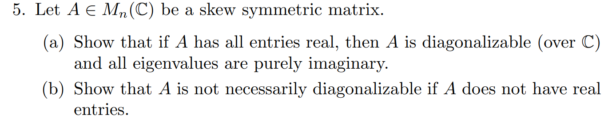

# MATH574 : Homework-3

 <b>1st December, 2021</b> 

<b>
Notes from MATH574: Applied Matrix Analysis (Prof. Robert Guralnick).</b>

---

Q5.

Properties of a Skew Symmetric Matrix A of shape n x n - 

$$
	A + A^T = 0 \; (by \; definition.) \; - eq(1)
$$

$$
	det(A) = 0 \iff n = odd
$$

Proof -

$$
	\begin{aligned} 
	\\
	
	det(A^T) = det(A) \; \color{green} (property \; of \; det)\\
	\implies det(-A) = det(A) \\
	\implies (-1)^n det(A) = det(A) \; \color{green} (\because det(kA) = k^n det(A)) \\
	\implies - det(A) = det(A) \\
	\implies det(A) = 0

	\end{aligned}
$$

Other useful facts for any matrix B - 

$$
	e^B = I + B + \frac{B^2}{2!} + \frac{B^3}{3!} + . . . = \sum_{i=0}^{\infty} \frac{B^n}{n!}
$$

$$

	(e^B)^T = I + B^T + \frac{(B^T)^2}{2!} + \frac{(B^T)^3}{3!} + . . . = \sum_{i=0}^{\infty} \frac{(B^T)^n}{n!}  = e^{B^T} \\

	\implies \color{blue} (e^B)^T = e^{B^T} \; \color{black} - eq(2)
$$

Properties of orthogonal(Q)/unitary(U) matrix

$$
	\color{brown} U^T U = I \color{black} \; (by \; def.) \\
	\implies  U^T (U^T U) = U^T I = U^T \\
	\implies U^T (U^T U) U = U^T U \\
	\implies U I U^T = U^T U = I \\
	\implies \color{brown}U U^T = I
$$

An orthonormal/unitary matrix is an isometry, i.e it conserves lengths when applied any vector.
Let $y = Ux$
$$
	|y|^2 = y^T y = (Ux)^T (Ux) = x^T U^T U x \\\;\\
	 =  x^T (U^TU) x = x^T I x = x^Tx = |x|^2 
	\\ \; \\
	
	\implies |y| = |x| \;\;\; _\blacksquare	  
$$

**Lemma 0:** The eigenvalues of a orthonormal/unitary matrix are always of magnitude 1, i.e lie on the unit circle in the Argand plane. Let $(\lambda , x )$ be an eigenvalue,eigenvector pair of the orthonormal/unitary matrix Q/U.

So we have  $Ux = \lambda x = y$

We know that $|y|=|x|$. So,
$$
	| y |^2 = | x |^2 \\ 
	\implies | \lambda x |^2 = |x|^2 \\
	\implies |\lambda|^2 |x|^2 = |x|^2 \\
	\implies ( |\lambda|^2 - 1 ) |x|^2 = 0 \\\;\\
	\implies   |\lambda|^2 - 1 = \frac{0}{|x|^2} = 0 \; \color{green} \\

	\because \; x \neq 0 \; as \; x \; is \; eigenvector \color{black} \\\;\\

	\implies |\lambda|^2 = 1 \\\;\\
	
	\implies |\lambda| = 1 \;\;\; _\blacksquare	
	
$$
 

Other useful facts - 

$$
	e^{\alpha}  e^{\beta} = e^{\alpha + \beta} \; if \; \alpha \; and \; \beta \; commute. 
$$

Let $( \color{darkred} \lambda,x \color{black})$ be the eigenvalue and eigenvector pair of a matrix $M$. Then $(\color{darkred} \lambda^t, x) \color{black}$ is an eigenvector, eigenvalue pair for the matrix $M^t$.

$$
	M^tx  = M^{t-1}Mx = M^{t-1}\lambda x =  \lambda M^{t-1}x = \lambda^2 M^{t-2}x = ... = \lambda^t x
$$

**Lemma 1:** The exponent of a real skew symmetric matrix A is an orthonormal matrix.

**Proof:** To show that any matrix Q is orthonormal, we need to show $Q^T Q = I = Q Q^T$ i.e $Q^{-1} = Q^T$.

$$
	\color{green} (e^A)^T (e^A) \color{black} = e^{A^T} (e^A) = e^{-A}(e^A) = e^{-A + A} = e^0 = \color{green}I \\\;\\
	\implies (e^A)^T (e^A) = I \\\;\\
	
	\implies e^A \; is \; orthonormal \;\;\; _\blacksquare 		\\\;\\
	\color{brown} \because \;A \;has\; real \;entries,\; so \;does \;e^A.
$$

Some facts about polynomials of matrices - 

**Lemma 2:** Let $f = a_0 + a_1 x + a_2 x^2 + ...$ be a polynomial. If $( \color{darkred} \lambda,x \color{black})$ is an eigenvalue,eigenvector pair of a matrix M, then $( \color{darkred} f(\lambda),x  \color{black})$ is an eigenvalue of $f(M)$

**Proof:**
$$
	\color{green} f(M) x \color{black} = (a_0 I + a_1 M + a_2 M^2 + ...) x \\
	= a_0 I x+ a_1 M x + a_2 M^2 x + ... \\
	= a_0 x + a_1 \lambda x + a_2 \lambda^2 x + ... \\
	= (a_0  + a_1 \lambda + a_2 \lambda^2 + ...) x \\
	= \color{green} f(\lambda) x \color{black}  
$$

**Lemma 3 (corollary of lemma 2):** Let $(\lambda, x)$ be eigenvalue, eigenvector pair for a matrix $M$. Then $(e^{\lambda}, x)$ is a eigenvalue, eigenvector pair for the matrix $e^M$.

**Proof:** 
$$
	e^z = 1 + z + \frac{z^2}{2!} + \frac{z^3}{3!} + ... = f_e(z) \; is \; a \; polynomial.

	\\\;\\

	So,\;  f_e(M) x = f_e (\lambda) x \; \color{green} (by \;Lemma 2) \color{black} \\\;\\
	e^M x = e^{\lambda} x \;\;\; _\blacksquare 
$$	

**Lemma 4:** Let $f(x) = a_0 + a_1 x + a_2 x^2 + ...$ be a polynomial. If a matrix $M$ is diagonalizable as $M = PDP^{-1}$, then the matrix $f(M)$ is diagonalizable as $f(M) = P f(D) P^{-1}$.

**Proof 1:**  

Note that $M^k = M M ...M = PDP^{-1} \; PDP^{-1} \;... \; PDP^{-1} = P D^k P^{-1}$

$$
	f(M) = a_0 + a_1 M + a_2 M^2 + ... \\ \; \\
	= a_0 I + a_1 PDP^{-1} + a_2 PD^2P^{-1} + ...\\ \; \\
	= P(a_0  + a_1 D + a_2 D^2 + ...)P^{-1} \\ \; \\
	= P f(D) P^{-1} \;\;\; _\blacksquare
$$

**Proof 2:** 

Note that if $g(y) = b_0 + b_1 y + b_2 y^2 + ... $ and $D$ is a diagonal matrix such that $D_{ij} =  d_{ii} * \delta_{ij}$ where $\delta_{ij}$ is the [Kronecker delta](https://en.wikipedia.org/wiki/Kronecker_delta) function and $d_{ii}$ are the diagonal entries, then $E = g(D)$ is a matrix such that $E_{ij} = g(d_{ii}) * \delta_{ij}$. This is a result of the fact that the power of a diagonal matrix is the matrix with the entries (diagonal or otherwise, since the others are zero anyways) raised to that same power.

We know that in diagonalization of any matrix $M$ as $M=PDP^{-1}$, the P matrix contains the eigenvectors as columns and the D matrix has the corresponding eigenvalues in the diagonals. We also know from **Lemma 2** that for every eigenvalue, eigenvector pair $(\lambda, x)$ of $M$, we have $(f(\lambda),x)$ as an eigenvalue, eigenvector pair for $f(M)$. So the eigenvalues of $f(M)$ are $f(\lambda)$, while the eigenvectors do not change. So to construct the diagonalization of $f(M)$ as $f(M) = R C R^{-1}$, we put the same eigenvectors x on the columns of R and $f(\lambda)$ on the diagonals of C. So $R = P$ and $C = f(D) \; \color{brown}(see \; above \; note)$.

 So, $ f(M) = RCR^{-1} = P f(D) P^{-1}$

**Lemma 5 (corollary of lemma 4):** If M is diagonalizable as $PDP^{-1}$, then $e^M$ is diagonalizable as $P e^D P^{-1}$.
**Proof:**
Note that $e^y = 1 + y + \frac{y^2}{2!} + \frac{y^3}{3!} + ... = f_e(y)$ is a polynomial.

So, using **lemma 4**, 
$$
	e^M = f_e(M) = P f_e(D) P^{-1} = P e^D P^{-1}
	\\ \; \\
	\implies \color{green} e^M = P e^D P^{-1} \;\;\; _\blacksquare
$$

**We will first show that if the skew symmetric matrix is diagonalizable, then its eigenvalues are all purely imaginary.**

If A is diagonalizable, $A = WTW^{-1}$ where T is diagonal with the eigenvalues of A.

We also know that $e^A = Q$ where $Q$ is orthonormal by **lemma 1**.

Using **lemma 5**, $ e^A = W \mathbf{e^T} W^{-1} = W \mathbf{E} W^{-1}$ where $\color{darkred} \mathbf{E = e^T}$ and is diagonal and contains the eigenvalues of Q which lie on the unit circle in the Argand plane making $E_{kk} = e^{i\theta} \; \color{red} (eq.1)$ for some $\theta$.

Since $T$ is diagonal, $E = e^T \implies E_{kk} = e^{T_{kk}}  \color{red} \; (eq. 2)$.

From $\color{red} eq.1$ and $\color{red} eq.2$
$$
	 		E_{kk} = e^{i\theta} = e^{T_{kk}} \\\;\\

	 		\implies T_{kk}
	 		 = i \theta \;\;\; _\blacksquare
$$

Since $T_{kk}$ are the eigenvalues of $A$, $T_{kk} = i\theta$ for some $\theta$ means that they are all purely imaginary except when $\theta = 0$ which is when it is both purely imaginary and real. $\; _\blacksquare$

**Alternate short proof**

Note - 

$$
	\lang k a,b \rang = k \lang a,b \rang

	\\ \; \\

	\lang a, kb \rang = -k \lang a, b \rang

	\\ \; \\

	\lang a, b \rang = \overline{ \lang b, a \rang }  
$$

Let $k$ be an eigenvalue with eigenvector $v$ for the skew symmetric matrix $A$, i.e $Av = kv$

$$ 
	k \lang v, v \rang = \lang kv, v \rang = \lang Av, v \rang
	= \overline{ \lang v, Av \rang } = \lang     

$$
