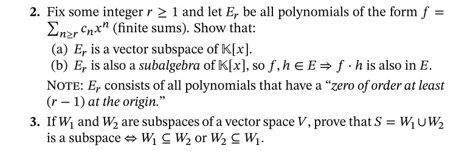
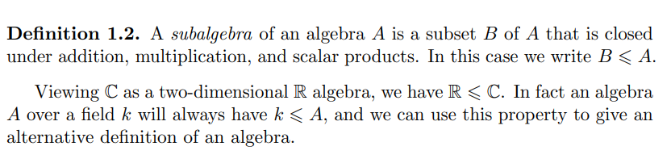
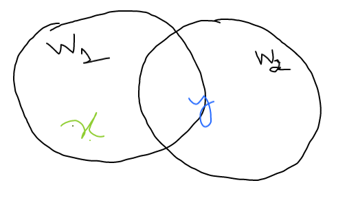
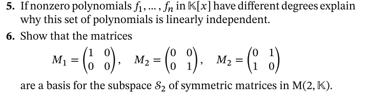
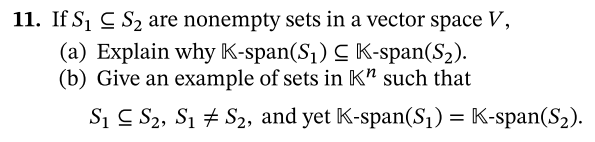
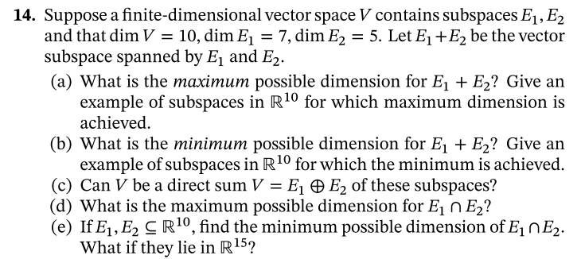
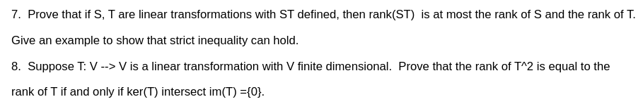

# Some results on optimising convex functions under simple constraints

 <b>19th September, 2021</b> 

<b>
Notes from MATH574: Applied Matrix Analysis (Prof. Robert Guralnik).</b>

---

>edits -\
init: 19th September, 2021

> ==========
[Textbook: Linear Algebra-I, Greenleaf and Sohie](https://www.maa.org/press/maa-reviews/linear-algebra-i)
> ==========

#### Notes from Chapter1

**Basis**: A spanning set of vectors which are also independent. (page 21)

$$
B = \{ \vec{v_i | i \in 1,2,3,.... } \} \; is \; a \; basis \; of \; V 

\\\;\\ \Big\Updownarrow \\\;\\

spanning \equiv \sum_{i=1,2,3,...}{c_i \vec{v_i}} = V \;  
\\\;\\ and \\\;\\
 \; independence \equiv \sum_{i=1,2,3,...}{c_i \vec{v_i}} = 0 \implies c_i = 0 \; \forall \; i=1,2,3,.. 
$$

**Existence and Construction of Basis (page 21):**
Every finite field has a basis.
There are two ways of constructing a basis - a.**pruning** and b. **extending**

*Pruning* - we start from a spanning set of vectors for $V$, we can always prune to make
them independent (if they already aren't).

*Extending* - we start with a set of independent vector $S$ and add one vector $v_1$ at a time 
to $S$ where $v_1$ is not in $span(S)$ already. $S_1 = S \cup {v}$ In this way, 
we can can finally make $S_r$ as basis of $V$ (if S wasn't already)

If we can not find a finite set of vectors using the extension method, then the 
vector space $V$ is said to be infinite dimensional.

> The space of all polynomials in the field $\mathbb{K}$ is denoted by $\mathbb{K}[x]$ is infinite dimensional. 
> The set of polynomials of degree n is, however, finite. A basis for this space is 
> given by $\{ 1, x^2, x^3,....,x^n \}$.

**Proposition-1.53 (page 23):** If $S \subseteq T$ is an independent set of vectors in a finite 
dimensional vector space V, and T a finite set of vectors that span V, we can adjoin 
certain vectors from $T$ to $S$ to get a basis for $V$ that contains the original set
of independent vectors in $S$.

**Theorem 1.54 (page 24):** All bases in a finite-dimensional vector space have the same
cardinality. More generally, if $V$ is finite dimensional , and $S$ is a finite spanning
set (with $|S|=n$), every independent set of vectors $L \subseteq V$ has cardinality 
$|L| \leq |S|$. In other words, the size of any independent set is always less than or 
equal to that of a spanning set.

**Corollary 1.55 (page 25):** In a finite-dimensional vector space, all bases have the same
cardinality, which we refer to as the dimension $dim_{\mathbb{K}}(V)$ or simply $dim(V)$ or
 $|V|$ when the underlying ground field $]mathbb{K}$ is understood. 

> Always, $dim_{\mathbb{K}}(\mathbb{K^n}) = n$ and the standard basis is $\{1,e_2,....,e_n \}\\$
> Hence, $dim_{\mathbb{C}}(\mathbb{C^n}) = n\\$
> however, $dim_{\mathbb{R}}(\mathbb{C^n})=2n$

> The basis for $\mathbb{C^n}$ over field $\mathbb{C}$ is the standrad basis $ \{e_1,e_2,...,e_n \}$
> i.e the coefficients/coordinates of the basis are elements of $\mathbb{C}\\$

> The basis for $\mathbb{C^n}$ over field $\mathbb{R}$ is $\{ e_1,e_2,....,e_n,ie_1,ie_2,....,ie_n \}$
> 

**Exercise 1.57 (page25):** If $V$ is a finite dimensional vector space and $W \subseteq V$
a subspace, explain why $W$ must also be finite dimensional.
**Solution:** By pruning the basis $B_V$ of $V$ which definitely spans $V$ and has finite cardinality,
we must be able to get a basis $B_W$ for $W$ - but this means $W$ must have finite dimension as the
cardinality of $B_W$ must lie between 0 and $|B_V|$.

Alternatively, using proposition 1.53 above, we can extend a basis $B_W$ of $W$ to a basis of 
$B_V$, i.e $dim(V) = |B_V| \geq |B_W| = \infty$ and hence is not finite dimensional as given in question

**Implicit and Parametric Description of Subspaces (Revisited) (page 26):**
Every $V$ of dimension n can be identified in a natural way with $\mathbb{K^n}$ once a basis 
$\{ f_1, f_2, ....,f_n\}$ in $V$ has been determined, so we can always restrict attention to
 describing subspaces $W$ of coordinate space $\mathbb{K^n}$.

 Given a basis 
 	$\mathfrak{X} = \{ f_i \}$ in $V$, the map $j_{\mathfrak{X}}:\mathbb{K^n} \rightarrow  V$ given
 	by $$ x = (x_1,...,x_n) \rightarrow j_{\mathfrak{X}}(x) = \sum_{i=1}^{n}{x_i f_i} $$
 is a bijection that respects all vector space operations in the sense that
 $$
 j_{\mathfrak{X}}(\lambda \cdot x) = \lambda \cdot j_{\mathfrak{X}}(x)
 \\\;\\and\\\;\\
 j_{\mathfrak{X}}(x+y) = j_{\mathfrak{X}}(x) + j_{\mathfrak{X}}(y) 
 $$

**It is an *isomorphism* between $\mathbb{K^n}$ and $V$, by which properties of one space 
can be matched with those of the other.**

### Homework-1

**page39: Q2,Q3**

**Solution-q2a:**
Requirements for a vector space $V$ over field $\mathbb{K}$ - 
1. $0 \in V$
2. $x,y \in V \implies x+y \in V$
3. $\lambda \in \mathbb{K}, v \in V \implies \lambda \cdot v \in V $

Let $f_1. f_2 \in E$ such that $f_1 = \sum_{n \geq r}{c_nx^n}$ and
 $f_2 =  \sum_{n \geq r}{d_nx^n}$.

1. Since $\mathbb{K}$ is a field, it contains the additive identity $0$ of the field.
If we set $z_n = 0, \; \forall \;  n \geq r$, then clearly 
$ 0 = \sum_{n \geq r}{z_n x^n} = f_0 \in E.\\\;$

2. Also $f_1 + f_2 = \sum_{n \geq r}{(c_n + d_n)x^n} = \sum_{n \geq r}{k_n x^n}$.Since $\mathbb{K}$ is a field, closure under $+$ gives 
$\forall \; c_n,d_n \in \mathbb{K} \implies c_n + d_n = k_n \in K$.
Hence $f_1 + f_2 = \sum_{n \geq n}{k_n x_n} \in E$.

3. Since $\mathbb{K}$ is a field, hence closure under the $\times$ operation gives
$ \lambda , t_n \in \mathbb{k} \implies \lambda t_n = k_n \in \mathbb{K} $.
For $f_3 = \sum_{n \geq r}{t_n x^n}, \lambda f_3 = \sum_{n \geq r}{\lambda t_n x^n} 
= \sum_{n \geq r}{k_n x^n} \in E$

Hence $E$ is a vector space over $\mathbb{K}$. Now all that needs to be shown is 
that it is a subspace of the space of all polynomials $\mathbb{K[x]}$. 

Clearly, we know that the polynomials of maximum degree $r-1$ of the form $g = \sum_{n < r}{c_nx^n}$ form a 
vector space $G$. This can be verified by applying the above 3 conditions.

Similarly, a basis for $G$ is given by $\{ 1,x,x^2,....,x^{k-1} \}$. Hence clearly $dim(G) = k$.
$\forall g \in G \implies g \in \mathbb{K[x]}$, however, $g \not\in E$.

Also $\forall f \in E, \implies f \in \mathbb{K[x]}$. Hence $E \subseteq G$

Hence clearly $E \subseteq \mathbb{K[x]}$ but cannot span all of $\mathbb{K[x]}$. Hence $E$ must
be a subspace of $\mathbb{K[x]}$.

Also $ F+G = \mathbb{K[x]}$ and  $F \cap G = \phi $.

**Solution-q2b**

*[Source: Dimensions of Matrix Subalgebras, Phillip T. Heikoop](https://www.google.com/url?sa=t&rct=j&q=&esrc=s&source=web&cd=&ved=2ahUKEwiy6_KT6ozzAhV5IDQIHW5nCpcQFnoECB0QAQ&url=https%3A%2F%2Fdigital.wpi.edu%2Fdownloads%2Fxk81jn96k%3Flocale%3Dzh&usg=AOvVaw1h2Mck6NPmWP9sdA45BQGG)*

**To show** - $E_r$ is a subalgebra of $\mathbb{K[x]}$ i.e
$ \forall \; f,h \in E \implies f \cdot h \in E$.

let $f = \sum_{n \geq r}{c_n x^n} $ and $h = \sum_{n \geq r}{d_n x^n} \\\;\\$
$\implies f \cdot h = \sum_{n \geq r}\big({\sum_{i+j=n}{c_i d_j}\big) x^n}$

Clearly $f \cdot h \in E$ $\;\;\; _\blacksquare$ 

Hence $E_r$ is a subalgebra of $\mathbb{K[x]}$ 

**Solution-q3:**

One direction is obvious - Let $ W_1 \subseteq W_2 $, then $ W_1 \cup W_2 = W_2$ and hence is 
the subspace $W_2$.

The other direction is - $ W_1 \cup W_2 $ is a subspace,
 without loss of generality, implies $ W_1 \subseteq W_2 $. 

Let us assume $W_1 \not\subseteq W_2$ or $W_2 \not\subseteq W_1$.

Let $\color{seagreen}x \in W_1 -  W_2$ and $\color{blue}y \in W_2$.
Then, $x,y \in W_1 + W_2$ and  hence $ x+y \in W_1 + W_2$.

However, this means 
$x+y \in W_1$ or $x+y \in W_2$ since 
$ z \in A \cup B \iff z \in A \; or \; z \in B$ by definition of set uinion. 

First, we show that $x+y$ cannot be in $W_2$. If $ x+y \in W_2$, then since $W_2$ is a 
subspace and $ y \in W_2$, $  x = \color{blue}(x+y) - y \in W_2 $ due to $W_2$ being closed under 
addition/subtraction. However we started with $ x \in \color{seagreen} W_1 - W_2$. This leads to a contradiction
as $ \color{seagreen}(W_1 - W_2) \color{default} \cap \color{blue} W_1 \color{default}= \phi $ ie. $x$ cannot belong to both $\color{seagreen} W_1 - W_2$ and
 $\color{blue}W_2$ simultaneously.

Second, if $x+y \in W_1$, then $ y = (x+y) - x \in W_1 $ since $x \in W_1$ and $W_1$ is a subspace.
However we started with  $ y \in W_2$. So $\color{blue}y \in W_2$ and $y \in W_1$. This means
$ y \in W_1 \cap W_2$. However we started with arbitrary $\color{blue}y \in W_2$. This means 
that the argument above works for any arbitrary $y \in W_2$ and
 hence $\forall y \in W_2, y \in W_1 \cap W_1$. Hence we must have $W2 \subseteq W1$. 
 

**page43: Q5,Q6,Q11**

**Solution q5**

Without loss of generality, let us assume that the nonzero polynomials
$f_1,...,f_n \in \mathbb{K[x]}$ be ordered by ascending degrees.

Let $ 0 < d_i = deg(f_i) \in \mathbb{N}$. So $d_n \geq ... \geq d_1$.

Since $d_i \in \mathbb{N}$ and $f_i$ have different degrees,
hence $d_i - d_{i-1} \geq 1 $
Also since $f_1$ is nonzero, $d_1 \geq 1$
$$
\begin{aligned}

d_n - d_{n-1} \geq 1 \\
d_{n-1} - d_{n-2} \geq 1 \\
. \\
. \\
. \\
d_2 - d_1 \geq 1 \\
d_1 \geq 1 \\
---------\\
\implies d_n \geq n

\end{aligned}
$$
 
We know that we have an isomorphism between the polynomials of maximum degree
$d_n$ and $\mathbb{K^{d_n}}$. Invoking this isomorphism, each of our nonzero
polynomial $f_i$ has a vector representation 
$\vec{v_i} \langle k_{i1}, ...k_{id_n} \rangle \in \mathbb{K^d_n}$.

Let us arrange the vector representations of the $n$ polynomials as the 
rows of a matrix of shape $n \times d_n$ and since $n \leq d_n$, this either
square or a fat matrix. The top row is $\vec{v_n}$, second $\vec{v_{n-1}}$ and so on till
we fill the last($n^{th}$) row with $\vec{v_1}$.

This matrix is clearly in row echelon form since we filled he rows in descending order 
of polynomial degrees. Since $d_1 > 0 \implies \vec{v_1} $, and the last row is nonzero.
Hence all the rows of this matrix are non-zero and hence the rows are independent.

Due to the isomorphism between the polynomials and their vector representations 
(which are also the rows of this matrix), since the rows of the matrix are independent, 
so are the polynomials. $\;\;\; _\blacksquare$

**Solution q6**

Any symmetric matrix in $M(2,\mathbb{K})$ can be written in the form of 
$M = \begin{bmatrix}
   a & b \\
   b & d
\end{bmatrix}$.

To prove that a set is a basis of a subspace, we need to show -
1. the elements of the set can span the subspace.
2. the elements of the set are independent.

For 1, we need to show that we can span any matrix $M$ using

$
M_1=
\begin{bmatrix}
   1 & 0 \\
   0 & 0
\end{bmatrix}

M_2=
\begin{bmatrix}
   0 & 0 \\
   0 & 1
\end{bmatrix}

M_3=
\begin{bmatrix}
   0 & 1 \\
   1 & 0
\end{bmatrix}
$.

Clearly, $ aM_1 + dM_2 + bM_3 = M \; \forall \;a,b,c \in \mathbb{K} $ and hence we can reach any $M$
and hence span $M(2,\mathbb{K})$.

For 2, we need to show that $M_1, M_2$ and $M_3$ are independent. Let us assume they are dependent.
Hence $ \alpha M_1 + \delta M_2 + \gamma M_3 = 
\begin{bmatrix}
   0 & 0 \\
   0 & 0
\end{bmatrix}
\;s.t \;\; \alpha^2 + \beta^2 + \delta^2 \neq 0$ i.e not all of $\alpha,\beta,\gamma \in \mathbb{K}$
 are $0$.

$$
\alpha M_1 + \delta M_2 + \beta M_3 = 
\begin{bmatrix}
   \alpha & \beta \\
   \beta & \delta
\end{bmatrix}
=\begin{bmatrix}
   0 & 0 \\
   0 & 0
\end{bmatrix}

\\
\Updownarrow
\\

\alpha = \beta = \delta = 0
$$

This is a contradiction since $\alpha, \beta, \gamma$ cannot all be zero (trivial) if $M_1, M_2, M_3$ are 
assumed to be dependent. Hence our assumption must be wrong since we could not find a non-trivial
$\alpha, \beta, \delta$ for which $\alpha M_1 + \delta M_2 + \beta M_3 = \begin{bmatrix}
   0 & 0 \\
   0 & 0
\end{bmatrix}$.

**Solution q11a**

$S_1 \subseteq S_2 \iff \forall \; x \in S_1 , x \in S_2$.

$S_2 = S_1 \cup (S_2 - S_1)$ and $S_2 \cap S_1 = \phi$

$span(S_1) = \sum_{x_i \in S_1}{\alpha_i x_i}$ 

$span(S_2) = 
\sum_{y_i \in S_2}{\beta_i y_i} \\
= \sum_{y_i \in S_1 \cup (S_2 - S_1)}{\beta_i y_i} \\
= \sum_{y_i \in S_1}{\beta_i y_i} + \sum_{y_i \in (S_1 - S_1)}{\beta_i y_i}
\\
= span(S_1) + span(S_2 - S_1) \geq span(S_1)
$

Hence, $span(S_22) \geq span(S_1)$  $\;\;\;_\blacksquare$

**Solution q11b**

Let $ a, b, c \in \mathbb{K^n}$.
Let $S_1 = \{ a,b \}$ and $S_2 = \{ a, \alpha a + \beta b, b \}$ 
 where $\aplha, \beta \in \mathbb{K}$.

Clearly $S_1 \subsetneqq S_2$ but $span(S_1) = span(\{a,b\}) = span(S_2)$.

**Page44 Q14**

**Solution q14a:**
Given - $dim(V)=10$, $E_1, E_2 \subseteq V$, hence $dim(E_1 + E_2) \le1 10$.
Hence $max \; of \; dim (E_1+E_2)$ is 10.

Example: $E_1 = \{ e_1, e_2, e_3,e_4, e_5, e_6, e_7\}, E_2 = \{ e_6, e_7, e_8, e_9, e_{10}\}$
where $\{ e_1, e_2,...,e_{10} \}$ is the standard/canonical/natural basis of $V$.

**Solution q14b:**
Since $ max\{ dim(E_1), dim(E_2) \} \leq  dim(E_1 + E_2)$, 
 we have a minimum dimension of $7 = dim(E_1)$.

Example: $E_1 = \{ e_i | i=1,...,7 \}, E_2 = \{ e_i | i=1,...,5\}$.

**Solution q14c:**
For direct sum, there can be no common elements in $E_1$ and $E_2$ except 0, i.e
$E_1 \cap E_2 = 0 $. Also for direct sum, $dim(E_1) + dim(E_2) = dim(E_1 + E_2)$
which is not going to be the case here. 

Hence $V$ cannot be the direct sum $V = E_1 + E_2$ of these subspaces.

**Solution q14d:**
Maximum possible dimension for $E_1 \cap E_2$ is $5 = min\{ dim(E_1), dim(E_2) \}$.

**Solution q14e:**
If $E_1,E_2 \subseteq \mathbb{R^10}$, then minimum possible dimension of $E_1 \cap E_2$
is 2. 

If $E_1,E_2 \subseteq \mathbb{R^{15}}$, minimum possible dimension of $E_1 \cap E_2$ is 0.

**Solution q7:**

We know that the rank of a matrix = row rank = column rank.
By the mechanics of matrix multiplication, we know that the columns of $ST$
are the linear combination of the columns of $S$ i.e the columns of $ST$ are
in the column space of $S$. Hence column rank of $S$ is at max equal to 
column rank of the matrix $S$. 

Similarly by the mechanics of matrix multiplication, the rows of $ST$ are the
linear combination of the rows of the matrix $T$. Hence all the rows of $ST$
 lie in the row space of $T$. Hence row rank of $ST$ is at max equal to the 
 row rank of matrix $T$.

 Using the above two information, 

 
$$
rank(ST) = colrank(ST) \leq colrank(S) = rank(S)\\
rank(ST) = rowrank(ST) \leq rowrank(T) = rank(T) 
\\ \Updownarrow \\
rank(ST) \leq min \{ rank(S), rank(T) \} \;\;\; _\blacksquare
$$

**Example for strict inquality:**
Let $rank(S),rank(T) > 0$.

If $colspace(T) \subseteq nullspace(S)$, then $ST = 0\\$ 
and hence $rank(ST) = 0 < min\{ rank(S), rank(T) \}$.

Also since $rank(A) = rank(A^T)$, if $rowspace(S) \subseteq leftnullspace(T)$,
then $ST=0$ and hence $rank(ST)=0$ leading to the strict inequality.

However, such extreme cases are not required for strict inequality.
If $colspace(T) \cap nulspace(S) \neq \{0\}$, then there is strict inequality.

Similary, if $rowspace(S) \cap leftnullspace(T)$, then there is strict inequality.

**Condition for strict equality:**

$$
colspace(T) \cap nullspace(S) = \{0\}
\\ \Updownarrow \\
rank(ST) = min \{ rank(S), rank(T) \} 
$$

Arguing the other direction $ rank(ST) = min \{ rank(S), rank(T) \} \implies colspace(A) \cap nullspace(S) = \{ 0 \} $ is not very difficult.
We argue by contradiction. Let $ \vec{0} \neq \vec{v} \in colspace(T) \cap nullspace(S) $. 

Then $\vec{v} \in colspace(T), \vec{v} \in nullspace(S)$. 
Since $colspace(T), nullspace(S)$ are subspaces, hence 
$\lambda \vec{v} \in colspace(T)$ and $ \lambda \vec{v} \in nullspace(S)$

Let $rank(T) \leq rank(S)$ and $rank(ST) = rank(T)$.

Also let $dim(colspace(T))= columnrank(T) = t$.

Since $\lambda \vec{v}$ is a subspace, let us write $colspace(T) = span(\vec{v}) \oplus Z $ for some subspace Z with  $dim(Z) = t-1$.

Thinking of $ST$ as a composition of linear transformations, the columnspace of $T$ is input to the linear transformation $L_S$ represented by $S$.
Hence the input to $S$ is $colspace(T) =  span(\vec{v}) \oplus Z$.

$L_S( span(\vec{v}) \oplus Z) = L_S(span(\vec{v})) + L_S(Z) = \vec{0} + L_S(Z) = L_S(Z)$ 

Hence, $rank(ST) = dim( L_S( span(\vec{v}) \oplus Z)) = dim( L_S(Z) ) \leq dim(Z) = t-1 = rank(T)-1$. 

This is a contradiction as we started with $rank(ST) =  rank(T)$.

**Solution q8:**

This is a special case of Q7 with S=T.

We already know that if $ colspace(T) \cap nulspace(S) \neq \{0\} $, 
then $rank(ST) < min \{ rank(S), rank(T) \}$.
Otherwise $rank(ST) = min \{ rank(S), rank(T) \}$.

Now, realise that $colspace = image$ and $nulspace = kernel$.

If $ \{0\} = colspace(T) \cap nulspace(S) = im(T) \cap ker(S) = im(T) \cap ker(S) $,
then equality holds and 
$rank(ST) = min \{ rank(S), rank(T) \}$. 

Now setting $S=T$ in the above statement,

If $ \{0\} = ker(T) \cap im(T)$, then $ rank(T^2) = min \{ rank(T), rank(T)\} = rank(T) $.

Hence, 

$$
ker(T) \cap im(T) = \{ 0 \}
\\ \Updownarrow \\
rank(T^2) = rank(T)
$$
