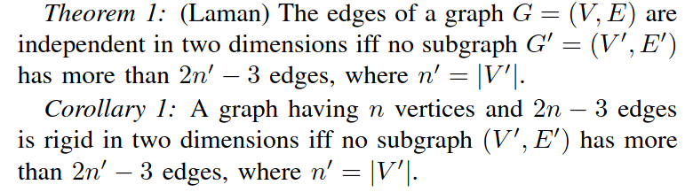
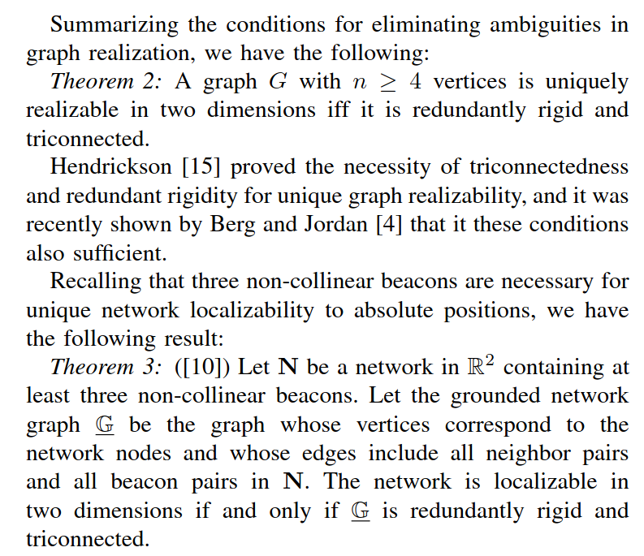

# PHY760-Computational Methods in Physics

 <b>9th August, 2022</b> 

<b>
Project Report for PHY760 (Summer 2022): Computational Methods in Physics (Prof. T. K. Satish Kumar).</b>

---

>edits -\
init: 9th August, 2022

[Syllabus](syllabus.pdf)

#### Network localization with sparse noise
---

##### Motivation

In many applications, we have wireless nodes which need to be deployed in adhoc manner. In these scenarios, there are some nodes called anchor nodes which can localize themselves accurately using an external lozalization mechanism (like GPS). However, there are a lot of low power nodes which can not localize themselves using the external mechanism due to high energy costs of doing so. However, due to wireless radios on the nodes, the receive signal strength indicator (RSSI) values on the nodes can be used to estimate the pairwise distance. We might have noise in the estimated pairwise distances and sometimes we might not know all of the pairwise distances. 

##### Formalized problem statement 

Let $C$ be a set of nodes where $C = B \cap A$ and $B \cup A = \phi$ i.e $A$ and $B$ form a partition of $C$. $A$ is a set of anchor nodes whose positions are known completely.  $B$ is a set of nodes whose positions are unknown. The symmetric distance matrix $D[i,j] = |C[i] - C[j]|$ is observed with noise as $O = D + N + S$ where $S$ is a sparse noise matrix and N is a noise matrix which is not sparse. 

A) Can we recover distance matrix $D$ from the observation matrix $O$?

B) If we recover the distance matrix, can we estimate the positions of the low power nodes in $B$?

##### Background and Survey

The problem above is not new and many methods have been discovered over past few decades. We will survey some of the methods starting from a simpler version of the problem and then progressing towards the more complex versions. 

**1) Noiseless complete distance matrix**

In this case, we assume that the distance matrix estimate has no noise in it and that all the pairwise distances are known. Multidimensional Scaling (MDS) is a known technique that can address this case. First the distance matrix can be used to get the Gram (Grammian) matrix which captures the pairwise inner product between the positions of the nodes. There is a choice to be made here for picking one of the points as the origin since estimating the positions from a distance matrix is unique only upto rigid transformations like translations, rotations and reflections. The Gram matrix is of shape $(n-1) \times (n-1)$ if the distance matrix is of the shape $n \times n$. If we choose the first node as the origin, we have

$$
	G[i,j] = \frac{D[1,i]^2 + D[1,j]^2 - D[i,j]}{2}
$$

Let the postion vectors of the $n-1$ nodes with respect to the first node be arranged into the columns of the matrix $X$ of shape $d \times (n-1)$ where $d=2,3$ based on if the points lie in 2D/3D.

$$
	G = X^T X
$$

Since we have already recovered G, we want find a decomposition as $G = A^T A$ so that we can set $X = A$ which will recover a solution with the first node at origin and unique upto rotations and reflections. With three known anchor positions, the rigid transformation can be resolved and we can recover the absolute coordinates of all the nodes in $C$.

If the observed matrix $O$ is noiseless, then $O = D$.

$$
	G = \frac{O[1,i]^2 + O[1,j]^2 - O[i,j]}{2} = \frac{D[1,i]^2 + D[1,j]^2 - D[i,j]}{2}
$$
 is a perfect Gram matrix which is positive semidefinite(PSD) and has rank d unless the points actually lie in a lower dimensional space than their tru embedding space (for eg, maybe the points lie on a line in 2D or on a line/plane in 3D).

Singular Value Decomposition (SVD) of the symmetric positive-semidefinite $G$ can help us recover one such decomposition. 
$$
	G = U \Sigma U^T = (U \Sigma^{1/2}) (\Sigma^{1/2} U^T) = (U \Sigma^{1/2}) (U \Sigma^{1/2})^T = A A^T \\ \; \\
	A = U\Sigma^{1/2}
$$

where $ A \in \mathbb{R}^{ (n-1) \times d}$

**2A. Complete but noisy distance matrix**

If the observed distance matrix $O$ is noisy, then the estimate
$$
	G = \frac{O[1,i]^2 + O[1,j]^2 - O[i,j]}{2}
$$

is a noisy estimate of the Gram matrix. However, we can still hope to recover the positions approximately by a truncated rank-2 SVD decomposition if the noise is negligible as compared to the true distances i.e high signal to noise ratio (SNR). 
$$
	G = (U \Sigma^{1/2}) (U \Sigma^{1/2})^T = A A^T \\ \; \\
$$

where $ A \in \mathbb{R}^{ (n-1) \times d}$ and we can set $X = A$.

**2B. Complete but sparse noisy distance matrix**

In this case, we observe all the pairwise distances but there might be noise on some of the observations but not many. 
$$
	O = D + S
$$

where $S$ is a sparse matrix of the same shape as $D$, i.e in $\mathbb{R}^{n \times n}$. That is, $S[i,j] = 0$ for a lot of $(i,j)$.

Techniques (e.g [3][3],[4][4], [5][5]) already exist on how to recover $F$ and $S$ from $Z = V + W$ as long as $V$ is low rank and $W$ is sparse.

We know that $E = D \odot D$ is low rank with rank $d+2$ where $\odot$ is the [Hadamard product](https://en.wikipedia.org/wiki/Hadamard_product_(matrices).

$$
 O[i,j]^2 = (D[i,j] + S[i,j])^2 = D[i,j]^2 + (S[i,j]^2 + 2 D[i,j] S[i,j]) = D[i,j]^2 + P[i,j] 
$$

where $P = S \odot S + 2 D \odot S $ has the same sparsity structure as S and hence $O \odot O = E + P$ is low rank plus sparse too. Using the methods from the previous papers, we can recover $E$ which is low rank of rank $d+2$. From $E$, taking eeleementwise square root will produce $D$ and then we can find tthee Gram matrix $G$ from which a solution can be recovered.

**3. No noise but incomplete distance matrix**

In this case, we might not observe all pairwise distances between the nodes but some of them. In such a case, how much can be really said about the positions of the nodes. We take inspiration from the work in [Network Localization in Partially Localizable Networks][0]. Depending on which pairwise distances we know, the estimation of position might admit multiple solutions instead of a unique one. The [Laman condition](https://en.wikipedia.org/wiki/Laman_graph) is stated below - 

*Laman Condition*

The above paper also provides the necessary and sufficient conditions for a graph of nodes to be unique localized.

*Necessary and Sufficient Conditions for Localization*

Here is a proposed solution to the incomplete but no noise observation matrix $O$. Find all the nodes in B for which pairwise distance is known to atleast 3 anchor nodes. Take the submatrix of size $4 \times 4$ which contains the pairwise distances to the three or more anchor nodes and the node itself. This $4 \times 4$ distance matrix can then be used to get the Gram matrix from which the relative positions of the points can be recovered with one anchor as the origin. Since there are three anchors already in the $4 \times 4$ submatrix, we can recover the global coordinates easily without any ambiguity due to rigid transformations in 2D. Once the position of a node in $B$ is found, we designate that node to be an anchor and move it from $B$ to $A$. Now we can repeat the algorithm on the nodes in $B$. The algorithm will terminate when $B = \phi$ or when there is no element in $B$ such that we know their distances to atleast three anchors in $A$.

Another possible way that comes to mind is to use matrix completion. The squared distance matrix is low rank of rank $d+2$ where $d \in \{2,3\}$. Or we could also find the incomplete Gram matrix $G$ which is of low rank $d$. Then using low rank matrix completion with rank $d+2$ or $d$ for $E$ and $G$ respectively, we can recover the complete matrices $D$ and/or $G$ after which the SVD can be used to get a solution.

Deep learning based methods have also been used to solve the problem. A simple solution would be to have a simple multilayer perceptron (MLP) trained on the columns of the observation matrix corresponding to the anchors with the target being the position vector of the anchors and hope that the after the training the network ould be able to predic the positions of the non anchor nodes when the column corresponding to the unknown nodes are passed as input.

Graph neural networks have been used recently to address the current problem. [6][6] proposes to start with a threshold $T_h$ on distance to build the initial graph from the observed distance matrix. This graph has the adjacency matrix $A_{T_h}$.The augmented adjacency matrix (makes self loops) is $\tilde A_{T_h} = A_{T_h} + I$.
  
$$
	A_{T_h}[i,j] = 1 \text{ iff } O[i,j] > T_h \text{ else }  0
$$

The normalized adjacency matrix is defined as $\hat A_{T_h} = \tilde D_{T_h}^{-1/2} \tilde A_{T_h} \tilde D_{T_h}^{-1/2} $ where $D_{T_h}$ is the degree matrix of the augmented self looped matrix.

The following network is trained - 
$$
	\hat X = \hat A \; \phi ( \;\;\;  \hat A \; (A_{T_h} \odot O) \; W^{(1)} \;\;\; ) \;  W^{(2)}
$$

where $W^{(1)}$ and $W^{(2)}$ need to be learnt by minimizing the loss

$$
	L(W^{(1)}, W^{(2)}) := || X_a - \hat X ||
$$

where $X_a$ is the matrix with columns corresponding to the position of the anchor nodes. 

**4. Incomplete + sparse noisy obsereved distances**

This problem is the focus of the PHY760 project. I am still exploring ideas on how to best handle this problem. The Fast Pivot paper by Prof. T. K. Satish kumar has been inspiring and I am exploring both spectral graph methods and graph learning based methods to handle this problem. I have a few vague ideas on borrowing handcrafted feature methods similar to [7][7] for learning images from coordinates. I hope to work with Prof. Satish beyond the summer semester on this project along with my friends who have been immensely helpful for discussing new directions and ideas towards a solution on this problem.

##### References -

[0. Network Localization in Partially Localizable Networks][0]

[1. Sparse and Low-Rank Matrix Decompositions][1]

[2. Sparse and Low-Rank Matrix Decompositions][2]

[3. Low-rank and sparse matrix decomposition via the truncated nuclear norm and a sparse regularizer][3]

[4. Unique sparse decomposition of low rank matrices][4]

[5. SPARSE PLUS LOW RANK MATRIX DECOMPOSITION: A DISCRETE OPTIMIZATION APPROACH][5]

[6. GRAPH NEURAL NETWORK FOR LARGE-SCALE NETWORK LOCALIZATION][6]

[7. Fourier Features Let Networks Learn High Frequency Functions in Low Dimensional Domains][7]

[0]: https://homes.cs.washington.edu/~arvind/papers/pln.pdf
[1]: https://dspace.mit.edu/bitstream/handle/1721.1/58946/Chandrasekaran-2009-Sparse%20and%20low-rank%20matrix%20decompositions.pdf
[2]: http://users.cms.caltech.edu/~venkatc/cspw_slr_sysid09.pdf
[3]: https://link.springer.com/article/10.1007/s00371-018-1555-1
[4]: https://openreview.net/pdf?id=2GapPLFKvA
[5]: https://arxiv.org/pdf/2109.12701.pdf
[6]: https://ieeexplore.ieee.org/stamp/stamp.jsp?arnumber=9414520
[7]: https://arxiv.org/pdf/2006.10739.pdf
