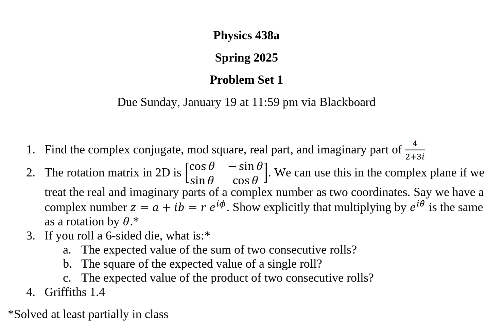
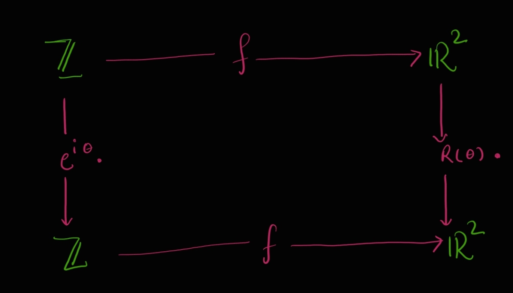
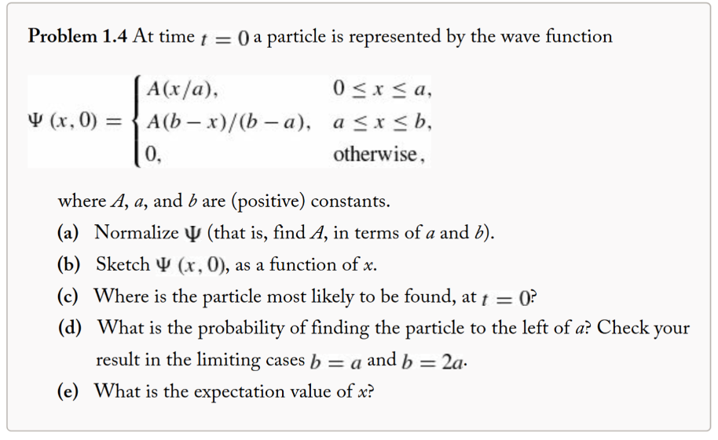
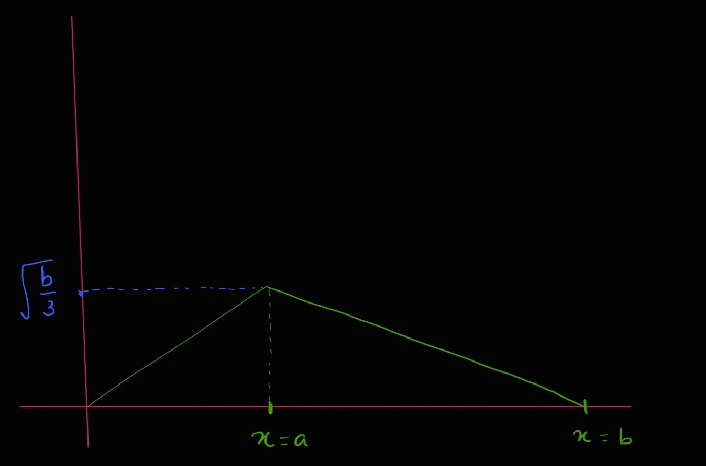

q---
themes: ["colorful"]
category: courses

---

 <b>PSET 1 Solutions</b> 

<b> 
18th January, 2025
</b>

---

*[questions pdf](pset1.pdf)*

---

### 1.

$$
z = \frac{4}{2 + 3i}
  = \frac{4}{2 + 3i} \cdot \frac{2 - 3i}{2 - 3i}
  = \frac{8 - 12i}{2^2 + 3^2} = \frac{8 - 12i}{4 + 9}
  = \frac{8 - 12i}{13}
$$

Hence the conjugate is,

$\bar z = \frac{1}{13} \cdot (8 + 12i)$

and mod square is,

$$
|z|^2 = \frac{|8 - 12i|^2}{13^2} = \frac{64 + 144}{169} = \frac{208}{169} 
$$

Note that we could have also gotten this directly as follows,

$$
|z|^2 = \frac{4^2}{|2 + 3i|^2} = \frac{16}{4 + 9} = \frac{16}{13}
$$

Real and imaginary parts are, 

$$
Re(z) = \frac{8}{13} \;\;,\;\; Im(z) = -\frac{12i}{13}
$$

### 2.

We are identifying  complex numbers $\mathbb{C}$ in the Argand plane with vectors in $\mathbb{R}^2$. More precisely this means that there exits an isomorphism between the two set of objects. 

Let the isomorphism be defined as $f(z) = \begin{bmatrix} Re(z) \\ Im(z) \end{bmatrix}$

We want to show that the operation of multiplying $e^{i\theta}$ on $Z$ corresponds to the operation of multiplying the rotation matrix $R(\theta) = \begin{bmatrix} cos\theta & -sin\theta \\ sin\theta & cos\theta \end{bmatrix}$.

Category theoritical  diagram

We want to show - 

$$
f(e^{i \theta} \cdot z) = R(\theta) \cdot f(z)
$$

Proof:

Let $\mathbb{C} \ni z = Ae^{i \alpha} = Acos\alpha + iAsin\alpha$

Then,

$$
LHS = f(e^{i \theta} \cdot A e^{i \alpha}) = f(A e^{i(\alpha + \theta)}) 
= A\begin{bmatrix} cos(\alpha + \theta) \\ sin(\alpha + \theta)\end{bmatrix}
$$

$$
RHS 
= \begin{bmatrix} cos\theta & -sin\theta \\ sin\theta & cos\theta\end{bmatrix} \cdot
f(Ae^{i\alpha})
= \begin{bmatrix} cos\theta & -sin\theta \\ sin\theta & cos\theta\end{bmatrix} \cdot
\begin{bmatrix} Acos\alpha \\ Asin\alpha\end{bmatrix} \\\;\\
= A \begin{bmatrix} cos\theta & -sin\theta \\ sin\theta & cos\theta\end{bmatrix} \cdot
\begin{bmatrix} cos\alpha \\ sin\alpha\end{bmatrix} \\\;\\
= A \begin{bmatrix} cos\theta cos\alpha - sin\theta sin\alpha \\
 sin\theta cos\alpha + cos\theta sin\alpha \end{bmatrix} \\\;\\

= A \begin{bmatrix} cos(\alpha + \theta) \\ sin(\alpha + \theta)\end{bmatrix} \\\;\\
= LHS \;\;\; {\blacksquare}
$$

### 3.

We roll a six sided die. 

Let $X_1, X_2$ be the random variables associated with the two rolls of the die respectively. We note that $X_1,X_2$ are indepentent random variables.

#### 3a.

The expected value ot the sum of two consecutive rolls.

Let $X = X_1 + X_2$ be the random variable of our interest. 

$$
E[X] = E[X_1 + X_2] = E[X_1] + E[X_2] = 2 E[X_1] \;\;\; \because X_1,X_2 \text{ are identically distributed} \\

E[X_1] = (1 + 2 + 3 + 4 + 5 + 6)/6 = \frac{6 \cdot 7}{2 \cdot 6} = 3.5 \\

\therefore E[X] = 2 * E[X_1] = 2 * 3.5 = 7
$$

#### 3.b

Expected value of a single roll is $E[X_1] = 3.5$ as seen in part **a** above.

#### 3.c

We are looking for $E[X_1X_2]$ and since they are independent, 

$E[X_1 X_2] = E[X_1]E[X_2] = \frac{7}{2} \cdot \frac{7}{2} = \frac{49}{4}$

### 4.

#### 4a.

$|\psi|^2$ must equal $1$ at all times as it is a probability density function.

$$
\int_0^a A^2(x/a)^2dx + \int_a^b A^2(b-x)^2/(b-a)^2 = 1 \\
\implies (A^2/3a^2) [x^3]_0^a - A^2/3(b-a)^2 [(b-x)^3]_a^b = 1\\
\implies A^2[a/3 + (b-a)/3] = 1 \\
\implies A^2 (b/3) = 1 \\
\implies A = \sqrt{\frac{3}{b}}
$$

We discard the negative root $-\sqrt{\frac{3}{b}}$ as the probability density function is non-negative.

#### #### 4b.

#### 4c.

Since the pdf $\psi(x,0)$ peaks at $x=a$, the particle is most likely to be at $x=a$.

#### 4d.

The probabiity of finding the particle left of $x=a$ is given by 

$$
\int_0^a |\psi(x,0)|^2 = \int_0^a (A^2/a^2) x^2 = (A^2/a^2) [x^3]_0^a 
= \frac{3}{ba^2}(a^3/3) = \frac{a}{b} \\
$$

In the limiting case when $b=a$, we have $a/b = 1$ which make sense if we look at the graph of $\psi(x,0)$ above as the pdf is non-zero only in the interval $[0,a]$.

In the other limiting case of $b = 2a$, we have $a/b = \frac{1}{2}$ which also makes sense as the graph of $\psi(x,0)$ will be symmetric about $x=a$ and hence half of the probability lies left of $x=a$.

#### 4e.

If  $f(x)$ be the pdf of $x$, then the expectation of $x$ is given by $E[x] = \langle x \rangle$

$$
E[x] = \int_{-\infty}^{\infty} x \cdot f(x)\;dx = \int_0^b x \cdot |\psi(x,0)|^2 \; dx \\\;\\
= \int_0^a x \cdot \frac{A^2}{a^2}x^2 \; dx + \int_a^b x \cdot \frac{A^2}{(b-a)^2} (b-x)^2 \\\;\\
= \frac{A^2}{a^2}\int_0^a x^3 \; dx + \frac{A^2}{(b-a)^2}\int_a^bx\cdot (b-x)^2 \; dx\\\;\\
= \frac{3}{4ba^2}[x^4]_0^a + \frac{3}{b(b-a)^2}\int_a^b(x^3-2bx^2 + b^2x)\;dx \\\;\\
= \frac{3a^2}{4b} + \frac{3}{b(b-a)^2}[x^4/4 - 2bx^3/3 + b^2x^2/2]_a^b \\\;\\
= \frac{3a^2}{4b} + \frac{3}{b(b-a)^2}[\frac{b^4 - a^4}{4} - \frac{2b}{3}(b^3 - a^3) + \frac{b^2}{2}(b^2 - a^2)]
$$
