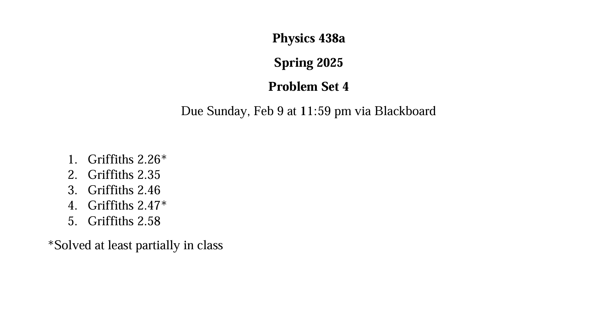
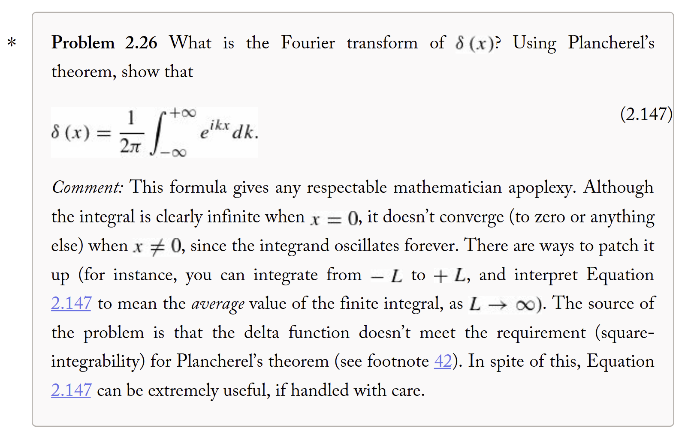

q---
themes: ["colorful"]
category: courses

---

 <b>PSET 1 Solutions</b> 

<b> 
4th February, 2025
</b>

---

*[questions pdf](pset4.pdf)*

---

>Fourier transforms and Inverse Fourier Transforms 

$$
  F(k) = \int_{-\infty}^{+ \infty} f(x) e^{-ikx} dx 
$$

$$
  f(x) = \int_{-\infty}^{+ \infty} F(k) e^{ikx} dk
$$

Let us look at the fourier transform of $\delta(x)$

$$
  D(k) = \int_{-\infty}^{+\infty} \delta(x) e^{-ikx} dx \\
  \;\;\; = \int
$$
