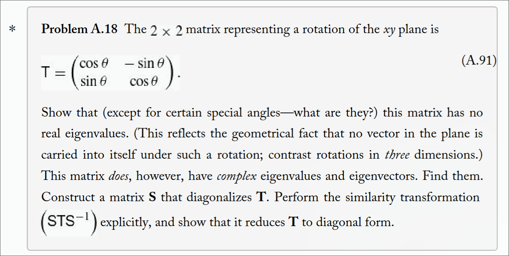
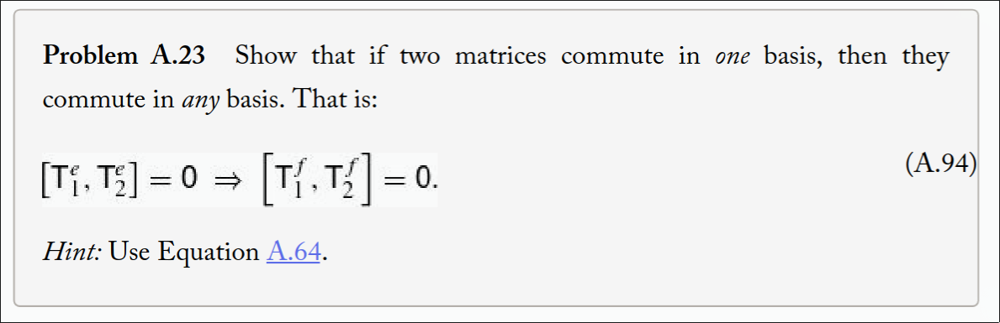
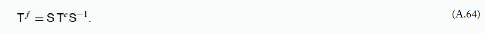
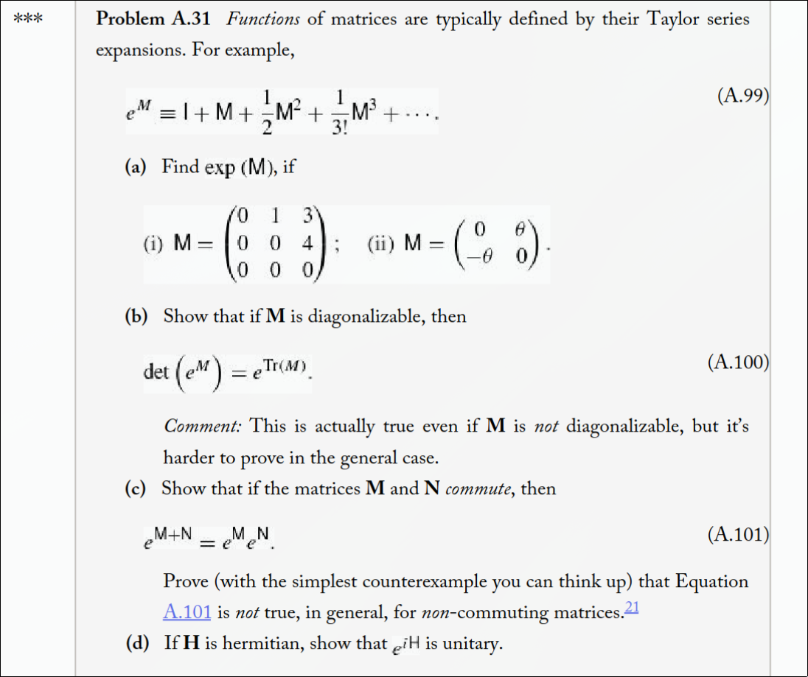

q---
themes: ["muted","colorful"]
category: courses

---

 <b>PSET 5 Solutions</b> 

<b> 
22th February, 2025
</b>

---

*questions*
---

### 1.

#### a)
Yes, the set of polynomial of degree less than N in x forms a vectors space. 

If $p_1,p_2$ are polynomials such that $degree(p_1), degree(p_2) \leq N$, then we know that $degree(p_1 + p_2) \leq \max \{degree(p_1),degree(p_2)\}$.
We also know that multiplying any such $p$ by a scalar (from the field of Complex Numbers) will not change its degree. 
The above two facts tell us that such polynomials are closed under addition and scalar multiplication and hence form a vector field. 

All we require for a structure like $[(Set,+_s), (Field,+_f, \times_f), \times_{fs}]$
to be a vectors space is for it to be closed under $+_s$ and $\times_{fs}$ as described below

$$
  s_1, s_2 \in Set \implies s_1 +_s s_2 \in Set \\
  f \in Field, s \in Set \implies f \times_{fs} s \in Set 
$$

We call the elements of the $Set$ as vectors.  

Set = Complex coefficient Polynomials with degree atmost N
Field = Complex Numbers ( usually this is the set that provides for the 
coefficents for the monomials $x^i$, here we assume this field to be the complex number field. But one could think of 
only polynomials which have integer coefficients and then we will have the field as $\mathbb Z$)

$+_s$ = The usual polynomial addition
$+_f$ = Usual addition defined on complex numbers
$\times_{fs}$ = usual multiplication of a polynomial by a complex number

If $v_1,v_2,...,v_n \in S$ are $n$ vectors, a linear combination of these vectors is defined by
$$
  \sum_i^n f_i \times_{fs} v_i 
$$
where $\sum_i^n$ is the sum using the binary operator $+_s$.

A basis for a vector space using the structure $[(Set,+_s), (Field,+_f, \times_f), \times_{fs}]$ is a
minimal linearly independent list/sequence $[B]$ (with $B$ as just the set of elements in the sequence $[B]$), where $B \subset Set$, 
such that any vector ($\in Set$) can be written as a linear combination of the elements in $[B]$ (or $B$).

Here independence means no element in the set $B$ can be expressed as a linear combination of the rest of the elements in the set $B$.
The number of elements in this minimal sequence $[B]$ is called the dimension of the vector space.
Basis for a vectors space need not be unique and often they aren't.
There could be many basis(es) (or bases?) for a vectors space, and usually there are infinitely
many for an infinite vector space (by  infinite vector space, we mean the number of elements in $Set$ to be infinite).

By definition, once a basis is adopted, any vectors $v$ (an element of the $Set$) can be reached/represented
using a  linear combination of the elements in the basis $B$ and hence each vector can be identified
with the sequence of coefficients $[v_B]$ corresponding to the elements ($ \in Field$) that multiply (using $\times_{fs}$) infront
of the sequence of basis elements (in $[B]$). The minimality of condition required in the definition of a basis this
representation/identification to be unique for a given vector $v$, i.e there exist only one sequence $[v_B]$ ($\in Field$)
that represents $v$. There cannot be two such sequences ($\in Field$) that, when used as the coefficient in the linear combination
of the corresponding elements from the basis sequence $[B]$ would reach the same vector $v$. 

>*Hence, once a basis is adpted, there is a unique representation (name, if you will) for each vector in $Set$.*

One convenient basis for the vector space of polynomials in $x$ of degree less than $N$ is given below
$$[B] = \{ 1, x, x^2, x^3, ..., x^{N-1} \}$$.

Let $B$ be represent the set of elements in the sequence $[B]$.

How do we know it is a basis?
**1. Linear Independence:**
Observe that there is no way to get any element in this basis
as a linear combination of the rest.

**2 Ability to reach all elements in the set of Polynomials with degree < N**
Any polynomial of degree less than $N$ can be represented as a linear combination of the basis elements

**3 Minimality**  
Assume $[B]$ is not minimal.
Lets say there is an element that can be dropped, say $x^m$ for $0 \leq m \leq N$ to obtain a new basis $[C] = [B] \ x^m$.
Then we face the following consequence -

- Because we are convinced of the linear independence in $1$ above, we know that no element n $[B]$
can be represented as a linear combination of the others. Hence,  $x^m \in B$ cannot be represented by a lienar combination of
the rest.

- $x^m$ is a polynomial of degree less than $N$

- $x^m$ cannot be represented by $C$. Hence $[C]$ cannot be used to represent/reach every
element in $Set$ = polynomials of degree less than N. Hence $C$ violates the reachability condition required
to be a basis and hence is not a basis.  

** Thus, $[B] = \{ 1, x, x^2, ..., x^{N-1}\}$ is a basis.

Some other basis(es) are:-

**Newton Basis**

$[(x - a_0), (x - a_0)(x - a_1),...,(x - a_0)(x - a_1)(x-a_2)...(x - a_{N-1})]$

where $a_i \in Field$, $i \in [0,N-1]$ 

**Lagrange Basis**

$[l_0, l_1, l_2,...,l_{N-1}]$

where 
$$
  l_i = \prod_{0 \leq j < N \; ; \; j \neq i} \; \frac{x - b_j}{b_i - b_j}
$$

and $b_i \in Field$

Notice that $l_i(b_j) = \delta_{ij} = \begin{cases} 1 & i=j \\ 0 & i \neq j \end{cases} $  
This property is useful when we want to interpolate $N$ points $(x_i,b_i) \; ; \; 0 \leq i < N$ with a $N$th degree polynomial.

#### b) 
If the polynomials are required to be even functions, then the monomials appearing in the polynomials
must also be even functions. This means, we can only have even powers of $x$. 

We need to check if addition of these even polynomials remain within the class/set of even polynomials.
We also need to check that multiplying by a scalar from the field $Field$(= Complex numbers in our case) 
also result in even polynomials of degree less than $N$.

Let $p_1, p_2$ be two polynomials which have degree less than $N$ and also even. 
Since we know that sum of even functions, is even, it is clear that $p_1 + p_2$ is even. 
We also know that $degree(p_1 + p_2) \leq \max \{ degree(p_1), degree(p_2) \}$. Hence $p_1 + p_2$ has
degree less than $N$.

Mutiplying such a polynomials with a scalar from the field of complex numbers will not change evenness of the
polynomial as we know that multiplying an even functioni by a scalar doesn't affect its evenness.

From the above two facts, we conclude that the class of even polynomials with degree atmost $N$ indeed form a vector space. 

#### c) 
If we require the leading coefficient to be one, then it is not a vector space. 

We will provide examples that demonstrate the failure of closure under addition or multiplicatio (or both) that is a requirement for 
a vector space.

- Failure under addition ($+_{s}$)

Let $p_1$ and $p_2$ be two such polynomials, then the leading coefficient of $p_1 + p_2$ is 2 and hence it no longer 
belongs to the given class of polynomials.

This itself is enough evidence that the given class of polynomial does not form a vector space. But we will give another 
example for failure of closure under multiplicaiton

- Failure under mulitplicaiton ($\times_{fs}$)

Let $p$ be polynomial from the given class. Consider $ 5 + 2i \in \mathbb{Z}$. 
$5 \times_{fs} p$  has leading coefficient $5 + 2i$ and  not $1$ and hence is not in the given class. 
This is a failure of closure under mulitplication which is a required property of a vector space. 

#### d) 

Let the class of polynomials with the property that they have a value of $0$ at $x=1$ be denoted by $P$
Let $p(x) \in P$. Then $p(1) = 0$.

- Check for closure under multiplication  
Let $ a \in \mathbb{Z}$, and $q(x) = a \times_{fs} p(x)$. Then $q(1) = a \times_{fs} p(1) = a \times_{fs} 0 = 0$.
Thus $q(x) \in P \;\; \forall a \in \mathbb{Z}$.

- Check for closure under addition  
Let $p_1(x), p_2(x) \in P$. Let $q(x) = p_1(x) +_{s} p_2(x)$. Then $q(1) = p_1(1) +_{s} p_2(1) = 0 +_{s} 0 = 0$

> Note: We hand waved above and the addition $+_s$ and multiplicaiton $\times_{sf}$ do not make sense on evaluations of polynoimials at x=1 and 
more care needs to be taken to make it clear what the additions and multiplications mean when we evaluate a polynomial. 
A more rigourous approach will go like this -
$$
  q := a \times_{fs} p \;\;\; \text{and} \\
  q(x) = a \times_{f}  p(x)
$$

$$
  q := p_1 +_s p_2 \;\;\; \text{and} \\
  q(x) = p_1(x) +_f p_2(x)
$$

The above two checks show that we have closure under addition and multiplication and hence the set/class of polynomials $P$ 
indeed form a vector space.

#### e) 
Let $P$ be the class/set of polynomials with the property that $\forall p \in P, p(0) = 1$. 
Let $p \in P$ and $q = 5 \times_{fs} p$. $q(0) = 5 \times_f p(0) = 5 \times_f 1 = 5$. 
Hence $q \notin P$ which shows failure of closure under multiplication. 
Hence the set of polynomials $P$ do not form a vector space. 

### 2.

#### a)

$Aa = \begin{bmatrix}  3i \\ 6 + 2i \\ 6 \end{bmatrix}$

#### b)

$a^{\dagger} b = \begin{bmatrix} -i & -2i & 2 \end{bmatrix} \begin{bmatrix} 2 \\ 1 - i \\ 0 \end{bmatrix} = -2i -2i(1 -i) = -2i(1 + 1 - i) = -2i(2 - i) = -4i + 2i^2 = -2 - 4i$

#### c)

$ \tilde{a} B b = a^T B b = \begin{bmatrix} i & 2i & 2 \end{bmatrix} \begin{bmatrix} 2 & 0 & -i \\ 0 & 1 & 0 \\ i & 3 & 2 \end{bmatrix}
\begin{bmatrix} 2 \\ 1 - i \\ 0 \end{bmatrix} = \begin{bmatrix} i & 2i & 2 \end{bmatrix} \begin{bmatrix} 4 \\ 1 - i \\ 3 - i \end{bmatrix}
= 4i + 2i + 2 + 6 - 2i  = 8 + 4i$

#### d)

$ab^{\dagger} = \begin{bmatrix} i \\ 2i \\ 2 \end{bmatrix} \begin{bmatrix} 2 & 1 + i & 0 \end{bmatrix} 
= \begin{bmatrix} 2i & -1 + i & 0   \\ 4i & -2 + 2i & 0 \\ 4 & 2 + 2i & 0 \end{bmatrix}$

### 3.

Let us first show that if $S$ is unitary it carries an orthonormal basis $E$ to another (call it $F$).
We recall that if $E$ anf $F$ are two basis(es), and let $a^{e}$ and $a^{f}$ be the coordinates
of the same vectors $\vec{a}$ in the two basis(es) respectively. If $S_{f}^{e} = S$ is the matrix containing the
coordinates of the basis elements of $E$ w.r.t the basis $F$, then we can have the following relation

$$
  a^f = S_{f}^{e} a^e
$$

Assume that the basis $E$ is orthonormal and has $n$ elements, i.e we are operating in $\mathbb{R}^n$. Since we are also given $S_{f}^{e} = S$ is unitary, $S^{\dagger}S = I$.
Consider the $a$th and $b$th column of the matrix $S$. These columns have the entries $S_{ia}$ and $S_{ib}$ for $i \in [1,n]$.
Since $S^{\dagger}S = I$, the dot product $\langle S_{a} | S_{b} \rangle = \delta_{ab}$. The same goes for the rows of $S$.

Let the basis $E$ be the sequence of vectors $[e_1,e_2,...,e_n]$ and similarly basis $F$ be the sequence $[f_1, f_2, ..., f_n]$.
We have already assumed $E$ to be an orthonormal basis and hence the dot product $\langle e_i | e_j \rangle = \delta_{ij}$.
 
Need to make this proof rigorous but I will skip here.

Let us move to the next question. We want to show that similarity preserves matrix multiplicaiton.

Let $(A^e,A^f), (B^e,B^f), C^e,C^f$ be pairs of similar matrices such that $A^eB^e = C^e$.
Let $S_{e}^f = S$ be the change of basis matrix from bais $E$ to $F$.

Hence $A^f = S_e^f A^e S_f^e = S A^e S^{-1}$. And similarly $B^f = SB^eS^{-1}$ and $C^f = SC^eS^{-1}$.

Now, $A^f  B^f = S A^e S^{-1} S B^e S^{-1} = S A^e B^e S^{-1} = S C^e S^{-1} = C^f \;\;\; _\blacksquare$.

Also the question wants us to show that similarity transform of a hermitian matrix $H^e$ (i.e H^{e \dagger} = H^e) by $S$ is preserved if $S$ is unitary.
Since $S$ is unitary, $S^{\dagger}S = I \implies S^{-1} = S^{\dagger}$

Hence, if $H^f = S H^e S^{-1}$, then
$$
  H^{f \dagger} = (S H^e S^{-1})^{\dagger} = (S H^e S^{\dagger})^{\dagger} = S^{\dagger \dagger} H^{e \dagger} S^{\dagger} \\
  = S H^e S^{\dagger} = H^f \;\;\; _\blacksquare
$$

### 4.

$$
  det(T - xI) = 0 \implies (\cos(\theta) - x)^2 + \sin^2(\theta) = 0 \\
  \implies \cos(\theta) -x = \pm i \sin(\theta) \\
  \implies  x = \cos(\theta) \pm i \sin(\theta) = e^{\pm i\theta}
$$

As seen above, the eigenvalues are not real.

Let us find the eigenvectors.

For the eigenvalue $e^{+i \theta}$,
$$
  T \begin{bmatrix} a \\ b \end{bmatrix} = e^{i \theta} \begin{bmatrix} a \\  b \end{bmatrix} \\
   \implies a \cos(\theta) - b \sin(\theta)  = a \cos(\theta) + i a \sin(\theta) \;\; \& \;\; a \sin(\theta) + b \cos(\theta) = b \cos(\theta) + i b \sin(\theta)
  \implies -b = ia \;\; \& \;\; a = ib
$$

Take $a = 1$, then $b  = -ia = -i$. Hence $e_2 = \begin{bmatrix} 1 \\ -i \end{bmatrix}$ is an eigenvectors correspponding to the eigenvalue $e^{i\theta}$.

Verification -

$$
  T \begin{bmatrix} 1 \\ -i \end{bmatrix} = \begin{bmatrix} \cos(\theta) + i \sin(\theta) \\\;\\
   \sin(\theta) - i \cos(\theta) \end{bmatrix} \\\;\\
  = \begin{bmatrix} e^{i \theta} \\ -i e^{i \theta} \end{bmatrix} = e^{i \theta} \begin{bmatrix} 1 \\ -i \end{bmatrix}
$$

Similarly for the eigenvalue $e^{-i \theta}$, we get the eigenvector $e_1 = \begin{bmatrix} 1 \\ i \end{bmatrix} $.

Verification -

$$
  T \begin{bmatrix} 1 \\ i \end{bmatrix} = \begin{bmatrix} \cos(\theta) - i \sin(\theta) \\ \sin(\theta) + i \cos(\theta) \end{bmatrix} \\\;\\
  = e^{-i \theta} \begin{bmatrix} 1 \\ i \end{bmatrix} 
$$

> Note: the eigenvectors are orthogonal to each other, i.e $\langle e_1 | \rangle = 0$.

**Diagonalization**

Let $E = \frac{1}{\sqrt{2}}\begin{bmatrix} 1 & 1 \\ i & -i \end{bmatrix}$ be the matrix containing the normalized eigenvectors as the columns.
Then the diagonalization of $T$ is $T^e = E^{-1} T E$. Since the eivengvectors are orthogonal and normalized, $E^{-1} = E^{\dagger}$

$$
  T^e = E^{-1} T E = E^{\dagger} T E \\\;\\
  = \frac{1}{2} \begin{bmatrix} 1 & -i \\ 1 & i \end{bmatrix}
  \begin{bmatrix} \cos(\theta) & - \sin(\theta) \\ \sin(\theta) & \cos(\theta) \end{bmatrix}
  \begin{bmatrix} 1 & 1 \\ i & -i \end{bmatrix} \\\;\\
  = \begin{bmatrix} e^{-i \theta} & 0 \\ 0 & e^{i \theta} \end{bmatrix}
$$

### 4.

 
*Equation A.64*

$$
  [T_1^f , T_2^f] = T_1^f T_2^f - T_2^f T_1^f \\\;\\
  = S T_1^e S^{-1} S T_2^e S^{-1} - S T_2^e S^{-1} S T_1^e S^{-1} \\\;\\
  = S T_1^e T_2^e S^{-1} - S T_2^e T_1^e S^{-1} \\\;\\
  = S (T_1^e T_2^e - T_2^e T_1^e ) S^{-1} \\\;\\
  = S [T_1^e, T_2^e] S^{-1} = S \; 0 \; S^{-1} = 0 \;\;\; _\blacksquare
$$

### 6.

#### a)

(i)
$$
  M^2 = \begin{bmatrix} 0 & 0 & 4\\ 0 & 0 & 0\\ 0 & 0 & 0\end{bmatrix}
  M^3 = 0, M^4 = 0, ...
  e^M = I + M + \frac{1}{2!}M^2 = \begin{bmatrix} 1 & 1 & 5 \\ 0 & 1 & 4 \\ 0 & 0 & 1 \end{bmatrix} 
$$ 

(ii)

If we denote $J = \begin{bmatrix} 0 & 1 \\ -1 & 0 \end{bmatrix}$, then $J^2 = -I$.

$I$ and $J$ play the same role as $1$ and $i$ in complex numbers. We say that the algebra of $I,J$ under matrix multiplication is
a homomorphism of the algebra of $1,i$ under complex multiplication. 

$$
  M = \theta \begin{bmatrix} 0 & 1 \\ -1 & 0 \end{bmatrix} = \theta J \\\;\\
  M^2 = -\theta^2 \begin{bmatrix} 1 & 0 \\ 0 & 1 \end{bmatrix} = -\theta^2 I \\\;\\
  M^3 = M M^2 = \theta J -\theta^2 I = -\theta^3 J \\\;\\
  M^4 = M^2 M^2 = \theta^4 I \\ \; \\
$$

$$
  e^M = e^{\theta J} = \cos(\theta) + J \sin(\theta) \;\;\;
$$
This is similar to complex numbers. One can verify the above from the expansion of $e^M$ and collecting the
even powers and odd powers of $\theta$ separately.

#### b)

We assume $Mi \in \mathbb{R}^{m \times m}$ is diagonalizable. This means $M = P D P^{-1}$ for some invertible matrix $P$
and diagonal matrix $D$ whose diagonals are $\lambda_i$ for $i \in 1,2,3...m$.

Let $E \in \mathbb{R}^{m \times m}$ be a diagonal matrix whose diagonals are $e^{\lambda_i}$. It is easy to see that $e^D = E$

We also know that the trace operator has the invariance under cyclicity property i.e.
$Tr(AB) = Tr(BA)$ which also gives us $Tr(ABC) = Tr(CAB) = Tr(BCA)$

$$
  \det(e^M) = \det( \sum_{n=0}^{\infty} \frac{1}{n!} M^n) = \det (\sum_n \frac{1}{n!} (PDP^{-1})^n ) \\\;\\
  = \det(\sum_n \frac{1}{n!} PD^nP^{-1}) = \det(P \sum_n \frac{1}{n!} D^n P^{-1}) = \det(P e^D P^{-1}) \\\;\\
  = \det(P) \det(e^D) \det(P^{-1} = \det(e^D) =  \det(E) = \prod_{i=1}^m e^{\lambda_i} = e^{\sum_{i=1}^m \lambda_i} \\\;\\
  = e^{Tr(D)} = e^{Tr(DP^{-1}P)} = e^{Tr(P D P^{-1}} = e^{Tr(M)} \;\;\; _\blacksquare
$$

#### c)

We assume $[M,N] = 0$, i.e $M,N$ commute, i.e $MN = NM$.

$$
LHS = e^{M+N} = \sum_{n=0}^{\infty} \frac{1}{n!} (M+N)^n = \sum_{n=0}^{i\infty} \frac{1}{n!} \binom{n}{k} M^kN^{n-k}
$$

$$
  RHS = e^M e^N = \bigg( \sum_{a=0}^{\infty} \frac{1}{a!}M^a \bigg) \bigg( \sum_{b=0}^{\infty} \frac{1}{b!}N^b \bigg) \\\;\\
  = \sum_a \sum_b \frac{1}{a!b!} M^aN^b
$$

>Note that the RHS can be expanded using binomial expansion **only** because $MN= NM$. This is the place where we used the
information that $M$ and $N$ commute. This is cruciali and without commutativity we cannot use the binomail expansion
and the following arguments cannot be made.

If we stare at the two expressions obtained from the LHS and the RHS, it is clear that the only way the two can be the same is
if the coefficient of $M^aN^a$ match in the the LHS and the RHS.

Notice that each term in the sum of both the LHS and the RHS contain unique terms of the form $M^aN^b$, i.e there aren't
mutliple terms that have the same powers of $M^aN^b$. Hence we can just match the terms on LHS and RHS by equating the powers.

Let us look at the term $M^aN^b$ in the RHS. The corresponding term in the LHS must be $M^kN^{n-k}$ where $k = a$ and $n-k = b$.

Now, the coefficient of $M^aN^b$ on LHS is $\frac{1}{n!} \binom{n}{k} = \frac{1}{n!} \frac{n!}{n! (n-k)!} = \frac{1}{n! (n-k)!} = \frac{1}{a!b!}$ which
matches the coefficient on the RHS and hence we have proved the given statement that $[M,N]=0 \implies e^{M+N} = e^Me^N$.

#### d)

Let us assume $H$ to be hermitian, i.e $H^{\dagger} = H$.
Then $H$ commutes with $H^{\dagger}$ because $H^{\dagger}H = HH = HH^{\dagger}$.

If $H$ is hermitian, then $A = iH$ is anti-hermitian/skew-hermitian, i.e $A^{\datter} = (iH)^{\dagger} = - i H^{\dagger} = -iH = -A$.

Note that any anti-hermitian matric $A$ commutes with $A^{\dagger}$ because $A^{\dagger}A = -AA = A (-A) = AA^{\dagger]}$

Note that for any matrix $M$, $(M^n)^{\dagger} = (\underbrace{MMM....M}_{\text{n times}})^{\dagger}
= (\underbrace{M^{\dagger}M^{\dagger}....M^{\dagger}}_{\text{n times}}) = (M^{\dagger})^n$

Also note that for any matrix $M$,
$$
  (e^M)^{\dagger} = \bigg( \sum_{n=0}^{\infty} \frac{1}{n!}M^n \bigg)^{\dagger} =
  \sum_{n=0}^{\infty} \big( \frac{1}{n!} M^n \big)^{\dagger} =
  \sum_{n=0}^{\infty} \frac{1}{n!} (M^{\dagger})^n = e^{M^{\dagger}}
$$

>Claim: For any skew-hermitian/anti-hermitian matrix $A$, $B = e^A$ is unitary, i.e $B^{\dagger}B = I$  
Proof:
$$
  B^{\dagger}B = (e^A)^{\dagger} e^A = e^{A^{\dagger}} e^A =  e^{A^{\dagger} + A} = e^{-A + A} = e^0 = I \;\;\; _\blacksquare
$$

Since $iH$ is anti-symmetric, by the above proof, $e^{iH}$ is unitary. 
